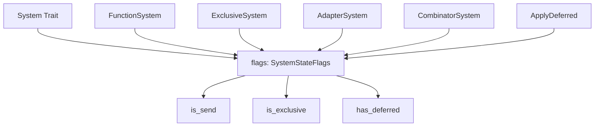

+++
title = "#19506 Unify system state"
date = "2025-06-08T00:00:00"
draft = false
template = "pull_request_page.html"
in_search_index = true

[taxonomies]
list_display = ["show"]

[extra]
current_language = "en"
available_languages = {"en" = { name = "English", url = "/pull_request/bevy/2025-06/pr-19506-en-20250608" }, "zh-cn" = { name = "中文", url = "/pull_request/bevy/2025-06/pr-19506-zh-cn-20250608" }}
labels = ["A-ECS", "C-Code-Quality", "X-Contentious", "D-Straightforward"]
+++

## Unified System State Representation in Bevy ECS

### Basic Information
- **Title**: Unify system state
- **PR Link**: https://github.com/bevyengine/bevy/pull/19506
- **Author**: re0312
- **Status**: MERGED
- **Labels**: A-ECS, C-Code-Quality, S-Ready-For-Final-Review, M-Needs-Migration-Guide, X-Contentious, D-Straightforward
- **Created**: 2025-06-06T05:06:48Z
- **Merged**: 2025-06-08T18:36:07Z
- **Merged By**: alice-i-cecile

### Description Translation
**Objective**  
Preparation for 'system as entities' feature. Current system state representation uses separate booleans (is_send, is_exclusive, has_deferred). As more states may be added, using Bitflags provides a more concise and performant approach.

**Solution**  
Use Bitflags to unify system state representation.

### The Story of This Pull Request

#### The Problem and Context
Bevy's Entity Component System (ECS) previously tracked three separate boolean flags for each system:
1. `is_send`: Whether the system can be sent across threads
2. `is_exclusive`: Whether the system requires exclusive World access
3. `has_deferred`: Whether the system uses deferred operations like Commands

These discrete flags presented several challenges:
- Adding new state attributes would require modifying the System trait interface
- State checks required multiple method calls
- Combinator systems needed to manually combine flags from child systems
- No unified representation for scheduler optimizations

With the upcoming "system as entities" feature requiring additional state metadata, a more scalable solution was needed.

#### The Solution Approach
The PR replaces the three boolean flags with a unified `SystemStateFlags` bitflag enum. This approach:
- Uses bitwise operations for efficient state combination
- Provides a single method (`flags()`) to access all state information
- Maintains backward compatibility through default trait implementations
- Enables easy addition of future state flags

Bitflags were chosen over an enum struct because:
1. They allow combining states using bitwise OR (`|`)
2. They provide efficient storage (single u8)
3. They enable simple state checks via `intersects()` 

#### The Implementation
The core change introduces a `SystemStateFlags` bitflag in `system.rs`:

```rust
bitflags! {
    pub struct SystemStateFlags: u8 {
        const NON_SEND = 1 << 0;
        const EXCLUSIVE = 1 << 1;
        const DEFERRED = 1 << 2;
    }
}
```

The System trait is modified to use this unified representation:

```rust
pub trait System: Send + Sync + 'static {
    fn flags(&self) -> SystemStateFlags;
    
    // Backward-compatible defaults
    fn is_send(&self) -> bool {
        !self.flags().intersects(SystemStateFlags::NON_SEND)
    }
    
    // Similar defaults for is_exclusive/has_deferred...
}
```

All system implementations were updated to return flags instead of individual booleans. For example, exclusive systems now define their state as:

```rust
fn flags(&self) -> SystemStateFlags {
    SystemStateFlags::NON_SEND | SystemStateFlags::EXCLUSIVE
}
```

Combinator systems combine child flags efficiently:

```rust
fn flags(&self) -> super::SystemStateFlags {
    self.a.flags() | self.b.flags()
}
```

The `SystemMeta` struct was refactored to store a single `flags` field instead of separate booleans, improving memory efficiency and access patterns.

#### Technical Insights
Key implementation details:
1. **Bitwise Composition**: Combinator systems use `|` to merge child system flags
2. **Backward Compatibility**: Existing code using `is_send()` etc. continues working
3. **Validation**: Flags are set during system initialization in `SystemMeta`
4. **Efficiency**: Single u8 storage reduces memory footprint versus three booleans

Notable edge case handling:
- The `ApplyDeferred` system explicitly sets NON_SEND|EXCLUSIVE
- Exclusive systems always return NON_SEND|EXCLUSIVE
- Migration guide provides clear upgrade path for custom systems

#### The Impact
These changes provide:
- **Extensibility**: New states can be added without breaking changes
- **Performance**: Single flag check instead of multiple boolean checks
- **Consistency**: Unified state representation across all system types
- **Maintainability**: Reduced boilerplate in system implementations

The PR also includes a comprehensive migration guide demonstrating how to convert custom systems to the new flags interface.

### Visual Representation



### Key Files Changed

1. `crates/bevy_ecs/src/system/system.rs` (+28/-3)  
   Added SystemStateFlags bitflag and refactored System trait
   
   ```rust
   // Before:
   fn is_send(&self) -> bool;
   fn is_exclusive(&self) -> bool;
   fn has_deferred(&self) -> bool;
   
   // After:
   bitflags! {
       pub struct SystemStateFlags: u8 {
           const NON_SEND = 1 << 0;
           const EXCLUSIVE = 1 << 1;
           const DEFERRED = 1 << 2;
       }
   }
   
   fn flags(&self) -> SystemStateFlags;
   ```

2. `crates/bevy_ecs/src/system/function_system.rs` (+11/-21)  
   Updated SystemMeta to use unified flags
   
   ```rust
   // Before:
   is_send: bool,
   has_deferred: bool,
   
   // After:
   flags: SystemStateFlags,
   ```

3. `crates/bevy_ecs/src/system/exclusive_function_system.rs` (+6/-15)  
   Implemented flags for exclusive systems
   
   ```rust
   fn flags(&self) -> SystemStateFlags {
       SystemStateFlags::NON_SEND | SystemStateFlags::EXCLUSIVE
   }
   ```

4. `crates/bevy_ecs/src/system/combinator.rs` (+6/-20)  
   Implemented flag composition for combinators
   
   ```rust
   fn flags(&self) -> super::SystemStateFlags {
       self.a.flags() | self.b.flags()
   }
   ```

5. `release-content/migration-guides/unified_system_state_flag.md` (+43/-0)  
   Added migration guide with code examples

### Further Reading
- [Bitflags crate documentation](https://docs.rs/bitflags/latest/bitflags/)
- [Bevy ECS System documentation](https://bevyengine.org/learn/book/next/ecs/systems/)
- [Bitmasking techniques](https://graphics.stanford.edu/~seander/bithacks.html)