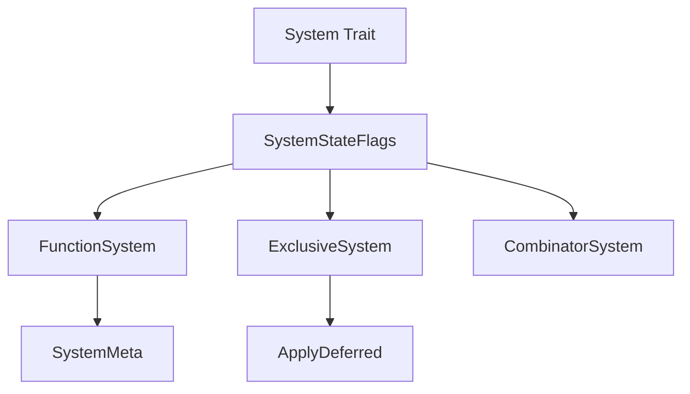

+++
title = "#19506 Unify system state"
date = "2025-06-08T00:00:00"
draft = false
template = "pull_request_page.html"
in_search_index = false

[extra]
current_language = "zh-cn"
available_languages = {"en" = { name = "English", url = "/pull_request/bevy/2025-06/pr-19506-en-20250608" }, "zh-cn" = { name = "中文", url = "/pull_request/bevy/2025-06/pr-19506-zh-cn-20250608" }}
+++

# 统一系统状态标识分析报告

## 基本信息
- **标题**: Unify system state
- **PR链接**: https://github.com/bevyengine/bevy/pull/19506
- **作者**: re0312
- **状态**: 已合并
- **标签**: A-ECS, C-Code-Quality, S-Ready-For-Final-Review, M-Needs-Migration-Guide, X-Contentious, D-Straightforward
- **创建时间**: 2025-06-06T05:06:48Z
- **合并时间**: 2025-06-08T18:36:07Z
- **合并人**: alice-i-cecile

## 描述翻译
### 目标
- 为"系统即实体"功能做准备
- 当前系统有`is_send`、`is_exclusive`、`has_deferred`等一系列状态。随着"系统即实体"功能的落地，系统可能有更多状态。使用Bitflags统一所有状态是更简洁高效的方法

### 解决方案
- 使用Bitflags统一系统状态

## PR实现过程分析

### 问题背景
在Bevy ECS架构中，系统(System)需要维护多种状态属性：
- `is_send`: 表示系统是否线程安全
- `is_exclusive`: 表示系统是否需要独占访问World
- `has_deferred`: 表示系统是否包含延迟操作(如Commands)

随着ECS架构演进（特别是"系统即实体"功能开发），系统状态属性可能增加。现有实现使用三个独立的布尔值和方法管理状态，存在两个主要问题：
1. **扩展性差**：添加新状态需要修改所有系统实现
2. **效率低**：状态检查需要多次方法调用和布尔运算

### 解决方案选择
使用bitflags统一系统状态管理：
- **核心思路**：将离散状态合并为位标志(bit flags)
- **优势**：
  - 单次方法调用获取所有状态
  - 位运算高效组合/检查状态
  - 新状态只需添加新标志位
- **替代方案考虑**：保持现有布尔值方案会被否决，因无法解决扩展性问题

### 具体实现
在`system.rs`中定义`SystemStateFlags`位标志类型：
```rust
bitflags! {
    pub struct SystemStateFlags: u8 {
        const NON_SEND    = 1 << 0; // 系统不可跨线程
        const EXCLUSIVE   = 1 << 1; // 需要独占World访问
        const DEFERRED    = 1 << 2; // 包含延迟操作
    }
}
```

在`System` trait中增加`flags()`方法并重构原有方法：
```rust
pub trait System: Send + Sync + 'static {
    fn flags(&self) -> SystemStateFlags;
    
    #[inline]
    fn is_send(&self) -> bool {
        !self.flags().intersects(SystemStateFlags::NON_SEND)
    }
    
    #[inline]
    fn is_exclusive(&self) -> bool {
        self.flags().intersects(SystemStateFlags::EXCLUSIVE)
    }
    
    #[inline]
    fn has_deferred(&self) -> bool {
        self.flags().intersects(SystemStateFlags::DEFERRED)
    }
}
```

重构`SystemMeta`元数据结构：
```rust
pub struct SystemMeta {
    // 替换前: is_send: bool, has_deferred: bool
    flags: SystemStateFlags,
    // ...其他字段不变...
}
```

### 系统实现适配
所有系统类型（普通系统、独占系统、组合系统等）实现新的`flags()`方法：

普通函数系统(`function_system.rs`)：
```rust
fn flags(&self) -> SystemStateFlags {
    self.system_meta.flags
}
```

独占系统(`exclusive_function_system.rs`)：
```rust
fn flags(&self) -> SystemStateFlags {
    SystemStateFlags::NON_SEND | SystemStateFlags::EXCLUSIVE
}
```

ApplyDeferred系统(`executor/mod.rs`)：
```rust
fn flags(&self) -> SystemStateFlags {
    SystemStateFlags::NON_SEND | SystemStateFlags::EXCLUSIVE
}
```

### 技术要点
1. **位运算高效性**：状态组合/检查使用位运算(OR/AND)，比布尔运算更高效
2. **向后兼容**：原有方法转为基于flags的派生方法
3. **扩展机制**：添加新状态只需在bitflags添加常量
4. **迁移安全**：为自定义系统提供详细迁移指南

### 影响分析
1. **性能提升**：状态检查从3次方法调用减少到1次
2. **代码简化**：移除27个方法实现，减少冗余代码
3. **架构改进**：为"系统即实体"功能奠定基础
4. **维护性增强**：新状态只需修改一处定义

## 关键文件变更

### `crates/bevy_ecs/src/system/system.rs`
引入`SystemStateFlags`位标志类型并重构System trait：
```diff
+ use bitflags::bitflags;
+
+ bitflags! {
+     pub struct SystemStateFlags: u8 {
+         const NON_SEND    = 1 << 0;
+         const EXCLUSIVE   = 1 << 1;
+         const DEFERRED    = 1 << 2;
+     }
+ }
+
 pub trait System: Send + Sync + 'static {
+     fn flags(&self) -> SystemStateFlags;
+     
      #[inline]
      fn is_send(&self) -> bool {
-         // 原实现
+         !self.flags().intersects(SystemStateFlags::NON_SEND)
      }
      
      // 类似重构is_exclusive和has_deferred
 }
```

### `crates/bevy_ecs/src/system/function_system.rs`
重构SystemMeta和系统实现：
```diff
 pub struct SystemMeta {
-     is_send: bool,
-     has_deferred: bool,
+     flags: SystemStateFlags,
 }

 impl FunctionSystem {
     fn flags(&self) -> SystemStateFlags {
-         // 原is_send/is_exclusive/has_deferred实现
+         self.system_meta.flags
     }
 }
```

### `release-content/migration-guides/unified_system_state_flag.md`
新增迁移指南：
```markdown
## 统一系统状态标志

迁移前：
```rust
fn is_send(&self) -> bool { false }
fn is_exclusive(&self) -> bool { true }
fn has_deferred(&self) -> bool { false }
```

迁移后：
```rust
fn flags(&self) -> SystemStateFlags {
    SystemStateFlags::NON_SEND | SystemStateFlags::EXCLUSIVE
}
```
```

## 组件关系


## 延伸阅读
1. [Rust bitflags文档](https://docs.rs/bitflags/latest/bitflags/)
2. [Bevy ECS架构指南](https://bevyengine.org/learn/book/plugins/ecs/)
3. [系统状态设计模式](https://gameprogrammingpatterns.com/state.html)