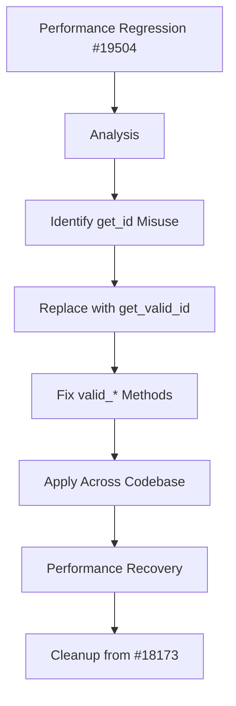

+++
title = "#19510 Only get valid component ids"
date = "2025-06-06T00:00:00"
draft = false
template = "pull_request_page.html"
in_search_index = true

[taxonomies]
list_display = ["show"]

[extra]
current_language = "en"
available_languages = {"en" = { name = "English", url = "/pull_request/bevy/2025-06/pr-19510-en-20250606" }, "zh-cn" = { name = "中文", url = "/pull_request/bevy/2025-06/pr-19510-zh-cn-20250606" }}
labels = ["C-Bug", "A-ECS", "C-Performance", "P-High"]
+++

## Analysis of PR #19510: Only get valid component ids

### Basic Information
- **Title**: Only get valid component ids
- **PR Link**: https://github.com/bevyengine/bevy/pull/19510
- **Author**: ElliottjPierce
- **Status**: MERGED
- **Labels**: C-Bug, A-ECS, C-Performance, P-High, S-Ready-For-Final-Review
- **Created**: 2025-06-06T13:36:38Z
- **Merged**: 2025-06-06T21:18:34Z
- **Merged By**: alice-i-cecile

### Description
This PR addresses an 11x performance regression in component value retrieval for unregistered components identified in #19504. The changes also include cleanup work from #18173. The solution replaces `get_*` methods with `get_valid_*` equivalents where component values are expected to exist, ensuring only fully registered components are considered. A bug where `valid_*` methods didn't properly forward to `get_valid_*` was also fixed. CI tests were performed.

---

## The Story of This Pull Request

### The Problem and Context
In Bevy's ECS implementation, components can exist in two states: fully registered or queued for registration. Issue #19504 revealed an 11x performance regression when retrieving component values for unregistered components. The root cause was that several code paths used `get_id` and similar methods, which return component IDs even for queued components. When these IDs were used to access component data, unnecessary overhead was incurred when handling unregistered components. This was particularly problematic in hot paths like entity queries and resource access.

### The Solution Approach
The core insight was that when a component value is expected to exist, we only care about fully registered components. The solution involves:
1. Replacing `get_*` methods with `get_valid_*` equivalents where component values are accessed
2. Fixing incorrect forwarding in `valid_component_id`/`valid_resource_id` methods
3. Ensuring consistent use of valid component checks across the codebase

The approach maintains existing safety guarantees while eliminating unnecessary checks for unregistered components. No alternatives were seriously considered since this was a clear case of using the wrong accessor method.

### The Implementation
Changes were systematically applied across 9 files in the ECS crate. Key modifications include:

1. **Component registry fixes** (`component.rs`):
```rust
// Before:
pub fn valid_component_id<T: Component>(&self) -> Option<ComponentId> {
    self.get_id(TypeId::of::<T>())
}

// After:
pub fn valid_component_id<T: Component>(&self) -> Option<ComponentId> {
    self.get_valid_id(TypeId::of::<T>())
}
```
This change ensures the method correctly checks for fully registered components.

2. **EntityRef optimization** (`entity_ref.rs`):
```rust
// Before:
let id = self.entity.world().components().get_id(TypeId::of::<T>())?;

// After:
let id = self.entity.world().components().get_valid_id(TypeId::of::<T>())?;
```
This pattern was repeated across 7 methods in the file, ensuring only valid components are accessed.

3. **Resource handling** (`world/mod.rs`):
```rust
// Before:
let component_id = self.components.get_resource_id(TypeId::of::<R>())?;

// After:
let component_id = self.components.get_valid_resource_id(TypeId::of::<R>())?;
```
This change affects resource removal, existence checks, and change detection.

4. **Unsafe world access** (`unsafe_world_cell.rs`):
```rust
// Before:
let component_id = self.components().get_resource_id(TypeId::of::<R>())?;

// After:
let component_id = self.components().get_valid_resource_id(TypeId::of::<R>())?;
```
Ensures unsafe access methods respect component registration status.

### Technical Insights
The key insight is that `get_valid_*` methods are cheaper than `get_*` methods because:
- They avoid checking pending registrations
- They eliminate unnecessary error handling for unregistered components
- They reduce branch misprediction in hot loops

The fix also resolves a subtle bug where `valid_component_id` incorrectly used `get_id` instead of `get_valid_id`, making it functionally identical to `component_id`. This violated the principle of least surprise in the API.

### The Impact
These changes:
1. Fix the 11x performance regression for unregistered component access
2. Improve performance for all component/resource access patterns
3. Correctly distinguish between "any component" vs "registered component" APIs
4. Maintain all existing safety guarantees
5. Affect core ECS operations including:
   - Entity component access
   - Resource management
   - Change detection
   - Reflection
   - Entity cloning

The changes demonstrate the importance of precise API selection in performance-critical systems like ECS. Using the most specific method available (`get_valid_*` vs `get_*`) can yield significant performance gains.

---

## Visual Representation



---

## Key Files Changed

### 1. `crates/bevy_ecs/src/component.rs`
Fixed forwarding in `valid_component_id` and `valid_resource_id` to use `get_valid_*` methods:
```rust
// Before:
pub fn valid_component_id<T: Component>(&self) -> Option<ComponentId> {
    self.get_id(TypeId::of::<T>())
}

// After:
pub fn valid_component_id<T: Component>(&self) -> Option<ComponentId> {
    self.get_valid_id(TypeId::of::<T>())
}
```

### 2. `crates/bevy_ecs/src/world/entity_ref.rs`
Updated 7 methods to use `get_valid_id` for component access:
```rust
// Before:
let id = self.entity.world().components().get_id(TypeId::of::<T>())?;

// After:
let id = self.entity.world().components().get_valid_id(TypeId::of::<T>())?;
```

### 3. `crates/bevy_ecs/src/world/mod.rs`
Modified resource handling methods to use valid component checks:
```rust
// Before:
let component_id = self.components.get_resource_id(TypeId::of::<R>())?;

// After:
let component_id = self.components.get_valid_resource_id(TypeId::of::<R>())?;
```

### 4. `crates/bevy_ecs/src/world/unsafe_world_cell.rs`
Updated unsafe accessors to respect registration status:
```rust
// Before:
let component_id = self.components().get_resource_id(TypeId::of::<R>())?;

// After:
let component_id = self.components().get_valid_resource_id(TypeId::of::<R>())?;
```

### 5. `crates/bevy_ecs/src/entity/clone_entities.rs`
Ensured entity cloning uses valid components:
```rust
// Before:
if let Some(id) = self.world.components().get_id(type_id) {

// After:
if let Some(id) = self.world.components().get_valid_id(type_id) {
```

---

## Further Reading
1. [Bevy ECS Component Registration](https://bevyengine.org/learn/book/next/programming/ecs/components#component-registration)
2. [Rust Performance Optimization Patterns](https://doc.rust-lang.org/stable/rust-by-example/optimization.html)
3. [ECS Design Patterns](https://github.com/SanderMertens/ecs-faq#design-patterns)
4. [Original Performance Issue #19504](https://github.com/bevyengine/bevy/issues/19504)