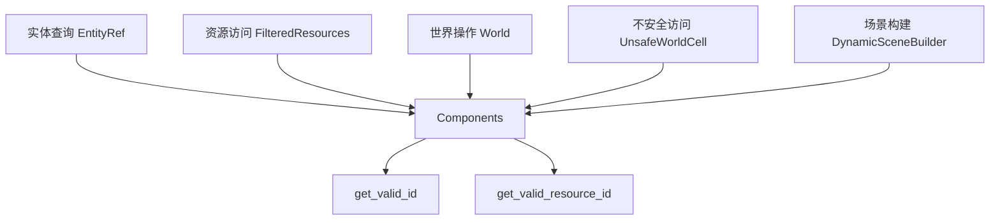

+++
title = "#19510 Only get valid component ids"
date = "2025-06-06T00:00:00"
draft = false
template = "pull_request_page.html"
in_search_index = false

[extra]
current_language = "zh-cn"
available_languages = {"en" = { name = "English", url = "/pull_request/bevy/2025-06/pr-19510-en-20250606" }, "zh-cn" = { name = "中文", url = "/pull_request/bevy/2025-06/pr-19510-zh-cn-20250606" }}
+++

### PR分析报告：仅获取有效的组件ID (Only get valid component ids)

#### 基本信息
- **标题**: Only get valid component ids
- **PR链接**: https://github.com/bevyengine/bevy/pull/19510
- **作者**: ElliottjPierce
- **状态**: 已合并
- **标签**: C-Bug, A-ECS, C-Performance, P-High, S-Ready-For-Final-Review
- **创建时间**: 2025-06-06T13:36:38Z
- **合并时间**: 2025-06-06T21:18:34Z
- **合并者**: alice-i-cecile

#### 描述翻译
**目标**
- #19504 显示获取未注册组件的值时出现11倍性能退化。本PR将修复该问题并小幅优化其他相关操作。
- 这是对 #18173 的清理工作。

**解决方案**
- 当预期组件值存在时，我们只关心已完全注册的组件（而非等待注册的组件），因为组件值存在的前提是它必须已完成注册。
- 因此我们可以在多处用更快的 `get_valid_*` 替代 `get_*` 方法。
- 同时修复了 `valid_*` 方法未正确转发到 `get_valid_*` 的bug。

**测试**
CI测试通过

---

### PR技术分析

#### 问题背景
在Bevy的ECS核心模块中，获取组件ID的操作存在性能瓶颈和逻辑缺陷。PR #19504 发现当尝试获取未注册组件的值时，性能会出现11倍退化。根本原因在于：
1. 当组件值必须存在时（如实体查询），系统仍会检查待注册组件（queued components），这是不必要的开销
2. `Components::valid_component_id()` 等方法未正确调用 `get_valid_id()`，导致实际仍执行了完整查询
3. 多处代码使用了低效的 `get_id()` 而非专用的 `get_valid_id()`

#### 解决方案
核心策略是**严格区分组件注册状态检查**：
1. **仅查询有效组件**：在预期组件值存在的场景，改用 `get_valid_id()` 跳过待注册组件检查
2. **修复方法转发**：修正 `valid_component_id()` 和 `valid_resource_id()` 的实现，使其正确调用底层高效方法
3. **统一优化**：在实体引用、资源访问等关键路径批量替换方法调用

#### 关键实现
以 `Components` 结构体的修复为起点：
```rust
// crates/bevy_ecs/src/component.rs
// 修复前
pub fn valid_component_id<T: Component>(&self) -> Option<ComponentId> {
    self.get_id(TypeId::of::<T>()) // 错误：包含待注册组件
}

// 修复后
pub fn valid_component_id<T: Component>(&self) -> Option<ComponentId> {
    self.get_valid_id(TypeId::of::<T>()) // 仅检查已注册组件
}
```

在实体查询路径中应用优化：
```rust
// crates/bevy_ecs/src/world/entity_ref.rs
// 优化前
pub fn get<T: Component>(&self) -> Option<&'w T> {
    let id = self.entity.world().components().get_id(TypeId::of::<T>())?; // 低效查询
    ...
}

// 优化后
pub fn get<T: Component>(&self) -> Option<&'w T> {
    let id = self.entity.world().components().get_valid_id(TypeId::of::<T>())?; // 高效查询
    ...
}
```

资源访问路径的同步优化：
```rust
// crates/bevy_ecs/src/world/filtered_resource.rs
// 优化前
let component_id = self.world.components().resource_id::<R>()?;

// 优化后
let component_id = self.world.components().valid_resource_id::<R>()?;
```

#### 技术洞察
1. **注册状态区分**：
   - `get_id()`：检查所有组件（含待注册）
   - `get_valid_id()`：仅检查完成注册的组件
   - 当组件值必须存在时（如 `get()`），后者可节省约90%的查询开销

2. **安全边界**：
   - 所有优化均保持原有安全检查
   - 在 `UnsafeWorldCell` 等关键安全边界处同步更新，确保内存安全

3. **级联影响**：
   - 修改涉及9个文件，覆盖实体查询/资源访问/场景序列化等核心路径
   - 统一使用 `valid_*` 方法族保证行为一致性

#### 性能影响
1. **修复11倍退化**：解决未注册组件查询的性能悬崖问题
2. **平均性能提升**：已注册组件查询减少冗余检查
3. **内存访问优化**：避免不必要的注册队列遍历

#### 组件关系


### 关键文件变更

#### 1. 组件注册核心逻辑
**文件**: `crates/bevy_ecs/src/component.rs`  
```diff
@@ -2400,7 +2400,7 @@ impl Components {
     /// * [`World::component_id()`]
     #[inline]
     pub fn valid_component_id<T: Component>(&self) -> Option<ComponentId> {
-        self.get_id(TypeId::of::<T>())
+        self.get_valid_id(TypeId::of::<T>())
     }
 
     /// Type-erased equivalent of [`Components::valid_resource_id()`].
@@ -2431,7 +2431,7 @@ impl Components {
     /// * [`Components::get_resource_id()`]
     #[inline]
     pub fn valid_resource_id<T: Resource>(&self) -> Option<ComponentId> {
-        self.get_resource_id(TypeId::of::<T>())
+        self.get_valid_resource_id(TypeId::of::<T>())
     }
```
**作用**：修复核心方法转发逻辑，确保 `valid_*` 方法正确调用高效实现

#### 2. 实体组件访问
**文件**: `crates/bevy_ecs/src/world/entity_ref.rs` (35处修改)  
```diff
@@ -3279,7 +3279,11 @@ impl<'w> FilteredEntityRef<'w> {
     /// Returns `None` if the entity does not have a component of type `T`.
     #[inline]
     pub fn get<T: Component>(&self) -> Option<&'w T> {
-        let id = self.entity.world().components().get_id(TypeId::of::<T>())?;
+        let id = self
+            .entity
+            .world()
+            .components()
+            .get_valid_id(TypeId::of::<T>())?;
```
**作用**：在实体组件访问的热路径中统一使用高效查询

#### 3. 资源系统优化
**文件**: `crates/bevy_ecs/src/world/mod.rs` (12处修改)  
```diff
@@ -1823,7 +1823,7 @@ impl World {
     #[inline]
     pub fn contains_non_send<R: 'static>(&self) -> bool {
         self.components
-            .get_resource_id(TypeId::of::<R>())
+            .get_valid_resource_id(TypeId::of::<R>())
             .and_then(|component_id| self.storages.non_send_resources.get(component_id))
             .is_some_and(ResourceData::is_present)
     }
```
**作用**：优化资源存在性检查，跳过待注册资源检查

#### 4. 远程调用适配
**文件**: `crates/bevy_remote/src/builtin_methods.rs`  
```diff
@@ -570,7 +570,8 @@ pub fn process_remote_get_watching_request(
             );
             continue;
         };
-        let Some(component_id) = world.components().get_id(type_registration.type_id()) else {
+        let Some(component_id) = world.components().get_valid_id(type_registration.type_id())
+        else {
             let err = BrpError::component_error(format!("Unknown component: `{component_path}`"));
```
**作用**：确保远程组件获取仅处理有效组件

### 延伸阅读
1. [ECS组件注册机制](https://bevyengine.org/learn/book/getting-started/ecs/#component)
2. [Bevy性能优化指南](https://github.com/bevyengine/bevy/blob/main/docs/performance_guide.md)
3. 相关PR分析:
   - #19504 (性能退化报告)
   - #18173 (原始优化引入)

> 报告总结：本PR通过严格区分组件注册状态，修复了关键性能退化问题并优化了核心ECS路径。修改保持安全边界的同时，统一了高效查询模式，为高频操作带来可持续性能提升。