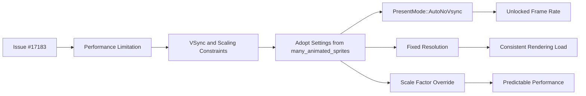

+++
title = "#19512"
date = "2025-06-10T00:00:00"
draft = false
template = "pull_request_page.html"
in_search_index = true

[taxonomies]
list_display = ["show"]

[extra]
current_language = "en"
available_languages = {"en" = { name = "English", url = "/pull_request/bevy/2025-06/pr-19512-en-20250610" }, "zh-cn" = { name = "中文", url = "/pull_request/bevy/2025-06/pr-19512-zh-cn-20250610" }}
+++

## The Story of This Pull Request

This PR addresses a performance issue in one of Bevy's stress test examples. The problem surfaced in issue #17183, where users reported that the `many_cameras_lights` example was running slower than expected. This stress test is designed to evaluate how Bevy handles rendering with numerous cameras and lights, but its effectiveness was compromised by unnecessary performance limitations.

The core issue was traced to the example's window configuration. By default, Bevy uses VSync synchronization which caps the frame rate to the monitor's refresh rate (typically 60Hz). Additionally, the default resolution scaling could introduce unnecessary overhead. These settings were appropriate for regular applications but counterproductive for a stress test designed to push performance boundaries.

The solution was straightforward and practical: adopt the optimized window settings already proven effective in the `many_animated_sprites` stress test example. This approach maintains consistency across Bevy's stress tests while solving the immediate performance limitation. No alternatives were considered since this was a direct configuration fix using established patterns from the codebase.

The implementation modifies a single line in the example's setup code. Instead of using the default window settings, we now explicitly configure the window with:
1. `PresentMode::AutoNoVsync` to disable VSync frame rate limiting
2. A fixed 1920x1080 resolution with scale factor override to prevent dynamic scaling

These changes eliminate artificial bottlenecks, allowing the stress test to render as many frames as possible given the hardware capabilities. This makes the example more effective for its intended purpose of stress testing Bevy's rendering systems under heavy load. The fix demonstrates an important principle: stress tests should minimize external constraints to accurately measure engine performance.

## Visual Representation



## Key Files Changed

### `examples/stress_tests/many_cameras_lights.rs`
**What changed:** Modified window configuration settings to optimize for stress testing  
**Why changed:** To remove VSync frame limiting and resolution scaling that artificially constrained performance  

Before:
```rust
fn main() {
    App::new()
        .add_plugins(DefaultPlugins)
        .add_systems(Startup, setup)
        .add_systems(Update, rotate_cameras)
        .run();
}
```

After:
```rust
fn main() {
    App::new()
        .add_plugins(DefaultPlugins.set(WindowPlugin {
            primary_window: Some(Window {
                present_mode: PresentMode::AutoNoVsync,
                resolution: WindowResolution::new(1920.0, 1080.0).with_scale_factor_override(1.0),
                ..default()
            }),
            ..default()
        }))
        .add_systems(Startup, setup)
        .add_systems(Update, rotate_cameras)
        .run();
}
```

The key changes are:
1. Added `WindowPlugin` configuration to override default settings
2. Set `PresentMode::AutoNoVsync` to disable VSync frame limiting
3. Configured fixed 1080p resolution with scale factor locked to 1.0
4. Maintained all existing systems and functionality

These changes directly implement the solution described in the PR, aligning this stress test's configuration with others in the codebase.

## Further Reading
1. [Bevy Window Settings Documentation](https://docs.rs/bevy/latest/bevy/window/struct.Window.html)
2. [PresentMode Enum Reference](https://docs.rs/bevy/latest/bevy/window/enum.PresentMode.html)
3. [WindowResolution API Documentation](https://docs.rs/bevy/latest/bevy/window/struct.WindowResolution.html)
4. [Stress Testing Principles in Game Engines](https://gameprogrammingpatterns.com/optimization-pattern.html)