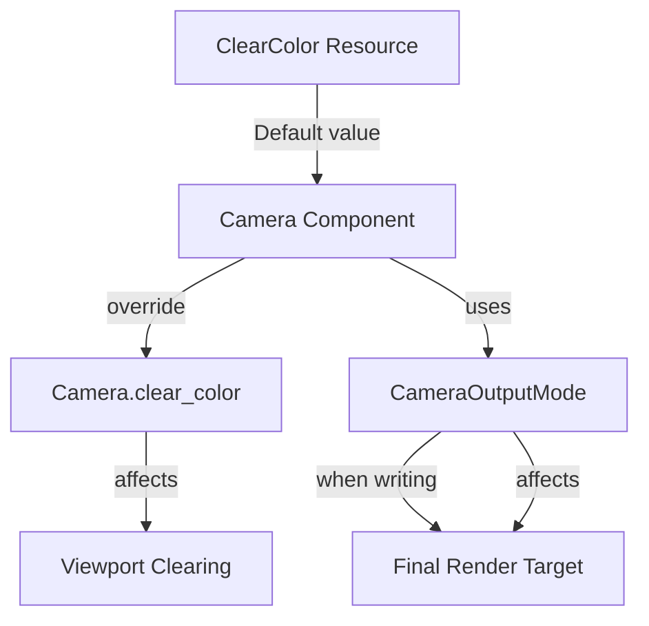

+++
title = "#19514 Minor clear color doc improvements"
date = "2025-06-09T00:00:00"
draft = false
template = "pull_request_page.html"
in_search_index = true

[taxonomies]
list_display = ["show"]

[extra]
current_language = "en"
available_languages = {"en" = { name = "English", url = "/pull_request/bevy/2025-06/pr-19514-en-20250609" }, "zh-cn" = { name = "中文", url = "/pull_request/bevy/2025-06/pr-19514-zh-cn-20250609" }}
labels = ["C-Docs", "D-Trivial", "A-Rendering"]
+++

## Technical Report: PR #19514 - Minor clear color doc improvements

### Basic Information
- **Title**: Minor clear color doc improvements
- **PR Link**: https://github.com/bevyengine/bevy/pull/19514
- **Author**: SpecificProtagonist
- **Status**: MERGED
- **Labels**: C-Docs, D-Trivial, A-Rendering, S-Ready-For-Final-Review
- **Created**: 2025-06-06T18:07:57Z
- **Merged**: 2025-06-09T20:16:02Z
- **Merged By**: alice-i-cecile

### Description Translation
The original description is in English and requires no translation:

```
Minor documentation improvements regarding clear color and camera output mode.

- Clarified when `ClearColorConfig` is used, including when writing to the final render target texture
- Added note about what happens when `blend_state` is not set in `CameraOutputMode::Write`
- Clarified that `ClearColor` is a default and that individual cameras can override it
```

### The Story of This Pull Request

**The Problem and Context**  
The Bevy renderer's camera documentation had minor ambiguities around clear color behavior. Specifically:  
1. The `ClearColorConfig` enum documentation didn't explicitly mention its usage when writing to final render targets  
2. The `CameraOutputMode::Write` variant didn't document behavior when `blend_state` was None  
3. The `ClearColor` resource documentation didn't clarify it was a default that cameras could override  

These documentation gaps could lead to developer confusion about:  
- When clear color operations occur during rendering  
- How camera-specific configurations override global defaults  
- Expected behavior when blend_state isn't configured  

**The Solution Approach**  
SpecificProtagonist addressed these through precise documentation improvements:  
1. Added explicit references to related camera properties using Rust's intra-doc links  
2. Clarified behavioral implications of missing configurations  
3. Specified override relationships between global resources and camera components  

No code logic changes were needed since the issues were purely documentation-related. The approach focused on adding missing contextual information while maintaining existing technical accuracy.

**The Implementation**  
Changes were localized to documentation comments in two files:  

1. In `camera.rs`, clarified `CameraOutputMode` behavior:  
```rust
// Before:
/// Control how this camera outputs once rendering is completed.

// After:
/// Control how this [`Camera`] outputs once rendering is completed.
#[derive(Debug, Clone, Copy)]
pub enum CameraOutputMode {
    Write {
        /// The blend state that will be used...
        /// If not set, the output will be written as-is, ignoring `clear_color`...
        blend_state: Option<BlendState>,
        ...
    }
}
```
The key additions:  
- Linked to [`Camera`] using intra-doc syntax  
- Added explicit behavior description for `blend_state: None` case  

2. In `clear_color.rs`, enhanced documentation for both the enum and resource:  
```rust
// ClearColorConfig before:
/// For a camera, specifies the color used to clear the viewport before rendering.

// ClearColorConfig after:
/// For a camera, specifies the color used to clear the viewport
/// [before rendering](crate::camera::Camera::clear_color)
/// or when [writing to the final render target texture](crate::camera::Camera::output_mode).

// ClearColor resource before:
/// A [`Resource`] that stores the color that is used to clear the screen between frames.

// ClearColor resource after:
/// A [`Resource`] that stores the default color that cameras use to clear...
/// Individual cameras may use [`Camera.clear_color`] to specify a different...
/// [`Camera.clear_color`]: crate::camera::Camera::clear_color
```
Key improvements:  
- Linked to relevant camera properties  
- Specified the resource acts as a default  
- Documented camera override capability  

**Technical Insights**  
These changes highlight important Bevy rendering concepts:  
1. **Clear operations occur at multiple stages**: Before rendering AND during final output composition  
2. **Configuration cascading**: Resource-level defaults can be overridden by component-level configurations  
3. **Blend state implications**: When blend_state is None, clear_color is ignored during output writing  

The documentation now better reflects Bevy's actual rendering pipeline behavior where:  
- `Camera::clear_color` controls pre-render clearing  
- `CameraOutputMode::Write` controls final target operations  
- Global `ClearColor` resource provides default values  

**The Impact**  
These changes provide:  
1. Clearer expectations about rendering pipeline behavior  
2. Better guidance for customizing camera-specific rendering  
3. Reduced cognitive load when debugging rendering issues  
4. Improved API discoverability through intra-doc links  

The documentation now accurately reflects that clear color configuration affects:  
- Initial viewport clearing (via `Camera::clear_color`)  
- Final output operations (via `CameraOutputMode::Write`)  
- With camera configurations taking precedence over global defaults  

### Visual Representation


### Key Files Changed

1. **crates/bevy_render/src/camera/camera.rs**  
   - Improved documentation for `CameraOutputMode`  
   - Added clarification about `blend_state: None` behavior  

```rust
// Before:
/// Control how this camera outputs once rendering is completed.
pub enum CameraOutputMode {
    Write {
        /// The blend state that will be used...
        blend_state: Option<BlendState>,
        ...
    }
}

// After:
/// Control how this [`Camera`] outputs once rendering is completed.
pub enum CameraOutputMode {
    Write {
        /// The blend state that will be used...
        /// If not set, the output will be written as-is...
        blend_state: Option<BlendState>,
        ...
    }
}
```

2. **crates/bevy_render/src/camera/clear_color.rs**  
   - Enhanced documentation for both `ClearColorConfig` and `ClearColor`  
   - Added intra-doc links and usage context  

```rust
// ClearColorConfig before:
/// For a camera, specifies the color used to clear the viewport before rendering.

// After:
/// For a camera, specifies the color used to clear the viewport
/// [before rendering](crate::camera::Camera::clear_color)
/// or when [writing to the final render target texture](crate::camera::Camera::output_mode).

// ClearColor resource before:
/// A [`Resource`] that stores the color that is used to clear the screen...

// After:
/// A [`Resource`] that stores the default color that cameras use...
/// Individual cameras may use [`Camera.clear_color`] to specify...
/// [`Camera.clear_color`]: crate::camera::Camera::clear_color
```

### Further Reading
1. [Bevy Rendering Pipeline Documentation](https://bevyengine.org/learn/book/rendering/pipeline/)  
2. [WGSL Blend State Specification](https://gpuweb.github.io/gpuweb/#blend-state)  
3. [Intra-doc Links in Rust Documentation](https://doc.rust-lang.org/rustdoc/linking-to-items-by-name.html)  
4. [Camera Systems in Bevy](https://github.com/bevyengine/bevy/blob/main/crates/bevy_render/src/camera/camera.rs)