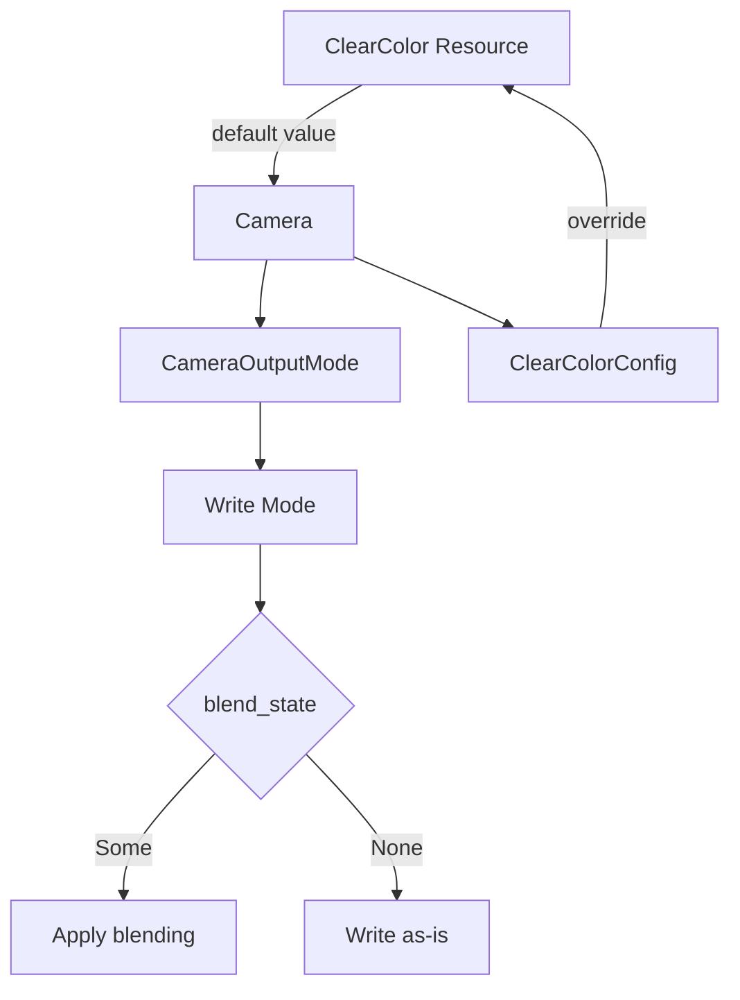

+++
title = "#19514 Minor clear color doc improvements"
date = "2025-06-09T00:00:00"
draft = false
template = "pull_request_page.html"
in_search_index = false

[extra]
current_language = "zh-cn"
available_languages = {"en" = { name = "English", url = "/pull_request/bevy/2025-06/pr-19514-en-20250609" }, "zh-cn" = { name = "中文", url = "/pull_request/bevy/2025-06/pr-19514-zh-cn-20250609" }}
labels = ["C-Docs", "D-Trivial", "A-Rendering"]
+++

# Minor clear color doc improvements

## Basic Information
- **Title**: Minor clear color doc improvements
- **PR Link**: https://github.com/bevyengine/bevy/pull/19514
- **Author**: SpecificProtagonist
- **Status**: MERGED
- **Labels**: C-Docs, D-Trivial, A-Rendering, S-Ready-For-Final-Review
- **Created**: 2025-06-06T18:07:57Z
- **Merged**: 2025-06-09T20:16:02Z
- **Merged By**: alice-i-cecile

## Description Translation
对`ClearColor`和`ClearColorConfig`的文档进行了一些小的改进，以明确默认清除颜色的使用方式以及`CameraOutputMode::Write`中`blend_state`的作用。

具体来说：
- 在`ClearColorConfig`的文档中，添加了指向`Camera`相关字段的链接，并说明清除颜色也用于写入最终渲染目标时。
- 在`ClearColor`资源的文档中，更明确地说明这是默认清除颜色，而单个摄像机可以通过`Camera.clear_color`覆盖此设置。
- 在`CameraOutputMode::Write`的`blend_state`字段的文档中，添加说明：如果没有设置混合状态，输出将原样写入，忽略`clear_color`和最终渲染目标中已有的数据。

这些改进旨在帮助用户理解清除颜色如何被使用，特别是当使用自定义输出模式时。

## The Story of This Pull Request

### 问题背景
在Bevy的渲染系统中，清除颜色(clear color)是控制摄像机渲染前行为的关键配置。开发者在配置`CameraOutputMode::Write`时，对`blend_state`字段的行为存在困惑，特别是当该字段为`None`时清除颜色如何生效。同时，文档没有明确区分全局`ClearColor`资源与每个摄像机`ClearColorConfig`之间的关系，导致用户不清楚如何覆盖默认清除行为。

### 解决方案
作者SpecificProtagonist通过三处文档改进来解决这些困惑：
1. 在`CameraOutputMode::Write`的`blend_state`文档中，明确添加了当未设置混合状态时的行为描述
2. 在`ClearColorConfig`文档中添加了指向相关摄像机字段的链接和上下文说明
3. 在`ClearColor`资源文档中强调其"默认"属性并说明覆盖机制

这些改动不改变任何功能逻辑，纯粹通过文档澄清来提升API可用性。作者采用了最直接的解决方案——增强现有文档字符串，避免了不必要的架构变更。

### 实现细节
核心修改集中在两个文件中：

1. **camera.rs**中的`CameraOutputMode`文档更新：
```rust
// 修改后
pub enum CameraOutputMode {
    Write {
        /// The blend state that will be used...
        /// If not set, the output will be written as-is, ignoring `clear_color`...
        blend_state: Option<BlendState>,
        ...
    }
}
```
这处修改明确说明了当`blend_state=None`时，系统会直接写入输出而忽略清除颜色配置，解决了关于混合状态行为的主要困惑点。

2. **clear_color.rs**中的两处改进：
```rust
// ClearColorConfig文档修改后
/// For a camera, specifies the color used to clear the viewport
/// [before rendering](crate::camera::Camera::clear_color)
/// or when [writing to the final render target texture](crate::camera::Camera::output_mode).
```

```rust
// ClearColor文档修改后
/// A [`Resource`] that stores the default color that cameras use...
///
/// Individual cameras may use [`Camera.clear_color`] to specify a different
/// clear color or opt out of clearing their viewport.
```
这些修改通过添加内联文档链接([`Camera.clear_color`])建立了概念间的关联，同时使用"default"一词明确区分了全局配置和每个摄像机的覆盖能力。

### 技术洞察
1. **可选字段的明确文档**：当API包含`Option<T>`字段时，必须明确说明`None`和`Some`状态的行为差异。原始文档缺失`blend_state=None`的行为说明是主要问题根源。
2. **默认值与覆盖机制**：资源(Resource)作为默认配置的模式需要显式文档说明其与组件级配置的覆盖关系。
3. **文档链接的价值**：使用`[crate::path]`语法创建的内联文档链接能显著提升API discoverability，帮助用户在不同概念间导航。

### 影响
这些文档改进：
1. 消除了`CameraOutputMode::Write`配置中关于混合状态和清除颜色互动的困惑
2. 明确了全局清除颜色资源与每个摄像机配置的优先级关系
3. 通过文档链接提升了API的自我解释性
4. 保持了100%向后兼容性，仅通过文档提升用户体验

## Visual Representation



## Key Files Changed

### 1. `crates/bevy_render/src/camera/camera.rs`
- **修改原因**：澄清`CameraOutputMode::Write`中`blend_state`字段的行为
- **代码变更**：
```diff
- /// Control how this camera outputs once rendering is completed.
+ /// Control how this [`Camera`] outputs once rendering is completed.
  #[derive(Debug, Clone, Copy)]
  pub enum CameraOutputMode {
      /// Writes the camera output to configured render target.
      Write {
          /// The blend state that will be used by the pipeline that writes the intermediate render textures to the final render target texture.
+         /// If not set, the output will be written as-is, ignoring `clear_color` and the existing data in the final render target texture.
          blend_state: Option<BlendState>,
          /// The clear color operation to perform on the final render target texture.
          clear_color: ClearColorConfig,
```

### 2. `crates/bevy_render/src/camera/clear_color.rs`
- **修改原因**：明确`ClearColorConfig`和`ClearColor`的用途，并添加相关链接
- **代码变更**：
```diff
- /// For a camera, specifies the color used to clear the viewport before rendering.
+ /// For a camera, specifies the color used to clear the viewport
+ /// [before rendering](crate::camera::Camera::clear_color)
+ /// or when [writing to the final render target texture](crate::camera::Camera::output_mode).
  #[derive(Reflect, Serialize, Deserialize, Copy, Clone, Debug, Default, From)]
  #[reflect(Serialize, Deserialize, Default, Clone)]
  pub enum ClearColorConfig {
```

```diff
- /// A [`Resource`] that stores the color that is used to clear the screen between frames.
+ /// A [`Resource`] that stores the default color that cameras use to clear the screen between frames.
  ///
  /// This color appears as the "background" color for simple apps,
  /// when there are portions of the screen with nothing rendered.
+ ///
+ /// Individual cameras may use [`Camera.clear_color`] to specify a different
+ /// clear color or opt out of clearing their viewport.
+ ///
+ /// [`Camera.clear_color`]: crate::camera::Camera::clear_color
  #[derive(Resource, Clone, Debug, Deref, DerefMut, ExtractResource, Reflect)]
  #[reflect(Resource, Default, Debug, Clone)]
  pub struct ClearColor(pub Color);
```

## Further Reading
1. [Bevy Camera and Rendering Documentation](https://docs.rs/bevy_render/latest/bevy_render/camera/index.html): 官方摄像机文档
2. [Rendering Pipeline Fundamentals](https://bevy-cheatbook.github.io/pipeline.html): Bevy渲染管线基础
3. [WGSL Blend State Specification](https://gpuweb.github.io/gpuweb/#blend-state): WebGPU混合状态规范