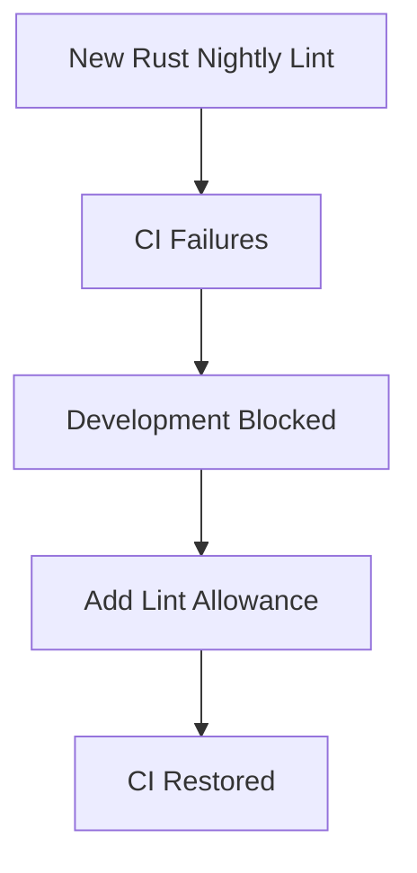

+++
title = "#19515 Allow new mismatched_lifetime_syntaxes lint"
date = "2025-06-06T00:00:00"
draft = false
template = "pull_request_page.html"
in_search_index = true

[taxonomies]
list_display = ["show"]

[extra]
current_language = "en"
available_languages = {"en" = { name = "English", url = "/pull_request/bevy/2025-06/pr-19515-en-20250606" }, "zh-cn" = { name = "中文", url = "/pull_request/bevy/2025-06/pr-19515-zh-cn-20250606" }}
labels = ["D-Trivial", "A-Build-System", "P-Critical", "X-Contentious"]
+++

### Analysis of PR #19515: Allow new mismatched_lifetime_syntaxes lint

#### Basic Information
- **Title**: Allow new mismatched_lifetime_syntaxes lint  
- **PR Link**: https://github.com/bevyengine/bevy/pull/19515  
- **Author**: alice-i-cecile  
- **Status**: MERGED  
- **Labels**: D-Trivial, A-Build-System, S-Ready-For-Final-Review, P-Critical, X-Contentious  
- **Created**: 2025-06-06T19:44:15Z  
- **Merged**: 2025-06-06T20:32:37Z  
- **Merged By**: alice-i-cecile  

#### Description
The new nightly lint produces [unhelpful, noisy output](http://github.com/bevyengine/bevy/actions/runs/15491867876/job/43620116435?pr=19510) that makes lifetimes more prominent in our library code than we generally find helpful.

This needs to be fixed or allowed, in order to unbreak CI for every PR in this repo.

Blanket allow the lint at the workspace level.

Let's see if CI passes!

---

### The Story of This Pull Request

#### The Problem and Context
A new lint (`mismatched_lifetime_syntaxes`) was introduced in Rust's nightly compiler. This lint automatically triggered warnings in Bevy's CI pipeline during builds, producing verbose output that cluttered logs and made lifetime syntax appear more prominently than necessary. The warnings were unhelpful for Bevy's development workflow and caused CI failures for all open PRs. Since Bevy uses a deny-by-default policy for lints, any new warnings from the compiler would fail CI. This became a critical issue (P-Critical) because it blocked all development activity.

#### The Solution Approach
The most straightforward solution was to explicitly allow the new lint at the workspace level. This approach:
1. Avoids the need for widespread code changes to satisfy the new lint rules
2. Maintains consistency by handling the lint configuration in a single location
3. Immediately unblocks CI without compromising existing quality standards

The alternative – modifying lifetime syntax across the entire codebase – was rejected due to:
- The disproportionate effort required relative to the benefit
- Potential introduction of new bugs during mass refactoring
- Disruption to active development work

#### The Implementation
The change was implemented in `Cargo.toml`, Bevy's central dependency and configuration file. A single line was added to the `[workspace.lints.rust]` section:

```toml
[workspace.lints.rust]
missing_docs = "warn"
mismatched_lifetime_syntaxes = "allow"  # New addition
unexpected_cfgs = { level = "warn", check-cfg = ['cfg(docsrs_dep)'] }
unsafe_code = "deny"
```

This modification:
- Explicitly sets the lint level to `allow`
- Affects all crates in the workspace
- Preserves existing lint configurations (`deny` for unsafe code, `warn` for missing docs)
- Uses Rust's standard lint level syntax

#### Technical Insights
The `mismatched_lifetime_syntaxes` lint detects inconsistent lifetime parameter declarations in function signatures. For example:
```rust
// Might trigger the lint
fn foo<'a>(x: &'a i32, y: &i32) 

// Preferred style
fn foo(x: &i32, y: &i32)
```

By allowing this lint:
- Bevy maintains compatibility with nightly Rust without requiring immediate code changes
- Developers can incrementally address lifetime syntax when modifying relevant code
- The team preserves flexibility to re-enable the lint later if needed

#### The Impact
This change immediately:
- Restores CI functionality for all PRs
- Eliminates noisy compiler output
- Maintains existing code quality standards
- Requires no modifications to application code

The solution demonstrates pragmatic handling of compiler updates in large projects – prioritizing development velocity while maintaining control over quality standards.

---

### Visual Representation


---

### Key Files Changed

#### `Cargo.toml`
**Change**: Added lint allowance for `mismatched_lifetime_syntaxes`  
**Why**: To suppress new compiler warnings and restore CI functionality  
**Impact**: Affects all crates in the workspace  

```toml
# Before:
[workspace.lints.rust]
missing_docs = "warn"
unexpected_cfgs = { level = "warn", check-cfg = ['cfg(docsrs_dep)'] }
unsafe_code = "deny"

# After:
[workspace.lints.rust]
missing_docs = "warn"
mismatched_lifetime_syntaxes = "allow"  # Added line
unexpected_cfgs = { level = "warn", check-cfg = ['cfg(docsrs_dep)'] }
unsafe_code = "deny"
```

---

### Further Reading
1. [Rust Lint Levels Documentation](https://doc.rust-lang.org/rustc/lints/levels.html)
2. [Rustc Lint Explanation](https://github.com/rust-lang/rust/issues/121652)
3. [Bevy's CI Configuration](https://github.com/bevyengine/bevy/blob/main/.github/workflows/ci.yml)
4. [Cargo Workspace Lints RFC](https://github.com/rust-lang/rfcs/blob/master/text/1234-workspace-lints.md)

---

### Full Code Diff
```diff
diff --git a/Cargo.toml b/Cargo.toml
index 207259a31f111..000bebe13496d 100644
--- a/Cargo.toml
+++ b/Cargo.toml
@@ -72,6 +72,7 @@ allow_attributes_without_reason = "warn"
 
 [workspace.lints.rust]
 missing_docs = "warn"
+mismatched_lifetime_syntaxes = "allow"
 unexpected_cfgs = { level = "warn", check-cfg = ['cfg(docsrs_dep)'] }
 unsafe_code = "deny"
 unsafe_op_in_unsafe_fn = "warn"
```