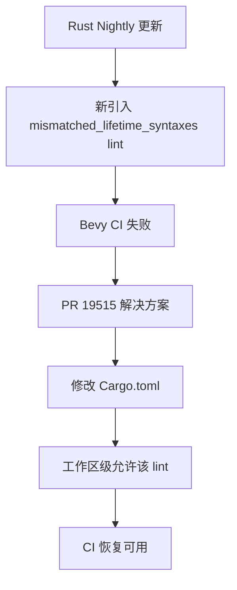

+++
title = "#19515 Allow new mismatched_lifetime_syntaxes lint"
date = "2025-06-06T00:00:00"
draft = false
template = "pull_request_page.html"
in_search_index = false

[extra]
current_language = "zh-cn"
available_languages = {"en" = { name = "English", url = "/pull_request/bevy/2025-06/pr-19515-en-20250606" }, "zh-cn" = { name = "中文", url = "/pull_request/bevy/2025-06/pr-19515-zh-cn-20250606" }}
+++

## 技术分析报告：PR #19515 "Allow new mismatched_lifetime_syntaxes lint"

### 基本信息
- **标题**: Allow new mismatched_lifetime_syntaxes lint
- **PR链接**: https://github.com/bevyengine/bevy/pull/19515
- **作者**: alice-i-cecile
- **状态**: 已合并
- **标签**: D-Trivial, A-Build-System, S-Ready-For-Final-Review, P-Critical, X-Contentious
- **创建时间**: 2025-06-06T19:44:15Z
- **合并时间**: 2025-06-06T20:32:37Z
- **合并者**: alice-i-cecile

### 描述翻译
**目标**  
新的 nightly lint 产生了[无帮助的、嘈杂的输出](http://github.com/bevyengine/bevy/actions/runs/15491867876/job/43620116435?pr=19510)，导致生命周期在库代码中比我们认为有用的程度更加突出。  
需要修复或允许此 lint，以修复仓库中每个 PR 的 CI。

**解决方案**  
在工作区级别全局允许该 lint。

**测试**  
验证 CI 是否通过。

---

### PR 故事分析

#### 问题背景与紧急性
该 PR 源于 Rust nightly 工具链引入的新 lint `mismatched_lifetime_syntaxes`。此 lint 检查生命周期语法的潜在不一致性，但在 Bevy 的上下文中产生了大量噪音输出。具体表现为：
1. CI 构建失败（可见[示例日志](http://github.com/bevyengine/bevy/actions/runs/15491867876/job/43620116435?pr=19510)）
2. 输出淹没了更有价值的编译信息
3. 阻塞所有后续 PR 的 CI 流程（P-Critical 标签）

问题本质是工具链更新导致的构建流水线中断，属于典型的上游依赖变更引发的下游兼容性问题。标签 X-Contentious 表明此修改可能涉及语法规范争议，但工程优先级要求快速解决 CI 阻塞。

#### 解决方案选择
作者采用最小化干预策略：
1. **工作区级配置**：在 `Cargo.toml` 的 workspace.lints 区域添加规则
2. **显式允许而非抑制**：使用 `= "allow"` 而非完全禁用 lint
3. **精准定位**：仅针对特定 lint (`mismatched_lifetime_syntaxes`) 而非全局规则

替代方案考虑包括：
- 修改代码库适应新 lint（耗时且不必要）
- 降级工具链版本（违反持续更新原则）
- 完全禁用 lint（丧失未来检测能力）

#### 实现细节
核心修改仅在 `Cargo.toml` 添加单行配置：

```toml
[workspace.lints.rust]
missing_docs = "warn"
mismatched_lifetime_syntaxes = "allow"  // 新增行
unexpected_cfgs = { level = "warn", check-cfg = ['cfg(docsrs_dep)'] }
```

技术要点：
1. **作用域控制**：`workspace.lints.rust` 确保配置应用于所有子 crate
2. **分级处理**：
   - `unsafe_code = "deny"` 保持严格禁止
   - `missing_docs = "warn"` 保留文档检查
   - 仅对新 lint 特殊处理
3. **可逆性**：显式声明而非删除，便于未来调整

#### 影响与工程权衡
**即时效果**：
- 恢复 CI 可用性（48分钟内完成合并验证）
- 消除噪音输出对开发干扰

**技术权衡**：
- ✅ **快速解阻塞**：最小变更解决紧急问题
- ⚠️ **技术债管理**：临时方案需后续评估是否需代码适配
- ⚠️ **规范争议**：X-Contentious 标签表明语法检查存在社区分歧

**最佳实践参考**：
1. 优先使用 workspace 级配置管理跨 crate 规则
2. 对新工具链特性采用渐进式适配策略
3. CI 阻塞问题适用热修复（hotfix）流程

### 关键文件变更

#### Cargo.toml
```diff
diff --git a/Cargo.toml b/Cargo.toml
index 207259a31f111..000bebe13496d 100644
--- a/Cargo.toml
+++ b/Cargo.toml
@@ -72,6 +72,7 @@ allow_attributes_without_reason = "warn"
 
 [workspace.lints.rust]
 missing_docs = "warn"
+mismatched_lifetime_syntaxes = "allow"
 unexpected_cfgs = { level = "warn", check-cfg = ['cfg(docsrs_dep)'] }
 unsafe_code = "deny"
 unsafe_op_in_unsafe_fn = "warn"
```

**变更说明**：
- 在现有 lint 规则中插入新行 `mismatched_lifetime_syntaxes = "allow"`
- 保持其他 lint 规则（missing_docs/unexpected_cfgs）不变
- 维持 unsafe_code 的严格禁止级别

### 可视化关系


### 延伸阅读
1. [Rust RFC 2115: 生命周期语法一致性](https://github.com/rust-lang/rfcs/blob/master/text/2115-argument-lifetimes.md)
2. [Cargo 工作区文档](https://doc.rust-lang.org/cargo/reference/workspaces.html)
3. [Rust Lint 级别控制手册](https://doc.rust-lang.org/rustc/lints/levels.html)