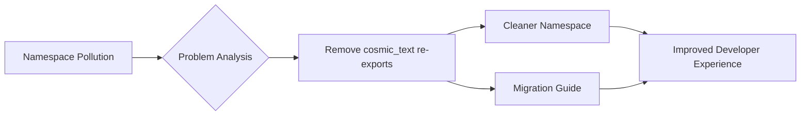

+++
title = "#19516 Remove re-exports of cosmic_text types"
date = "2025-06-06T00:00:00"
draft = false
template = "pull_request_page.html"
in_search_index = true

[taxonomies]
list_display = ["show"]

[extra]
current_language = "en"
available_languages = {"en" = { name = "English", url = "/pull_request/bevy/2025-06/pr-19516-en-20250606" }, "zh-cn" = { name = "中文", url = "/pull_request/bevy/2025-06/pr-19516-zh-cn-20250606" }}
labels = ["C-Usability", "A-Text", "X-Contentious", "D-Straightforward"]
+++

## Analysis of PR #19516: Remove re-exports of cosmic_text types

### Basic Information
- **Title**: Remove re-exports of cosmic_text types
- **PR Link**: https://github.com/bevyengine/bevy/pull/19516
- **Author**: alice-i-cecile
- **Status**: MERGED
- **Labels**: C-Usability, S-Ready-For-Final-Review, M-Needs-Migration-Guide, A-Text, X-Contentious, D-Straightforward
- **Created**: 2025-06-06T20:09:34Z
- **Merged**: 2025-06-06T22:07:03Z
- **Merged By**: alice-i-cecile

### Description Translation
# Objective

As discussed in #19285, we do a poor job at keeping the namespace tidy and free of duplicates / user-conflicting names in places. `cosmic_text` re-exports were the worst offender.

## Solution

Remove the re-exports completely. While the type aliases were quite thoughtful, they weren't used in any of our code / API.

### The Story of This Pull Request

This PR addresses namespace pollution in Bevy's text module caused by re-exported types from the `cosmic_text` crate. The problem manifested as autocomplete conflicts in user code, particularly with common type names like `Query` that collided with the re-exports. This violated Rust's best practices for clean module design and caused developer friction.

The solution was straightforward: completely remove the re-exports since they weren't used internally in Bevy's codebase. The implementation required two changes: first, deleting the re-export statements from `text.rs`, and second, creating a migration guide to help users update their code.

The removal of these re-exports improves developer experience by reducing namespace collisions and making autocomplete more predictable. The migration guide ensures users understand how to adjust their code by directly importing from `cosmic_text` instead of relying on Bevy's re-exports.

### Key Files Changed

1. **`crates/bevy_text/src/text.rs`**  
   Removed the re-exports of `cosmic_text` types that were causing namespace pollution.

```rust
// Before:
pub use cosmic_text::{
    self, FamilyOwned as FontFamily, Stretch as FontStretch, Style as FontStyle,
    Weight as FontWeight,
};

use crate::{Font, TextLayoutInfo, TextSpanAccess, TextSpanComponent};
```

```rust
// After:
use crate::{Font, TextLayoutInfo, TextSpanAccess, TextSpanComponent};
```

2. **`release-content/migration-guides/remove_cosmic_text_reexports.md`**  
   Added a migration guide explaining the change and how to update code.

```markdown
---
title: Removed `cosmic_text` re-exports
pull_requests: [TODO]
---

Previously, `bevy_text` re-exported the entirety of `cosmic_text` while renaming a few of the most confusing re-exports,
using the following code.

```rust
pub use cosmic_text::{
    self, FamilyOwned as FontFamily, Stretch as FontStretch, Style as FontStyle, Weight as FontWeight,
};
```

These re-exports commonly conflicted with other types (like `Query`!), leading to messy autocomplete errors.
Ultimately, these are largely an implementation detail, and were not widely used.

We've completely removed these re-exports (including the renamed types): if you need to use these types, please rely on them directly from `cosmic_text`, being sure that the version number you are using matches the version used by your version of `bevy_text`.
```

### Visual Representation



### Further Reading
1. [Rust Module System Best Practices](https://doc.rust-lang.org/book/ch07-02-defining-modules-to-control-scope-and-privacy.html)
2. [Bevy Text Documentation](https://docs.rs/bevy_text/latest/bevy_text/)
3. [cosmic_text Crate Documentation](https://docs.rs/cosmic_text/latest/cosmic_text/)