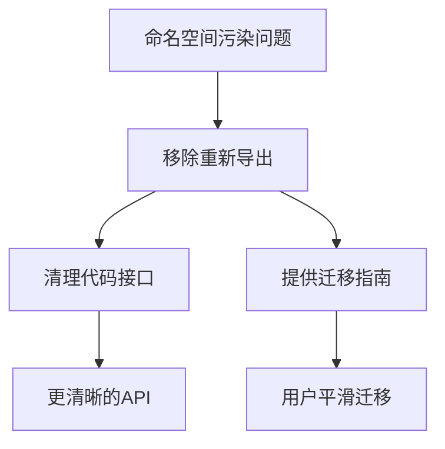

+++
title = "#19516 Remove re-exports of cosmic_text types"
date = "2025-06-06T00:00:00"
draft = false
template = "pull_request_page.html"
in_search_index = false

[extra]
current_language = "zh-cn"
available_languages = {"en" = { name = "English", url = "/pull_request/bevy/2025-06/pr-19516-en-20250606" }, "zh-cn" = { name = "中文", url = "/pull_request/bevy/2025-06/pr-19516-zh-cn-20250606" }}
+++

### 移除 `cosmic_text` 的重新导出

#### 基础信息
- **标题**: Remove re-exports of cosmic_text types
- **PR 链接**: https://github.com/bevyengine/bevy/pull/19516
- **作者**: alice-i-cecile
- **状态**: 已合并
- **标签**: C-Usability, S-Ready-For-Final-Review, M-Needs-Migration-Guide, A-Text, X-Contentious, D-Straightforward
- **创建时间**: 2025-06-06T20:09:34Z
- **合并时间**: 2025-06-06T22:07:03Z
- **合并者**: alice-i-cecile

#### 描述翻译
**目标**  
如 #19285 所述，我们在保持命名空间整洁、避免重复/用户冲突方面处理不足，`cosmic_text` 的重新导出是最严重的案例。

**解决方案**  
完全移除重新导出。虽然类型别名设计合理，但它们未在代码/API 中使用。

---

### 技术分析叙事

#### 问题背景
在 Bevy 的文本模块中，存在一个长期的设计问题：通过全局重新导出 `cosmic_text` 的全部内容（包括重命名的类型别名），导致命名空间污染。具体表现为：
1. 用户在使用 Bevy 时容易遭遇命名冲突（例如 `cosmic_text::Query` 与 Bevy ECS 的 `Query` 冲突）
2. IDE 自动补全被无关类型污染
3. 这些重新导出本质上是实现细节，未被 Bevy 内部或公共 API 实际使用

#### 解决方案选择
经过社区讨论（#19285），确认最直接有效的方案是**完全移除重新导出**。决策依据：
- 类型别名（如 `FontFamily`）未被任何 Bevy 代码引用
- 保留部分导出仍会造成命名空间污染
- 用户如需 `cosmic_text` 类型应直接依赖原 crate

#### 实现细节
改动集中在两个文件：

**1. 清理文本模块**  
移除 `bevy_text/src/text.rs` 中的重新导出代码：
```diff
- pub use cosmic_text::{
-     self, FamilyOwned as FontFamily, Stretch as FontStretch, Style as FontStyle,
-     Weight as FontWeight,
- };
```
这直接解决了命名空间污染问题。移除后：
- 模块仅保留 Bevy 自有类型（如 `TextLayoutInfo`）
- 用户代码若依赖这些导出将立即编译报错（需迁移）

**2. 添加迁移指南**  
新增 `release-content/migration-guides/remove_cosmic_text_reexports.md` 文件：
```markdown
---
title: Removed `cosmic_text` re-exports
---

Previously, `bevy_text` re-exported the entirety of `cosmic_text` while renaming a few...
```
指南明确：
- 冲突原因（如与 `Query` 冲突）
- 替代方案：直接依赖 `cosmic_text` 并保持版本同步
- 强调这些类型是实现细节

#### 技术影响
1. **正向影响**  
   - 消除 IDE 自动补全干扰
   - 避免用户代码的意外命名冲突
   - 简化 Bevy 文本模块的公共接口
   - 明确依赖边界（`cosmic_text` 作为独立实现细节）

2. **迁移成本**  
   需要修改直接使用重导出类型的用户代码，例如：  
   ```rust
   // 迁移前
   use bevy_text::FontWeight;
   // 迁移后
   use cosmic_text::Weight as FontWeight;
   ```

3. **设计启示**  
   - 避免重新导出第三方 crate 的全部内容
   - 类型别名需有实际使用场景才引入
   - 公共 API 应最小化实现细节暴露

---

### 变更关系图


---

### 关键文件变更
**1. 文本模块清理**  
`crates/bevy_text/src/text.rs`  
```diff
- pub use cosmic_text::{
-     self, FamilyOwned as FontFamily, Stretch as FontStretch, Style as FontStyle,
-     Weight as FontWeight,
- };
```
- **作用**：彻底移除问题根源
- **影响**：编译时立即暴露非法依赖

**2. 迁移指南**  
`release-content/migration-guides/remove_cosmic_text_reexports.md` (+18)  
```markdown
We've completely removed these re-exports...
use cosmic_text directly...
```
- **作用**：提供明确迁移路径
- **关键说明**：强调版本匹配要求（`cosmic_text` 版本需与 `bevy_text` 一致）

---

### 延伸阅读
1. [命名空间设计最佳实践](https://rust-lang.github.io/api-guidelines/naming.html)
2. [Rust 模块系统详解](https://doc.rust-lang.org/book/ch07-02-defining-modules-to-control-scope-and-privacy.html)
3. [Bevy 文本模块架构](https://github.com/bevyengine/bevy/tree/main/crates/bevy_text)