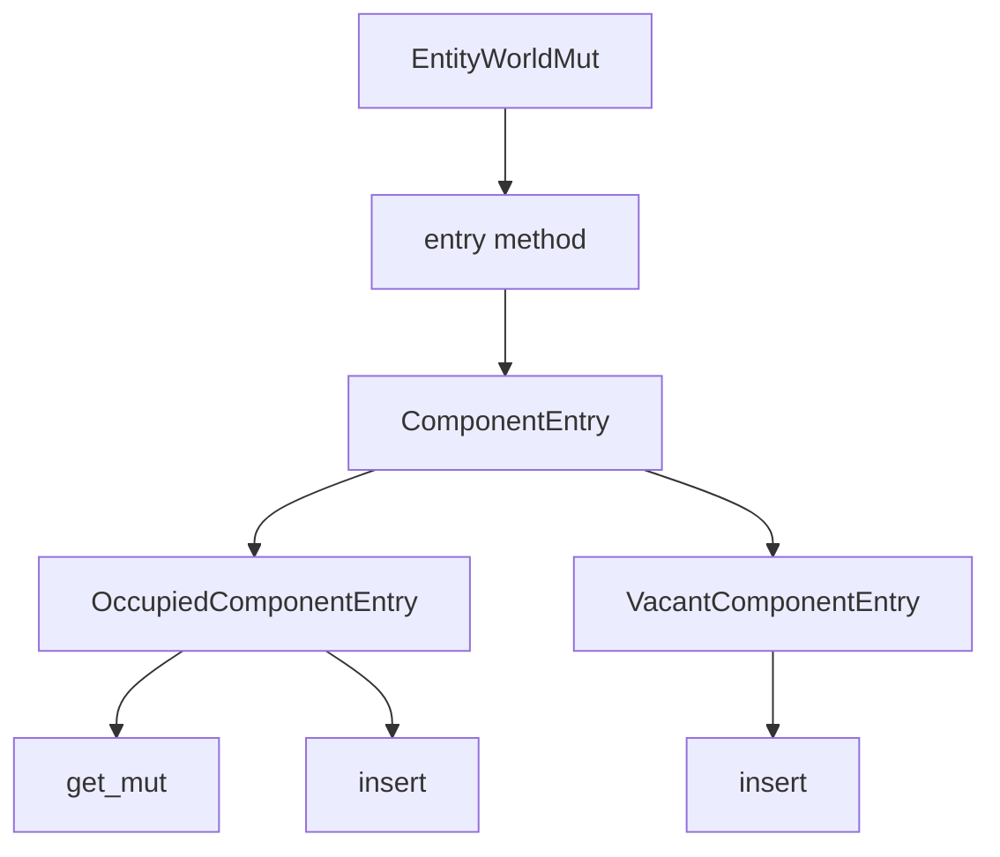

+++
title = "#19517 Rename bevy_ecs::world::Entry to ComponentEntry"
date = "2025-06-10T00:00:00"
draft = false
template = "pull_request_page.html"
in_search_index = true

[taxonomies]
list_display = ["show"]

[extra]
current_language = "en"
available_languages = {"en" = { name = "English", url = "/pull_request/bevy/2025-06/pr-19517-en-20250610" }, "zh-cn" = { name = "中文", url = "/pull_request/bevy/2025-06/pr-19517-zh-cn-20250610" }}
labels = ["A-ECS", "C-Usability"]
+++

### Rename bevy_ecs::world::Entry to ComponentEntry

## Basic Information
- **Title**: Rename bevy_ecs::world::Entry to ComponentEntry
- **PR Link**: https://github.com/bevyengine/bevy/pull/19517
- **Author**: alice-i-cecile
- **Status**: MERGED
- **Labels**: A-ECS, C-Usability, S-Ready-For-Final-Review, M-Needs-Migration-Guide
- **Created**: 2025-06-06T20:36:27Z
- **Merged**: 2025-06-10T01:31:32Z
- **Merged By**: alice-i-cecile

## Description Translation
The `Entry` enum in `bevy::ecs::world` has been renamed to `ComponentEntry`, to avoid name clashes with `hash_map`, `hash_table` and `hash_set` `Entry` types.

Correspondingly, the nested `OccupiedEntry` and `VacantEntry` enums have been renamed to `OccupiedComponentEntry` and `VacantComponentEntry`.

## The Story of This Pull Request

This PR addresses a naming conflict in Bevy's ECS module. The `Entry` type in `bevy_ecs::world` had become problematic because its name overlapped with similarly named types in Rust's standard collections like `HashMap` and `HashSet`. This naming collision created ambiguity for developers working with both ECS components and standard collections in the same codebase.

To resolve this, we renamed the ECS-specific type to `ComponentEntry`. This change clarifies its purpose while maintaining the existing functionality. The rename includes both the main enum and its variants:
- `Entry` → `ComponentEntry`
- `OccupiedEntry` → `OccupiedComponentEntry`
- `VacantEntry` → `VacantComponentEntry`

The implementation required updating all references to these types across the codebase. For example, the `entry` method in `EntityWorldMut` now returns `ComponentEntry` instead of `Entry`:

```rust
// Before:
pub fn entry<'a, T: Component>(&'a mut self) -> Entry<'w, 'a, T> 

// After:
pub fn entry<'a, T: Component>(&'a mut self) -> ComponentEntry<'w, 'a, T>
```

All method implementations were updated to use the new naming pattern. The documentation examples were also updated to reflect the changes, ensuring users see correct usage patterns. For instance:

```rust
// Before:
if let Entry::Occupied(o) = entity.entry::<Comp>() { ... }

// After:
if let ComponentEntry::Occupied(o) = entity.entry::<Comp>() { ... }
```

The renaming maintains the same functionality while improving code clarity. This change required updating multiple files including the core ECS implementation and the render synchronization system. A migration guide was added to help users transition their existing code.

## Visual Representation



## Key Files Changed

1. **crates/bevy_ecs/src/world/entity_ref.rs** (+56/-56)
   - Updated all references to `Entry`, `OccupiedEntry`, and `VacantEntry`
   - Revised documentation examples to use new names
   - Maintained identical functionality with new naming

```rust
// Before:
pub enum Entry<'w, 'a, T: Component> {
    Occupied(OccupiedEntry<'w, 'a, T>),
    Vacant(VacantEntry<'w, 'a, T>),
}

// After:
pub enum ComponentEntry<'w, 'a, T: Component> {
    Occupied(OccupiedComponentEntry<'w, 'a, T>),
    Vacant(VacantComponentEntry<'w, 'a, T>),
}
```

2. **crates/bevy_ecs/src/world/mod.rs** (+3/-2)
   - Updated public exports to reflect new names
   - Ensured consistent naming in module interface

```rust
// Before:
pub use entity_ref::{..., Entry, OccupiedEntry, VacantEntry};

// After:
pub use entity_ref::{..., ComponentEntry, OccupiedComponentEntry, VacantComponentEntry};
```

3. **crates/bevy_render/src/sync_world.rs** (+2/-2)
   - Updated render synchronization system to use new names
   - Maintained identical behavior with renamed types

```rust
// Before:
match main_entity.entry::<RenderEntity>() {
    bevy_ecs::world::Entry::Occupied(_) => {...}
    bevy_ecs::world::Entry::Vacant(entry) => {...}
}

// After:
match main_entity.entry::<RenderEntity>() {
    bevy_ecs::world::ComponentEntry::Occupied(_) => {...}
    bevy_ecs::world::ComponentEntry::Vacant(entry) => {...}
}
```

4. **release-content/migration-guides/component_entry.md** (+8/-0)
   - Added migration guide documenting the change
   - Provided clear instructions for updating existing code

```markdown
---
title: `Entry` enum is now `ComponentEntry`
pull_requests: [TODO]
---

The `Entry` enum in `bevy::ecs::world` has been renamed to `ComponentEntry`...
```

## Further Reading
1. [Rust Naming Conventions](https://rust-lang.github.io/api-guidelines/naming.html)
2. [Bevy ECS World Documentation](https://docs.rs/bevy_ecs/latest/bevy_ecs/world/index.html)
3. [Rust Standard Library Entry API](https://doc.rust-lang.org/std/collections/hash_map/enum.Entry.html)

## Full Code Diff
```diff
diff --git a/crates/bevy_ecs/src/world/entity_ref.rs b/crates/bevy_ecs/src/world/entity_ref.rs
index 9842ee54e365d..ed4681b0c0f7f 100644
--- a/crates/bevy_ecs/src/world/entity_ref.rs
+++ b/crates/bevy_ecs/src/world/entity_ref.rs
@@ -2600,14 +2600,14 @@ impl<'w> EntityWorldMut<'w> {
     /// # Panics
     ///
     /// If the entity has been despawned while this `EntityWorldMut` is still alive.
-    pub fn entry<'a, T: Component>(&'a mut self) -> Entry<'w, 'a, T> {
+    pub fn entry<'a, T: Component>(&'a mut self) -> ComponentEntry<'w, 'a, T> {
         if self.contains::<T>() {
-            Entry::Occupied(OccupiedEntry {
+            ComponentEntry::Occupied(OccupiedComponentEntry {
                 entity_world: self,
                 _marker: PhantomData,
             })
         } else {
-            Entry::Vacant(VacantEntry {
+            ComponentEntry::Vacant(VacantComponentEntry {
                 entity_world: self,
                 _marker: PhantomData,
             })
@@ -2850,14 +2850,14 @@ impl<'w> EntityWorldMut<'w> {
 /// This `enum` can only be constructed from the [`entry`] method on [`EntityWorldMut`].
 ///
 /// [`entry`]: EntityWorldMut::entry
-pub enum Entry<'w, 'a, T: Component> {
+pub enum ComponentEntry<'w, 'a, T: Component> {
     /// An occupied entry.
-    Occupied(OccupiedEntry<'w, 'a, T>),
+    Occupied(OccupiedComponentEntry<'w, 'a, T>),
     /// A vacant entry.
-    Vacant(VacantEntry<'w, 'a, T>),
+    Vacant(VacantComponentEntry<'w, 'a, T>),
 }
 
-impl<'w, 'a, T: Component<Mutability = Mutable>> Entry<'w, 'a, T> {
+impl<'w, 'a, T: Component<Mutability = Mutable>> ComponentEntry<'w, 'a, T> {
     /// Provides in-place mutable access to an occupied entry.
     ///
     /// # Examples
@@ -2876,17 +2876,17 @@ impl<'w, 'a, T: Component<Mutability = Mutable>> Entry<'w, 'a, T> {
     #[inline]
     pub fn and_modify<F: FnOnce(Mut<'_, T>)>(self, f: F) -> Self {
         match self {
-            Entry::Occupied(mut entry) => {
+            ComponentEntry::Occupied(mut entry) => {
                 f(entry.get_mut());
-                Entry::Occupied(entry)
+                ComponentEntry::Occupied(entry)
             }
-            Entry::Vacant(entry) => Entry::Vacant(entry),
+            ComponentEntry::Vacant(entry) => ComponentEntry::Vacant(entry),
         }
     }
 }
 
-impl<'w, 'a, T: Component> Entry<'w, 'a, T> {
-    /// Replaces the component of the entry, and returns an [`OccupiedEntry`].
+impl<'w, 'a, T: Component> ComponentEntry<'w, 'a, T> {
+    /// Replaces the component of the entry, and returns an [`OccupiedComponentEntry`].
     ///
     /// # Examples
     ///
@@ -2905,13 +2905,13 @@ impl<'w, 'a, T: Component> Entry<'w, 'a, T> {
     /// assert_eq!(entry.get(), &Comp(2));
     /// ```
     #[inline]
-    pub fn insert_entry(self, component: T) -> OccupiedEntry<'w, 'a, T> {
+    pub fn insert_entry(self, component: T) -> OccupiedComponentEntry<'w, 'a, T> {
         match self {
-            Entry::Occupied(mut entry) => {
+            ComponentEntry::Occupied(mut entry) => {
                 entry.insert(component);
                 entry
             }
-            Entry::Vacant(entry) => entry.insert(component),
+            ComponentEntry::Vacant(entry) => entry.insert(component),
         }
     }
 
@@ -2937,10 +2937,10 @@ impl<'w, 'a, T: Component> Entry<'w, 'a, T> {
     /// assert_eq!(world.query::<&Comp>().single(&world).unwrap().0, 8);
     /// ```
     #[inline]
-    pub fn or_insert(self, default: T) -> OccupiedEntry<'w, 'a, T> {
+    pub fn or_insert(self, default: T) -> OccupiedComponentEntry<'w, 'a, T> {
         match self {
-            Entry::Occupied(entry) => entry,
-            Entry::Vacant(entry) => entry.insert(default),
+            ComponentEntry::Occupied(entry) => entry,
+            ComponentEntry::Vacant(entry) => entry.insert(default),
         }
     }
 
@@ -2961,15 +2961,15 @@ impl<'w, 'a, T: Component> Entry<'w, 'a, T> {
     /// assert_eq!(world.query::<&Comp>().single(&world).unwrap().0, 4);
     /// ```
     #[inline]
-    pub fn or_insert_with<F: FnOnce() -> T>(self, default: F) -> OccupiedEntry<'w, 'a, T> {
+    pub fn or_insert_with<F: FnOnce() -> T>(self, default: F) -> OccupiedComponentEntry<'w, 'a, T> {
         match self {
-            Entry::Occupied(entry) => entry,
-            Entry::Vacant(entry) => entry.insert(default()),
+            ComponentEntry::Occupied(entry) => entry,
+            ComponentEntry::Vacant(entry) => entry.insert(default()),
         }
     }
 }
 
-impl<'w, 'a, T: Component + Default> Entry<'w, 'a, T> {
+impl<'w, 'a, T: Component + Default> ComponentEntry<'w, 'a, T> {
     /// Ensures the entry has this component by inserting the default value if empty, and
     /// returns a mutable reference to this component in the entry.
     ///
@@ -2987,42 +2987,42 @@ impl<'w, 'a, T: Component + Default> Entry<'w, 'a, T> {
     /// assert_eq!(world.query::<&Comp>().single(&world).unwrap().0, 0);
     /// ```
     #[inline]
-    pub fn or_default(self) -> OccupiedEntry<'w, 'a, T> {
+    pub fn or_default(self) -> OccupiedComponentEntry<'w, 'a, T> {
         match self {
-            Entry::Occupied(entry) => entry,
-            Entry::Vacant(entry) => entry.insert(Default::default()),
+            ComponentEntry::Occupied(entry) => entry,
+            ComponentEntry::Vacant(entry) => entry.insert(Default::default()),
         }
     }
 }
 
-/// A view into an occupied entry in a [`EntityWorldMut`]. It is part of the [`Entry`] enum.
+/// A view into an occupied entry in a [`EntityWorldMut`]. It is part of the [`OccupiedComponentEntry`] enum.
 ///
 /// The contained entity must have the component type parameter if we have this struct.
-pub struct OccupiedEntry<'w, 'a, T: Component> {
+pub struct OccupiedComponentEntry<'w, 'a, T: Component> {
     entity_world: &'a mut EntityWorldMut<'w>,
     _marker: PhantomData<T>,
 }
 
-impl<'w, 'a, T: Component> OccupiedEntry<'w, 'a, T> {
+impl<'w, 'a, T: Component> OccupiedComponentEntry<'w, 'a, T> {
     /// Gets a reference to the component in the entry.
     ///
     /// # Examples
     ///
     /// ```
-    /// # use bevy_ecs::{prelude::*, world::Entry};
+    /// # use bevy_ecs::{prelude::*, world::ComponentEntry};
     /// #[derive(Component, Default, Clone, Copy, Debug, PartialEq)]
     /// struct Comp(u32);
     ///
     /// # let mut world = World::new();
     /// let mut entity = world.spawn(Comp(5));
     ///
-    /// if let Entry::Occupied(o) = entity.entry::<Comp>() {
+    /// if let ComponentEntry::Occupied(o) = entity.entry::<Comp>() {
     ///     assert_eq!(o.get().0, 5);
     /// }
     /// ```
     #[inline]
     pub fn get(&self) -> &T {
-        // This shouldn't panic because if we have an OccupiedEntry the component must exist.
+        // This shouldn't panic because if we have an OccupiedComponentEntry the component must exist.
         self.entity_world.get::<T>().unwrap()
     }
 
@@ -3031,14 +3031,14 @@ impl<'w, 'a, T: Component> OccupiedEntry<'w, 'a, T> {
     /// # Examples
     ///
     /// ```
-    /// # use bevy_ecs::{prelude::*, world::Entry};
+    /// # use bevy_ecs::{prelude::*, world::ComponentEntry};
     /// #[derive(Component, Default, Clone, Copy, Debug, PartialEq)]
     /// struct Comp(u32);
     ///
     /// # let mut world = World::new();
     /// let mut entity = world.spawn(Comp(5));
     ///
-    /// if let Entry::Occupied(mut o) = entity.entry::<Comp>() {
+    /// if let ComponentEntry::Occupied(mut o) = entity.entry::<Comp>() {
     ///     o.insert(Comp(10));
     /// }
     ///
@@ -3054,14 +3054,14 @@ impl<'w, 'a, T: Component> OccupiedEntry<'w, 'a, T> {
     /// # Examples
     ///
     /// ```
-    /// # use bevy_ecs::{prelude::*, world::Entry};
+    /// # use bevy_ecs::{prelude::*, world::ComponentEntry};
     /// #[derive(Component, Default, Clone, Copy, Debug, PartialEq)]
     /// struct Comp(u32);
     ///
     /// # let mut world = World::new();
     /// let mut entity = world.spawn(Comp(5));
     ///
-    /// if let Entry::Occupied(o) = entity.entry::<Comp>() {
+    /// if let ComponentEntry::Occupied(o) = entity.entry::<Comp>() {
     ///     assert_eq!(o.take(), Comp(5));
     /// }
     ///
@@ -3069,30 +3069,30 @@ impl<'w, 'a, T: Component> OccupiedEntry<'w, 'a, T> {
     /// ```
     #[inline]
     pub fn take(self) -> T {
-        // This shouldn't panic because if we have an OccupiedEntry the component must exist.
+        // This shouldn't panic because if we have an OccupiedComponentEntry the component must exist.
         self.entity_world.take().unwrap()
     }
 }
 
-impl<'w, 'a, T: Component<Mutability = Mutable>> OccupiedEntry<'w, 'a, T> {
+impl<'w, 'a, T: Component<Mutability = Mutable>> OccupiedComponentEntry<'w, 'a, T> {
     /// Gets a mutable reference to the component in the entry.
     ///
-    /// If you need a reference to the `OccupiedEntry` which may outlive the destruction of
-    /// the `Entry` value, see [`into_mut`].
+    /// If you need a reference to the [`OccupiedComponentEntry`] which may outlive the destruction of
+    /// the [`OccupiedComponentEntry`] value, see [`into_mut`].
     ///
     /// [`into_mut`]: Self::into_mut
     ///
     /// # Examples
     ///
     /// ```
-    /// # use bevy_ecs::{prelude::*, world::Entry};
+    /// # use bevy_ecs::{prelude::*, world::ComponentEntry};
     /// #[derive(Component, Default, Clone, Copy, Debug, PartialEq)]
     /// struct Comp(u32);
     ///
     /// # let mut world = World::new();
     /// let mut entity = world.spawn(Comp(5));
     ///
-    /// if let Entry::Occupied(mut o) = entity.entry::<Comp>() {
+    /// if let ComponentEntry::Occupied(mut o) = entity.entry::<Comp>() {
     ///     o.get_mut().0 += 10;
     ///     assert_eq!(o.get().0, 15);
     ///
@@ -3104,28 +3104,28 @@ impl<'w, 'a, T: Component<Mutability = Mutable>> OccupiedEntry<'w, 'a, T> {
     /// ```
     #[inline]
     pub fn get_mut(&mut self) -> Mut<'_, T> {
-        // This shouldn't panic because if we have an OccupiedEntry the component must exist.
+        // This shouldn't panic because if we have an OccupiedComponentEntry the component must exist.
         self.entity_world.get_mut::<T>().unwrap()
     }
 
-    /// Converts the `OccupiedEntry` into a mutable reference to the value in the entry with
+    /// Converts the [`OccupiedComponentEntry`] into a mutable reference to the value in the entry with
     /// a lifetime bound to the `EntityWorldMut`.
     ///
-    /// If you need multiple references to the `OccupiedEntry`, see [`get_mut`].
+    /// If you need multiple references to the [`OccupiedComponentEntry`], see [`get_mut`].
     ///
     /// [`get_mut`]: Self::get_mut
     ///
     /// # Examples
     ///
     /// ```
-    /// # use bevy_ecs::{prelude::*, world::Entry};
+    /// # use bevy_ecs::{prelude::*, world::ComponentEntry};
     /// #[derive(Component, Default, Clone, Copy, Debug, PartialEq)]
     /// struct Comp(u32);
     ///
     /// # let mut world = World::new();
     /// let mut entity = world.spawn(Comp(5));
     ///
-    /// if let Entry::Occupied(o) = entity.entry::<Comp>() {
+    /// if let ComponentEntry::Occupied(o) = entity.entry::<Comp>() {
     ///     o.into_mut().0 += 10;
     /// }
     ///
@@ -3133,40 +3133,40 @@ impl<'w, 'a, T: Component<Mutability = Mutable>> OccupiedEntry<'w, 'a, T> {
     /// ```
     #[inline]
     pub fn into_mut(self) -> Mut<'a, T> {
-        // This shouldn't panic because if we have an OccupiedEntry the component must exist.
+        // This shouldn't panic because if we have an OccupiedComponentEntry the component must exist.
         self.entity_world.get_mut().unwrap()
     }
 }
 
-/// A view into a vacant entry in a [`EntityWorldMut`]. It is part of the [`Entry`] enum.
-pub struct VacantEntry<'w, 'a, T: Component> {
+/// A view into a vacant entry in a [`EntityWorldMut`]. It is part of the [`ComponentEntry`] enum.
+pub struct VacantComponentEntry<'w, 'a, T: Component> {
     entity_world: &'a mut EntityWorldMut<'w>,
     _marker: PhantomData<T>,
 }
 
-impl<'w, 'a, T: Component> VacantEntry<'w, 'a, T> {
-    /// Inserts the component into the `VacantEntry` and returns an `OccupiedEntry`.
+impl<'w, 'a, T: Component> VacantComponentEntry<'w, 'a, T> {
+    /// Inserts the component into the [`VacantComponentEntry`] and returns an [`OccupiedComponentEntry`].
     ///
     /// # Examples
     ///
     /// ```
-    /// # use bevy_ecs::{prelude::*, world::Entry};
+    /// # use bevy_ecs::{prelude::*, world::ComponentEntry};
     /// #[derive(Component, Default, Clone, Copy, Debug, PartialEq)]
     /// struct Comp(u32);
     ///
     /// # let mut world = World::new();
     /// let mut entity = world.spawn_empty();
     ///
-    /// if let Entry::Vacant(v) = entity.entry::<Comp>() {
+    /// if let ComponentEntry::Vacant(v) = entity.entry::<Comp>() {
     ///     v.insert(Comp(10));
     /// }
     ///
     /// assert_eq!(world.query::<&Comp>().single(&world).unwrap().0, 10);
     /// ```
     #[inline]
-    pub fn insert(self, component: T) -> OccupiedEntry<'w, 'a, T> {
+    pub fn insert(self, component: T) -> OccupiedComponentEntry<'w, 'a, T> {
         self.entity_world.insert(component);
-        OccupiedEntry {
+        OccupiedComponentEntry {
             entity_world: self.entity_world,
             _marker: PhantomData,
         }
@@ -3177,7 +3177,7 @@ impl<'w, 'a, T: Component> VacantEntry<'w, 'a, T> {
 ///
 /// To define the access when used as a [`QueryData`](crate::query::QueryData),
 /// use a [`QueryBuilder`](crate::query::QueryBuilder) or [`QueryParamBuilder`](crate::system::QueryParamBuilder).
-/// The `FilteredEntityRef` must be the entire `QueryData`, and not nested inside a tuple with other data.
+/// The [`FilteredEntityRef`] must be the entire [`QueryData`](crate::query::QueryData), and not nested inside a tuple with other data.
 ///
 /// ```
 /// # use bevy_ecs::{prelude::*, world::FilteredEntityRef};
diff --git a/crates/bevy_ecs/src/world/mod.rs b/crates/bevy_ecs/src/world/mod.rs
index 8cd558e8db23d..17d1a667d35b4 100644
--- a/crates/bevy_ecs/src/world/mod.rs
+++ b/crates/bevy_ecs/src/world/mod.rs
@@ -24,8 +24,9 @@ pub use component_constants::*;
 pub use deferred_world::DeferredWorld;
 pub use entity_fetch::{EntityFetcher, WorldEntityFetch};
 pub use entity_ref::{
-    DynamicComponentFetch, EntityMut, EntityMutExcept, EntityRef, EntityRefExcept, EntityWorldMut,
-    Entry, FilteredEntityMut, FilteredEntityRef, OccupiedEntry, TryFromFilteredError, VacantEntry,
+    ComponentEntry, DynamicComponentFetch, EntityMut, EntityMutExcept, EntityRef, EntityRefExcept,
+    EntityWorldMut, FilteredEntityMut, FilteredEntityRef, OccupiedComponentEntry,
+    TryFromFilteredError, VacantComponentEntry,
 };
 pub use filtered_resource::*;
 pub use identifier::WorldId;
diff --git a/crates/bevy_render/src/sync_world.rs b/crates/bevy_render/src/sync_world.rs
index f6c2f8759369d..b5844d065de60 100644
--- a/crates/bevy_render/src/sync_world.rs
+++ b/crates/bevy_render/src/sync_world.rs
@@ -219,10 +219,10 @@ pub(crate) fn entity_sync_system(main_world: &mut World, render_world: &mut Worl
                 EntityRecord::Added(e) => {
                     if let Ok(mut main_entity) = world.get_entity_mut(e) {
                         match main_entity.entry::<RenderEntity>() {
-                            bevy_ecs::world::Entry::Occupied(_) => {
+                            bevy_ecs::world::ComponentEntry::Occupied(_) => {
                                 panic!("Attempting to synchronize an entity that has already been synchronized!");
                             }
-                            bevy_ecs::world::Entry::Vacant(entry) => {
+                            bevy_ecs::world::ComponentEntry::Vacant(entry) => {
                                 let id = render_world.spawn(MainEntity(e)).id();
 
                                 entry.insert(RenderEntity(id));
diff --git a/release-content/migration-guides/component_entry.md b/release-content/migration-guides/component_entry.md
new file mode 100644
index 0000000000000..56b3b96da0b8f
--- /dev/null
+++ b/release-content/migration-guides/component_entry.md
@@ -0,0 +1,8 @@
+---
+title: `Entry` enum is now `ComponentEntry`
+pull_requests: [TODO]
+---
+
+The `Entry` enum in `bevy::ecs::world` has been renamed to `ComponentEntry`, to avoid name clashes with `hash_map`, `hash_table` and `hash_set` `Entry` types.
+
+Correspondingly, the nested `OccupiedEntry` and `VacantEntry` enums have been renamed to `OccupiedComponentEntry` and `VacantComponentEntry`.
```