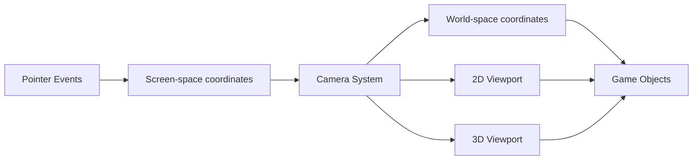

+++
title = "#19518 Mention in the docs for pointer events that these are in screen-space."
date = "2025-06-06T00:00:00"
draft = false
template = "pull_request_page.html"
in_search_index = true

[taxonomies]
list_display = ["show"]

[extra]
current_language = "en"
available_languages = {"en" = { name = "English", url = "/pull_request/bevy/2025-06/pr-19518-en-20250606" }, "zh-cn" = { name = "中文", url = "/pull_request/bevy/2025-06/pr-19518-zh-cn-20250606" }}
labels = ["C-Docs", "D-Trivial", "A-Picking"]
+++

## Technical Analysis Report: PR #19518 - Mention in the docs for pointer events that these are in screen-space

### Basic Information
- **Title**: Mention in the docs for pointer events that these are in screen-space.
- **PR Link**: https://github.com/bevyengine/bevy/pull/19518
- **Author**: andriyDev
- **Status**: MERGED
- **Labels**: C-Docs, D-Trivial, S-Ready-For-Final-Review, A-Picking
- **Created**: 2025-06-06T22:01:32Z
- **Merged**: 2025-06-06T22:37:25Z
- **Merged By**: alice-i-cecile

### Description Translation
# Objective
- Fixes #18109.

## Solution
- All these docs now mention screen-space vs world-space.
- `start_pos` and `latest_pos` both link to `viewport_to_world` and `viewport_to_world_2d`.
- The remaining cases are all deltas. Unfortunately `Camera` doesn't have an appropriate method for these cases, and implementing one would be non-trivial (e.g., the delta could have a different world-space size based on the depth). For these cases, I just link to `Camera` and suggest using some of its methods. Not a great solution, but at least it gets users on the correct track.

### The Story of This Pull Request

The core issue (#18109) stemmed from ambiguity in Bevy's pointer event documentation. Several event structs contained position and delta fields without clearly specifying their coordinate system. This was problematic because Bevy uses two distinct coordinate systems:
- Screen-space (pixels, top-left origin)
- World-space (scene coordinates, bottom-left origin in 2D)

Without explicit documentation, developers could misinterpret these values, leading to incorrect calculations for interactions like drag distances or object positioning. For example, a developer might directly use a screen-space delta to move a world-space object, resulting in unexpected behavior due to the coordinate system mismatch.

The solution approach focused on documentation enhancements rather than API changes. For absolute position fields (`start_pos` and `latest_pos` in `DragEntry`), we added direct links to `Camera`'s conversion methods since these map cleanly from viewport coordinates to world space. For relative movement fields (deltas), the conversion is more complex because:
1. Deltas represent movement vectors rather than absolute positions
2. World-space delta magnitude varies by depth in 3D contexts
3. Bevy's Camera API lacks direct delta conversion methods

The implementation added consistent documentation blocks across six fields in four event structs. Each documentation block:
1. Explicitly states the coordinate system (screen pixels)
2. Explains the coordinate orientation (top-left vs bottom-left)
3. Provides conversion guidance with appropriate Camera method links

For delta fields, the documentation acknowledges the conversion complexity and suggests developers explore Camera methods as a starting point, while noting that a complete solution might require custom logic. This pragmatic approach balances clarity with practicality - it addresses the immediate documentation gap without introducing new API surface area or complex conversion utilities.

The changes improve developer experience by:
1. Preventing misinterpretation of coordinate systems
2. Providing direct links to relevant conversion methods
3. Setting accurate expectations about coordinate conversion complexity
4. Maintaining backward compatibility (pure documentation change)

From an architectural perspective, this change reinforces Bevy's pattern of using screen-space coordinates for input events while keeping world-space transformations in the render/camera systems. The documentation bridges these domains by explicitly connecting input events to existing camera transformation utilities.

### Visual Representation



### Key Files Changed

**File**: `crates/bevy_picking/src/events.rs`  
**Changes**: Added documentation clarifying coordinate systems for pointer event fields  
**Rationale**: Fixes ambiguity in coordinate system usage for pointer events  

```rust
// Before (example for Move::delta):
pub struct Move {
    pub delta: Vec2,
}

// After:
pub struct Move {
    /// The change in position since the last move event.
    ///
    /// This is stored in screen pixels, not world coordinates. Screen pixels go from top-left to
    /// bottom-right, whereas (in 2D) world coordinates go from bottom-left to top-right. Consider
    /// using methods on [`Camera`](bevy_render::camera::Camera) to convert from screen-space to
    /// world-space.
    pub delta: Vec2,
}

// Before (example for DragEntry::start_pos):
pub struct DragEntry {
    pub start_pos: Vec2,
}

// After:
pub struct DragEntry {
    /// The position of the pointer at drag start.
    ///
    /// This is stored in screen pixels, not world coordinates. Screen pixels go from top-left to
    /// bottom-right, whereas (in 2D) world coordinates go from bottom-left to top-right. Consider
    /// using [`Camera::viewport_to_world`](bevy_render::camera::Camera::viewport_to_world) or
    /// [`Camera::viewport_to_world_2d`](bevy_render::camera::Camera::viewport_to_world_2d) to
    /// convert from screen-space to world-space.
    pub start_pos: Vec2,
}
```

### Further Reading
1. [Bevy Camera and Coordinates Documentation](https://bevyengine.org/learn/book/getting-started/cameras/)
2. [Screen vs World Space in Game Development](https://gamedev.stackexchange.com/questions/148338/inconsistent-use-of-screen-space-and-world-space-coordinates)
3. [Bevy Viewport to World Conversion](https://github.com/bevyengine/bevy/blob/main/crates/bevy_render/src/camera/camera.rs#L104-L124)

### Full Code Diff
```diff
diff --git a/crates/bevy_picking/src/events.rs b/crates/bevy_picking/src/events.rs
index 9a5bc51babe79..72c0f06c46b97 100644
--- a/crates/bevy_picking/src/events.rs
+++ b/crates/bevy_picking/src/events.rs
@@ -208,6 +208,11 @@ pub struct Move {
     /// Information about the picking intersection.
     pub hit: HitData,
     /// The change in position since the last move event.
+    ///
+    /// This is stored in screen pixels, not world coordinates. Screen pixels go from top-left to
+    /// bottom-right, whereas (in 2D) world coordinates go from bottom-left to top-right. Consider
+    /// using methods on [`Camera`](bevy_render::camera::Camera) to convert from screen-space to
+    /// world-space.
     pub delta: Vec2,
 }
 
@@ -228,8 +233,18 @@ pub struct Drag {
     /// Pointer button pressed and moved to trigger this event.
     pub button: PointerButton,
     /// The total distance vector of a drag, measured from drag start to the current position.
+    ///
+    /// This is stored in screen pixels, not world coordinates. Screen pixels go from top-left to
+    /// bottom-right, whereas (in 2D) world coordinates go from bottom-left to top-right. Consider
+    /// using methods on [`Camera`](bevy_render::camera::Camera) to convert from screen-space to
+    /// world-space.
     pub distance: Vec2,
     /// The change in position since the last drag event.
+    ///
+    /// This is stored in screen pixels, not world coordinates. Screen pixels go from top-left to
+    /// bottom-right, whereas (in 2D) world coordinates go from bottom-left to top-right. Consider
+    /// using methods on [`Camera`](bevy_render::camera::Camera) to convert from screen-space to
+    /// world-space.
     pub delta: Vec2,
 }
 
@@ -240,6 +255,11 @@ pub struct DragEnd {
     /// Pointer button pressed, moved, and released to trigger this event.
     pub button: PointerButton,
     /// The vector of drag movement measured from start to final pointer position.
+    ///
+    /// This is stored in screen pixels, not world coordinates. Screen pixels go from top-left to
+    /// bottom-right, whereas (in 2D) world coordinates go from bottom-left to top-right. Consider
+    /// using methods on [`Camera`](bevy_render::camera::Camera) to convert from screen-space to
+    /// world-space.
     pub distance: Vec2,
 }
 
@@ -296,8 +316,20 @@ pub struct DragDrop {
 #[reflect(Clone, PartialEq)]
 pub struct DragEntry {
     /// The position of the pointer at drag start.
+    ///
+    /// This is stored in screen pixels, not world coordinates. Screen pixels go from top-left to
+    /// bottom-right, whereas (in 2D) world coordinates go from bottom-left to top-right. Consider
+    /// using [`Camera::viewport_to_world`](bevy_render::camera::Camera::viewport_to_world) or
+    /// [`Camera::viewport_to_world_2d`](bevy_render::camera::Camera::viewport_to_world_2d) to
+    /// convert from screen-space to world-space.
     pub start_pos: Vec2,
     /// The latest position of the pointer during this drag, used to compute deltas.
+    ///
+    /// This is stored in screen pixels, not world coordinates. Screen pixels go from top-left to
+    /// bottom-right, whereas (in 2D) world coordinates go from bottom-left to top-right. Consider
+    /// using [`Camera::viewport_to_world`](bevy_render::camera::Camera::viewport_to_world) or
+    /// [`Camera::viewport_to_world_2d`](bevy_render::camera::Camera::viewport_to_world_2d) to
+    /// convert from screen-space to world-space.
     pub latest_pos: Vec2,
 }
```