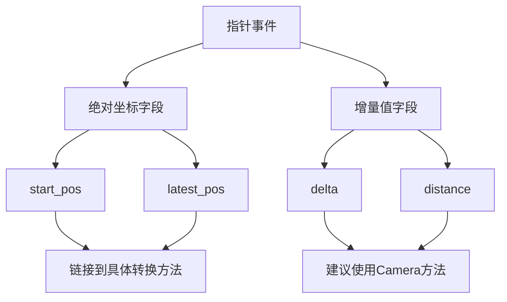

+++
title = "#19518 Mention in the docs for pointer events that these are in screen-space."
date = "2025-06-06T00:00:00"
draft = false
template = "pull_request_page.html"
in_search_index = false

[extra]
current_language = "zh-cn"
available_languages = {"en" = { name = "English", url = "/pull_request/bevy/2025-06/pr-19518-en-20250606" }, "zh-cn" = { name = "中文", url = "/pull_request/bevy/2025-06/pr-19518-zh-cn-20250606" }}
+++

## 指针事件文档：澄清屏幕空间坐标系

### 基本信息
- **标题**: Mention in the docs for pointer events that these are in screen-space.
- **PR链接**: https://github.com/bevyengine/bevy/pull/19518
- **作者**: andriyDev
- **状态**: 已合并
- **标签**: C-Docs, D-Trivial, S-Ready-For-Final-Review, A-Picking
- **创建时间**: 2025-06-06T22:01:32Z
- **合并时间**: 2025-06-06T22:37:25Z
- **合并人**: alice-i-cecile

### 描述翻译

# 目标
- 修复 #18109。

## 解决方案
- 所有相关文档现在都提及了屏幕空间(screen-space)与世界空间(world-space)的区别。
- `start_pos` 和 `latest_pos` 都链接到 `viewport_to_world` 和 `viewport_to_world_2d` 方法。
- 其余情况都是增量值(deltas)。遗憾的是`Camera`没有提供直接处理这些情况的方法，实现这种方法也比较复杂（例如增量值可能因深度不同而在世界空间中有不同尺寸）。对于这些情况，我链接到`Camera`并建议使用其部分方法。这不是完美的解决方案，但至少能为用户指明正确方向。

---

### PR分析

#### 问题背景
在Bevy的指针事件系统中，多个结构体（如`Move`、`Drag`、`DragEnd`）的坐标字段（如`delta`、`distance`、`start_pos`）使用屏幕空间坐标系(screen-space)。这导致了用户困惑（#18109），因为：
1. 屏幕空间坐标系原点在左上角，Y轴向下
2. 2D世界空间坐标系原点在左下角，Y轴向上
3. 开发者期望这些坐标直接对应世界空间，导致计算错误

#### 解决方案
PR通过文档更新明确坐标空间属性：
1. 在所有相关字段添加屏幕空间说明
2. 为绝对坐标(`start_pos`, `latest_pos`)添加直接转换方法引用
3. 为相对坐标(`delta`, `distance`)提供处理建议

#### 实现细节
修改集中在`events.rs`文件，添加了32行文档说明：
```rust
// 在DragEntry结构体
pub struct DragEntry {
    /// The position of the pointer at drag start.
    ///
    /// This is stored in screen pixels, not world coordinates. Screen pixels go from top-left to
    /// bottom-right, whereas (in 2D) world coordinates go from bottom-left to top-right. Consider
    /// using [`Camera::viewport_to_world`](bevy_render::camera::Camera::viewport_to_world) or
    /// [`Camera::viewport_to_world_2d`](bevy_render::camera::Camera::viewport_to_world_2d) to
    /// convert from screen-space to world-space.
    pub start_pos: Vec2,
    
    /// The latest position of the pointer during this drag, used to compute deltas.
    ///
    /// This is stored in screen pixels, not world coordinates. Screen pixels go from top-left to
    /// bottom-right, whereas (in 2D) world coordinates go from bottom-left to top-right. Consider
    /// using [`Camera::viewport_to_world`](bevy_render::camera::Camera::viewport_to_world) or
    /// [`Camera::viewport_to_world_2d`](bevy_render::camera::Camera::viewport_to_world_2d) to
    /// convert from screen-space to world-space.
    pub latest_pos: Vec2,
}
```

对于增量值字段，文档采用不同策略：
```rust
// 在Move事件
pub struct Move {
    // ...
    /// The change in position since the last move event.
    ///
    /// This is stored in screen pixels, not world coordinates. Screen pixels go from top-left to
    /// bottom-right, whereas (in 2D) world coordinates go from bottom-left to top-right. Consider
    /// using methods on [`Camera`](bevy_render::camera::Camera) to convert from screen-space to
    /// world-space.
    pub delta: Vec2,
}
```

#### 技术权衡
1. **绝对坐标处理**：直接链接到`viewport_to_world/viewport_to_world_2d`方法，提供明确转换路径
2. **增量值处理**：由于深度影响转换，建议开发者使用Camera方法自行处理而非提供直接转换
3. **一致性**：所有相关字段都添加了相同的坐标系说明，避免遗漏

#### 影响
1. 消除用户对坐标系的误解
2. 为新手开发者提供明确的转换指引
3. 保持API不变，仅通过文档改进用户体验

### 关键文件变更

#### `crates/bevy_picking/src/events.rs`
**变更原因**：添加指针事件的坐标系说明文档

**关键修改**：
```diff
@@ -208,6 +208,11 @@ pub struct Move {
     /// Information about the picking intersection.
     pub hit: HitData,
     /// The change in position since the last move event.
+    ///
+    /// This is stored in screen pixels, not world coordinates. Screen pixels go from top-left to
+    /// bottom-right, whereas (in 2D) world coordinates go from bottom-left to top-right. Consider
+    /// using methods on [`Camera`](bevy_render::camera::Camera) to convert from screen-space to
+    /// world-space.
     pub delta: Vec2,
 }
 
@@ -228,8 +233,18 @@ pub struct Drag {
     /// Pointer button pressed and moved to trigger this event.
     pub button: PointerButton,
     /// The total distance vector of a drag, measured from drag start to the current position.
+    ///
+    /// This is stored in screen pixels, not world coordinates. Screen pixels go from top-left to
+    /// bottom-right, whereas (in 2D) world coordinates go from bottom-left to top-right. Consider
+    /// using methods on [`Camera`](bevy_render::camera::Camera) to convert from screen-space to
+    /// world-space.
     pub distance: Vec2,
     /// The change in position since the last drag event.
+    ///
+    /// This is stored in screen pixels, not world coordinates. Screen pixels go from top-left to
+    /// bottom-right, whereas (in 2D) world coordinates go from bottom-left to top-right. Consider
+    /// using methods on [`Camera`](bevy_render::camera::Camera) to convert from screen-space to
+    /// world-space.
     pub delta: Vec2,
 }
 
@@ -240,6 +255,11 @@ pub struct DragEnd {
     /// Pointer button pressed, moved, and released to trigger this event.
     pub button: PointerButton,
     /// The vector of drag movement measured from start to final pointer position.
+    ///
+    /// This is stored in screen pixels, not world coordinates. Screen pixels go from top-left to
+    /// bottom-right, whereas (in 2D) world coordinates go from bottom-left to top-right. Consider
+    /// using methods on [`Camera`](bevy_render::camera::Camera) to convert from screen-space to
+    /// world-space.
     pub distance: Vec2,
 }
 
@@ -296,8 +316,20 @@ pub struct DragDrop {
 #[reflect(Clone, PartialEq)]
 pub struct DragEntry {
     /// The position of the pointer at drag start.
+    ///
+    /// This is stored in screen pixels, not world coordinates. Screen pixels go from top-left to
+    /// bottom-right, whereas (in 2D) world coordinates go from bottom-left to top-right. Consider
+    /// using [`Camera::viewport_to_world`](bevy_render::camera::Camera::viewport_to_world) or
+    /// [`Camera::viewport_to_world_2d`](bevy_render::camera::Camera::viewport_to_world_2d) to
+    /// convert from screen-space to world-space.
     pub start_pos: Vec2,
     /// The latest position of the pointer during this drag, used to compute deltas.
+    ///
+    /// This is stored in screen pixels, not world coordinates. Screen pixels go from top-left to
+    /// bottom-right, whereas (in 2D) world coordinates go from bottom-left to top-right. Consider
+    /// using [`Camera::viewport_to_world`](bevy_render::camera::Camera::viewport_to_world) or
+    /// [`Camera::viewport_to_world_2d`](bevy_render::camera::Camera::viewport_to_world_2d) to
+    /// convert from screen-space to world-space.
     pub latest_pos: Vec2,
 }
```

### 图示



### 延伸阅读
1. [Bevy坐标系统文档](https://bevyengine.org/learn/book/getting-started/coordinate-system/)
2. [Camera::viewport_to_world 方法实现](https://github.com/bevyengine/bevy/blob/main/crates/bevy_render/src/camera/mod.rs)
3. [屏幕空间 vs 世界空间概念解析](https://gamedev.stackexchange.com/questions/148338/screen-coordinates-to-world-coordinates)