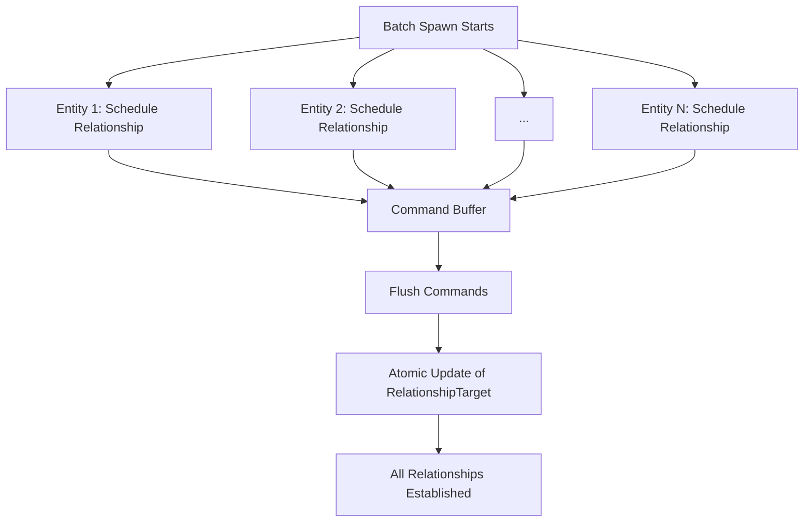

+++
title = "#19519 Fixing Relationship Inconsistencies in Batch Spawning Operations"
date = "2025-06-30T00:00:00"
draft = false
template = "pull_request_page.html"
in_search_index = true

[taxonomies]
list_display = ["show"]

[extra]
current_language = "en"
available_languages = {"en" = { name = "English", url = "/pull_request/bevy/2025-06/pr-19519-en-20250630" }, "zh-cn" = { name = "中文", url = "/pull_request/bevy/2025-06/pr-19519-zh-cn-20250630" }}
labels = ["C-Bug", "A-ECS"]
+++

## Title: Fixing Relationship Inconsistencies in Batch Spawning Operations

## Basic Information
- **Title**: Spawn batch with relationship
- **PR Link**: https://github.com/bevyengine/bevy/pull/19519
- **Author**: gwafotapa
- **Status**: MERGED
- **Labels**: C-Bug, A-ECS, S-Ready-For-Final-Review
- **Created**: 2025-06-06T22:54:38Z
- **Merged**: 2025-06-30T22:36:09Z
- **Merged By**: alice-i-cecile

## Description Translation
# Objective

Fixes #19356
Issue: Spawning a batch of entities in relationship with the same target adds the relationship between the target and only the last entity of the batch. `spawn_batch` flushes only after having spawned all entities. This means each spawned entity will have run the `on_insert` hook of its `Relationship` component. Here is the relevant part of that hook:
```Rust
            if let Some(mut relationship_target) =
                target_entity_mut.get_mut::<Self::RelationshipTarget>()
            {
                relationship_target.collection_mut_risky().add(entity);
            } else {
                let mut target = <Self::RelationshipTarget as RelationshipTarget>::with_capacity(1);
                target.collection_mut_risky().add(entity);
                world.commands().entity(target_entity).insert(target);
            }
```
Given the above snippet and since there's no flush between spawns, each entity finds the target without a `RelationshipTarget` component and defers the insertion of that component with the entity's id as the sole member of its collection. When the commands are finally flushed, each insertion after the first replaces the one before and in the process triggers the `on_replace` hook of `RelationshipTarget` which removes the `Relationship` component from the corresponding entity. That's how we end up in the invalid state.

## Solution

I see two possible solutions
1. Flush after every spawn
2. Defer the whole code snippet above

I don't know enough about bevy as a whole but 2. seems much more efficient to me. This is what I'm proposing here. I have a doubt though because I've started to look at #19348 that 1. would fix as well.

## Testing

I added a test for the issue. I've put it in `relationship/mod.rs` but I could see it in `world/spawn_batch.rs` or `lib.rs` because the test is as much about `spawn_batch` as it is about relationships.

## The Story of This Pull Request

### Problem Identification
The issue (#19356) occurred when spawning multiple entities in a batch that all shared a relationship with the same target entity. In batch spawning operations, Bevy's ECS doesn't flush commands between individual spawns. This caused a race condition in relationship management where:
1. Each new entity's `Relationship` component would trigger its `on_insert` hook
2. The hook would find the target entity missing its `RelationshipTarget` component
3. It would schedule a command to insert a new `RelationshipTarget` containing only itself
4. When commands finally flushed, only the last scheduled insert would persist
5. The intermediate inserts would trigger `on_replace` hooks that incorrectly removed relationships

This resulted in only the final entity in the batch maintaining its relationship to the target.

### Solution Approach
The developer considered two approaches:
1. Flushing after every spawn: Would resolve the issue but introduce performance overhead by breaking batch efficiency
2. Deferred relationship management: Modifies the hook to use Bevy's command system for atomic updates

The developer implemented option #2 as it maintains batch efficiency while fixing the consistency issue. The key insight was that by using Bevy's command entry API, all relationship updates could be deferred and applied atomically when commands flush.

### Implementation Details
The solution modifies the relationship hook to use Bevy's `entity_commands.entry()` API:
```rust
if let Ok(mut entity_commands) = world.commands().get_entity(target_entity) {
    // Deferring is necessary for batch mode
    entity_commands
        .entry::<Self::RelationshipTarget>()
        .and_modify(move |mut relationship_target| {
            relationship_target.collection_mut_risky().add(entity);
        })
        .or_insert_with(|| {
            let mut target = Self::RelationshipTarget::with_capacity(1);
            target.collection_mut_risky().add(entity);
            target
        });
}
```
This approach:
1. Uses command-based entity access instead of direct world access
2. Defers both component modification and insertion operations
3. Uses `and_modify` to update existing components
4. Uses `or_insert_with` to create new components only when needed
5. Maintains all operations in the command buffer until flush

### Testing Strategy
Two tests were added to verify the fix:
1. `spawn_batch_with_relationship`: Validates batch spawning of child entities
2. `insert_batch_with_relationship`: Validates batch insertion of relationships

The tests confirm that:
- All child entities maintain their `ChildOf` relationship
- The parent's `Children` component contains all children
- Relationships persist after command execution

### Technical Insights
The original implementation had a fundamental ordering issue: immediate world access during batch operations caused overlapping state mutations. By shifting to Bevy's command system:
- All relationship updates become atomic operations
- The system naturally handles multiple updates to the same component
- Batch efficiency is preserved since commands execute together
- The solution avoids expensive per-entity flushes

The `entry()` API was particularly valuable here as it provides atomic "upsert" semantics, handling both the modification and insertion cases through a unified interface.

### Impact
This fix:
1. Corrects relationship management in batch operations
2. Maintains Bevy's batch spawning performance
3. Prevents accidental relationship removal
4. Adds test coverage for batch relationship scenarios

The changes are localized to the relationship hook, minimizing risk to other systems. The solution demonstrates how Bevy's command system can resolve ordering issues in batch operations.

## Visual Representation



## Key Files Changed

### `crates/bevy_ecs/src/relationship/mod.rs`
1. **Relationship Hook Modification**  
   Changed the relationship hook implementation to use deferred command operations

```rust
// Before:
if let Ok(mut target_entity_mut) = world.get_entity_mut(target_entity) {
    if let Some(mut relationship_target) =
        target_entity_mut.get_mut::<Self::RelationshipTarget>()
    {
        relationship_target.collection_mut_risky().add(entity);
    } else {
        let mut target = <Self::RelationshipTarget as RelationshipTarget>::with_capacity(1);
        target.collection_mut_risky().add(entity);
        world.commands().entity(target_entity).insert(target);
    }
}

// After:
if let Ok(mut entity_commands) = world.commands().get_entity(target_entity) {
    entity_commands
        .entry::<Self::RelationshipTarget>()
        .and_modify(move |mut relationship_target| {
            relationship_target.collection_mut_risky().add(entity);
        })
        .or_insert_with(|| {
            let mut target = Self::RelationshipTarget::with_capacity(1);
            target.collection_mut_risky().add(entity);
            target
        });
}
```

2. **Test Cases Added**  
   Added validation for batch relationship operations

```rust
#[test]
fn spawn_batch_with_relationship() {
    let mut world = World::new();
    let parent = world.spawn_empty().id();
    let children = world
        .spawn_batch((0..10).map(|_| ChildOf(parent)))
        .collect::<Vec<_>>();

    for &child in &children {
        assert!(world
            .get::<ChildOf>(child)
            .is_some_and(|child_of| child_of.parent() == parent));
    }
    assert!(world
        .get::<Children>(parent)
        .is_some_and(|children| children.len() == 10));
}

#[test]
fn insert_batch_with_relationship() {
    let mut world = World::new();
    let parent = world.spawn_empty().id();
    let child = world.spawn_empty().id();
    world.insert_batch([(child, ChildOf(parent))]);
    world.flush();

    assert!(world.get::<ChildOf>(child).is_some());
    assert!(world.get::<Children>(parent).is_some());
}
```

## Further Reading
1. [Bevy ECS Relationships Documentation](https://bevyengine.org/learn/book/ecs/relationships/)
2. [Command System in Bevy](https://bevyengine.org/learn/book/ecs/commands/)
3. [Entity Commands API Reference](https://docs.rs/bevy_ecs/latest/bevy_ecs/system/struct.EntityCommands.html)
4. [Batch Processing Patterns in ECS](https://www.gamedeveloper.com/programming/entity-component-system-architectures)