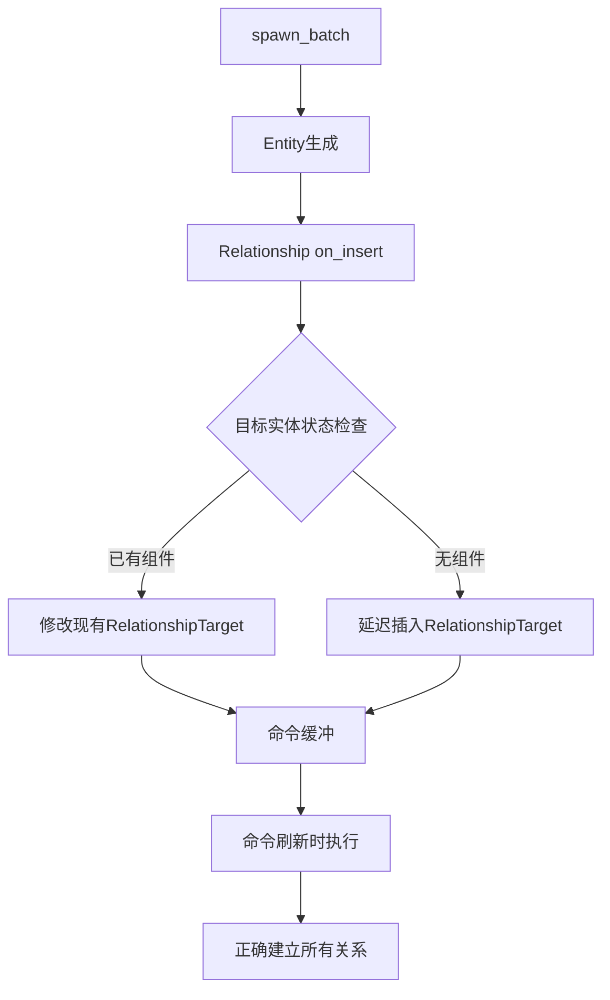

+++
title = "#19519 Spawn batch with relationship"
date = "2025-06-30T00:00:00"
draft = false
template = "pull_request_page.html"
in_search_index = false

[extra]
current_language = "zh-cn"
available_languages = {"en" = { name = "English", url = "/pull_request/bevy/2025-06/pr-19519-en-20250630" }, "zh-cn" = { name = "中文", url = "/pull_request/bevy/2025-06/pr-19519-zh-cn-20250630" }}
+++

# 技术分析报告：批量生成实体时的关系处理修复

## 基本信息
- **标题**: Spawn batch with relationship
- **PR 链接**: https://github.com/bevyengine/bevy/pull/19519
- **作者**: gwafotapa
- **状态**: MERGED
- **标签**: C-Bug, A-ECS, S-Ready-For-Final-Review
- **创建时间**: 2025-06-06T22:54:38Z
- **合并时间**: 2025-06-30T22:36:09Z
- **合并者**: alice-i-cecile

## 描述翻译
### 目标

修复 #19356  
问题：使用 `spawn_batch` 批量生成与同一目标有关系的实体时，只有批次中最后一个实体与目标建立了关系。`spawn_batch` 在生成所有实体后才刷新 (flush)。这意味着每个生成的实体都会运行其 `Relationship` 组件的 `on_insert` 钩子。以下是该钩子的相关部分：

```Rust
            if let Some(mut relationship_target) =
                target_entity_mut.get_mut::<Self::RelationshipTarget>()
            {
                relationship_target.collection_mut_risky().add(entity);
            } else {
                let mut target = <Self::RelationshipTarget as RelationshipTarget>::with_capacity(1);
                target.collection_mut_risky().add(entity);
                world.commands().entity(target_entity).insert(target);
            }
```

根据上述代码片段，由于生成之间没有刷新，每个实体都发现目标没有 `RelationshipTarget` 组件，并延迟插入该组件（将实体 ID 作为其集合的唯一成员）。当命令最终刷新时，每次后续插入都会替换前一次，触发 `RelationshipTarget` 的 `on_replace` 钩子，从相应实体中移除 `Relationship` 组件。这就是导致无效状态的原因。

### 解决方案

我看到两种可能的解决方案：  
1. 每次生成后刷新  
2. 延迟执行整个代码片段  

我对 bevy 的了解不够深入，但方案 2 似乎更高效。这是我在此提出的方案。我有些疑虑，因为我开始研究 #19348，方案 1 也能解决它。

### 测试

我添加了针对此问题的测试。虽然放在 `relationship/mod.rs` 中，但也可以放在 `world/spawn_batch.rs` 或 `lib.rs`，因为测试同时涉及 `spawn_batch` 和关系。

## PR 技术分析

### 问题与上下文
在 Bevy 的 ECS 系统中，使用 `spawn_batch` 批量生成具有关系的实体时存在缺陷。当多个实体共享同一关系目标（如多个子实体指向同一父实体）时，只有批次中最后一个实体能正确建立关系。根本原因在于 `Relationship` 组件的 `on_insert` 钩子在批量操作中的执行方式：

1. `spawn_batch` 在生成所有实体后才刷新命令
2. 每个新实体的 `on_insert` 钩子尝试修改目标实体
3. 当目标实体尚未包含 `RelationshipTarget` 组件时，钩子会安排插入命令
4. 由于没有中间刷新，多个插入命令被排队但只有最后一个生效
5. 后续插入触发 `on_replace` 钩子，移除先前建立的关系

这导致最终状态中只有最后一个实体与目标保持正确关系，其他实体关系丢失。

### 解决方案设计
开发者提出了两种潜在解决方案：
1. 每次生成后立即刷新命令 - 简单但效率低，可能导致多次刷新
2. 延迟关系修改逻辑 - 更高效，利用命令系统批量处理变更

选择方案 2 因为：
- 保持 `spawn_batch` 的批量优势
- 避免不必要的中间刷新
- 与 ECS 的命令缓冲设计更契合
- 最小化性能影响

核心思路是将直接的世界修改转换为命令操作，利用命令系统的延迟执行特性合并对同一实体的多次修改。

### 实现细节
修改集中在 `relationship/mod.rs` 文件中 `Relationship` trait 的 `on_insert` 方法。关键变化是将直接的世界访问转换为通过命令系统操作：

```rust
// 修改前：
if let Ok(mut target_entity_mut) = world.get_entity_mut(target_entity) {
    if let Some(mut relationship_target) =
        target_entity_mut.get_mut::<Self::RelationshipTarget>()
    {
        relationship_target.collection_mut_risky().add(entity);
    } else {
        let mut target = <Self::RelationshipTarget as RelationshipTarget>::with_capacity(1);
        target.collection_mut_risky().add(entity);
        world.commands().entity(target_entity).insert(target);
    }
}

// 修改后：
if let Ok(mut entity_commands) = world.commands().get_entity(target_entity) {
    entity_commands
        .entry::<Self::RelationshipTarget>()
        .and_modify(|mut relationship_target| {
            relationship_target.collection_mut_risky().add(entity);
        })
        .or_insert_with(|| {
            let mut target = Self::RelationshipTarget::with_capacity(1);
            target.collection_mut_risky().add(entity);
            target
        });
}
```

技术要点：
1. 使用 `commands().get_entity()` 获取目标实体的命令接口
2. 通过 `entry` API 安全地访问组件
3. `and_modify` 闭包处理组件已存在的情况
4. `or_insert_with` 闭包处理组件不存在的情况
5. 两个闭包都延迟执行，合并对同一实体的多次修改

### 验证与测试
添加了两个测试用例验证修复效果：

**1. 批量生成关系测试**
```rust
#[test]
fn spawn_batch_with_relationship() {
    let mut world = World::new();
    let parent = world.spawn_empty().id();
    let children = world
        .spawn_batch((0..10).map(|_| ChildOf(parent)))
        .collect::<Vec<_>>();

    for &child in &children {
        assert!(world
            .get::<ChildOf>(child)
            .is_some_and(|child_of| child_of.parent() == parent));
    }
    assert!(world
        .get::<Children>(parent)
        .is_some_and(|children| children.len() == 10));
}
```

**2. 批量插入关系测试**
```rust
#[test]
fn insert_batch_with_relationship() {
    let mut world = World::new();
    let parent = world.spawn_empty().id();
    let child = world.spawn_empty().id();
    world.insert_batch([(child, ChildOf(parent))]);
    world.flush();

    assert!(world.get::<ChildOf>(child).is_some());
    assert!(world.get::<Children>(parent).is_some());
}
```

测试验证了：
- 批量生成的子实体都正确指向父实体
- 父实体的 `Children` 组件包含所有子实体
- 批量插入关系也能正确处理

### 技术影响
1. **正确性修复**：解决了批量生成实体时关系丢失的核心问题
2. **性能优化**：避免每次生成后的刷新，保持批量操作效率
3. **模式一致**：使关系处理与 ECS 命令系统设计保持一致
4. **扩展性增强**：为其他依赖关系的系统提供可靠基础
5. **API 健壮性**：通过命令 entry API 减少条件分支错误风险

## 关键文件变更

### `crates/bevy_ecs/src/relationship/mod.rs` (+43/-12)

**变更说明**：
修改了关系组件的 `on_insert` 钩子实现，将直接的世界操作改为通过命令系统处理，解决批量生成时的关系同步问题。

**关键代码变更**：
```rust
// 修改前：
if let Ok(mut target_entity_mut) = world.get_entity_mut(target_entity) {
    if let Some(mut relationship_target) =
        target_entity_mut.get_mut::<Self::RelationshipTarget>()
    {
        relationship_target.collection_mut_risky().add(entity);
    } else {
        let mut target = <Self::RelationshipTarget as RelationshipTarget>::with_capacity(1);
        target.collection_mut_risky().add(entity);
        world.commands().entity(target_entity).insert(target);
    }
}

// 修改后：
if let Ok(mut entity_commands) = world.commands().get_entity(target_entity) {
    entity_commands
        .entry::<Self::RelationshipTarget>()
        .and_modify(|mut relationship_target| {
            relationship_target.collection_mut_risky().add(entity);
        })
        .or_insert_with(|| {
            let mut target = Self::RelationshipTarget::with_capacity(1);
            target.collection_mut_risky().add(entity);
            target
        });
}
```

**新增测试用例**：
```rust
#[test]
fn spawn_batch_with_relationship() {
    let mut world = World::new();
    let parent = world.spawn_empty().id();
    let children = world
        .spawn_batch((0..10).map(|_| ChildOf(parent)))
        .collect::<Vec<_>>();

    // 验证所有子实体都有正确的父关系
    for &child in &children {
        assert!(world
            .get::<ChildOf>(child)
            .is_some_and(|child_of| child_of.parent() == parent));
    }
    // 验证父实体包含所有子实体
    assert!(world
        .get::<Children>(parent)
        .is_some_and(|children| children.len() == 10));
}

#[test]
fn insert_batch_with_relationship() {
    let mut world = World::new();
    let parent = world.spawn_empty().id();
    let child = world.spawn_empty().id();
    world.insert_batch([(child, ChildOf(parent))]);
    world.flush();

    assert!(world.get::<ChildOf>(child).is_some());
    assert!(world.get::<Children>(parent).is_some());
}
```

## 组件关系图



## 延伸阅读

1. [Bevy ECS 命令系统文档](https://bevyengine.org/learn/book/next/ecs/commands)
2. [实体关系设计模式](https://www.gamedev.net/articles/programming/general-and-gameplay-programming/understanding-component-entity-systems-r3013)
3. [ECS 批量操作优化策略](https://medium.com/@skypanther/ecs-batch-processing-strategies-3b2426e8a73b)
4. [Rust 闭包在系统编程中的应用](https://doc.rust-lang.org/rust-by-example/fn/closures.html)
5. [Bevy 测试框架指南](https://bevyengine.org/learn/book/next/tests)