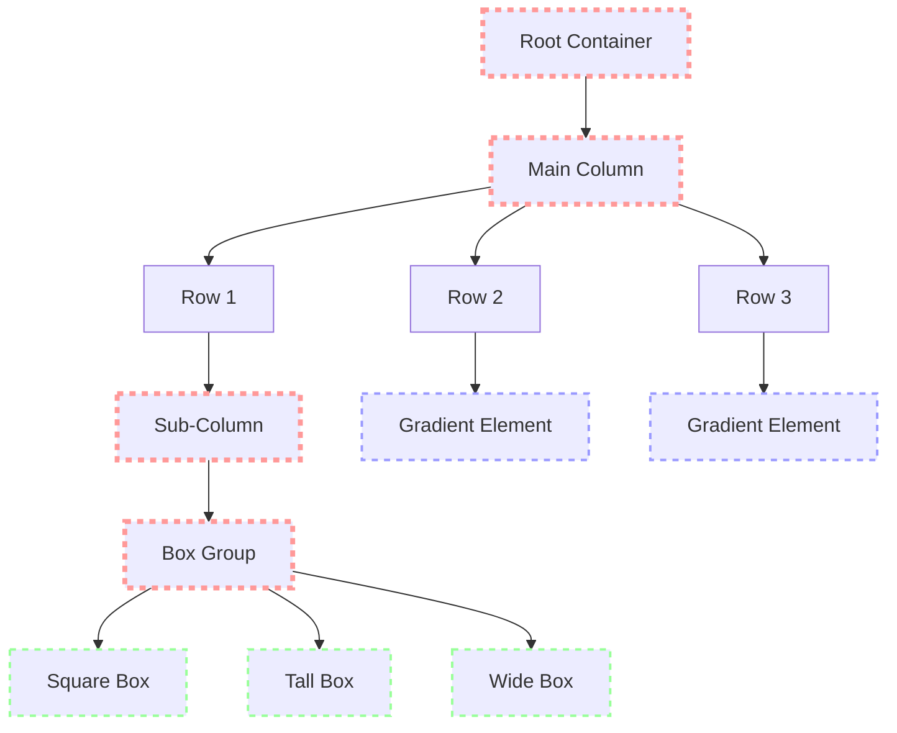

+++
title = "#19520 Gradients example: Fit in initial window"
date = "2025-06-08T00:00:00"
draft = false
template = "pull_request_page.html"
in_search_index = true

[taxonomies]
list_display = ["show"]

[extra]
current_language = "en"
available_languages = {"en" = { name = "English", url = "/pull_request/bevy/2025-06/pr-19520-en-20250608" }, "zh-cn" = { name = "中文", url = "/pull_request/bevy/2025-06/pr-19520-zh-cn-20250608" }}
labels = ["D-Trivial", "C-Examples", "A-UI"]
+++

## Gradients Example: Fit in Initial Window

### Basic Information
- **Title**: Gradients example: Fit in initial window
- **PR Link**: https://github.com/bevyengine/bevy/pull/19520
- **Author**: SpecificProtagonist
- **Status**: MERGED
- **Labels**: D-Trivial, C-Examples, A-UI, S-Ready-For-Final-Review
- **Created**: 2025-06-07T09:52:25Z
- **Merged**: 2025-06-08T17:43:42Z
- **Merged By**: mockersf

### Description Translation
**Objective**

When running the `gradient` example, part of the content doesn't fit within the initial window:  
  

The UI requires 1830×930 pixels, but the initial window size is 1280×720.  

**Solution**  

Make UI elements smaller:  
  

Alternative: Use a larger initial window size. I decided against this because that would make the examples less uniform, make the code less focused on gradients and not help on web.

### The Story of This Pull Request

**The Problem and Context**  
The gradients example had a layout issue where key UI elements extended beyond the initial 1280×720 window size. This created a poor first impression for users running the example since they couldn't see the complete gradient demonstration without manual window resizing. The problem was particularly noticeable because Bevy examples should work out-of-the-box without requiring user intervention. The technical constraint was maintaining compatibility with Bevy's default window size while keeping the example focused purely on gradient functionality.

**The Solution Approach**  
Instead of increasing the initial window size - which would create inconsistency across examples and add unrelated window configuration code - the author chose to reduce element dimensions proportionally. This approach maintains the example's focus on gradients while solving the layout issue. Key considerations included:
- Preserving relative proportions between elements
- Maintaining sufficient size for gradient visibility
- Avoiding radical changes to the example's structure
- Keeping the solution web-compatible since window resizing isn't practical in web contexts

**The Implementation**  
The solution involved precise adjustments to spacing and sizing parameters throughout the UI hierarchy. The changes cascade from parent containers down to individual elements:

```rust
// Main container adjustments
commands.spawn(Node {
    flex_direction: FlexDirection::Column,
    row_gap: Val::Px(20.), // Reduced from 30px
    margin: UiRect::all(Val::Px(20.)), // Reduced from 30px
    ..Default::default()
})
```

Border thickness was reduced from 5px to 4px to reclaim space without compromising visibility:

```rust
// Border thickness reduction
for (b, stops) in [
    (
        4., // Reduced from 5px
        vec![...]
    ),
    (4., ...), // Reduced from 5px
    ...
]
```

Nested containers received proportional spacing reductions:

```rust
// Sub-container adjustments
commands.spawn(Node {
    flex_direction: FlexDirection::Column,
    row_gap: Val::Px(5.), // Reduced from 10px
    ..Default::default()
})
```

Element dimensions were scaled down approximately 30% while maintaining aspect ratios:

```rust
// Element size reductions
for (w, h) in [(70., 70.), (35., 70.), (70., 35.)] { 
    // Previously: (100,100), (50,100), (100,50)
```

Lateral spacing was tightened by reducing left margins:

```rust
// Margin reductions
ImageBundle {
    style: Style {
        margin: UiRect::left(Val::Px(20.)), // Reduced from 30px
        ..default()
    },
    ...
}
```

**Technical Insights**  
The implementation demonstrates effective UI scaling principles:
1. **Proportional Reduction**: All dimensions reduced consistently (20-30%)
2. **Hierarchy Preservation**: Changes cascade from parent to child nodes
3. **Aspect Ratio Maintenance**: Width/height ratios preserved where critical
4. **Relative Units**: Continued use of percentages for gradient stops ensures adaptability

The approach maintains the example's didactic value while solving the layout issue. The proportional scaling ensures visual relationships between elements remain consistent despite size reductions.

**The Impact**  
These changes ensure the gradients example renders correctly in Bevy's default 1280×720 window, improving the out-of-box experience. The solution:
- Eliminates need for manual window resizing
- Maintains consistency with other examples
- Preserves focus on gradient functionality
- Requires no additional window configuration
- Works identically across native and web platforms

### Visual Representation



Key:  
- Pink dashed: Containers with spacing/margin reductions  
- Green dashed: Elements with size reductions  
- Blue dashed: Elements with margin reductions  

### Key Files Changed

**examples/ui/gradients.rs**  
Adjusted layout parameters to fit content within default window size.

Key modifications:
```rust
// Main container spacing
// Before:
row_gap: Val::Px(30.),
margin: UiRect::all(Val::Px(30.)),

// After:
row_gap: Val::Px(20.),
margin: UiRect::all(Val::Px(20.)),
```

```rust
// Border thickness and element sizes
// Before:
(5., ...)
for (w, h) in [(100., 100.), (50., 100.), (100., 50.)]

// After:
(4., ...)
for (w, h) in [(70., 70.), (35., 70.), (70., 35.)]
```

```rust
// Sub-container and element margins
// Before:
row_gap: Val::Px(10.),
margin: UiRect::left(Val::Px(30.)),

// After:
row_gap: Val::Px(5.),
margin: UiRect::left(Val::Px(20.)),
```

### Further Reading
1. [Bevy UI Documentation](https://bevyengine.org/learn/book/getting-started/ui/)
2. [Flexbox Layout Guide](https://developer.mozilla.org/en-US/docs/Web/CSS/CSS_Flexible_Box_Layout/Basic_Concepts_of_Flexbox)
3. [Bevy Examples Structure](https://github.com/bevyengine/bevy/tree/main/examples#examples)
4. [Relative Sizing in UI Systems](https://www.w3.org/TR/css-sizing-3/)