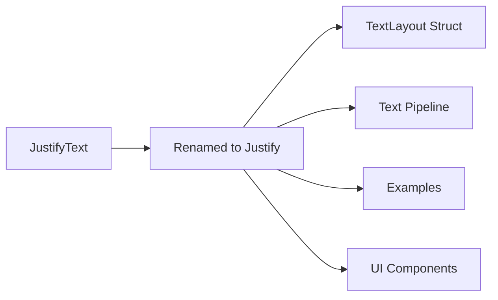

+++
title = "#19522 Rename `JustifyText` to `Justify`"
date = "2025-06-09T00:00:00"
draft = false
template = "pull_request_page.html"
in_search_index = true

[taxonomies]
list_display = ["show"]

[extra]
current_language = "en"
available_languages = {"en" = { name = "English", url = "/pull_request/bevy/2025-06/pr-19522-en-20250609" }, "zh-cn" = { name = "中文", url = "/pull_request/bevy/2025-06/pr-19522-zh-cn-20250609" }}
labels = ["C-Usability", "A-Text"]
+++

# Rename `JustifyText` to `Justify`

## Basic Information
- **Title**: Rename `JustifyText` to `Justify`
- **PR Link**: https://github.com/bevyengine/bevy/pull/19522
- **Author**: ickshonpe
- **Status**: MERGED
- **Labels**: C-Usability, S-Ready-For-Final-Review, M-Needs-Migration-Guide, A-Text
- **Created**: 2025-06-07T10:33:02Z
- **Merged**: 2025-06-09T20:17:15Z
- **Merged By**: alice-i-cecile

## Description Translation
# Objective

Rename `JustifyText`:
* The name `JustifyText` is just ugly.
* It's inconsistent since no other `bevy_text` types have a `Text-` suffix, only prefix.
* It's inconsistent with the other text layout enum `Linebreak` which doesn't have a prefix or suffix.

Fixes #19521.

## Solution

Rename `JustifyText` to `Justify`.

Without other context, it's natural to assume the name `Justify` refers to text justification.

## The Story of This Pull Request

This PR addresses a naming inconsistency in Bevy's text layout system. The `JustifyText` enum controlled horizontal text alignment but had naming issues that made it stand out awkwardly in the API. 

The core problem was threefold: First, the `Text` suffix made the name unnecessarily verbose compared to related types like `LineBreak`. Second, it violated Bevy's naming conventions where text-related components typically use `Text` as a prefix (e.g., `Text2d`, `TextFont`) rather than a suffix. Third, the name felt redundant since justification is inherently a text operation.

The solution was straightforward: rename `JustifyText` to `Justify`. This change maintains clear intent while aligning with existing naming patterns. The enum variants (`Left`, `Center`, `Right`, `Justified`) remain unchanged as they're sufficiently descriptive without the suffix.

Implementation required updating all references throughout the codebase. The changeset includes:
1. Renaming the enum definition itself
2. Updating all function parameters that accepted justification values
3. Modifying struct fields storing justification settings
4. Adjusting documentation comments
5. Updating example code to demonstrate the new naming

```rust
// Before
TextLayout::new_with_justify(JustifyText::Center)

// After
TextLayout::new_with_justify(Justify::Center)
```

A key technical consideration was maintaining compatibility with the underlying `cosmic_text` library. The PR preserves the conversion logic to `cosmic_text::Align` but updates it to use the new enum name:

```rust
impl From<Justify> for cosmic_text::Align {
    fn from(justify: Justify) -> Self {
        match justify {
            Justify::Left => cosmic_text::Align::Left,
            // ... other variants
        }
    }
}
```

The changes are purely nominal - no functional alterations were made to text layout behavior. This renaming improves API consistency and reduces cognitive load for developers working with text components. The migration path is straightforward, requiring only a find-and-replace operation from `JustifyText` to `Justify`.

## Visual Representation



## Key Files Changed

1. `crates/bevy_text/src/text.rs` (+13/-13)
   - Core enum renamed from `JustifyText` to `Justify`
   - Updated all references in methods and conversions
   - Preserved all enum variants and their functionality

```rust
// Before:
pub enum JustifyText { ... }

// After:
pub enum Justify { ... }
```

2. `crates/bevy_text/src/pipeline.rs` (+4/-4)
   - Updated function signatures to use `Justify`
   - Modified text processing logic to reference new name

```rust
// Before:
justify: JustifyText,

// After:
justify: Justify,
```

3. `examples/2d/text2d.rs` (+5/-5)
   - Updated example to demonstrate new API
   - Changed justification values in text entities

```rust
// Before:
TextLayout::new_with_justify(JustifyText::Center)

// After:
TextLayout::new_with_justify(Justify::Center)
```

4. `examples/testbed/2d.rs` (+5/-5)
   - Updated testbed justification values
   - Changed enum references in text rendering examples

```rust
// Before:
JustifyText::Left,

// After:
Justify::Left,
```

5. `examples/ui/text_debug.rs` (+5/-5)
   - Updated UI text debug example
   - Modified text explanations to reference new name

```rust
// Before:
"This text is right-justified. The `JustifyText` component"

// After:
"This text is right-justified. The `Justify` component"
```

## Further Reading
1. [Rust API Guidelines - Naming](https://rust-lang.github.io/api-guidelines/naming.html)
2. [Bevy Text Component Documentation](https://docs.rs/bevy_text/latest/bevy_text/)
3. [Cosmic Text Alignment Reference](https://docs.rs/cosmic-text/latest/cosmic_text/enum.Align.html)