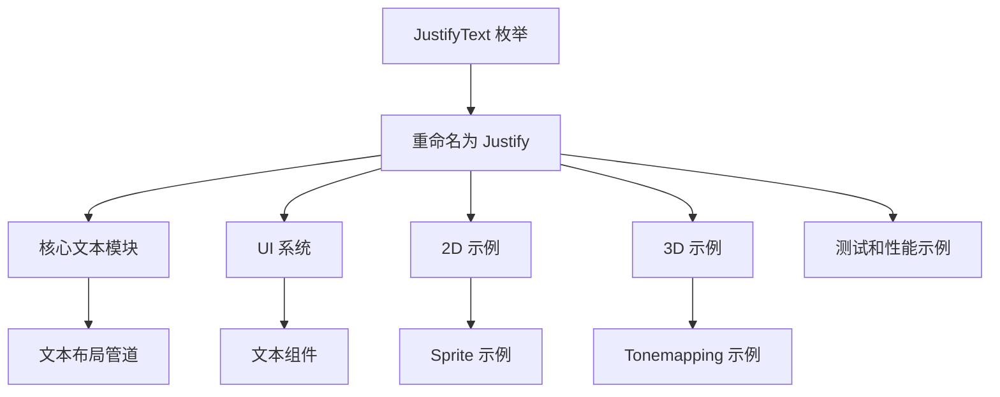

+++
title = "#19522 Rename `JustifyText` to `Justify`"
date = "2025-06-09T00:00:00"
draft = false
template = "pull_request_page.html"
in_search_index = false

[extra]
current_language = "zh-cn"
available_languages = {"en" = { name = "English", url = "/pull_request/bevy/2025-06/pr-19522-en-20250609" }, "zh-cn" = { name = "中文", url = "/pull_request/bevy/2025-06/pr-19522-zh-cn-20250609" }}
labels = ["C-Usability", "A-Text"]
+++

# Rename `JustifyText` to `Justify`

## Basic Information
- **Title**: Rename `JustifyText` to `Justify`
- **PR Link**: https://github.com/bevyengine/bevy/pull/19522
- **Author**: ickshonpe
- **Status**: MERGED
- **Labels**: C-Usability, S-Ready-For-Final-Review, M-Needs-Migration-Guide, A-Text
- **Created**: 2025-06-07T10:33:02Z
- **Merged**: 2025-06-09T20:17:15Z
- **Merged By**: alice-i-cecile

## Description Translation
PR 目标：

重命名 `JustifyText`：
* 名称 `JustifyText` 不美观
* 它与其它 `bevy_text` 类型不一致，因为其它类型没有 `Text-` 后缀，只有前缀
* 它与其它文本布局枚举 `Linebreak` 不一致，后者既没有前缀也没有后缀

修复 #19521。

解决方案：

将 `JustifyText` 重命名为 `Justify`。

在没有其它上下文的情况下，可以自然地认为名称 `Justify` 指的是文本对齐。

## The Story of This Pull Request

### 问题与背景
在 Bevy 引擎的文本系统中，存在一个名为 `JustifyText` 的枚举类型，用于控制文本对齐方式（左对齐、居中、右对齐和两端对齐）。开发者在使用过程中发现了几个命名问题：
1. 名称 `JustifyText` 显得冗余且不够简洁，特别是后缀 "Text" 在上下文中显得多余
2. 该命名与同一模块中的其它文本类型不一致：其它类型如 `TextColor`、`TextFont` 都使用 "Text" 作为前缀而非后缀
3. 该命名与文本布局相关的另一个枚举 `LineBreak` 不一致，后者没有使用任何前后缀

这些问题导致了 API 的不一致性和潜在的开发者困惑，特别是当开发者同时使用多个文本组件时。代码审查和 issue 跟踪中确认了这些问题（issue #19521），因此需要解决这些命名不一致性。

### 解决方案
开发者决定将 `JustifyText` 重命名为更简洁的 `Justify`。这个新名称：
- 保持了语义清晰性（在文本上下文中，"Justify" 自然指代文本对齐）
- 消除了冗余的后缀
- 与 `LineBreak` 的命名风格保持一致
- 减少了开发者在代码中输入的长度

这个变更属于简单的重命名操作，不需要修改功能逻辑，但需要在整个代码库中更新所有引用点。

### 实现细节
实现方案涉及在代码库中搜索所有 `JustifyText` 的引用点，并将其替换为 `Justify`。主要修改包括：

1. **核心类型重命名**：
   ```rust
   // 之前:
   pub enum JustifyText { Left, Center, Right, Justified }
   
   // 之后:
   pub enum Justify { Left, Center, Right, Justified }
   ```

2. **相关方法更新**：
   ```rust
   // 之前:
   TextLayout::new_with_justify(JustifyText::Center)
   
   // 之后:
   TextLayout::new_with_justify(Justify::Center)
   ```

3. **类型转换更新**：
   ```rust
   // 之前:
   impl From<JustifyText> for cosmic_text::Align
   
   // 之后:
   impl From<Justify> for cosmic_text::Align
   ```

4. **文档和注释更新**：
   ```rust
   // 之前:
   /// specified [`JustifyText`](crate::text::JustifyText)
   
   // 之后:
   /// specified [`Justify`](crate::text::Justify)
   ```

变更影响了整个项目中的多个位置，包括核心文本处理逻辑、UI 系统和 2D/3D 示例。特别值得注意的是，在文本布局管道中，对齐处理逻辑保持不变，只是类型名称更新：
```rust
// 在 pipeline.rs 中
// 之前:
if bounds.width.is_none() && justify != JustifyText::Left { ... }

// 之后:
if bounds.width.is_none() && justify != Justify::Left { ... }
```

### 技术洞察
1. **命名一致性**：在 API 设计中，保持命名模式一致有助于降低认知负担。这次变更使文本布局类型（`Justify` 和 `LineBreak`）都采用了简洁的无前后缀形式。
   
2. **破坏性变更处理**：由于这是公开 API 的变更，PR 添加了迁移指南（`M-Needs-Migration-Guide` 标签），指导用户如何更新他们的代码。

3. **影响范围控制**：变更通过简单重命名实现，没有修改任何功能逻辑，最大限度地降低了引入新错误的风险。

### 影响
1. **API 一致性提升**：解决了 `bevy_text` 模块中的命名不一致问题，使 API 更符合 Rust 的命名惯例。
   
2. **开发者体验改进**：更简洁的 `Justify` 名称减少了代码冗余，使文本布局代码更易读：
   ```rust
   // 之前:
   TextLayout::new(JustifyText::Center, LineBreak::WordBoundary)
   
   // 之后:
   TextLayout::new(Justify::Center, LineBreak::WordBoundary)
   ```
   
3. **迁移需求**：用户需要更新项目中所有 `JustifyText` 的引用为 `Justify`，但变更可以通过简单的查找替换完成。

## Visual Representation



## Key Files Changed

1. **crates/bevy_text/src/text.rs** (+13/-13)
   - 核心变更：重命名 `JustifyText` 为 `Justify`
   - 代码片段：
     ```rust
     // 之前:
     pub enum JustifyText { ... }
     
     // 之后:
     pub enum Justify { ... }
     ```

2. **examples/2d/text2d.rs** (+5/-5)
   - 更新 2D 文本示例中的对齐方式引用
   - 代码片段：
     ```rust
     // 之前:
     let text_justification = JustifyText::Center;
     
     // 之后:
     let text_justification = Justify::Center;
     ```

3. **examples/testbed/2d.rs** (+5/-5)
   - 更新测试环境中的文本对齐引用
   - 代码片段：
     ```rust
     // 之前:
     for (i, justify) in [JustifyText::Left, ...]
     
     // 之后:
     for (i, justify) in [Justify::Left, ...]
     ```

4. **examples/ui/text_debug.rs** (+5/-5)
   - 更新 UI 文本调试示例中的对齐说明
   - 代码片段：
     ```rust
     // 之前:
     "This text is right-justified. The `JustifyText` component..."
     
     // 之后:
     "This text is right-justified. The `Justify` component..."
     ```

5. **crates/bevy_text/src/pipeline.rs** (+4/-4)
   - 更新文本处理管道中的对齐参数类型
   - 代码片段：
     ```rust
     // 之前:
     justify: JustifyText,
     
     // 之后:
     justify: Justify,
     ```

## Further Reading
1. [Rust API 命名指南](https://rust-lang.github.io/api-guidelines/naming.html) - Rust 官方命名惯例
2. [Bevy 文本系统文档](https://docs.rs/bevy_text/latest/bevy_text/) - 最新文本组件文档
3. [语义化版本控制](https://semver.org/) - 处理破坏性变更的最佳实践