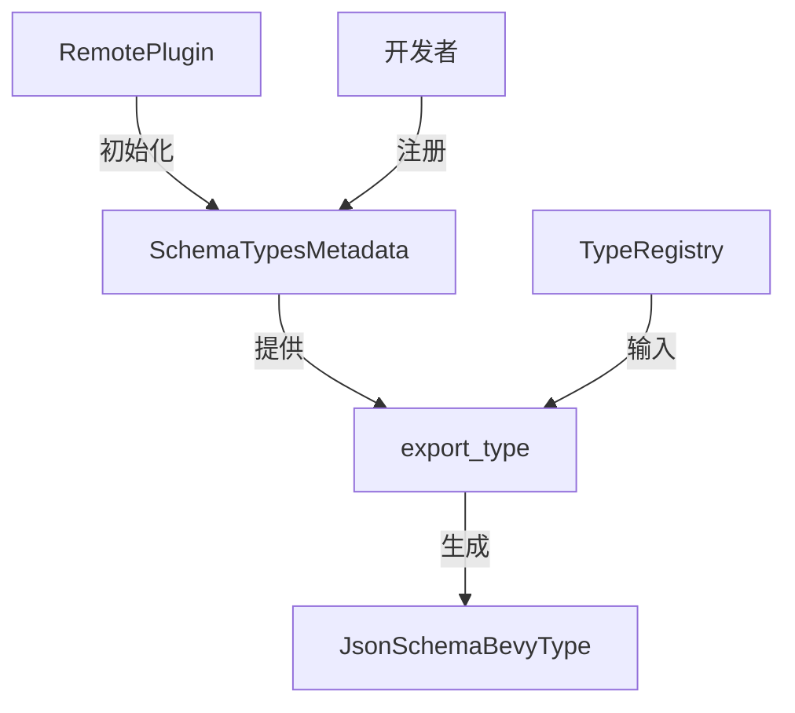

+++
title = "#19524 Schema types metadata"
date = "2025-06-20T00:00:00"
draft = false
template = "pull_request_page.html"
in_search_index = false

[extra]
current_language = "zh-cn"
available_languages = {"en" = { name = "English", url = "/pull_request/bevy/2025-06/pr-19524-en-20250620" }, "zh-cn" = { name = "中文", url = "/pull_request/bevy/2025-06/pr-19524-zh-cn-20250620" }}
labels = ["C-Feature", "A-Dev-Tools"]
+++

# Schema types metadata

## Basic Information
- **Title**: Schema types metadata
- **PR Link**: https://github.com/bevyengine/bevy/pull/19524
- **Author**: Leinnan
- **Status**: MERGED
- **Labels**: C-Feature, S-Ready-For-Final-Review, A-Dev-Tools
- **Created**: 2025-06-07T11:07:09Z
- **Merged**: 2025-06-20T17:28:04Z
- **Merged By**: alice-i-cecile

## Description Translation
### 目标
- 当前在生成 Bevy JSON Schema 时，有一个预定义的支持数据类型列表，这些类型会被检测并映射为 reflect_types 数组元素。
- 使开发者能够为 Bevy JSON Schema 注册自定义的 `reflectTypes` 映射。

### 解决方案
- 创建一个 `SchemaTypesMetadata` 资源，用于存储 `TypeData` 的 `TypeId` 到字符串的映射。该列表初始包含更多类型，并且无需分叉包即可扩展。

### 测试
- 作者已在游戏中长期使用该实现，其 bevy_remote 的分支包含更多后续计划合并的改动。

## The Story of This Pull Request

### 问题背景
在 Bevy 的 JSON Schema 生成机制中，存在一个关键限制：`reflect_types` 映射使用硬编码实现，仅支持固定的几种反射类型（如 Component、Resource 等）。这导致两个主要问题：
1. 开发者无法为自定义类型数据（TypeData）添加映射
2. 内置类型列表无法扩展，强制开发者必须分叉代码库才能添加新类型

该限制在需要暴露自定义类型信息的场景（如远程开发工具）尤为突出，阻碍了框架的扩展性。

### 解决方案设计
核心方案是引入 `SchemaTypesMetadata` 资源，将类型元数据管理从硬编码改为可配置模式：
1. 使用 `HashMap<TypeId, String>` 存储类型到名称的映射
2. 提供默认实现包含常用内置类型
3. 暴露 API 允许运行时注册新映射

设计决策考虑：
- 选择 `Resource` 存储：需要全局访问且生命周期与 app 一致
- 使用 `TypeId` 作为键：精确匹配类型数据
- 默认包含基础类型：保持向后兼容性

### 实现细节
#### 1. 新增 SchemaTypesMetadata 资源
在 `schemas/mod.rs` 中定义核心数据结构：
```rust
#[derive(Debug, Resource, Reflect)]
#[reflect(Resource)]
pub struct SchemaTypesMetadata {
    pub type_data_map: HashMap<TypeId, String>,
}

impl Default for SchemaTypesMetadata {
    fn default() -> Self {
        let mut data_types = Self {
            type_data_map: Default::default(),
        };
        data_types.map_type_data::<ReflectComponent>("Component");
        data_types.map_type_data::<ReflectResource>("Resource");
        // 条件编译支持
        #[cfg(feature = "bevy_asset")]
        data_types.map_type_data::<bevy_asset::ReflectAsset>("Asset");
        data_types
    }
}
```
关键方法实现：
```rust
impl SchemaTypesMetadata {
    pub fn map_type_data<T: TypeData>(&mut self, name: impl Into<String>) {
        self.type_data_map.insert(TypeId::of::<T>(), name.into());
    }

    pub fn get_registered_reflect_types(&self, reg: &TypeRegistration) -> Vec<String> {
        self.type_data_map
            .iter()
            .filter_map(|(id, name)| reg.data_by_id(*id).and(Some(name.clone())))
            .collect()
    }
}
```

#### 2. 重构 JSON Schema 生成
修改 `json_schema.rs` 中的类型导出函数：
```rust
pub fn export_type(
    reg: &TypeRegistration,
    metadata: &SchemaTypesMetadata,
) -> (Cow<'static, str>, JsonSchemaBevyType) {
    (reg.type_info().type_path().into(), (reg, metadata).into())
}

impl From<(&TypeRegistration, &SchemaTypesMetadata)> for JsonSchemaBevyType {
    fn from(value: (&TypeRegistration, &SchemaTypesMetadata)) -> Self {
        let (reg, metadata) = value;
        JsonSchemaBevyType {
            reflect_types: metadata.get_registered_reflect_types(reg),
            // ...其他字段保持不变
        }
    }
}
```

#### 3. 集成到类型导出方法
修改 `builtin_methods.rs` 中的远程方法：
```rust
pub fn export_registry_types(In(params): In<Option<Value>>, world: &World) -> BrpResult<Value> {
    let extra_info = world.resource::<crate::schemas::SchemaTypesMetadata>();
    let types = world.resource::<AppTypeRegistry>();
    
    types.read().iter().filter_map(|type_reg| {
        let (id, schema) = export_type(type_reg, extra_info);
        // ...过滤逻辑
        Some((id.to_string(), schema))
    })
}
```

#### 4. 初始化资源
在插件系统中初始化资源：
```rust
impl Plugin for RemotePlugin {
    fn build(&self, app: &mut App) {
        app
            .init_resource::<schemas::SchemaTypesMetadata>()
            // ...其他初始化
    }
}
```

#### 5. 条件编译支持
在 `Cargo.toml` 中添加可选依赖：
```toml
[features]
bevy_asset = ["dep:bevy_asset"]

[dependencies]
bevy_asset = { path = "../bevy_asset", optional = true }
```

### 技术要点
1. **动态扩展机制**：通过 `map_type_data` 方法，开发者可注册任意 `TypeData` 实现到字符串的映射
2. **运行时查询**：`get_registered_reflect_types` 动态构建类型列表
3. **条件编译**：通过 `cfg(feature = "bevy_asset")` 实现可选依赖
4. **向后兼容**：默认实现包含原有所有类型，不影响现有功能

### 影响分析
1. **扩展性提升**：开发者无需修改框架代码即可添加自定义类型映射
2. **架构改进**：将硬编码数据转为可配置资源，符合 ECS 设计原则
3. **测试覆盖**：新增测试用例验证自定义类型数据功能：
```rust
#[test]
fn reflect_struct_with_custom_type_data() {
    // 定义自定义 TypeData
    struct ReflectCustomData;
    
    let mut metadata = SchemaTypesMetadata::default();
    metadata.map_type_data::<ReflectCustomData>("CustomData");
    
    // 验证自定义类型被正确识别
    assert!(metadata.has_type_data::<ReflectCustomData>(&schema.reflect_types));
}
```

### 潜在改进方向
1. 添加序列化支持，允许从配置文件加载元数据
2. 实现自动注册机制用于常见 TypeData 实现
3. 增加验证逻辑防止名称冲突

## Visual Representation



## Key Files Changed

### `crates/bevy_remote/src/schemas/mod.rs` (+64/-0)
新增核心资源类型定义：
```rust
#[derive(Debug, Resource, Reflect)]
#[reflect(Resource)]
pub struct SchemaTypesMetadata {
    pub type_data_map: HashMap<TypeId, String>,
}

impl SchemaTypesMetadata {
    pub fn map_type_data<T: TypeData>(&mut self, name: impl Into<String>) {
        self.type_data_map.insert(TypeId::of::<T>(), name.into());
    }
}
```

### `crates/bevy_remote/src/schemas/json_schema.rs` (+132/-31)
重构类型导出逻辑：
```rust
// 修改前
fn get_registered_reflect_types(reg: &TypeRegistration) -> Vec<String> {
    // 硬编码类型列表
    let registered_reflect_types: [(TypeId, &str); 5] = [ ... ];
    // ...
}

// 修改后
pub fn export_type(
    reg: &TypeRegistration,
    metadata: &SchemaTypesMetadata,
) -> (Cow<'static, str>, JsonSchemaBevyType) {
    (reg.type_info().type_path().into(), (reg, metadata).into())
}
```

### `crates/bevy_remote/src/builtin_methods.rs` (+15/-10)
集成新元数据系统：
```rust
// 修改前
let schemas = types.iter()
    .map(export_type)
    .filter(...)
    .collect();

// 修改后
let extra_info = world.resource::<SchemaTypesMetadata>();
let schemas = types.iter()
    .filter_map(|type_reg| {
        let (id, schema) = export_type(type_reg, extra_info);
        // ...
    })
    .collect();
```

### `crates/bevy_remote/src/lib.rs` (+3/-0)
资源初始化：
```rust
impl Plugin for RemotePlugin {
    fn build(&self, app: &mut App) {
        app
            .init_resource::<schemas::SchemaTypesMetadata>()
            // ...
    }
}
```

### `crates/bevy_remote/Cargo.toml` (+3/-1)
添加可选依赖：
```toml
[features]
bevy_asset = ["dep:bevy_asset"]

[dependencies]
bevy_asset = { path = "../bevy_asset", optional = true }
```

## Further Reading
1. [Bevy Reflection System](https://bevyengine.org/learn/book/migration-guides/0.12-0.13/#reflect-changes)
2. [TypeData Documentation](https://docs.rs/bevy_reflect/latest/bevy_reflect/trait.TypeData.html)
3. [Resource Pattern in ECS](https://bevy-cheatbook.github.io/programming/res.html)