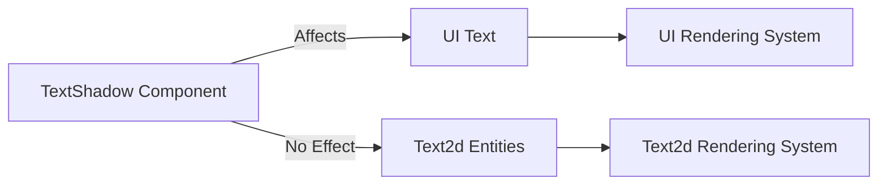

+++
title = "#19533 Document `TextShadow` not supported by `Text2d`"
date = "2025-06-16T00:00:00"
draft = false
template = "pull_request_page.html"
in_search_index = true

[taxonomies]
list_display = ["show"]

[extra]
current_language = "en"
available_languages = {"en" = { name = "English", url = "/pull_request/bevy/2025-06/pr-19533-en-20250616" }, "zh-cn" = { name = "中文", url = "/pull_request/bevy/2025-06/pr-19533-zh-cn-20250616" }}
labels = ["C-Docs", "A-Text"]
+++

# Document `TextShadow` not supported by `Text2d`

## Basic Information
- **Title**: Document `TextShadow` not supported by `Text2d`
- **PR Link**: https://github.com/bevyengine/bevy/pull/19533
- **Author**: ickshonpe
- **Status**: MERGED
- **Labels**: C-Docs, S-Ready-For-Final-Review, A-Text
- **Created**: 2025-06-08T11:40:20Z
- **Merged**: 2025-06-16T22:15:52Z
- **Merged By**: alice-i-cecile

## Description Translation
# Objective

Document `TextShadow` not supported by `Text2d`

## The Story of This Pull Request

This PR addresses a gap in Bevy's documentation regarding the `TextShadow` component. The core issue was straightforward: developers using Bevy's UI system might reasonably expect the `TextShadow` component to work with all text rendering systems, but this wasn't actually the case. Specifically, `TextShadow` only affects UI text elements and doesn't apply to `Text2d` entities used in 2D scenes.

The problem surfaced because Bevy's ECS architecture allows attaching any component to any entity, but not all components affect all entities. Without explicit documentation, users might waste time attempting to use `TextShadow` with `Text2d`, not realizing the component has no effect in that context. This could lead to confusion and unnecessary debugging sessions.

The solution approach was minimal and focused: add a clear documentation note directly in the `TextShadow` component's rustdoc comments. The implementation involved a single-line addition to the component's documentation block. By placing the note in the rustdoc, it becomes immediately visible in IDE tooltips and generated documentation, ensuring developers discover this limitation during normal coding workflows.

The change was implemented by adding a concise note beneath the existing component documentation. The phrasing "Not supported by `Text2d`" is direct and unambiguous, using the exact type name developers would encounter in code. This specificity helps prevent misunderstandings about which text systems are affected.

From a technical perspective, this change doesn't alter any runtime behavior - it's purely documentation. However, it significantly improves the developer experience by setting clear expectations about component compatibility. The change also demonstrates good documentation practices: addressing implicit knowledge gaps directly at the source code level where developers are most likely to encounter them.

## Visual Representation



## Key Files Changed

### `crates/bevy_ui/src/ui_node.rs`
Added documentation note to clarify `TextShadow` component limitations.

#### Before:
```rust
/// Adds a shadow behind text
#[derive(Component, Copy, Clone, Debug, PartialEq, Reflect)]
#[reflect(Component, Default, Debug, Clone, PartialEq)]
pub struct TextShadow {
```

#### After:
```rust
/// Adds a shadow behind text
///
/// Not supported by `Text2d`
#[derive(Component, Copy, Clone, Debug, PartialEq, Reflect)]
#[reflect(Component, Default, Debug, Clone, PartialEq)]
pub struct TextShadow {
```

## Further Reading
- [Bevy UI Components Documentation](https://docs.rs/bevy_ui/latest/bevy_ui/)
- [Text2d Rendering System](https://docs.rs/bevy_text/latest/bevy_text/struct.Text2d.html)
- [Effective Rust Documentation Practices](https://doc.rust-lang.org/rustdoc/how-to-write-documentation.html)

## Full Code Diff
```diff
diff --git a/crates/bevy_ui/src/ui_node.rs b/crates/bevy_ui/src/ui_node.rs
index 1c5ed364b98f9..d81f80f8b9626 100644
--- a/crates/bevy_ui/src/ui_node.rs
+++ b/crates/bevy_ui/src/ui_node.rs
@@ -2875,6 +2875,8 @@ impl ComputedNodeTarget {
 }
 
 /// Adds a shadow behind text
+///
+/// Not supported by `Text2d`
 #[derive(Component, Copy, Clone, Debug, PartialEq, Reflect)]
 #[reflect(Component, Default, Debug, Clone, PartialEq)]
 pub struct TextShadow {
```