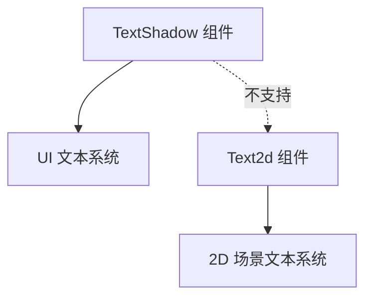

+++
title = "#19533 Document `TextShadow` not supported by `Text2d`"
date = "2025-06-16T00:00:00"
draft = false
template = "pull_request_page.html"
in_search_index = false

[extra]
current_language = "zh-cn"
available_languages = {"en" = { name = "English", url = "/pull_request/bevy/2025-06/pr-19533-en-20250616" }, "zh-cn" = { name = "中文", url = "/pull_request/bevy/2025-06/pr-19533-zh-cn-20250616" }}
labels = ["C-Docs", "A-Text"]
+++

# Document `TextShadow` not supported by `Text2d`

## Basic Information
- **Title**: Document `TextShadow` not supported by `Text2d`
- **PR Link**: https://github.com/bevyengine/bevy/pull/19533
- **Author**: ickshonpe
- **Status**: MERGED
- **Labels**: C-Docs, S-Ready-For-Final-Review, A-Text
- **Created**: 2025-06-08T11:40:20Z
- **Merged**: 2025-06-16T22:15:52Z
- **Merged By**: alice-i-cecile

## Description Translation
# Objective

为 `TextShadow` 添加文档说明：不支持 `Text2d`

## The Story of This Pull Request

在 Bevy 引擎中，`TextShadow` 组件用于为 UI 文本添加阴影效果，但它与 `Text2d` 组件不兼容。这个 PR 解决了一个文档缺失问题：开发者尝试在 `Text2d` 上应用 `TextShadow` 时，由于缺乏明确的文档说明，可能会花费时间调试为什么阴影效果没有生效。

问题核心在于 `TextShadow` 和 `Text2d` 属于 Bevy 中不同的文本渲染系统。`TextShadow` 是专门为 Bevy UI 系统设计的组件，而 `Text2d` 用于场景中的 2D 文本渲染。两者使用不同的渲染路径和技术实现，因此 `TextShadow` 的功能无法应用于 `Text2d` 实体。

解决方案直接明了：在 `TextShadow` 的 Rust 文档注释中添加一行明确说明，指出该组件不支持 `Text2d`。这种文档更新不需要修改任何功能代码，但能显著提升开发者体验。通过预先说明这个限制，可以防止用户浪费时间尝试不可行的组合。

在实现上，选择在 `TextShadow` 的结构体定义上方添加文档注释是最合适的位置。Rust 的文档注释（以 `///` 开头）会出现在生成的 API 文档中，确保开发者在查阅 `TextShadow` 的官方文档时能立即看到这个重要限制。这种位置选择符合 Rust 的最佳实践，保持了文档与代码的紧密关联。

这个改动虽然微小，但体现了良好的 API 设计原则：明确说明组件的使用限制和兼容性要求。在游戏引擎开发中，清晰的文档对于帮助开发者正确使用不同渲染系统的组件至关重要。未来如果有计划支持 `Text2d` 的阴影效果，可能需要创建单独的 `Text2dShadow` 组件或扩展渲染器功能。

## Visual Representation



## Key Files Changed

### crates/bevy_ui/src/ui_node.rs
在 `TextShadow` 结构体的文档注释中添加了不支持 `Text2d` 的说明，防止用户错误使用。

代码修改：
```rust
// File: crates/bevy_ui/src/ui_node.rs
// Before:
/// Adds a shadow behind text
#[derive(Component, Copy, Clone, Debug, PartialEq, Reflect)]
#[reflect(Component, Default, Debug, Clone, PartialEq)]
pub struct TextShadow {

// After:
/// Adds a shadow behind text
///
/// Not supported by `Text2d`
#[derive(Component, Copy, Clone, Debug, PartialEq, Reflect)]
#[reflect(Component, Default, Debug, Clone, PartialEq)]
pub struct TextShadow {
```

## Further Reading
1. [Bevy UI 系统文档](https://docs.rs/bevy_ui/latest/bevy_ui/)
2. [Bevy Text 模块源码](https://github.com/bevyengine/bevy/tree/main/crates/bevy_text)
3. [Rust 文档注释规范](https://doc.rust-lang.org/rustdoc/how-to-write-documentation.html)