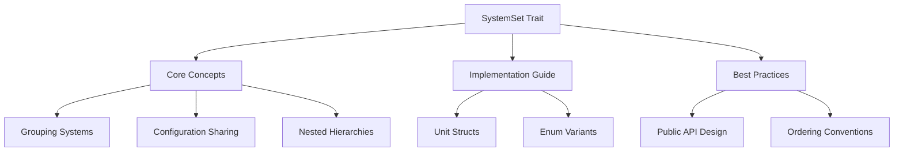

+++
title = "#19538 Write real docs for `SystemSet`"
date = "2025-06-09T00:00:00"
draft = false
template = "pull_request_page.html"
in_search_index = true

[taxonomies]
list_display = ["show"]

[extra]
current_language = "en"
available_languages = {"en" = { name = "English", url = "/pull_request/bevy/2025-06/pr-19538-en-20250609" }, "zh-cn" = { name = "中文", url = "/pull_request/bevy/2025-06/pr-19538-zh-cn-20250609" }}
labels = ["C-Docs", "A-ECS", "D-Modest"]
+++

## Analysis of PR #19538: Write real docs for `SystemSet`

### Basic Information
- **Title**: Write real docs for `SystemSet`
- **PR Link**: https://github.com/bevyengine/bevy/pull/19538
- **Author**: alice-i-cecile
- **Status**: MERGED
- **Labels**: C-Docs, A-ECS, S-Ready-For-Final-Review, X-Uncontroversial, D-Modest
- **Created**: 2025-06-08T17:33:38Z
- **Merged**: 2025-06-09T20:20:52Z
- **Merged By**: alice-i-cecile

### Description Translation
**Objective**

`SystemSet`s are surprisingly rich and nuanced, but are extremely poorly documented.

Fixes #19536.

**Solution**

Explain the basic concept of system sets, how to create them, and give some opinionated advice about their more advanced functionality.

**Follow-up**

I'd like proper module level docs on system ordering that I can link to here, but they don't exist. Punting to follow-up!

### The Story of This Pull Request

#### The Problem and Context
Bevy's Entity Component System (ECS) relies heavily on system ordering for correct execution. `SystemSet` provides a mechanism to group systems and manage their collective behavior, but its documentation was minimal - just a single line comment ("Types that identify logical groups of systems"). This lack of documentation created several issues:

1. Users couldn't discover advanced features like nested sets or configuration inheritance
2. There were no examples showing practical usage patterns
3. The relationship between system sets and scheduling wasn't explained
4. Best practices for API design using system sets were missing

This documentation gap was significant because system sets are fundamental to organizing complex ECS workflows. Without proper guidance, users were forced to either experiment through trial-and-error or dig through source code.

#### The Solution Approach
The author addressed this by completely rewriting the `SystemSet` trait documentation to provide comprehensive guidance. The approach included:

1. Explaining core concepts like grouping and configuration inheritance
2. Providing practical examples for both unit struct and enum-based sets
3. Demonstrating how to add systems to sets and configure ordering
4. Offering design advice for public API exposure

The documentation intentionally focuses on practical usage rather than implementation details, making it immediately useful for developers working with Bevy's scheduler.

#### The Implementation
The implementation consists entirely of documentation improvements with no code changes. The new docs cover:

1. **Core concepts**: Explains how system sets allow grouping systems and sharing configuration
```rust
/// System sets are tag-like labels that can be used to group systems together.
/// This allows you to share configuration (like run conditions) across multiple systems,
/// and order systems or system sets relative to conceptual groups of systems.
```

2. **Hierarchy**: Documents how sets can contain other sets
```rust
/// System sets can belong to any number of other system sets,
/// allowing you to create nested hierarchies of system sets...
```

3. **Practical examples**: Shows both unit struct and enum patterns
```rust
// Unit struct example
#[derive(SystemSet, Debug, Clone, PartialEq, Eq, Hash)]
struct PhysicsSystems;

// Enum example
#[derive(SystemSet, Debug, Clone, PartialEq, Eq, Hash)]
enum CombatSystems {
   TargetSelection,
   DamageCalculation,
   Cleanup,
}
```

4. **Configuration patterns**: Demonstrates adding systems to sets and ordering
```rust
schedule.configure_sets((
    CombatSystems::TargetSelection,
    CombatSystems::DamageCalculation,
    CombatSystems::Cleanup
).chain());

schedule.add_systems(target_selection.in_set(CombatSystems::TargetSelection));
```

#### Technical Insights
Key technical aspects clarified in the documentation:

1. **Configuration inheritance**: Settings applied to a parent set propagate to child systems and sets
2. **Multiple membership**: Systems can belong to multiple sets simultaneously
3. **API design**: System sets provide stable extension points for downstream crates
4. **Ordering conventions**: Enum variants should be ordered according to desired execution sequence

The documentation explicitly notes that enum ordering must still be explicitly configured despite conventional ordering:
```rust
/// By convention, the listed order of the system set in the enum
/// corresponds to the order in which the systems are run.
/// Ordering must be explicitly added to ensure that this is the case...
```

#### The Impact
These documentation improvements provide immediate value:
1. New users can understand system sets without digging through source code
2. Established patterns (like enum-based sets) are now officially documented
3. The relationship between sets and scheduling is clearly explained
4. Library authors have guidance for exposing stable extension points

The changes resolve #19536 and provide foundational knowledge that will help reduce common scheduling errors in Bevy projects.

### Visual Representation


### Key Files Changed
**File**: `crates/bevy_ecs/src/schedule/set.rs`  
**Changes**: Comprehensive rewrite of `SystemSet` trait documentation (+87 lines, -1 line)

**Before:**
```rust
define_label!(
    /// Types that identify logical groups of systems.
    #[diagnostic::on_unimplemented(
        note = "consider annotating `{Self}` with `#[derive(SystemSet)]`"
    )]
    SystemSet
);
```

**After:**
```rust
define_label!(
    /// System sets are tag-like labels that can be used to group systems together.
    ///
    /// This allows you to share configuration (like run conditions) across multiple systems,
    /// and order systems or system sets relative to conceptual groups of systems.
    /// To control the behavior of a system set as a whole, use [`Schedule::configure_sets`](crate::prelude::Schedule::configure_sets),
    /// or the method of the same name on `App`.
    ///
    /// Systems can belong to any number of system sets, reflecting multiple roles or facets that they might have.
    /// For example, you may want to annotate a system as "consumes input" and "applies forces",
    /// and ensure that your systems are ordered correctly for both of those sets.
    ///
    /// System sets can belong to any number of other system sets,
    /// allowing you to create nested hierarchies of system sets to group systems together.
    /// Configuration applied to system sets will flow down to their members (including other system sets),
    /// allowing you to set and modify the configuration in a single place.
    ///
    /// ... (full documentation continues with examples and best practices)
    #[diagnostic::on_unimplemented(
        note = "consider annotating `{Self}` with `#[derive(SystemSet)]`"
    )]
    SystemSet
);
```

### Further Reading
1. [Bevy ECS Schedule Documentation](https://docs.rs/bevy_ecs/latest/bevy_ecs/schedule/index.html)
2. [System Ordering in Bevy](https://bevy-cheatbook.github.io/programming/system-order.html)
3. [Derive Macros in Rust](https://doc.rust-lang.org/reference/procedural-macros.html#derive-macros)
4. [Bevy's SystemSet API Documentation](https://docs.rs/bevy_ecs/latest/bevy_ecs/schedule/trait.SystemSet.html)