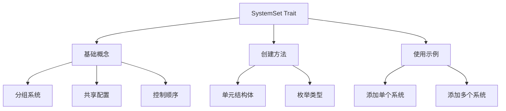

+++
title = "#19538 Write real docs for `SystemSet`"
date = "2025-06-09T00:00:00"
draft = false
template = "pull_request_page.html"
in_search_index = false

[extra]
current_language = "zh-cn"
available_languages = {"en" = { name = "English", url = "/pull_request/bevy/2025-06/pr-19538-en-20250609" }, "zh-cn" = { name = "中文", url = "/pull_request/bevy/2025-06/pr-19538-zh-cn-20250609" }}
labels = ["C-Docs", "A-ECS", "D-Modest"]
+++

# Write real docs for `SystemSet`

## Basic Information
- **Title**: Write real docs for `SystemSet`
- **PR Link**: https://github.com/bevyengine/bevy/pull/19538
- **Author**: alice-i-cecile
- **Status**: MERGED
- **Labels**: C-Docs, A-ECS, S-Ready-For-Final-Review, X-Uncontroversial, D-Modest
- **Created**: 2025-06-08T17:33:38Z
- **Merged**: 2025-06-09T20:20:52Z
- **Merged By**: alice-i-cecile

## Description Translation
`SystemSet`s 功能丰富且复杂，但当前文档极其匮乏。

修复 #19536。

### 解决方案
解释 system sets 的基本概念、创建方法，并就其高级功能提供指导建议。

### 后续工作
需要编写系统排序的模块级文档以便在此处链接，但目前尚未存在。将作为后续任务处理。

## The Story of This Pull Request

### 问题背景
`SystemSet` 是 Bevy ECS 中的核心抽象，用于对系统进行逻辑分组并管理执行顺序。尽管功能强大，现有文档仅包含少量注释，导致开发者难以理解其完整能力：

```rust
// 修改前的文档
define_label!(
    /// Types that identify logical groups of systems.
    ...
);
```

这种文档不足导致多个问题：
1. 新用户不清楚如何正确定义和使用 system sets
2. 高级功能（如嵌套 sets 和配置继承）未被记录
3. 缺少代码示例展示实际用法
4. 开发者无法理解如何通过 system sets 维护公共 API

具体问题在 issue #19536 中被明确提出，需要系统性的文档改进。

### 解决方案方法
PR 采用直接方法：在 `SystemSet` trait 的文档注释中全面重写说明文档。解决方案包含：
1. 基础概念解释：明确 system sets 作为标签式分组机制的角色
2. 使用场景说明：覆盖分组、配置共享和排序控制
3. 创建指南：展示通过派生宏定义 system sets 的两种模式
4. 实用代码示例：演示添加系统到 set 和配置执行顺序
5. 最佳实践建议：包括嵌套 set 设计和公共 API 维护策略

文档结构经过精心设计，从基础到高级概念渐进式展开，避免一次性信息过载。

### 实现细节
核心修改集中在 `set.rs` 文件，完全重写了 `SystemSet` 的文档注释。新增内容包括：

**基础概念说明**：
```rust
/// System sets are tag-like labels that can be used to group systems together.
///
/// This allows you to share configuration (like run conditions) across multiple systems,
/// and order systems or system sets relative to conceptual groups of systems.
```

**创建指南**：
```rust
/// ## Defining new system sets
///
/// To create a new system set, use the `#[derive(SystemSet)]` macro.
/// Unit structs are a good choice for one-off sets.
///
/// ```rust
/// # use bevy_ecs::prelude::*;
///
/// #[derive(SystemSet, Debug, Clone, PartialEq, Eq, Hash)]
/// struct PhysicsSystems;
/// ```
```

**枚举模式建议**：
```rust
/// When you want to define several related system sets,
/// consider creating an enum system set.
/// Each variant will be treated as a separate system set.
///
/// ```rust
/// # use bevy_ecs::prelude::*;
///
/// #[derive(SystemSet, Debug, Clone, PartialEq, Eq, Hash)]
/// enum CombatSystems {
///    TargetSelection,
///    DamageCalculation,
///    Cleanup,
/// }
/// ```
```

**添加系统到 set 的示例**：
```rust
/// // Adding a single system to a set.
/// schedule.add_systems(target_selection.in_set(CombatSystems::TargetSelection));
///
/// // Adding multiple systems to a set.
/// schedule.add_systems((player_damage_calculation, enemy_damage_calculation).in_set(CombatSystems::DamageCalculation));
```

文档特别注意了配置继承机制：
```rust
/// Configuration applied to system sets will flow down to their members (including other system sets),
/// allowing you to set and modify the configuration in a single place.
```

### 技术洞察
关键实现要点：
1. **派生宏使用**：通过 `#[derive(SystemSet)]` 自动实现 trait，简化定义
2. **配置继承**：父 set 的配置自动应用到所有子系统和子 set
3. **排序约定**：文档建议按枚举变体顺序定义执行顺序，但需显式配置：
   ```rust
   schedule.configure_sets((CombatSystems::TargetSelection, ...).chain());
   ```
4. **多归属支持**：系统可同时属于多个 set，满足不同维度分组需求
5. **API 稳定性**：system sets 作为抽象边界，允许内部实现变更不影响依赖方

### 影响评估
此文档改进带来：
1. **降低使用门槛**：新用户能快速理解 system sets 的核心概念
2. **减少错误使用**：明确指导避免常见配置错误
3. **提升代码可维护性**：公共 API 设计建议促进稳定接口
4. **统一最佳实践**：标准化 set 定义和排序配置模式

文档直接解决 issue #19536，填补了 ECS 文档的关键缺口。虽然系统排序的模块级文档仍需后续完善，但此 PR 已提供足够指引满足大多数用例。

## Visual Representation



## Key Files Changed

### `crates/bevy_ecs/src/schedule/set.rs`
**变更描述**：重写 `SystemSet` trait 的文档注释，提供全面使用指南和代码示例。

**变更前**：
```rust
define_label!(
    /// Types that identify logical groups of systems.
    #[diagnostic::on_unimplemented(
        note = "consider annotating `{Self}` with `#[derive(SystemSet)]`"
    )]
    ...
);
```

**变更后**：
```rust
define_label!(
    /// System sets are tag-like labels that can be used to group systems together.
    ///
    /// This allows you to share configuration (like run conditions) across multiple systems,
    /// and order systems or system sets relative to conceptual groups of systems.
    /// To control the behavior of a system set as a whole, use [`Schedule::configure_sets`](crate::prelude::Schedule::configure_sets),
    /// or the method of the same name on `App`.
    ///
    /// Systems can belong to any number of system sets, reflecting multiple roles or facets that they might have.
    /// For example, you may want to annotate a system as "consumes input" and "applies forces",
    /// and ensure that your systems are ordered correctly for both of those sets.
    ///
    /// ... // 完整文档见上方实现细节部分
    #[diagnostic::on_unimplemented(
        note = "consider annotating `{Self}` with `#[derive(SystemSet)]`"
    )]
    ...
);
```

**关联性**：此文件是 system sets 功能的核心定义位置，文档改进直接在此处提供最权威的使用指导。

## Further Reading
1. [Bevy ECS 官方文档](https://bevyengine.org/learn/book/ecs/)
2. [系统排序概念说明](https://bevyengine.org/learn/book/ecs/schedule#system-order)
3. [派生宏工作机制](https://doc.rust-lang.org/book/ch19-06-macros.html)