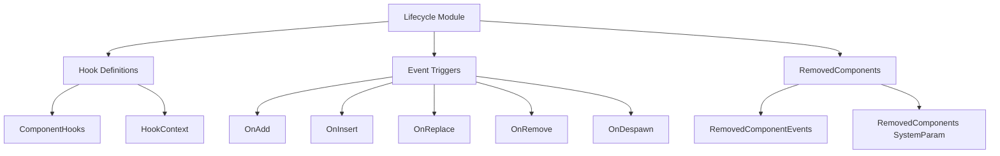

+++
title = "#19543 Component lifecycle reorganization and documentation"
date = "2025-06-10T00:00:00"
draft = false
template = "pull_request_page.html"
in_search_index = true

[taxonomies]
list_display = ["show"]

[extra]
current_language = "en"
available_languages = {"en" = { name = "English", url = "/pull_request/bevy/2025-06/pr-19543-en-20250610" }, "zh-cn" = { name = "中文", url = "/pull_request/bevy/2025-06/pr-19543-zh-cn-20250610" }}
labels = ["C-Docs", "A-ECS", "C-Code-Quality", "D-Straightforward"]
+++

## Component Lifecycle Reorganization and Documentation

### Basic Information
- **Title**: Component lifecycle reorganization and documentation
- **PR Link**: https://github.com/bevyengine/bevy/pull/19543
- **Author**: alice-i-cecile
- **Status**: MERGED
- **Labels**: C-Docs, A-ECS, C-Code-Quality, S-Ready-For-Final-Review, M-Needs-Migration-Guide, X-Uncontroversial, D-Straightforward
- **Created**: 2025-06-08T22:54:21Z
- **Merged**: 2025-06-10T01:17:36Z
- **Merged By**: alice-i-cecile

### Description
**Objective**  
The primary goal was to clearly document the differences between component lifecycle events via module docs. However, no unified module existed—lifecycle code was scattered, making discovery of related types difficult and leaving no suitable location for documentation.

**Solution**  
1. Unified assorted types into a single `bevy_ecs::component_lifecycle` module  
2. Added comprehensive documentation  
3. Created a migration guide  

**Testing**  
CI verification was sufficient for this organizational change.

**Follow-up**  
1. Lifecycle event names (particularly `OnReplace`) remain confusing and should be reconsidered  
2. Observers require proper module documentation  
3. Functional changes should be handled in separate PRs—this is purely documentation and reorganization  

### The Story of This Pull Request

#### The Problem and Context
Component lifecycle events (`OnAdd`, `OnInsert`, `OnReplace`, `OnRemove`, `OnDespawn`) were scattered across multiple files (`component.rs`, `removal_detection.rs`, `world/component_constants.rs`). This fragmentation made it difficult for developers to:
1. Discover related functionality  
2. Understand event differences and usage  
3. Maintain consistent documentation  

The lack of a central module also prevented cohesive documentation explaining critical distinctions like:
- When `OnAdd` (component newly added) vs `OnInsert` (any insertion) triggers  
- Order of operations during component replacement/removal  
- Appropriate use cases for hooks vs observers vs `RemovedComponents`  

#### The Solution Approach
The solution focused on consolidation without functional changes:
1. Create a dedicated `lifecycle` module for all event-related code  
2. Migrate existing implementations preserving behavior  
3. Write comprehensive module-level documentation  
4. Provide clear migration instructions  

Key decisions included:
- Placing `RemovedComponents` in the same module since it addresses similar concerns  
- Keeping existing event names to avoid scope creep  
- Maintaining existing hook signatures during relocation  

#### The Implementation
The core changes centered on creating `crates/bevy_ecs/src/lifecycle.rs` (+606 LOC) and migrating functionality into it:

```rust
// New module structure in lifecycle.rs
pub type ComponentHook = for<'w> fn(DeferredWorld<'w>, HookContext);
pub struct HookContext { ... }

pub struct ComponentHooks {
    pub(crate) on_add: Option<ComponentHook>,
    pub(crate) on_insert: Option<ComponentHook>,
    // ... other hooks
}

// Lifecycle event definitions
pub struct OnAdd;
pub struct OnInsert;
pub struct OnReplace;
pub struct OnRemove;
pub struct OnDespawn;

// RemovedComponents implementation
pub struct RemovedComponentEvents { ... }
pub struct RemovedComponents<'w, 's, T: Component> { ... }
```

Key migrations included:
1. Moving hook definitions from `component.rs` (-242 LOC)  
2. Transferring `RemovedComponents` from `removal_detection.rs` (-268 LOC)  
3. Relocating event triggers from `world/component_constants.rs` (-55 LOC)  

Documentation was added explaining event sequencing and use cases:

```rust
//! There are five types of lifecycle events, split into two categories...
//!
//! 1. Lifecycle events triggered when a component is added:
//!    - `OnAdd`: Triggered when a component is added to an entity that didn't have it
//!    - `OnInsert`: Triggered on any insertion (runs after `OnAdd`)
//!
//! 2. Lifecycle events triggered when a component is removed:
//!    - `OnReplace`: Triggered before removal/replacement
//!    - `OnRemove`: Triggered when removed without replacement
//!    - `OnDespawn`: Triggered per-component during despawning
```

#### Technical Insights
The reorganization revealed several important relationships:
1. **Event Sequencing**:  
   - `OnAdd` → `OnInsert` during additions  
   - `OnReplace` → `OnRemove` → `OnDespawn` during removals  
2. **Complementary Pairs**:  
   - `OnAdd`/`OnRemove` handle presence changes  
   - `OnInsert`/`OnReplace` handle all mutations  
3. **Cache Reliability**:  
   - `OnInsert`/`OnReplace` require immutable components for reliable cache updates  
   - Mutation-only changes don't trigger hooks  

The module now serves as the authoritative source for:
- Hook registration APIs (`on_add()`, `on_insert()`, etc.)  
- `RemovedComponents` system parameter usage  
- Lifecycle event semantics  

#### The Impact
The changes provide three key benefits:
1. **Improved Discoverability**: All lifecycle functionality exists in one module  
2. **Clearer Documentation**: Centralized explanations of event differences  
3. **Simplified Maintenance**: Logical grouping of related functionality  

Developers can now:
- Quickly locate lifecycle-related types  
- Understand event sequencing through module docs  
- Migrate using provided instructions  

The PR also fixed inconsistent terminology in event docs (e.g., "implementors" → "implementers").

### Visual Representation


### Key Files Changed

1. **crates/bevy_ecs/src/lifecycle.rs** (+606/-0)  
   New module containing all lifecycle-related code:  
   - Component hooks and context  
   - Lifecycle event types  
   - `RemovedComponents` implementation  

2. **crates/bevy_ecs/src/removal_detection.rs** (+0/-268)  
   Removed in favor of consolidated lifecycle module:

```rust
// Before: removal_detection.rs
pub struct RemovedComponentEvents { ... }
pub struct RemovedComponents<'w, 's, T: Component> { ... }

// After: Migrated to lifecycle.rs
```

3. **crates/bevy_ecs/src/component.rs** (+6/-242)  
   Moved hook-related code to lifecycle module:

```rust
// Before: component.rs
pub type ComponentHook = ... 
pub struct HookContext { ... }
pub struct ComponentHooks { ... }

// After: Only component metadata remains
```

4. **crates/bevy_ecs/src/world/component_constants.rs** (+0/-55)  
   Lifecycle event triggers migrated:

```rust
// Before: component_constants.rs
pub struct OnAdd;
pub struct OnInsert;
// ... other events

// After: Defined in lifecycle.rs
```

5. **crates/bevy_ecs/src/world/mod.rs** (+10/-8)  
   Updated to reference new module location:

```rust
// Updated world/mod.rs imports
use crate::lifecycle::{OnAdd, OnInsert, OnReplace, OnRemove, OnDespawn};
```

### Further Reading
1. [Bevy ECS Component Hooks Documentation](https://bevyengine.org/learn/book/ECS/component-hooks/)  
2. [Lifecycle Events RFC Discussion](https://github.com/bevyengine/rfcs/pull/45)  
3. [Observer Pattern in ECS Systems](https://github.com/SanderMertens/ecs-faq#observer-pattern)  

### Full Code Diff
<details>
<summary>View full diff</summary>

```diff
diff --git a/crates/bevy_app/src/app.rs b/crates/bevy_app/src/app.rs
index 61bbad3aedbd6..2adf6c2857571 100644
--- a/crates/bevy_app/src/app.rs
+++ b/crates/bevy_app/src/app.rs
@@ -1483,8 +1483,8 @@ mod tests {
         component::Component,
         entity::Entity,
         event::{Event, EventWriter, Events},
+        lifecycle::RemovedComponents,
         query::With,
-        removal_detection::RemovedComponents,
         resource::Resource,
         schedule::{IntoScheduleConfigs, ScheduleLabel},
         system::{Commands, Query},
diff --git a/crates/bevy_app/src/propagate.rs b/crates/bevy_app/src/propagate.rs
index 5d766a626c218..754ba3140ee3c 100644
--- a/crates/bevy_app/src/propagate.rs
+++ b/crates/bevy_app/src/propagate.rs
@@ -6,9 +6,9 @@ use bevy_ecs::{
     component::Component,
     entity::Entity,
     hierarchy::ChildOf,
+    lifecycle::RemovedComponents,
     query::{Changed, Or, QueryFilter, With, Without},
     relationship::{Relationship, RelationshipTarget},
-    removal_detection::RemovedComponents,
     schedule::{IntoScheduleConfigs, SystemSet},
     system::{Commands, Local, Query},
 };
diff --git a/crates/bevy_core_pipeline/src/oit/mod.rs b/crates/bevy_core_pipeline/src/oit/mod.rs
index 3ae95d71ccf12..5b5d038fa0580 100644
--- a/crates/bevy_core_pipeline/src/oit/mod.rs
+++ b/crates/bevy_core_pipeline/src/oit/mod.rs
@@ -1,7 +1,7 @@
 //! Order Independent Transparency (OIT) for 3d rendering. See [`OrderIndependentTransparencyPlugin`] for more details.
 
 use bevy_app::prelude::*;
-use bevy_ecs::{component::*, prelude::*};
+use bevy_ecs::{component::*, lifecycle::ComponentHook, prelude::*};
 use bevy_math::UVec2;
 use bevy_platform::collections::HashSet;
 use bevy_platform::time::Instant;
diff --git a/crates/bevy_ecs/compile_fail/tests/ui/component_hook_relationship.rs b/crates/bevy_ecs/compile_fail/tests/ui/component_hook_relationship.rs
index 4076819ee3d9d..79c21586441b2 100644
--- a/crates/bevy_ecs/compile_fail/tests/ui/component_hook_relationship.rs
+++ b/crates/bevy_ecs/compile_fail/tests/ui/component_hook_relationship.rs
@@ -60,4 +60,4 @@ mod case4 {
     pub struct BarTargetOf(Entity);
 }
 
-fn foo_hook(_world: bevy_ecs::world::DeferredWorld, _ctx: bevy_ecs::component::HookContext) {}
+fn foo_hook(_world: bevy_ecs::world::DeferredWorld, _ctx: bevy_ecs::lifecycle::HookContext) {}
diff --git a/crates/bevy_ecs/macros/src/component.rs b/crates/bevy_ecs/macros/src/component.rs
index 00268cb680050..6a693f2ce5192 100644
--- a/crates/bevy_ecs/macros/src/component.rs
+++ b/crates/bevy_ecs/macros/src/component.rs
@@ -434,7 +434,7 @@ impl HookAttributeKind {
             HookAttributeKind::Path(path) => path.to_token_stream(),
             HookAttributeKind::Call(call) => {
                 quote!({
-                    fn _internal_hook(world: #bevy_ecs_path::world::DeferredWorld, ctx: #bevy_ecs_path::component::HookContext) {
+                    fn _internal_hook(world: #bevy_ecs_path::world::DeferredWorld, ctx: #bevy_ecs_path::lifecycle::HookContext) {
                         (#call)(world, ctx)
                     }
                     _internal_hook
@@ -658,7 +658,7 @@ fn hook_register_function_call(
 ) -> Option<TokenStream2> {
     function.map(|meta| {
         quote! {
-            fn #hook() -> ::core::option::Option<#bevy_ecs_path::component::ComponentHook> {
+            fn #hook() -> ::core::option::Option<#bevy_ecs_path::lifecycle::ComponentHook> {
                 ::core::option::Option::Some(#meta)
             }
         }
diff --git a/crates/bevy_ecs/src/archetype.rs b/crates/bevy_ecs/src/archetype.rs
index 4e5b28dde82e6..7369028715fbe 100644
--- a/crates/bevy_ecs/src/archetype.rs
+++ b/crates/bevy_ecs/src/archetype.rs
@@ -693,7 +693,7 @@ impl Archetype {
 
     /// Returns true if any of the components in this archetype have at least one [`OnAdd`] observer
     ///
-    /// [`OnAdd`]: crate::world::OnAdd
+    /// [`OnAdd`]: crate::lifecycle::OnAdd
     #[inline]
     pub fn has_add_observer(&self) -> bool {
         self.flags().contains(ArchetypeFlags::ON_ADD_OBSERVER)
@@ -701,7 +701,7 @@ impl Archetype {
 
     /// Returns true if any of the components in this archetype have at least one [`OnInsert`] observer
     ///
-    /// [`OnInsert`]: crate::world::OnInsert
+    /// [`OnInsert`]: crate::lifecycle::OnInsert
     #[inline]
     pub fn has_insert_observer(&self) -> bool {
         self.flags().contains(ArchetypeFlags::ON_INSERT_OBSERVER)
@@ -709,7 +709,7 @@ impl Archetype {
 
     /// Returns true if any of the components in this archetype have at least one [`OnReplace`] observer
     ///
-    /// [`OnReplace`]: crate::world::OnReplace
+    /// [`OnReplace`]: crate::lifecycle::OnReplace
     #[inline]
     pub fn has_replace_observer(&self) -> bool {
         self.flags().contains(ArchetypeFlags::ON_REPLACE_OBSERVER)
@@ -717,7 +717,7 @@ impl Archetype {
 
     /// Returns true if any of the components in this archetype have at least one [`OnRemove`] observer
     ///
-    /// [`OnRemove`]: crate::world::OnRemove
+    /// [`OnRemove`]: crate::lifecycle::OnRemove
     #[inline]
     pub fn has_remove_observer(&self) -> bool {
         self.flags().contains(ArchetypeFlags::ON_REMOVE_OBSERVER)
@@ -725,7 +725,7 @@ impl Archetype {
 
     /// Returns true if any of the components in this archetype have at least one [`OnDespawn`] observer
     ///
-    /// [`OnDespawn`]: crate::world::OnDespawn
+    /// [`OnDespawn`]: crate::lifecycle::OnDespawn
     #[inline]
     pub fn has_despawn_observer(&self) -> bool {
         self.flags().contains(ArchetypeFlags::ON_DESPAWN_OBSERVER)
diff --git a/crates/bevy_ecs/src/bundle.rs b/crates/bevy_ecs/src/bundle.rs
index a54406dde16ba..7d6c0129dc0a2 100644
--- a/crates/bevy_ecs/src/bundle.rs
+++ b/crates/bevy_ecs/src/bundle.rs
@@ -66,15 +66,13 @@ use crate::{
         RequiredComponents, StorageType, Tick,
     },
     entity::{Entities, Entity, EntityLocation},
+    lifecycle::{ON_ADD, ON_INSERT, ON_REMOVE, ON_REPLACE},
     observer::Observers,
     prelude::World,
     query::DebugCheckedUnwrap,
     relationship::RelationshipHookMode,
     storage::{SparseSetIndex, SparseSets, Storages, Table, TableRow},
-    world::{
-        unsafe_world_cell::UnsafeWorldCell, EntityWorldMut, ON_ADD, ON_INSERT, ON_REMOVE,
-        ON_REPLACE,
-    },
+    world::{unsafe_world_cell::UnsafeWorldCell, EntityWorldMut},
 };
 use alloc::{boxed::Box, vec, vec::Vec};
 use bevy_platform::collections::{HashMap, HashSet};
@@ -2123,7 +2121,7 @@ fn sorted_remove<T: Eq + Ord + Copy>(source: &mut Vec<T>, remove: &[T]) {
 #[cfg(test)]
 mod tests {
     use crate::{
-        archetype::ArchetypeCreated, component::HookContext, prelude::*, world::DeferredWorld,
+        archetype::ArchetypeCreated, lifecycle::HookContext, prelude::*, world::DeferredWorld,
     };
     use alloc::vec;
 
diff --git a/crates/bevy_ecs/src/component.rs b/crates/bevy_ecs/src/component.rs
index 96f0ffed9f666..338050f5fb748 100644
--- a/crates/bevy_ecs/src/component.rs
+++ b/crates/bevy_ecs/src/component.rs
@@ -5,12 +5,12 @@ use crate::{
     bundle::BundleInfo,
     change_detection::{MaybeLocation, MAX_CHANGE_AGE},
     entity::{ComponentCloneCtx, Entity, EntityMapper, SourceComponent},
+    lifecycle::{ComponentHook, ComponentHooks},
     query::DebugCheckedUnwrap,
-    relationship::RelationshipHookMode,
     resource::Resource,
     storage::{SparseSetIndex, SparseSets, Table, TableRow},
     system::{Local, SystemParam},
-    world::{DeferredWorld, FromWorld, World},
+    world::{FromWorld, World},
 };
 use alloc::boxed::Box;
 use alloc::{borrow::Cow, format, vec::Vec};
@@ -376,7 +376,8 @@ use thiserror::Error;
 /// - `#[component(on_remove = on_remove_function)]`
 ///
 /// ```
-/// # use bevy_ecs::component::{Component, HookContext};
+/// # use bevy_ecs::component::Component;
+/// # use bevy_ecs::lifecycle::HookContext;
 /// # use bevy_ecs::world::DeferredWorld;
 /// # use bevy_ecs::entity::Entity;
 /// # use bevy_ecs::component::ComponentId;
@@ -405,7 +406,8 @@ use thiserror::Error;
 /// This also supports function calls that yield closures
 ///
 /// ```
-/// # use bevy_ecs::component::{Component, HookContext};
+/// # use bevy_ecs::component::Component;
+/// # use bevy_ecs::lifecycle::HookContext;
 /// # use bevy_ecs::world::DeferredWorld;
 /// #
 /// #[derive(Component)]
@@ -657,244 +659,6 @@ pub enum StorageType {
     SparseSet,
 }
 
-/// The type used for [`Component`] lifecycle hooks such as `on_add`, `on_insert` or `on_remove`.
-pub type ComponentHook = for<'w> fn(DeferredWorld<'w>, HookContext);
-
-/// Context provided to a [`ComponentHook`].
-#[derive(Clone, Copy, Debug)]
-pub struct HookContext {
-    /// The [`Entity`] this hook was invoked for.
-    pub entity: Entity,
-    /// The [`ComponentId`] this hook was invoked for.
-    pub component_id: ComponentId,
-    /// The caller location is `Some` if the `track_caller` feature is enabled.
-    pub caller: MaybeLocation,
-    /// Configures how relationship hooks will run
-    pub relationship_hook_mode: RelationshipHookMode,
-}
-
-/// [`World`]-mutating functions that run as part of lifecycle events of a [`Component`].
-///
-/// Hooks are functions that run when a component is added, overwritten, or removed from an entity.
-/// These are intended to be used for structural side effects that need to happen when a component is added or removed,
-/// and are not intended for general-purpose logic.
-///
-/// For example, you might use a hook to update a cached index when a component is added,
-/// to clean up resources when a component is removed,
-/// or to keep hierarchical data structures across entities in sync.
-///
-/// This information is stored in the [`ComponentInfo`] of the associated component.
-///
-/// There is two ways of configuring hooks for a component:
-/// 1. Defining the relevant hooks on the [`Component`] implementation
-/// 2. Using the [`World::register_component_hooks`] method
-///
-/// # Example 2
-///
-/// ```
-/// use bevy_ecs::prelude::*;
-/// use bevy_platform::collections::HashSet;
-///
-/// #[derive(Component)]
-/// struct MyTrackedComponent;
-///
-/// #[derive(Resource, Default)]
-/// struct TrackedEntities(HashSet<Entity>);
-///
-/// let mut world = World::new();
-/// world.init_resource::<TrackedEntities>();
-///
-/// // No entities with `MyTrackedComponent` have been added yet, so we can safely add component hooks
-/// let mut tracked_component_query = world.query::<&MyTrackedComponent>();
-/// assert!(tracked_component_query.iter(&world).next().is_none());
-///
-/// world.register_component_hooks::<MyTrackedComponent>().on_add(|mut world, context| {
-///    let mut tracked_entities = world.resource_mut::<TrackedEntities>();
-///   tracked_entities.0.insert(context.entity);
-/// });
-///
-/// world.register_component_hooks::<MyTrackedComponent>().on_remove(|mut world, context| {
-///   let mut tracked_entities = world.resource_mut::<TrackedEntities>();
-///   tracked_entities.0.remove(&context.entity);
-/// });
-///
-/// let entity = world.spawn(MyTrackedComponent).id();
-/// let tracked_entities = world.resource::<TrackedEntities>();
-/// assert!(tracked_entities.0.contains(&entity));
-///
-/// world.despawn(entity);
-/// let tracked_entities = world.resource::<TrackedEntities>();
-/// assert!(!tracked_entities.0.contains(&entity));
-/// ```
-#[derive(Debug, Clone, Default)]
-pub struct ComponentHooks {
-    pub(crate) on_add: Option<ComponentHook>,
-    pub(crate) on_insert: Option<ComponentHook>,
-    pub(crate) on_replace: Option<ComponentHook>,
-    pub(crate) on_remove: Option<ComponentHook>,
-    pub(crate) on_despawn: Option<ComponentHook>,
-}
-
-impl ComponentHooks {
-    pub(crate) fn update_from_component<C: Component + ?Sized>(&mut self) -> &mut Self {
-        if let Some(hook) = C::on_add() {
-            self.on_add(hook);
-        }
-        if let Some(hook) = C::on_insert() {
-            self.on_insert(hook);
-        }
-        if let Some(hook) = C::on_replace() {
-            self.on_replace(hook);
-        }
-        if let Some(hook) = C::on_remove() {
-            self.on_remove(hook);
-        }
-        if let Some(hook) = C::on_despawn() {
-            self.on_despawn(hook);
-        }
-
-        self
-    }
-
-    /// Register a [`ComponentHook`] that will be run when this component is added to an entity.
-    /// An `on_add` hook will always run before `on_insert` hooks. Spawning an entity counts as
-    /// adding all of its components.
-    ///
-    /// # Panics
-    ///
-    /// Will panic if the component already has an `on_add` hook
-    pub fn on_add(&mut self, hook: ComponentHook) -> &mut Self {
-        self.try_on_add(hook)
-            .expect("Component already has an on_add hook")
-    }
-
-    /// Register a [`ComponentHook`] that will be run when this component is added (with `.insert`)
-    /// or replaced.
-    ///
-    /// An `on_insert` hook always runs after any `on_add` hooks (if the entity didn't already have the component).
-    ///
-    /// # Warning
-    ///
-    /// The hook won't run if the component is already present and is only mutated, such as in a system via a query.
-    /// As a result, this is *not* an appropriate mechanism for reliably updating indexes and other caches.
-    ///
-    /// # Panics
-    ///
-    /// Will panic if the component already has an `on_insert` hook
-    pub fn on_insert(&mut self, hook: ComponentHook) -> &mut Self {
-        self.try_on_insert(hook)
-            .expect("Component already has an on_insert hook")
-    }
-
-    /// Register a [`ComponentHook`] that will be run when this component is about to be dropped,
-    /// such as being replaced (with `.insert`) or removed.
-    ///
-    /// If this component is inserted onto an entity that already has it, this hook will run before the value is replaced,
-    /// allowing access to the previous data just before it is dropped.
-    /// This hook does *not* run if the entity did not already have this component.
-    ///
-    /// An `on_replace` hook always runs before any `on_remove` hooks (if the component is being removed from the entity).
-    ///
-    /// # Warning
-    ///
-    /// The hook won't run if the component is already present and is only mutated, such as in a system via a query.
-    /// As a result, this is *not* an appropriate mechanism for reliably updating indexes and other caches.
-    ///
-    /// # Panics
-    ///
-    /// Will panic if the component already has an `on_replace` hook
-    pub fn on_replace(&mut self, hook: ComponentHook) -> &mut Self {
-        self.try_on_replace(hook)
-            .expect("Component already has an on_replace hook")
-    }
-
-    /// Register a [`ComponentHook`] that will be run when this component is removed from an entity.
-    /// Despawning an entity counts as removing all of its components.
-    ///
-    /// # Panics
-    ///
-    /// Will panic if the component already has an `on_remove` hook
-    pub fn on_remove(&mut self, hook: ComponentHook) -> &mut Self {
-        self.try_on_remove(hook)
-            .expect("Component already has an on_remove hook")
-    }
-
-    /// Register a [`ComponentHook`] that will be run for each component on an entity when it is despawned.
-    ///
-    /// # Panics
-    ///
-    /// Will panic if the component already has an `on_despawn` hook
-    pub fn on_despawn(&mut self, hook: ComponentHook) -> &mut Self {
-        self.try_on_despawn(hook)
-            .expect("Component already has an on_despawn hook")
-    }
-
-    /// Attempt to register a [`ComponentHook`] that will be run when this component is added to an entity.
-    ///
-    /// This is a fallible version of [`Self::on_add`].
-    ///
-    /// Returns `None` if the component already has an `on_add` hook.
-    pub fn try_on_add(&mut self, hook: ComponentHook) -> Option<&mut Self> {
-        if self.on_add.is_some() {
-            return None;
-        }
-        self.on_add = Some(hook);
-        Some(self)
-    }
-
-    /// Attempt to register a [`ComponentHook`] that will be run when this component is added (with `.insert`)
-    ///
-    /// This is a fallible version of [`Self::on_insert`].
-    ///
-    /// Returns `None` if the component already has an `on_insert` hook.
-    pub fn try_on_insert(&mut self, hook: ComponentHook) -> Option<&mut Self> {
-        if self.on_insert.is_some() {
-            return None;
-        }
-        self.on_insert = Some(hook);
-        Some(self)
-    }
-
-    /// Attempt to register a [`ComponentHook`] that will be run when this component is replaced (with `.insert`) or removed
-    ///
-    /// This is a fallible version of [`Self::on_replace`].
-    ///
-    /// Returns `None` if the component already has an `on_replace` hook.
-    pub fn try_on_replace(&mut self, hook: ComponentHook) -> Option<&mut Self> {
-        if self.on_replace.is_some() {
-            return None;
-        }
-        self.on_replace = Some(hook);
-        Some(self)
-    }
-
-    /// Attempt to register a [`ComponentHook`] that will be run when this component is removed from an entity.
-    ///
-    /// This is a fallible version of [`Self::on_remove`].
-    ///
-    /// Returns `None` if the component already has an `on_remove` hook.
-    pub fn try_on_remove(&mut self, hook: ComponentHook) -> Option<&mut Self> {
-        if self.on_remove.is_some() {
-            return None;
-        }
-        self.on_remove = Some(hook);
-        Some(self)
-    }
-
-    /// Attempt to register a [`ComponentHook`] that will be run for each component on an entity when it is despawned.
-    ///
-    /// This is a fallible version of [`Self::on_despawn`].
-    ///
-    /// Returns `None` if the component already has an `on_despawn` hook.
-    pub fn try_on_despawn(&mut self, hook: ComponentHook) -> Option<&mut Self> {
-        if self.on_despawn.is_some() {
-            return None;
-        }
-        self.on_despawn = Some(hook);
-        Some(self)
-    }
-}
-
 /// Stores metadata for a type of component or resource stored in a specific [`World`].
 #[derive(Debug, Clone)]
 pub struct ComponentInfo {
diff --git a/crates/bevy_ecs/src/event/base.rs b/crates/bevy_ecs/src/event/base.rs
index d525ba2e57695..bb896c4f09140 100644
--- a/crates/bevy_ecs/src/event/base.rs
+++ b/crates/bevy_ecs/src/event/base.rs
@@ -68,7 +68,7 @@ pub trait Event: Send + Sync + 'static {
     ///
     /// # Warning
     ///
-    /// This method should not be overridden by implementors,
+    /// This method should not be overridden by implementers,
     /// and should always correspond to the implementation of [`component_id`](Event::component_id).
     fn register_component_id(world: &mut World) -> ComponentId {
         world.register_component::<EventWrapperComponent<Self>>()
@@ -82,7 +82,7 @@ pub trait Event: Send + Sync + 'static {
     ///
     /// # Warning
     ///
-    /// This method should not be overridden by implementors,
+    /// This method should not be overridden by implementers,
     /// and should always correspond to the implementation of [`register_component_id`](Event::register_component_id).
     fn component_id(world: &World) -> Option<ComponentId> {
         world.component_id::<EventWrapperComponent<Self>>()
diff --git a/crates/bevy_ecs/src/hierarchy.rs b/crates/bevy_ecs/src/hierarchy.rs
index e138dfcac8bd5..dfc32e60dbd2b 100644
--- a/crates/bevy_ecs/src/hierarchy.rs
+++ b/crates/bevy_ecs/src/hierarchy.rs
@@ -10,8 +10,9 @@
 use crate::reflect::{ReflectComponent, ReflectFromWorld};
 use crate::{
     bundle::Bundle,
-    component::{Component, HookContext},
+    component::Component,
     entity::Entity,
+    lifecycle::HookContext,
     relationship::{RelatedSpawner, RelatedSpawnerCommands},
     system::EntityCommands,
     world::{DeferredWorld, EntityWorldMut, FromWorld, World},
diff --git a/crates/bevy_ecs/src/lib.rs b/crates/bevy_ecs/src/lib.rs
index 14802dfc8e69