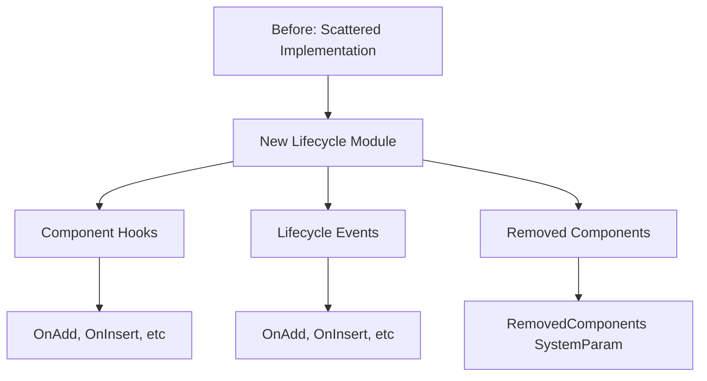

+++
title = "#19543 Component lifecycle reorganization and documentation"
date = "2025-06-10T00:00:00"
draft = false
template = "pull_request_page.html"
in_search_index = false

[extra]
current_language = "zh-cn"
available_languages = {"en" = { name = "English", url = "/pull_request/bevy/2025-06/pr-19543-en-20250610" }, "zh-cn" = { name = "中文", url = "/pull_request/bevy/2025-06/pr-19543-zh-cn-20250610" }}
labels = ["C-Docs", "A-ECS", "C-Code-Quality", "D-Straightforward"]
+++

# Component lifecycle reorganization and documentation

## Basic Information
- **Title**: Component lifecycle reorganization and documentation
- **PR Link**: https://github.com/bevyengine/bevy/pull/19543
- **Author**: alice-i-cecile
- **Status**: MERGED
- **Labels**: C-Docs, A-ECS, C-Code-Quality, S-Ready-For-Final-Review, M-Needs-Migration-Guide, X-Uncontroversial, D-Straightforward
- **Created**: 2025-06-08T22:54:21Z
- **Merged**: 2025-06-10T01:17:36Z
- **Merged By**: alice-i-cecile

## Description Translation
# Objective

我设定了一个简单的目标：通过模块文档清晰记录每个组件生命周期事件之间的差异。

不幸的是，这样的模块并不存在：各种生命周期代码分散在代码库各处。
没有一个统一的模块，很难发现相关类型，也没有合适的地方放置新的文档。

## Solution

1. 将分散的类型统一到单个 `bevy_ecs::component_lifecycle` 模块中。
2. 编写文档。
3. 编写迁移指南。

## Testing

感谢 CI！

## Follow-up

1. 生命周期事件名称容易混淆，特别是 `OnReplace`。我们应考虑重命名。但请不要在本 PR 中进行无谓讨论！
2. Observers 也需要真正的模块文档 :(
3. 任何功能性变更应在其他 PR 中进行；本 PR 仅涉及文档和重组。

## The Story of This Pull Request

### 问题背景
在 Bevy ECS 中，组件生命周期事件（如 `OnAdd`、`OnInsert`、`OnRemove` 等）和相关功能分散在多个模块中：
- 生命周期事件类型定义在 `world` 模块
- 钩子函数（hooks）逻辑在 `component` 模块
- 移除检测功能在 `removal_detection` 模块

这种分散结构导致：
1. 开发者难以发现相关功能
2. 缺少统一位置放置生命周期事件的对比文档
3. 代码组织结构不直观，增加了维护成本

### 解决方案
核心方案是将所有生命周期相关功能整合到新模块 `bevy_ecs::lifecycle` 中：
1. 创建新的 `lifecycle` 模块作为统一入口点
2. 迁移以下功能到新模块：
   - 生命周期事件类型 (`OnAdd`, `OnInsert`, `OnReplace`, `OnRemove`, `OnDespawn`)
   - 钩子类型 (`ComponentHook`, `HookContext`, `ComponentHooks`)
   - 移除检测功能 (`RemovedComponents`)
3. 编写全面的模块级文档，解释各事件差异和使用场景

### 实现细节
关键实现步骤包括：

1. **创建生命周期模块**：
   - 新建 `crates/bevy_ecs/src/lifecycle.rs` 文件
   - 将原有分散的生命周期相关代码迁移到此模块

2. **编写模块文档**：
```rust
//! This module contains various tools to allow you to react to component insertion or removal,
//! as well as entity spawning and despawning.
//!
//! There are four main ways to react to these lifecycle events:
//!
//! 1. Using component hooks, which act as inherent constructors and destructors for components.
//! 2. Using [observers], which are a user-extensible way to respond to events, including component lifecycle events.
//! 3. Using the [`RemovedComponents`] system parameter, which offers an event-style interface.
//! 4. Using the [`Added`] query filter, which checks each component to see if it has been added since the last time a system ran.
```

3. **明确定义事件差异**：
```rust
//! # Types of lifecycle events
//!
//! There are five types of lifecycle events, split into two categories...
//! - [`OnAdd`]: Triggered when a component is added to an entity that did not already have it.
//! - [`OnInsert`]: Triggered when a component is added to an entity, regardless of whether it already had it.
//! ...
```

4. **迁移 `RemovedComponents`**：
   - 将 `removal_detection` 模块功能迁移到 `lifecycle`
   - 更新所有相关引用

5. **更新常量引用**：
   - 生命周期事件对应的 `ComponentId` 常量 (`ON_ADD` 等) 迁移到新模块
   - 在相关位置更新引用路径

### 技术考量
1. **保持行为一致**：重构不改变现有功能行为，仅重组代码位置
2. **兼容性处理**：
   - 提供详细的迁移指南
   - 更新所有内部引用点（约 35 个文件）
3. **文档改进**：
   - 添加生命周期事件对比表格
   - 明确各事件触发时机和顺序
   - 提供完整的使用示例

### 影响分析
1. **正向影响**：
   - 显著改善相关功能的可发现性
   - 提供清晰的生命周期事件文档
   - 统一代码组织结构，降低维护成本
2. **迁移成本**：
   - 用户需更新导入路径（提供迁移指南）
   - 内部系统更新多处引用
3. **后续优化**：
   - 为 observers 添加文档（明确标注为待办）
   - 考虑重命名混淆的事件名（如 `OnReplace`）

## Visual Representation



## Key Files Changed

### `crates/bevy_ecs/src/lifecycle.rs` (+606/-0)
新建的生命周期模块，整合所有相关功能：

```rust
//! This module contains various tools to allow you to react to component insertion or removal,
//! as well as entity spawning and despawning.
//!
//! There are four main ways to react to these lifecycle events:
//!
//! 1. Using component hooks...
//! 2. Using [observers]...
//! 3. Using the [`RemovedComponents`] system parameter...
//! 4. Using the [`Added`] query filter...

/// The type used for [`Component`] lifecycle hooks
pub type ComponentHook = for<'w> fn(DeferredWorld<'w>, HookContext);

/// Context provided to a [`ComponentHook`]
#[derive(Clone, Copy, Debug)]
pub struct HookContext {
    pub entity: Entity,
    pub component_id: ComponentId,
    // ...
}

/// ComponentId for OnAdd
pub const ON_ADD: ComponentId = ComponentId::new(0);
// ...其他常量定义...

/// SystemParam for tracking removed components
#[derive(SystemParam)]
pub struct RemovedComponents<'w, 's, T: Component> {
    component_id: ComponentIdFor<'s, T>,
    reader: Local<'s, RemovedComponentReader<T>>,
    event_sets: &'w RemovedComponentEvents,
}
```

### `crates/bevy_ecs/src/removal_detection.rs` (+0/-268)
移除已迁移的模块：

```rust
// 文件内容完全迁移到 lifecycle 模块
// 旧文件已删除
```

### `crates/bevy_ecs/src/component.rs` (+6/-242)
清理 component 模块，移除钩子相关代码：

```rust
// 移除前的钩子定义
pub type ComponentHook = for<'w> fn(DeferredWorld<'w>, HookContext);
pub struct HookContext { /* ... */ }
pub struct ComponentHooks { /* ... */ }

// 清理后只保留组件核心定义
#[derive(Debug, Clone)]
pub struct ComponentInfo {
    // ...其他字段保留...
    // 移除了 hooks 字段
}
```

### `crates/bevy_ecs/src/world/component_constants.rs` (+0/-55)
移除已迁移的常量定义文件：

```rust
// 常量迁移到 lifecycle 模块后删除此文件
pub const ON_ADD: ComponentId = ComponentId::new(0);
// ...其他常量...
```

### `crates/bevy_ecs/src/world/mod.rs` (+10/-8)
更新 world 模块的引用：

```rust
// 更新前
use crate::removal_detection::RemovedComponentEvents;
use crate::world::component_constants::*;

// 更新后
use crate::lifecycle::{RemovedComponentEvents, ON_ADD, ON_INSERT, /* 其他常量 */};
```

## Further Reading
1. [Bevy ECS Component Lifecycle Documentation](https://bevyengine.org/learn/book/ecs/component-lifecycle/)
2. [Entity Component System Pattern](https://en.wikipedia.org/wiki/Entity_component_system)
3. [Rust Module System Best Practices](https://doc.rust-lang.org/book/ch07-02-defining-modules-to-control-scope-and-privacy.html)
4. [Bevy Observers RFC](https://github.com/bevyengine/rfcs/pull/39)