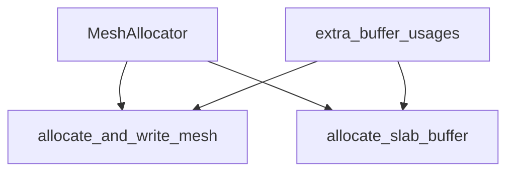

+++
title = "#19546 Add extra buffer usages field to MeshAllocator"
date = "2025-06-09T00:00:00"
draft = false
template = "pull_request_page.html"
in_search_index = false

[extra]
current_language = "zh-cn"
available_languages = {"en" = { name = "English", url = "/pull_request/bevy/2025-06/pr-19546-en-20250609" }, "zh-cn" = { name = "中文", url = "/pull_request/bevy/2025-06/pr-19546-zh-cn-20250609" }}
+++

### 标题：为 MeshAllocator 添加额外缓冲区用途字段的技术分析

## 基本信息
- **标题**: Add extra buffer usages field to MeshAllocator
- **PR 链接**: https://github.com/bevyengine/bevy/pull/19546
- **作者**: JMS55
- **状态**: 已合并
- **标签**: D-Trivial, A-Rendering, S-Ready-For-Final-Review
- **创建时间**: 2025-06-09T00:13:57Z
- **合并时间**: 2025-06-09T20:21:37Z
- **合并人**: alice-i-cecile

## 描述翻译
从 https://github.com/bevyengine/bevy/pull/19058 分离出来

## PR 技术分析

### 问题背景
在 Bevy 的渲染系统中，`MeshAllocator` 负责管理网格顶点和索引缓冲区的内存分配。当需要支持新的 GPU 功能时（例如在计算着色器中使用网格数据），现有的实现缺乏灵活性。具体来说：
1. 缓冲区创建硬编码了 `BufferUsages` 标志
2. 无法为缓冲区添加额外用途（如 `STORAGE`）
3. 这限制了高级用例（如 GPU 驱动的网格处理）

该 PR 是从 #19058 拆分出来的独立修改，旨在解决上述扩展性问题，同时保持向后兼容。

### 解决方案
核心方案是向 `MeshAllocator` 添加可配置的 `extra_buffer_usages` 字段：
1. 在结构体中声明新字段：
   ```rust
   pub extra_buffer_usages: BufferUsages,
   ```
2. 初始化时设为空标志：
   ```rust
   extra_buffer_usages: BufferUsages::empty(),
   ```
3. 在缓冲区创建点合并此字段：
   ```rust
   usage: buffer_usages | self.extra_buffer_usages,
   ```

### 实现细节
关键修改在缓冲区创建逻辑中：
1. **临时缓冲区分配**（用于数据上传）：
   ```diff
   - usage: buffer_usages | BufferUsages::COPY_DST,
   + usage: buffer_usages | BufferUsages::COPY_DST | self.extra_buffer_usages,
   ```
2. **常规缓冲区分配**：
   ```diff
   - usage: buffer_usages,
   + usage: buffer_usages | self.extra_buffer_usages,
   ```

这种实现保证了：
- 默认行为不变（因 `empty()` 标志不改变原行为）
- 按位或操作确保所有必需的标志被合并
- 新字段是公开的(pub)，允许外部配置

### 技术考量
1. **位标志设计**：利用 `BufferUsages` 的 bitflags 特性高效合并用途标志
2. **零成本抽象**：额外按位或操作在编译期优化，无运行时开销
3. **扩展性**：为 #19058 的计算着色器需求铺平道路
4. **兼容性**：保持现有 API 不变，仅添加可选功能

### 实际影响
1. 使后续添加 GPU 计算功能成为可能
2. 提高缓冲区分配策略的灵活性
3. 保持内存分配性能不变
4. 示范了如何通过最小改动扩展核心系统

## 可视化表示



## 关键文件变更

### `crates/bevy_render/src/mesh/allocator.rs`
**变更说明**：添加 `extra_buffer_usages` 字段并集成到缓冲区创建逻辑

**结构体定义变更**：
```rust
// Before:
pub struct MeshAllocator {
    general_vertex_slabs_supported: bool,
}

// After:
pub struct MeshAllocator {
    general_vertex_slabs_supported: bool,
    
    /// Additional buffer usages to add to any vertex or index buffers created.
    pub extra_buffer_usages: BufferUsages,
}
```

**初始化逻辑变更**：
```rust
// Before:
MeshAllocator {
    general_vertex_slabs_supported,
}

// After:
MeshAllocator {
    general_vertex_slabs_supported,
    extra_buffer_usages: BufferUsages::empty(),
}
```

**缓冲区创建点变更**：
```diff
 let buffer = render_device.create_buffer(&BufferDescriptor {
     label: Some(&format!("{label} Temp Buffer ({})", buffer_usages_to_str(buffer_usages))),
     size: len as u64,
-    usage: buffer_usages | BufferUsages::COPY_DST,
+    usage: buffer_usages | BufferUsages::COPY_DST | self.extra_buffer_usages,
     mapped_at_creation: true,
 });
```

```diff
 let buffer = render_device.create_buffer(&BufferDescriptor {
     label: Some(&format!(
         "Slab Buffer ({})",
         buffer_usages_to_str(buffer_usages)
     )),
     size: slab.current_slot_capacity as u64 * slab.element_layout.slot_size(),
-    usage: buffer_usages,
+    usage: buffer_usages | self.extra_buffer_usages,
     mapped_at_creation: false,
 });
```

## 延伸阅读
1. [WebGPU BufferUsages 文档](https://docs.rs/wgpu/latest/wgpu/struct.BufferUsages.html)
2. [Bevy 渲染管线架构概览](https://bevy-cheatbook.github.io/features/rendering.html)
3. [原始 PR #19058：计算着色器网格处理](https://github.com/bevyengine/bevy/pull/19058)
4. [Rust bitflags 使用模式](https://docs.rs/bitflags/latest/bitflags/)

## 完整代码变更
```diff
diff --git a/crates/bevy_render/src/mesh/allocator.rs b/crates/bevy_render/src/mesh/allocator.rs
index eb2d4de626e1a..c171cf3957d96 100644
--- a/crates/bevy_render/src/mesh/allocator.rs
+++ b/crates/bevy_render/src/mesh/allocator.rs
@@ -78,6 +78,9 @@ pub struct MeshAllocator {
     /// WebGL 2. On this platform, we must give each vertex array its own
     /// buffer, because we can't adjust the first vertex when we perform a draw.
     general_vertex_slabs_supported: bool,
+
+    /// Additional buffer usages to add to any vertex or index buffers created.
+    pub extra_buffer_usages: BufferUsages,
 }
 
 /// Tunable parameters that customize the behavior of the allocator.
@@ -348,6 +351,7 @@ impl FromWorld for MeshAllocator {
             mesh_id_to_index_slab: HashMap::default(),
             next_slab_id: default(),
             general_vertex_slabs_supported,
+            extra_buffer_usages: BufferUsages::empty(),
         }
     }
 }
@@ -598,7 +602,7 @@ impl MeshAllocator {
                         buffer_usages_to_str(buffer_usages)
                     )),
                     size: len as u64,
-                    usage: buffer_usages | BufferUsages::COPY_DST,
+                    usage: buffer_usages | BufferUsages::COPY_DST | self.extra_buffer_usages,
                     mapped_at_creation: true,
                 });
                 {
@@ -835,7 +839,7 @@ impl MeshAllocator {
                 buffer_usages_to_str(buffer_usages)
             )),
             size: slab.current_slot_capacity as u64 * slab.element_layout.slot_size(),
-            usage: buffer_usages,
+            usage: buffer_usages | self.extra_buffer_usages,
             mapped_at_creation: false,
         });
 
```