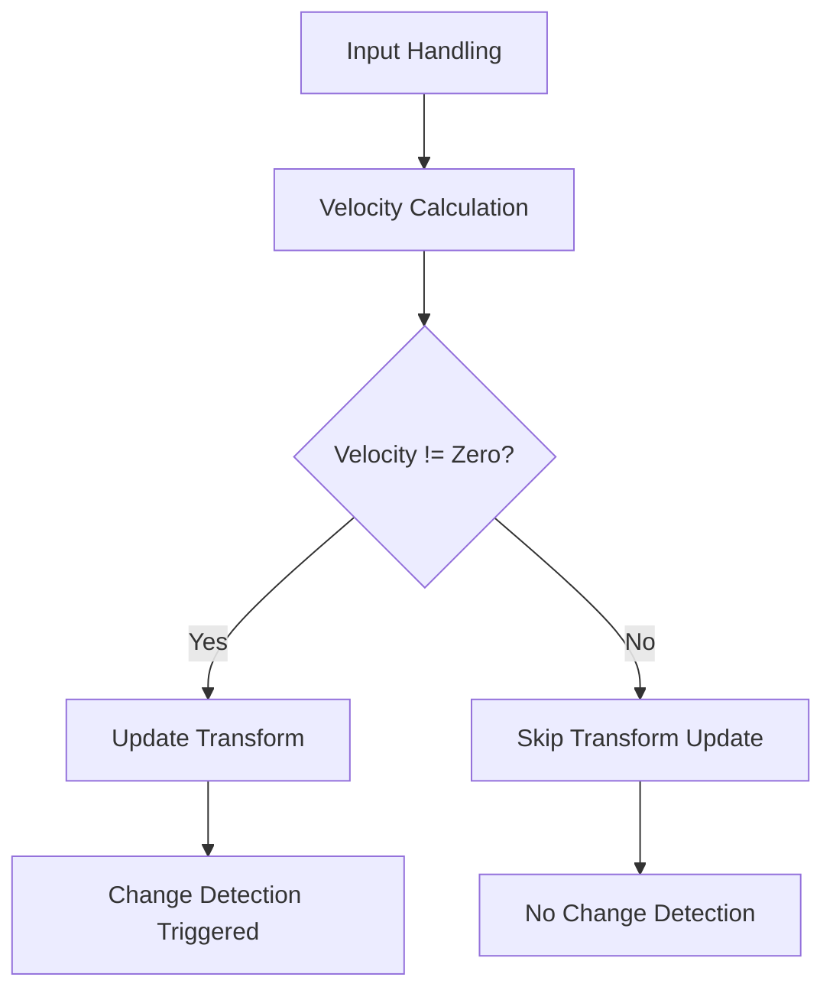

+++
title = "#19547 Optimizing Camera Controller to Avoid Unnecessary Change Detection Triggers"
date = "2025-06-09T00:00:00"
draft = false
template = "pull_request_page.html"
in_search_index = true

[taxonomies]
list_display = ["show"]

[extra]
current_language = "en"
available_languages = {"en" = { name = "English", url = "/pull_request/bevy/2025-06/pr-19547-en-20250609" }, "zh-cn" = { name = "中文", url = "/pull_request/bevy/2025-06/pr-19547-zh-cn-20250609" }}
labels = ["D-Trivial", "C-Examples"]
+++

## Title: Optimizing Camera Controller to Avoid Unnecessary Change Detection Triggers

### Basic Information
- **Title**: Make camera controller not trigger change detection every frame
- **PR Link**: https://github.com/bevyengine/bevy/pull/19547
- **Author**: JMS55
- **Status**: MERGED
- **Labels**: D-Trivial, C-Examples, S-Ready-For-Final-Review
- **Created**: 2025-06-09T00:15:23Z
- **Merged**: 2025-06-09T20:25:11Z
- **Merged By**: alice-i-cecile

### Description Translation
Split off from https://github.com/bevyengine/bevy/pull/19058

### The Story of This Pull Request

#### Problem and Context
The camera controller system in Bevy was triggering change detection every frame regardless of whether the camera actually moved. This occurred because the system unconditionally updated the camera's transform component each frame, even when the controller's velocity vector was zero. In Bevy's ECS architecture, writing to a component marks it as changed, which triggers downstream systems that monitor for component modifications. This caused unnecessary work in systems observing `Changed<Transform>` events, negatively impacting performance especially when the camera was stationary.

#### Solution Approach
The solution modifies the movement update logic to only apply translation changes when the controller has non-zero velocity. By adding a conditional check before updating the transform, we prevent writing to the component when no movement occurs. This avoids marking the transform as changed unnecessarily. The approach maintains the original movement calculations but gates them behind a velocity check.

#### Implementation
The implementation involved two key changes to the camera controller system:
1. Separated velocity calculation from movement application
2. Added conditional check before updating transform

The velocity calculation logic remains unchanged, but now only runs when there's input (axis_input != Vec3::ZERO). The critical addition is the velocity check before applying movement:

```rust
// Apply movement update
if controller.velocity != Vec3::ZERO {
    let forward = *transform.forward();
    let right = *transform.right();
    transform.translation += controller.velocity.x * dt * right
        + controller.velocity.y * dt * Vec3::Y
        + controller.velocity.z * dt * forward;
}
```

This simple condition prevents the transform modification when velocity is zero, which avoids triggering change detection.

#### Technical Insights
The change leverages Bevy's change detection mechanism where components are only marked as changed when their values are actually modified. By avoiding the write operation when velocity is zero, we prevent:
1. Unnecessary change detection triggers
2. False positives in systems using `Changed<Transform>`
3. Potential recomputations in transformation-dependent systems

The solution preserves the original movement behavior while optimizing the common case where the camera remains stationary. The velocity decay logic remains unchanged since it only modifies the controller component, not the transform.

#### Impact
This optimization:
1. Reduces CPU overhead by avoiding unnecessary change detection propagation
2. Maintains identical camera movement behavior
3. Sets a good practice pattern for similar controller systems
4. Improves efficiency of systems observing transform changes

The change demonstrates how minor logic adjustments in hot-path systems can yield significant performance benefits in ECS architectures by respecting change detection semantics.

### Visual Representation


### Key Files Changed

**File**: `examples/helpers/camera_controller.rs`  
**Changes**: Added velocity check before transform update  
**Purpose**: Avoid unnecessary change detection triggers  

Code comparison:
```rust
// Before:
// Apply movement update
if axis_input != Vec3::ZERO {
    // ... velocity calculation ...
}
let forward = *transform.forward();
let right = *transform.right();
transform.translation += controller.velocity.x * dt * right
    + controller.velocity.y * dt * Vec3::Y
    + controller.velocity.z * dt * forward;

// After:
// Update velocity
if axis_input != Vec3::ZERO {
    // ... velocity calculation ...
}

// Apply movement update
if controller.velocity != Vec3::ZERO {
    let forward = *transform.forward();
    let right = *transform.right();
    transform.translation += controller.velocity.x * dt * right
        + controller.velocity.y * dt * Vec3::Y
        + controller.velocity.z * dt * forward;
}
```

### Further Reading
1. [Bevy Change Detection Documentation](https://bevyengine.org/learn/book/change-detection/)
2. [ECS Best Practices: Component Updates](https://github.com/bevyengine/bevy/discussions/1943)
3. [System Ordering and Execution](https://bevyengine.org/learn/book/ecs-system-order/)
4. [Related PR: Camera Controller Improvements](https://github.com/bevyengine/bevy/pull/19058)