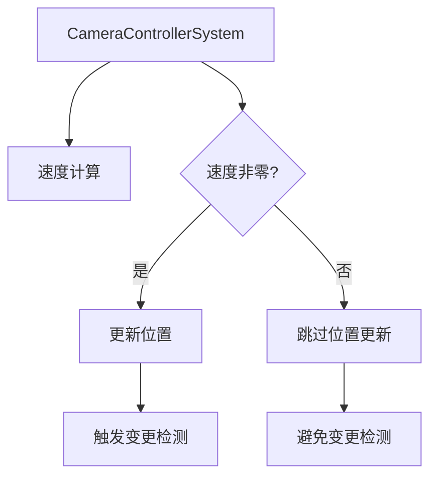

+++
title = "#19547 Make camera controller not trigger change detection every frame"
date = "2025-06-09T00:00:00"
draft = false
template = "pull_request_page.html"
in_search_index = false

[extra]
current_language = "zh-cn"
available_languages = {"en" = { name = "English", url = "/pull_request/bevy/2025-06/pr-19547-en-20250609" }, "zh-cn" = { name = "中文", url = "/pull_request/bevy/2025-06/pr-19547-zh-cn-20250609" }}
+++

## 技术分析报告：优化相机控制器避免每帧触发变更检测

### 基本信息
- **标题**: Make camera controller not trigger change detection every frame
- **PR链接**: https://github.com/bevyengine/bevy/pull/19547
- **作者**: JMS55
- **状态**: 已合并
- **标签**: D-Trivial, C-Examples, S-Ready-For-Final-Review
- **创建时间**: 2025-06-09T00:15:23Z
- **合并时间**: 2025-06-09T20:25:11Z
- **合并人**: alice-i-cecile

### 问题背景
在Bevy引擎的相机控制器示例中，存在一个性能优化问题。原实现中，相机的变换(transform)组件每帧都会更新，即使相机实际处于静止状态（速度向量为零）。这会导致Bevy的变更检测(change detection)机制每帧都标记该组件为"已修改"，从而触发下游系统不必要的处理逻辑。在大型项目中，这种持续变更检测会产生显著性能开销。

### 解决方案
核心解决思路很直接：仅当相机实际发生位移时才更新变换组件。通过添加速度向量的零值检查：
```rust
if controller.velocity != Vec3::ZERO {
    // 位置更新逻辑
}
```
这样当速度向量为零时（即相机静止），将跳过位置计算和变换组件的写入操作，避免触发变更检测。

### 具体实现
关键修改位于`camera_controller.rs`文件中的`run_camera_controller`函数：

```rust
// 修改前
let forward = *transform.forward();
let right = *transform.right();
transform.translation += controller.velocity.x * dt * right
    + controller.velocity.y * dt * Vec3::Y
    + controller.velocity.z * dt * forward;

// 修改后
if controller.velocity != Vec3::ZERO {
    let forward = *transform.forward();
    let right = *transform.right();
    transform.translation += controller.velocity.x * dt * right
        + controller.velocity.y * dt * Vec3::Y
        + controller.velocity.z * dt * forward;
}
```
修改将位置更新逻辑封装在速度非零的条件判断中。同时添加了清晰的代码注释说明两个逻辑块的不同职责：
1. `// Update velocity` 块负责速度向量的计算
2. `// Apply movement update` 块负责实际的位置更新

### 技术考量
1. **变更检测优化**：Bevy的ECS架构中，组件修改会设置`Changed<T>`标记。避免不必要修改可减少：
   - 变更查询(change query)的处理开销
   - 依赖变更检测的下游系统执行次数
   
2. **零值检查成本**：`Vec3::ZERO`比较是廉价的3分量浮点数比较，远低于位置计算和变更检测的开销

3. **内存访问优化**：当相机静止时，跳过变换组件的写入操作，减少内存带宽占用

### 影响分析
1. **性能提升**：在相机静止的场景中，完全消除变换组件的变更检测开销
2. **行为不变**：相机运动时的行为与原实现完全一致
3. **代码可读性**：通过注释明确分离速度计算和位置更新两个逻辑阶段

### 关键文件变更
`examples/helpers/camera_controller.rs` (+10/-6)
```rust
// 修改前片段
// Apply movement update
if axis_input != Vec3::ZERO {
    // 速度计算...
}
let forward = *transform.forward();
let right = *transform.right();
transform.translation += controller.velocity.x * dt * right
    + controller.velocity.y * dt * Vec3::Y
    + controller.velocity.z * dt * forward;

// 修改后片段
// Update velocity
if axis_input != Vec3::ZERO {
    // 速度计算...
}

// Apply movement update
if controller.velocity != Vec3::ZERO {
    let forward = *transform.forward();
    let right = *transform.right();
    transform.translation += controller.velocity.x * dt * right
        + controller.velocity.y * dt * Vec3::Y
        + controller.velocity.z * dt * forward;
}
```

### 组件关系图


### 延伸阅读
1. [Bevy变更检测机制](https://bevyengine.org/learn/book/next/programming/change-detection/)
2. [ECS架构中的优化模式](https://github.com/SanderMertens/ecs-faq#performance-patterns)
3. [原始PR讨论](https://github.com/bevyengine/bevy/pull/19058)（本次修改的源头）

该修改展示了在ECS架构中优化变更检测的经典模式：通过避免不必要的组件更新来减少系统开销，这种优化在频繁更新的组件上效果尤为显著。