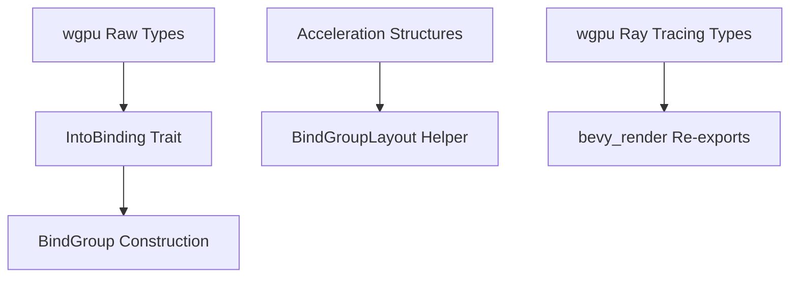

+++
title = "#19548 Add more wgpu helpers/types"
date = "2025-06-09T00:00:00"
draft = false
template = "pull_request_page.html"
in_search_index = true

[taxonomies]
list_display = ["show"]

[extra]
current_language = "en"
available_languages = {"en" = { name = "English", url = "/pull_request/bevy/2025-06/pr-19548-en-20250609" }, "zh-cn" = { name = "中文", url = "/pull_request/bevy/2025-06/pr-19548-zh-cn-20250609" }}
labels = ["D-Trivial", "A-Rendering"]
+++

### Title  
**Analysis of PR #19548: Add more wgpu helpers/types**  

---

### Basic Information  
- **Title**: Add more wgpu helpers/types  
- **PR Link**: https://github.com/bevyengine/bevy/pull/19548  
- **Author**: JMS55  
- **Status**: MERGED  
- **Labels**: D-Trivial, A-Rendering, S-Ready-For-Final-Review  
- **Created**: 2025-06-09T00:17:22Z  
- **Merged**: 2025-06-09T05:15:35Z  
- **Merged By**: alice-i-cecile  

---

### Description Translation  
Split off from https://github.com/bevyengine/bevy/pull/19058  

---

### The Story of This Pull Request  

#### The Problem and Context  
This PR emerged from ongoing work to support ray tracing in Bevy (#19058). During implementation, gaps were identified in Bevy's `wgpu` abstraction layer:  
1. **Missing Bind Group Helpers**: Existing `IntoBinding` implementations couldn't handle raw `wgpu` resources like `&wgpu::TextureView` or arrays of `wgpu::Sampler`/`wgpu::BufferBinding`.  
2. **Lack of Acceleration Structure Support**: No helper existed to create bind group layouts for ray tracing acceleration structures.  
3. **Incomplete Re-exports**: Key `wgpu` ray tracing types (e.g., `AccelerationStructureFlags`, `Blas`) weren't re-exported, forcing users to depend directly on `wgpu`.  

These limitations hindered ray tracing integration and general rendering flexibility.  

#### The Solution Approach  
The author addressed these gaps through targeted extensions:  
1. **Extended `IntoBinding` Implementations**: Added support for raw `wgpu` types and arrays to simplify bind group creation.  
2. **Acceleration Structure Helper**: Introduced a dedicated helper for constructing acceleration structure bindings.  
3. **Expanded Re-exports**: Surfaced essential `wgpu` ray tracing types in Bevy's public API.  

No alternatives were considered—the changes directly fill identified API gaps without breaking existing patterns.  

#### Implementation Details  
**1. Enhanced Bind Group Flexibility**  
New `IntoBinding` impls allow direct use of `wgpu` types when building bind groups. This eliminates boilerplate when interoperating with raw `wgpu` resources:  

```rust
// New impls in bind_group_entries.rs
impl<'a> IntoBinding<'a> for &'a wgpu::TextureView { /* ... */ }  

impl<'a> IntoBinding<'a> for &'a [&'a wgpu::Sampler] {  
    fn into_binding(self) -> BindingResource<'a> {  
        BindingResource::SamplerArray(self) // Now supports sampler arrays  
    }  
}  

impl<'a> IntoBinding<'a> for &'a [wgpu::BufferBinding<'a>] {  
    fn into_binding(self) -> BindingResource<'a> {  
        BindingResource::BufferArray(self) // Now supports buffer arrays  
    }  
}  
```  

**2. Acceleration Structure Helper**  
Added a helper to simplify bind group layout creation for ray tracing acceleration structures:  
```rust
// In bind_group_layout_entries.rs  
pub fn acceleration_structure() -> BindGroupLayoutEntryBuilder {  
    BindingType::AccelerationStructure.into_bind_group_layout_entry_builder()  
}  
```  
This aligns with existing helpers like `binding_types::texture()` and avoids manual `BindingType` handling.  

**3. Expanded Re-exports**  
Re-exported 15+ `wgpu` types related to ray tracing and buffer operations:  
```rust
// In render_resource/mod.rs  
pub use wgpu::{  
    AccelerationStructureFlags, Blas, BlasBuildEntry, /* ... */,  
    Tlas, TlasInstance, CreateBlasDescriptor // Ray tracing types  
};  
```  
This consolidates dependencies and simplifies access for rendering features.  

#### Technical Insights  
- **Ergonomics**: The new `IntoBinding` impls follow Bevy's existing trait-driven bind group pattern, ensuring consistency.  
- **Ray Tracing Readiness**: By re-exporting `wgpu` types, Bevy avoids abstraction leakage and prepares for future ray tracing features.  
- **Zero Cost**: All additions are trivial trait impls or re-exports—no runtime performance impact.  

#### Impact  
- **Reduced Boilerplate**: Developers can now use raw `wgpu` resources directly in bind groups.  
- **Ray Tracing Foundation**: Unblocks acceleration structure implementation in dependent PRs.  
- **Cleaner Imports**: Users access ray tracing types via `bevy_render` instead of manual `wgpu` imports.  

---

### Visual Representation  


---

### Key Files Changed  

#### `crates/bevy_render/src/render_resource/bind_group_entries.rs` (+21/-0)  
**Purpose**: Extend bind group API to support raw `wgpu` types and arrays.  
**Key Changes**:  
```rust
// Added impl for raw wgpu::TextureView
impl<'a> IntoBinding<'a> for &'a wgpu::TextureView {
    fn into_binding(self) -> BindingResource<'a> {
        BindingResource::TextureView(self)
    }
}

// Added support for sampler arrays
impl<'a> IntoBinding<'a> for &'a [&'a wgpu::Sampler] {
    fn into_binding(self) -> BindingResource<'a> {
        BindingResource::SamplerArray(self)
    }
}

// Added support for buffer arrays
impl<'a> IntoBinding<'a> for &'a [wgpu::BufferBinding<'a>] {
    fn into_binding(self) -> BindingResource<'a> {
        BindingResource::BufferArray(self)
    }
}
```

#### `crates/bevy_render/src/render_resource/bind_group_layout_entries.rs` (+4/-0)  
**Purpose**: Simplify acceleration structure bind group creation.  
**Key Changes**:  
```rust
pub fn acceleration_structure() -> BindGroupLayoutEntryBuilder {
    BindingType::AccelerationStructure.into_bind_group_layout_entry_builder()
}
```

#### `crates/bevy_render/src/render_resource/mod.rs` (+14/-10)  
**Purpose**: Re-export `wgpu` types for ray tracing and buffer operations.  
**Key Changes**:  
```rust
// Added re-exports for ray tracing types (e.g., Blas, Tlas)
pub use wgpu::{
    AccelerationStructureFlags, AccelerationStructureGeometryFlags, /* ... */, 
    CreateBlasDescriptor, CreateTlasDescriptor, Tlas, TlasInstance
};

// Removed redundant imports to declutter
```

---

### Further Reading  
1. [WebGPU Spec: Acceleration Structures](https://www.w3.org/TR/webgpu/#acceleration-structures)  
2. [Bevy Bind Groups Documentation](https://docs.rs/bevy/latest/bevy/render/render_resource/index.html)  
3. [wgpu Ray Tracing Guide](https://sotrh.github.io/learn-wgpu/ray-tracing/)