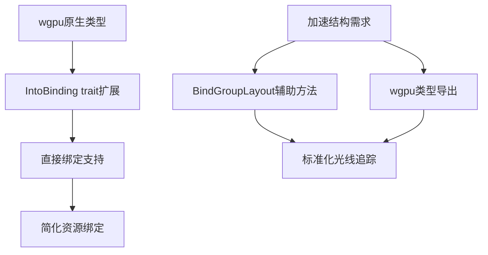

+++
title = "#19548 Add more wgpu helpers/types"
date = "2025-06-09T00:00:00"
draft = false
template = "pull_request_page.html"
in_search_index = false

[extra]
current_language = "zh-cn"
available_languages = {"en" = { name = "English", url = "/pull_request/bevy/2025-06/pr-19548-en-20250609" }, "zh-cn" = { name = "中文", url = "/pull_request/bevy/2025-06/pr-19548-zh-cn-20250609" }}
+++

## 技术分析报告：PR #19548

### 基本信息
- **标题**: Add more wgpu helpers/types
- **PR链接**: https://github.com/bevyengine/bevy/pull/19548
- **作者**: JMS55
- **状态**: MERGED
- **标签**: D-Trivial, A-Rendering, S-Ready-For-Final-Review
- **创建时间**: 2025-06-09T00:17:22Z
- **合并时间**: 2025-06-09T05:15:35Z
- **合并人**: alice-i-cecile

### 描述翻译
从 https://github.com/bevyengine/bevy/pull/19058 拆分出来

### 本PR的技术背景

这个PR源自大型渲染功能开发(#19058)的拆分工作，主要解决两个具体问题：
1. 绑定资源接口对wgpu原生类型的支持不足
2. 加速结构(acceleration structure)绑定布局缺少辅助方法

在Bevy渲染系统中，`IntoBinding` trait负责将资源转换为GPU可识别的绑定资源类型(BindingResource)。原始实现缺少对wgpu原生类型数组和特定类型的直接支持，导致开发者需要手动转换资源类型。同时，光线追踪所需的加速结构绑定类型缺少便捷的创建方法。

### 解决方案与实现

#### 1. 扩展绑定资源支持
在`bind_group_entries.rs`中新增三个关键实现：
```rust
// 支持wgpu原生纹理视图
impl<'a> IntoBinding<'a> for &'a wgpu::TextureView {
    fn into_binding(self) -> BindingResource<'a> {
        BindingResource::TextureView(self)
    }
}

// 支持采样器数组
impl<'a> IntoBinding<'a> for &'a [&'a wgpu::Sampler] {
    fn into_binding(self) -> BindingResource<'a> {
        BindingResource::SamplerArray(self)
    }
}

// 支持缓冲区数组
impl<'a> IntoBinding<'a> for &'a [wgpu::BufferBinding<'a>] {
    fn into_binding(self) -> BindingResource<'a> {
        BindingResource::BufferArray(self)
    }
}
```
这些扩展允许开发者直接使用wgpu原生类型，无需额外转换层，简化了复杂资源绑定的创建流程。

#### 2. 添加加速结构辅助方法
在`bind_group_layout_entries.rs`中新增：
```rust
pub fn acceleration_structure() -> BindGroupLayoutEntryBuilder {
    BindingType::AccelerationStructure.into_bind_group_layout_entry_builder()
}
```
该方法提供了标准化的加速结构绑定布局创建入口，确保光线追踪相关资源能正确配置。

#### 3. 暴露wgpu加速结构类型
在`render_resource/mod.rs`中新增类型导出：
```rust
pub use wgpu::{
    AccelerationStructureFlags,
    AccelerationStructureGeometryFlags,
    AccelerationStructureUpdateMode,
    Blas, BlasBuildEntry, BlasGeometries,
    BlasGeometrySizeDescriptors, 
    BlasTriangleGeometry, 
    BlasTriangleGeometrySizeDescriptor,
    CreateBlasDescriptor,
    CreateTlasDescriptor,
    Tlas, TlasInstance, TlasPackage,
    // ...其他保留的类型导出
};
```
这些导出使Bevy渲染系统能直接访问wgpu的光线追踪原语，为后续光线追踪功能奠定基础。

### 技术影响

1. **开发效率提升**：
   - 减少wgpu原生类型到Bevy类型的转换代码
   - 数组类型支持简化了复杂着色器的资源绑定
   ```rust
   // 之前需要手动转换
   let entries = &[
       binding0.into_binding(),
       binding1.into_binding()
   ];
   
   // 现在可直接使用
   let entries = &[
       &texture_view,
       &[&sampler1, &sampler2] 
   ];
   ```

2. **光线追踪基础**：
   - 加速结构辅助方法统一了绑定布局创建标准
   - 类型导出为光线追踪管线开发提供必要基础组件

3. **架构一致性**：
   - 保持与wgpu API的紧密对齐
   - 扩展而非修改现有接口，无破坏性变更

### 关键文件变更

#### 1. `crates/bevy_render/src/render_resource/bind_group_entries.rs`
```diff
+impl<'a> IntoBinding<'a> for &'a wgpu::TextureView {
+    #[inline]
+    fn into_binding(self) -> BindingResource<'a> {
+        BindingResource::TextureView(self)
+    }
+}
+
+impl<'a> IntoBinding<'a> for &'a [&'a wgpu::Sampler] {
+    #[inline]
+    fn into_binding(self) -> BindingResource<'a> {
+        BindingResource::SamplerArray(self)
+    }
+}
+
+impl<'a> IntoBinding<'a> for &'a [wgpu::BufferBinding<'a>] {
+    #[inline]
+    fn into_binding(self) -> BindingResource<'a> {
+        BindingResource::BufferArray(self)
+    }
+}
```

#### 2. `crates/bevy_render/src/render_resource/bind_group_layout_entries.rs`
```diff
+    pub fn acceleration_structure() -> BindGroupLayoutEntryBuilder {
+        BindingType::AccelerationStructure.into_bind_group_layout_entry_builder()
+    }
```

#### 3. `crates/bevy_render/src/render_resource/mod.rs`
```diff
 pub use wgpu::{
+    AccelerationStructureFlags, AccelerationStructureGeometryFlags,
+    AccelerationStructureUpdateMode,
     // ...
+    Blas, BlasBuildEntry, BlasGeometries,
+    BlasGeometrySizeDescriptors, BlasTriangleGeometry, BlasTriangleGeometrySizeDescriptor,
+    CreateBlasDescriptor, CreateTlasDescriptor,
     // ...
+    Tlas, TlasInstance, TlasPackage,
     // ...
 };
```

### 技术图示


### 延伸阅读
1. [WebGPU Binding Model](https://www.w3.org/TR/webgpu/#bindings)
2. [WGSL Resource Binding](https://gpuweb.github.io/gpuweb/wgsl/#resource-interface)
3. [Ray Tracing Acceleration Structures](https://arxiv.org/abs/2005.12288)
4. [Bevy Render Pipeline](https://bevy-cheatbook.github.io/pipeline.html)