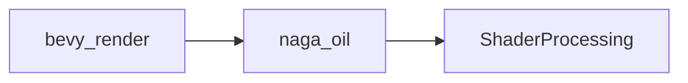

+++
title = "#19550 Require naga_oil 0.17.1"
date = "2025-06-09T00:00:00"
draft = false
template = "pull_request_page.html"
in_search_index = true

[taxonomies]
list_display = ["show"]

[extra]
current_language = "en"
available_languages = {"en" = { name = "English", url = "/pull_request/bevy/2025-06/pr-19550-en-20250609" }, "zh-cn" = { name = "中文", url = "/pull_request/bevy/2025-06/pr-19550-zh-cn-20250609" }}
labels = ["D-Trivial", "A-Rendering"]
+++

### Require naga_oil 0.17.1

#### Basic Information
- **Title**: Require naga_oil 0.17.1
- **PR Link**: https://github.com/bevyengine/bevy/pull/19550
- **Author**: JMS55
- **Status**: MERGED
- **Labels**: D-Trivial, A-Rendering, S-Ready-For-Final-Review
- **Created**: 2025-06-09T00:21:34Z
- **Merged**: 2025-06-09T05:15:35Z
- **Merged By**: alice-i-cecile

#### Description Translation
Split off from https://github.com/bevyengine/bevy/pull/19058

The patch should've been picked up anyways, but now it's required.

#### The Story of This Pull Request
This dependency update addresses a specific requirement in Bevy's rendering pipeline. The `naga_oil` crate provides critical shader processing capabilities, and version 0.17.1 contains a necessary patch that wasn't consistently being pulled in through the previous version specifier ("0.17"). 

The original version constraint allowed semver-compatible updates (0.17.x), but in practice, the required fix wasn't being reliably resolved during dependency resolution. By pinning to the exact patch version (0.17.1), we ensure the specific fix is always included without waiting for downstream resolution. This is particularly important for shader compilation where subtle differences can cause rendering artifacts or failures.

The change was split out from a larger rendering PR (#19058) to expedite the critical fix. While the patch should have been automatically included under the previous version range, explicitly requiring 0.17.1 eliminates any uncertainty in the dependency tree. The modification is minimal but significant - it touches both native and WebAssembly build configurations to ensure consistent behavior across platforms.

#### Visual Representation


#### Key Files Changed
**File**: `crates/bevy_render/Cargo.toml`  
**Changes**: Updated `naga_oil` dependency from 0.17 to 0.17.1 in both native and WebAssembly configurations.  

**Native build configuration diff:**
```diff
 [target.'cfg(not(target_arch = "wasm32"))'.dependencies]
 # Omit the `glsl` feature in non-WebAssembly by default.
-naga_oil = { version = "0.17", default-features = false, features = [
+naga_oil = { version = "0.17.1", default-features = false, features = [
   "test_shader",
 ] }
```

**WebAssembly build configuration diff:**
```diff
 [target.'cfg(target_arch = "wasm32")'.dependencies]
-naga_oil = "0.17"
+naga_oil = "0.17.1"
 js-sys = "0.3"
```

#### Further Reading
- [naga_oil 0.17.1 Release Notes](https://github.com/bevyengine/naga_oil/releases/tag/v0.17.1)  
- [Semantic Versioning Explained](https://semver.org/)  
- Original PR this was split from: [#19058](https://github.com/bevyengine/bevy/pull/19058)  

#### Full Code Diff
```diff
diff --git a/crates/bevy_render/Cargo.toml b/crates/bevy_render/Cargo.toml
index e844d950be33b..d9775e9c8fea6 100644
--- a/crates/bevy_render/Cargo.toml
+++ b/crates/bevy_render/Cargo.toml
@@ -119,7 +119,7 @@ wesl = { version = "0.1.2", optional = true }
 
 [target.'cfg(not(target_arch = "wasm32"))'.dependencies]
 # Omit the `glsl` feature in non-WebAssembly by default.
-naga_oil = { version = "0.17", default-features = false, features = [
+naga_oil = { version = "0.17.1", default-features = false, features = [
   "test_shader",
 ] }
 
@@ -127,7 +127,7 @@ naga_oil = { version = "0.17", default-features = false, features = [
 proptest = "1"
 
 [target.'cfg(target_arch = "wasm32")'.dependencies]
-naga_oil = "0.17"
+naga_oil = "0.17.1"
 js-sys = "0.3"
 web-sys = { version = "0.3.67", features = [
   'Blob',
```