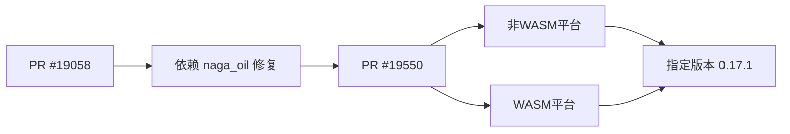

+++
title = "#19550 Require naga_oil 0.17.1"
date = "2025-06-09T00:00:00"
draft = false
template = "pull_request_page.html"
in_search_index = false

[extra]
current_language = "zh-cn"
available_languages = {"en" = { name = "English", url = "/pull_request/bevy/2025-06/pr-19550-en-20250609" }, "zh-cn" = { name = "中文", url = "/pull_request/bevy/2025-06/pr-19550-zh-cn-20250609" }}
+++

## PR 分析报告：Require naga_oil 0.17.1

### 基本信息
- **标题**: Require naga_oil 0.17.1
- **PR链接**: https://github.com/bevyengine/bevy/pull/19550
- **作者**: JMS55
- **状态**: 已合并
- **标签**: D-Trivial, A-Rendering, S-Ready-For-Final-Review
- **创建时间**: 2025-06-09T00:21:34Z
- **合并时间**: 2025-06-09T05:15:35Z
- **合并人**: alice-i-cecile

### 描述翻译
从 https://github.com/bevyengine/bevy/pull/19058 拆分出来  
该补丁本应被自动包含，但现在需要明确指定。

### PR 技术分析

#### 问题背景
该 PR 源于渲染管线对 `naga_oil` shader 预处理库的依赖管理问题。原始 PR #19058 实现的功能需要 `naga_oil` 0.17.1 版本中的特定修复（patch）。虽然语义化版本控制理论上应自动包含该补丁（因 0.17.1 满足 ^0.17.0 的要求），但实际构建中可能因锁文件（lockfile）或缓存机制导致未正确应用此关键修复。

#### 解决方案
为确保所有构建环境强制使用包含必要修复的版本，直接显式指定 `naga_oil` 依赖为 0.17.1。此方案：
1. 消除版本解析的不确定性
2. 避免潜在构建错误
3. 无需修改核心逻辑代码

#### 技术实现
修改集中于 `bevy_render` 的 Cargo.toml 文件，分平台处理依赖：
1. **非 WASM 平台**：保留现有 feature 配置，仅升级版本
2. **WASM 平台**：直接升级版本（无 feature 配置）

```diff
# crates/bevy_render/Cargo.toml

[target.'cfg(not(target_arch = "wasm32"))'.dependencies]
- naga_oil = { version = "0.17", default-features = false, features = [
+ naga_oil = { version = "0.17.1", default-features = false, features = [
   "test_shader",
 ] }

[target.'cfg(target_arch = "wasm32")'.dependencies]
- naga_oil = "0.17"
+ naga_oil = "0.17.1"
```

#### 技术影响
1. **确定性构建**：确保所有开发者/CI 环境使用相同依赖版本
2. **问题预防**：避免因依赖解析导致的潜在渲染错误
3. **维护性**：明确记录对特定补丁版本的依赖需求

#### 工程经验
- **依赖管理**：即使语义化版本规范应自动包含补丁，显式指定版本可避免环境差异导致的问题
- **最小变更**：仅修改版本声明，不触及功能代码，降低 review 成本
- **平台适配**：保持对 WASM 和非 WASM 平台的差异化配置

### 关键文件变更

#### `crates/bevy_render/Cargo.toml`
**变更原因**：强制使用 `naga_oil` 0.17.1 包含的必要修复  
**代码对比**：
```diff
[target.'cfg(not(target_arch = "wasm32"))'.dependencies]
- naga_oil = { version = "0.17", default-features = false, features = [
+ naga_oil = { version = "0.17.1", default-features = false, features = [
   "test_shader",
 ] }

[target.'cfg(target_arch = "wasm32")'.dependencies]
- naga_oil = "0.17"
+ naga_oil = "0.17.1"
```

### 技术图示


### 延伸阅读
1. [Cargo 语义化版本规范](https://doc.rust-lang.org/cargo/reference/specifying-dependencies.html)
2. [naga_oil 发布日志](https://github.com/bevyengine/naga_oil/releases)
3. [Rust 条件编译指南](https://doc.rust-lang.org/reference/conditional-compilation.html)