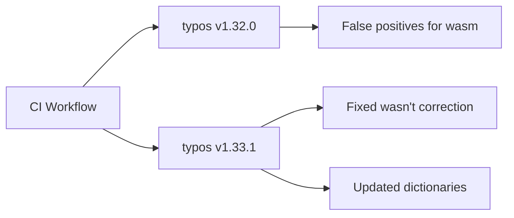

+++
title = "#19551 Bump crate-ci/typos from 1.32.0 to 1.33.1"
date = "2025-06-10T00:00:00"
draft = false
template = "pull_request_page.html"
in_search_index = true

[taxonomies]
list_display = ["show"]

[extra]
current_language = "en"
available_languages = {"en" = { name = "English", url = "/pull_request/bevy/2025-06/pr-19551-en-20250610" }, "zh-cn" = { name = "中文", url = "/pull_request/bevy/2025-06/pr-19551-zh-cn-20250610" }}
labels = ["C-Dependencies", "S-Adopt-Me"]
+++

# Bump crate-ci/typos from 1.32.0 to 1.33.1

## Basic Information
- **Title**: Bump crate-ci/typos from 1.32.0 to 1.33.1
- **PR Link**: https://github.com/bevyengine/bevy/pull/19551
- **Author**: app/dependabot
- **Status**: MERGED
- **Labels**: C-Dependencies, S-Adopt-Me
- **Created**: 2025-06-09T07:15:38Z
- **Merged**: 2025-06-10T00:00:57Z
- **Merged By**: mockersf

## Description Translation
Bumps [crate-ci/typos](https://github.com/crate-ci/typos) from 1.32.0 to 1.33.1.
<details>
<summary>Release notes</summary>
<p><em>Sourced from <a href="https://github.com/crate-ci/typos/releases">crate-ci/typos's releases</a>.</em></p>
<blockquote>
<h2>v1.33.1</h2>
<h2>[1.33.1] - 2025-06-02</h2>
<h3>Fixes</h3>
<ul>
<li><em>(dict)</em> Don't correct <code>wasn't</code> to <code>wasm't</code></li>
</ul>
<h2>v1.33.0</h2>
<h2>[1.33.0] - 2025-06-02</h2>
<h3>Features</h3>
<ul>
<li>Updated the dictionary with the <a href="https://redirect.github.com/crate-ci/typos/issues/1290">May 2025</a> changes</li>
</ul>
</blockquote>
</details>
<details>
<summary>Changelog</summary>
<p><em>Sourced from <a href="https://github.com/crate-ci/typos/blob/master/CHANGELOG.md">crate-ci/typos's changelog</a>.</em></p>
<blockquote>
<h2>[1.33.1] - 2025-06-02</h2>
<h3>Fixes</h3>
<ul>
<li><em>(dict)</em> Don't correct <code>wasn't</code> to <code>wasm't</code></li>
</ul>
<h2>[1.33.0] - 2025-06-02</h2>
<h3>Features</h3>
<ul>
<li>Updated the dictionary with the <a href="https://redirect.github.com/crate-ci/typos/issues/1290">May 2025</a> changes</li>
</ul>
</blockquote>
</details>
<details>
<summary>Commits</summary>
<ul>
<li><a href="https://github.com/crate-ci/typos/commit/b1ae8d918b6e85bd611117d3d9a3be4f903ee5e4"><code>b1ae8d9</code></a> chore: Release</li>
<li><a href="https://github.com/crate-ci/typos/commit/6c5d17de8e16370e7e1d8dd41c8dc0a7f22ea981"><code>6c5d17d</code></a> docs: Update changelog</li>
<li><a href="https://github.com/crate-ci/typos/commit/0a237ba81a86b72399a05f3441449ddeab9faf16"><code>0a237ba</code></a> Merge pull request <a href="https://redirect.github.com/crate-ci/typos/issues/1311">#1311</a> from epage/wasn</li>
<li><a href="https://github.com/crate-ci/typos/commit/79920cf06905dd147d4e784ae17136d98c211083"><code>79920cf</code></a> fix(dict): Don't correct <code>wasn't</code></li>
<li><a href="https://github.com/crate-ci/typos/commit/e99b2b47d9910ae09f6e828594c33ab3e0936491"><code>e99b2b4</code></a> chore: Release</li>
<li><a href="https://github.com/crate-ci/typos/commit/2afc152754dd1bf58997ad87bcc84f7797bb52ab"><code>2afc152</code></a> chore: Release</li>
<li><a href="https://github.com/crate-ci/typos/commit/544a19b4ae1a0814151fd081008bb9305abccdfc"><code>544a19b</code></a> docs: Update changelog</li>
<li><a href="https://github.com/crate-ci/typos/commit/2e0ca28a9540837425705660401059467b721ab9"><code>2e0ca28</code></a> Merge pull request <a href="https://redirect.github.com/crate-ci/typos/issues/1310">#1310</a> from epage/may</li>
<li><a href="https://github.com/crate-ci/typos/commit/94eb4e7b407daa7967ca1a23c72902898ab599f6"><code>94eb4e7</code></a> feat(dict): May 2025 updates</li>
<li><a href="https://github.com/crate-ci/typos/commit/a4cce4ca70447aa8b294fc0eaada68193eeec1fa"><code>a4cce4c</code></a> Merge pull request <a href="https://redirect.github.com/crate-ci/typos/issues/1308">#1308</a> from crate-ci/renovate/schemars-0.x</li>
<li>Additional commits viewable in <a href="https://github.com/crate-ci/typos/compare/v1.32.0...v1.33.1">compare view</a></li>
</ul>
</details>
<br />


[](https://docs.github.com/en/github/managing-security-vulnerabilities/about-dependabot-security-updates#about-compatibility-scores)

Dependabot will resolve any conflicts with this PR as long as you don't alter it yourself. You can also trigger a rebase manually by commenting `@dependabot rebase`.

[//]: # (dependabot-automerge-start)
[//]: # (dependabot-automerge-end)

---

<details>
<summary>Dependabot commands and options</summary>
<br />

You can trigger Dependabot actions by commenting on this PR:
- `@dependabot rebase` will rebase this PR
- `@dependabot recreate` will recreate this PR, overwriting any edits that have been made to it
- `@dependabot merge` will merge this PR after your CI passes on it
- `@dependabot squash and merge` will squash and merge this PR after your CI passes on it
- `@dependabot cancel merge` will cancel a previously requested merge and block automerging
- `@dependabot reopen` will reopen this PR if it is closed
- `@dependabot close` will close this PR and stop Dependabot recreating it. You can achieve the same result by closing it manually
- `@dependabot show <dependency name> ignore conditions` will show all of the ignore conditions of the specified dependency
- `@dependabot ignore this major version` will close this PR and stop Dependabot creating any more for this major version (unless you reopen the PR or upgrade to it yourself)
- `@dependabot ignore this minor version` will close this PR and stop Dependabot creating any more for this minor version (unless you reopen the PR or upgrade to it yourself)
- `@dependabot ignore this dependency` will close this PR and stop Dependabot creating any more for this dependency (unless you reopen the PR or upgrade to it yourself)


</details>

## The Story of This Pull Request

### The Problem and Context
The Bevy project uses crate-ci/typos as a GitHub Action in its CI pipeline to catch spelling errors in code and documentation. The existing workflow used version 1.32.0 of this tool. The typos tool maintainers released two updates: version 1.33.0 with updated dictionaries, and 1.33.1 containing a critical fix that prevented the tool from incorrectly suggesting "wasm't" as a correction for "wasn't". This was particularly important for Bevy since "wasm" (WebAssembly) is a relevant term in their ecosystem, and false positives could generate noise in PR reviews.

### The Solution Approach
Dependabot automatically detected the new typos versions and generated this PR to update the workflow configuration. The solution was straightforward: update the version reference in the CI configuration file to point to the latest patched version (1.33.1) instead of the older 1.32.0. This approach maintains existing functionality while benefiting from the latest improvements and fixes.

### The Implementation
The change is a single-line modification in the GitHub Actions workflow file. The version specifier for the typos action was updated from `v1.32.0` to `v1.33.1`. This ensures the CI pipeline will now use the updated typos checker with the improved dictionary and critical fix for "wasn't" corrections.

```yaml
- name: Check for typos
  uses: crate-ci/typos@v1.33.1  # Updated from v1.32.0
```

The simplicity of this change reflects a best practice for dependency management - small, incremental updates that are easy to review and test. The CI pipeline itself would validate that the new version works correctly with Bevy's codebase.

### Technical Insights
The key technical consideration was the false positive fix for "wasn't" → "wasm't". In game engine development where WebAssembly (wasm) is a common term, this incorrect suggestion could create noise during code reviews. The update also includes dictionary improvements that enhance the tool's accuracy for spotting genuine typos while reducing false positives.

Since this is a CI tool update rather than a code dependency, the risk is minimal. The change doesn't affect runtime behavior or build outputs, only the pre-merge validation process. The compatibility score of 100 indicates minimal risk of breaking changes.

### The Impact
This update provides concrete improvements:
1. Eliminates false positive corrections for "wasn't" → "wasm't"
2. Incorporates latest dictionary improvements for more accurate spell checking
3. Maintains compatibility with Bevy's existing CI workflow
4. Keeps dependencies current with security and maintenance best practices

The maintainers merged this quickly since it passed CI checks and provided clear benefits with minimal risk. This demonstrates the value of automated dependency management in maintaining tooling quality.

## Visual Representation



## Key Files Changed

### `.github/workflows/ci.yml`
This file defines Bevy's GitHub Actions CI pipeline. The change updates the version of the typos checker used in the spell-checking job.

**Before:**
```yaml
      - name: Check for typos
        uses: crate-ci/typos@v1.32.0
```

**After:**
```yaml
      - name: Check for typos
        uses: crate-ci/typos@v1.33.1
```

This single-line change updates the typos checker to the latest version while preserving all other aspects of the CI workflow. The update ensures Bevy benefits from the latest spell-checking improvements without requiring other modifications.

## Further Reading
1. [typos changelog](https://github.com/crate-ci/typos/blob/master/CHANGELOG.md) - Detailed release notes
2. [GitHub Actions documentation](https://docs.github.com/en/actions) - Workflow configuration reference
3. [Dependabot documentation](https://docs.github.com/en/code-security/dependabot) - Automated dependency management
4. [WebAssembly (wasm) overview](https://webassembly.org/) - Context for the critical fix

## Full Code Diff
```diff
diff --git a/.github/workflows/ci.yml b/.github/workflows/ci.yml
index 37db848558d6f..d2410b57d2dc3 100644
--- a/.github/workflows/ci.yml
+++ b/.github/workflows/ci.yml
@@ -293,7 +293,7 @@ jobs:
     steps:
       - uses: actions/checkout@v4
       - name: Check for typos
-        uses: crate-ci/typos@v1.32.0
+        uses: crate-ci/typos@v1.33.1
       - name: Typos info
         if: failure()
         run: |
```