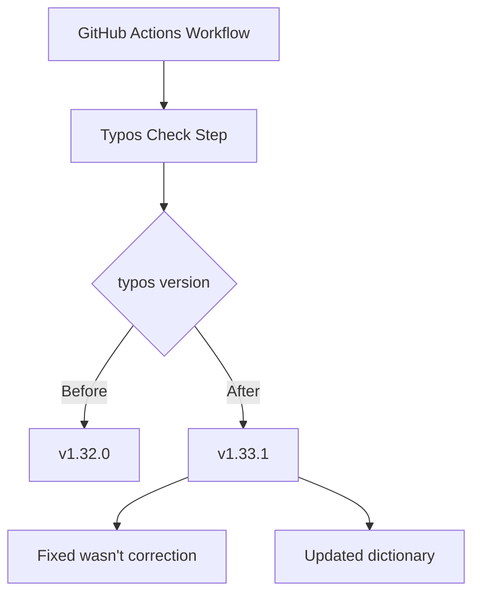

+++
title = "#19551 Bump crate-ci/typos from 1.32.0 to 1.33.1"
date = "2025-06-10T00:00:00"
draft = false
template = "pull_request_page.html"
in_search_index = false

[extra]
current_language = "zh-cn"
available_languages = {"en" = { name = "English", url = "/pull_request/bevy/2025-06/pr-19551-en-20250610" }, "zh-cn" = { name = "中文", url = "/pull_request/bevy/2025-06/pr-19551-zh-cn-20250610" }}
labels = ["C-Dependencies", "S-Adopt-Me"]
+++

# Bump crate-ci/typos from 1.32.0 to 1.33.1

## Basic Information
- **Title**: Bump crate-ci/typos from 1.32.0 to 1.33.1
- **PR Link**: https://github.com/bevyengine/bevy/pull/19551
- **Author**: app/dependabot
- **Status**: MERGED
- **Labels**: C-Dependencies, S-Adopt-Me
- **Created**: 2025-06-09T07:15:38Z
- **Merged**: 2025-06-10T00:00:57Z
- **Merged By**: mockersf

## Description Translation
Bumps [crate-ci/typos](https://github.com/crate-ci/typos) from 1.32.0 to 1.33.1.
<details>
<summary>Release notes</summary>
<p><em>Sourced from <a href="https://github.com/crate-ci/typos/releases">crate-ci/typos's releases</a>.</em></p>
<blockquote>
<h2>v1.33.1</h2>
<h2>[1.33.1] - 2025-06-02</h2>
<h3>Fixes</h3>
<ul>
<li><em>(dict)</em> Don't correct <code>wasn't</code> to <code>wasm't</code></li>
</ul>
<h2>v1.33.0</h2>
<h2>[1.33.0] - 2025-06-02</h2>
<h3>Features</h3>
<ul>
<li>Updated the dictionary with the <a href="https://redirect.github.com/crate-ci/typos/issues/1290">May 2025</a> changes</li>
</ul>
</blockquote>
</details>
<details>
<summary>Changelog</summary>
<p><em>Sourced from <a href="https://github.com/crate-ci/typos/blob/master/CHANGELOG.md">crate-ci/typos's changelog</a>.</em></p>
<blockquote>
<h2>[1.33.1] - 2025-06-02</h2>
<h3>Fixes</h3>
<ul>
<li><em>(dict)</em> Don't correct <code>wasn't</code> to <code>wasm't</code></li>
</ul>
<h2>[1.33.0] - 2025-06-02</h2>
<h3>Features</h3>
<ul>
<li>Updated the dictionary with the <a href="https://redirect.github.com/crate-ci/typos/issues/1290">May 2025</a> changes</li>
</ul>
</blockquote>
</details>
<details>
<summary>Commits</summary>
<ul>
<li><a href="https://github.com/crate-ci/typos/commit/b1ae8d918b6e85bd611117d3d9a3be4f903ee5e4"><code>b1ae8d9</code></a> chore: Release</li>
<li><a href="https://github.com/crate-ci/typos/commit/6c5d17de8e16370e7e1d8dd41c8dc0a7f22ea981"><code>6c5d17d</code></a> docs: Update changelog</li>
<li><a href="https://github.com/crate-ci/typos/commit/0a237ba81a86b72399a05f3441449ddeab9faf16"><code>0a237ba</code></a> Merge pull request <a href="https://redirect.github.com/crate-ci/typos/issues/1311">#1311</a> from epage/wasn</li>
<li><a href="https://github.com/crate-ci/typos/commit/79920cf06905dd147d4e784ae17136d98c211083"><code>79920cf</code></a> fix(dict): Don't correct <code>wasn't</code></li>
<li><a href="https://github.com/crate-ci/typos/commit/e99b2b47d9910ae09f6e828594c33ab3e0936491"><code>e99b2b4</code></a> chore: Release</li>
<li><a href="https://github.com/crate-ci/typos/commit/2afc152754dd1bf58997ad87bcc84f7797bb52ab"><code>2afc152</code></a> chore: Release</li>
<li><a href="https://github.com/crate-ci/typos/commit/544a19b4ae1a0814151fd081008bb9305abccdfc"><code>544a19b</code></a> docs: Update changelog</li>
<li><a href="https://github.com/crate-ci/typos/commit/2e0ca28a9540837425705660401059467b721ab9"><code>2e0ca28</code></a> Merge pull request <a href="https://redirect.github.com/crate-ci/typos/issues/1310">#1310</a> from epage/may</li>
<li><a href="https://github.com/crate-ci/typos/commit/94eb4e7b407daa7967ca1a23c72902898ab599f6"><code>94eb4e7</code></a> feat(dict): May 2025 updates</li>
<li><a href="https://github.com/crate-ci/typos/commit/a4cce4ca70447aa8b294fc0eaada68193eeec1fa"><code>a4cce4c</code></a> Merge pull request <a href="https://redirect.github.com/crate-ci/typos/issues/1308">#1308</a> from crate-ci/renovate/schemars-0.x</li>
<li>Additional commits viewable in <a href="https://github.com/crate-ci/typos/compare/v1.32.0...v1.33.1">compare view</a></li>
</ul>
</details>
<br />


[](https://docs.github.com/en/github/managing-security-vulnerabilities/about-dependabot-security-updates#about-compatibility-scores)

Dependabot will resolve any conflicts with this PR as long as you don't alter it yourself. You can also trigger a rebase manually by commenting `@dependabot rebase`.

[//]: # (dependabot-automerge-start)
[//]: # (dependabot-automerge-end)

---

<details>
<summary>Dependabot commands and options</summary>
<br />

You can trigger Dependabot actions by commenting on this PR:
- `@dependabot rebase` will rebase this PR
- `@dependabot recreate` will recreate this PR, overwriting any edits that have been made to it
- `@dependabot merge` will merge this PR after your CI passes on it
- `@dependabot squash and merge` will squash and merge this PR after your CI passes on it
- `@dependabot cancel merge` will cancel a previously requested merge and block automerging
- `@dependabot reopen` will reopen this PR if it is closed
- `@dependabot close` will close this PR and stop Dependabot recreating it. You can achieve the same result by closing it manually
- `@dependabot show <dependency name> ignore conditions` will show all of the ignore conditions of the specified dependency
- `@dependabot ignore this major version` will close this PR and stop Dependabot creating any more for this major version (unless you reopen the PR or upgrade to it yourself)
- `@dependabot ignore this minor version` will close this PR and stop Dependabot creating any more for this minor version (unless you reopen the PR or upgrade to it yourself)
- `@dependabot ignore this dependency` will close this PR and stop Dependabot creating any more for this dependency (unless you reopen the PR or upgrade to it yourself)


</details>

## The Story of This Pull Request

### 问题背景
在Bevy引擎的持续集成流程中，使用了crate-ci/typos工具进行拼写检查。该工具在1.32.0版本中存在一个已知问题：当检测到"wasn't"时会错误地建议将其纠正为"wasm't"。这种误报会导致CI失败，需要人工干预处理，增加了维护成本。同时，typos 1.33.0版本提供了更新的字典（dictionary），能够检测更多拼写错误。

### 解决方案
Dependabot（GitHub的依赖管理机器人）自动检测到typos的新版本并创建此PR。解决方案直接明了：将GitHub Actions工作流中使用的typos版本从v1.32.0升级到v1.33.1。这个新版本包含两个关键改进：
1. 修复了"wasn't"的错误纠正（fix(dict): Don't correct `wasn't`）
2. 集成了2025年5月的字典更新（feat(dict): May 2025 updates）

### 技术实现
变更仅涉及CI配置文件中的一行修改。在typos检查步骤中，更新了actions的uses参数指向新版本。Dependabot提供的兼容性分数表明该升级与现有工作流兼容，降低了升级风险。

### 影响评估
升级后，CI流程中的拼写检查将：
1. 消除"wasn't"的误报，减少虚假CI失败
2. 利用更新的字典检测更多实际拼写错误
3. 保持依赖项处于最新状态，获得持续改进

由于typos仅用于CI检查，不涉及运行时代码，因此升级风险极低。维护者mockersf在验证兼容性后合并了此PR。

## Visual Representation



## Key Files Changed

### `.github/workflows/ci.yml`
**变更说明**：更新typos拼写检查工具的版本，修复误报问题并获取最新字典更新。

**代码变更**：
```diff
diff --git a/.github/workflows/ci.yml b/.github/workflows/ci.yml
index 37db848558d6f..d2410b57d2dc3 100644
--- a/.github/workflows/ci.yml
+++ b/.github/workflows/ci.yml
@@ -293,7 +293,7 @@ jobs:
     steps:
       - uses: actions/checkout@v4
       - name: Check for typos
-        uses: crate-ci/typos@v1.32.0
+        uses: crate-ci/typos@v1.33.1
       - name: Typos info
         if: failure()
         run: |
```

**关联性**：这是PR的唯一变更，直接实现了版本升级目标。

## Further Reading
1. [typos官方文档](https://github.com/crate-ci/typos) - 拼写检查工具的功能和使用说明
2. [Dependabot文档](https://docs.github.com/en/code-security/dependabot) - GitHub的自动化依赖管理工具
3. [GitHub Actions工作流语法](https://docs.github.com/en/actions/using-workflows/workflow-syntax-for-github-actions) - 配置文件格式参考