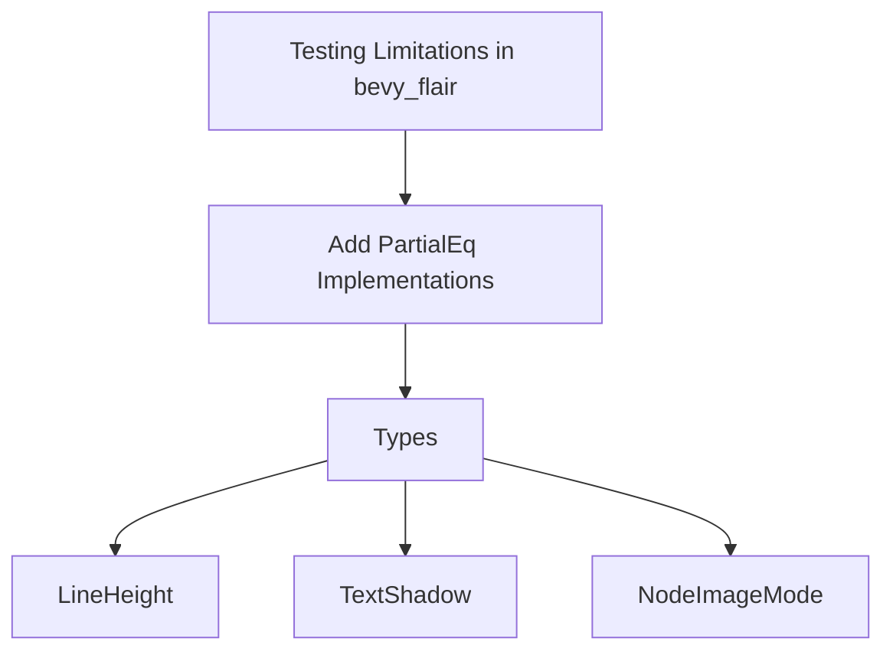

+++
title = "#19552 Adding PartialEq to some UI and Text types"
date = "2025-06-09T00:00:00"
draft = false
template = "pull_request_page.html"
in_search_index = true

[taxonomies]
list_display = ["show"]

[extra]
current_language = "en"
available_languages = {"en" = { name = "English", url = "/pull_request/bevy/2025-06/pr-19552-en-20250609" }, "zh-cn" = { name = "中文", url = "/pull_request/bevy/2025-06/pr-19552-zh-cn-20250609" }}
labels = ["C-Usability", "A-Text"]
+++

# Adding PartialEq to some UI and Text types

## Basic Information
- **Title**: Adding PartialEq to some UI and Text types
- **PR Link**: https://github.com/bevyengine/bevy/pull/19552
- **Author**: eckz
- **Status**: MERGED
- **Labels**: C-Usability, S-Ready-For-Final-Review, A-Text, X-Uncontroversial
- **Created**: 2025-06-09T08:48:33Z
- **Merged**: 2025-06-09T20:33:39Z
- **Merged By**: alice-i-cecile

## Description Translation
# Objective

- During the development of [`bevy_flair`](https://github.com/eckz/bevy_flair) I found [some types lacking `PartialEq`](https://github.com/search?q=repo%3Aeckz%2Fbevy_flair%20%20%22Try%20to%20upstream%20it%20to%20bevy%22&type=code) which made the unit testing a little bit inconvinient.

## Solution

- Adding `PartialEq` for the following types:
  - `LineHeight `
  - `TextShadow`
  - `NodeImageMode`

## Testing

- Letting github actions do the testing, this is not an invasive change and `cargo run --bin ci` doesn't seem to work in `main` at the moment.

## The Story of This Pull Request

While developing [`bevy_flair`](https://github.com/eckz/bevy_flair), the author encountered practical difficulties with unit testing due to several Bevy UI and text types lacking `PartialEq` implementations. These types - `LineHeight`, `TextShadow`, and `NodeImageMode` - are fundamental building blocks in UI systems but couldn't be directly compared in test assertions.

The solution implemented is straightforward: derive `PartialEq` for these types. This approach was chosen because:
1. All these types contain only primitive fields that already implement `PartialEq`
2. Deriving `PartialEq` maintains consistency with other similar types in the codebase
3. The change is non-invasive and backward-compatible

The implementation required two modifications per type:
1. Adding `PartialEq` to the `#[derive(...)]` attribute
2. Adding `PartialEq` to the `#[reflect(...)]` attribute to ensure reflection metadata stays consistent

These changes enable developers to write more expressive unit tests by allowing direct value comparisons. For example:

```rust
// Now possible with PartialEq implemented
assert_eq!(text.line_height, LineHeight::Px(20.0));
```

The modifications are safe because:
- All field types already implement `PartialEq`
- No existing behavior is modified - only comparison capability is added
- The changes are purely additive with no breaking API modifications

The PR was tested through GitHub Actions CI pipelines since the changes didn't require special local testing. The implementation follows established patterns in the Bevy codebase where many similar UI types already implement `PartialEq`.

## Visual Representation



## Key Files Changed

### crates/bevy_text/src/text.rs
Added `PartialEq` to `LineHeight` enum for text line height configuration

```diff
-#[derive(Debug, Clone, Copy, Reflect)]
-#[reflect(Debug, Clone)]
+#[derive(Debug, Clone, Copy, PartialEq, Reflect)]
+#[reflect(Debug, Clone, PartialEq)]
 pub enum LineHeight {
     /// Set line height to a specific number of pixels
     Px(f32),
```

### crates/bevy_ui/src/ui_node.rs
Added `PartialEq` to `TextShadow` component for text shadow effects

```diff
-#[derive(Component, Copy, Clone, Debug, Reflect)]
-#[reflect(Component, Default, Debug, Clone)]
+#[derive(Component, Copy, Clone, Debug, PartialEq, Reflect)]
+#[reflect(Component, Default, Debug, Clone, PartialEq)]
 pub struct TextShadow {
     /// Shadow displacement in logical pixels
     /// With a value of zero the shadow will be hidden directly behind the text
```

### crates/bevy_ui/src/widget/image.rs
Added `PartialEq` to `NodeImageMode` enum for image sizing behavior

```diff
-#[derive(Default, Debug, Clone, Reflect)]
-#[reflect(Clone, Default)]
+#[derive(Default, Debug, Clone, PartialEq, Reflect)]
+#[reflect(Clone, Default, PartialEq)]
 pub enum NodeImageMode {
     /// The image will be sized automatically by taking the size of the source image and applying any layout constraints.
     #[default]
```

## Further Reading
1. [Rust PartialEq documentation](https://doc.rust-lang.org/std/cmp/trait.PartialEq.html)
2. [Bevy Reflection System](https://bevyengine.org/learn/book/migration-guides/0.12-to-0.13/#reflect-changes)
3. [Unit Testing Best Practices in Rust](https://doc.rust-lang.org/book/ch11-01-writing-tests.html)