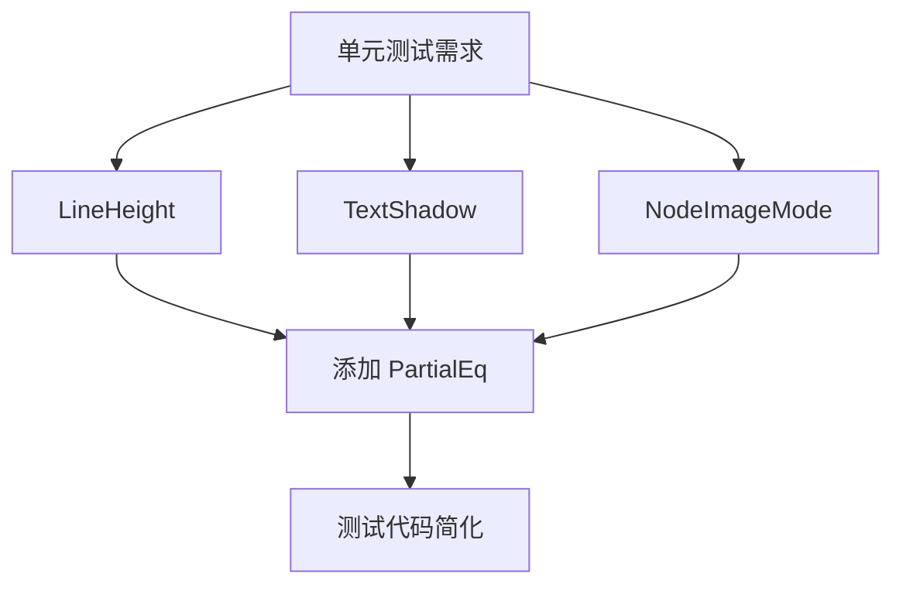

+++
title = "#19552 Adding PartialEq to some UI and Text types"
date = "2025-06-09T00:00:00"
draft = false
template = "pull_request_page.html"
in_search_index = false

[extra]
current_language = "zh-cn"
available_languages = {"en" = { name = "English", url = "/pull_request/bevy/2025-06/pr-19552-en-20250609" }, "zh-cn" = { name = "中文", url = "/pull_request/bevy/2025-06/pr-19552-zh-cn-20250609" }}
labels = ["C-Usability", "A-Text"]
+++

# 为部分 UI 和文本类型添加 PartialEq 支持

## Basic Information
- **Title**: Adding PartialEq to some UI and Text types
- **PR Link**: https://github.com/bevyengine/bevy/pull/19552
- **Author**: eckz
- **Status**: MERGED
- **Labels**: C-Usability, S-Ready-For-Final-Review, A-Text, X-Uncontroversial
- **Created**: 2025-06-09T08:48:33Z
- **Merged**: 2025-06-09T20:33:39Z
- **Merged By**: alice-i-cecile

## Description Translation
### 目标
- 在开发 [`bevy_flair`](https://github.com/eckz/bevy_flair) 过程中，发现[某些类型缺少 `PartialEq`](https://github.com/search?q=repo%3Aeckz%2Fbevy_flair%20%20%22Try%20to%20upstream%20it%20to%20bevy%22&type=code)，导致单元测试不够方便

### 解决方案
- 为以下类型添加 `PartialEq` 支持：
  - `LineHeight`
  - `TextShadow`
  - `NodeImageMode`

### 测试
- 由 GitHub Actions 执行测试，此变更非侵入式，且当前在 `main` 分支运行 `cargo run --bin ci` 似乎不可行

## The Story of This Pull Request

### 问题背景
在开发 `bevy_flair` 扩展时，作者发现 Bevy 引擎中某些 UI 和文本组件缺少 `PartialEq` trait 实现。具体来说，`LineHeight`、`TextShadow` 和 `NodeImageMode` 这三个类型无法直接进行相等性比较。这在编写单元测试时造成不便，因为测试中经常需要验证这些类型的值是否符合预期。

`PartialEq` 是 Rust 中用于实现部分相等比较的基础 trait，缺少该实现会：
1. 无法直接使用 `assert_eq!` 进行值比较
2. 增加测试代码复杂度（需要手动比较字段）
3. 限制类型在需要相等性检查的泛型场景中的使用

### 解决方案实现
解决方案直接明了：为这三个类型添加 `#[derive(PartialEq)]`。由于这些类型已经实现了 `Clone` 和 `Copy`，添加 `PartialEq` 是安全且合理的。修改同时更新了 `Reflect` derive 宏以包含 `PartialEq`，确保反射系统能正确处理相等性检查。

#### 关键技术点：
1. **派生宏顺序**：`PartialEq` 添加在现有 traits 之后，保持代码一致性
2. **反射集成**：更新 `#[reflect(...)]` 属性包含 `PartialEq`，确保反射系统感知此变更
3. **零开销抽象**：`derive(PartialEq)` 编译后生成高效的字段级比较代码

### 变更影响
1. **测试便利性**：现在可以直接对这些类型使用 `assert_eq!` 进行值比较
2. **API 一致性**：与 Bevy 中其他相似组件保持一致的 trait 实现
3. **潜在扩展性**：为未来可能的 `Eq` 实现打下基础（若类型满足额外要求）

```rust
// 修改前示例 (NodeImageMode)
#[derive(Default, Debug, Clone, Reflect)]
#[reflect(Clone, Default)]
pub enum NodeImageMode { /* ... */ }

// 修改后示例
#[derive(Default, Debug, Clone, PartialEq, Reflect)]
#[reflect(Clone, Default, PartialEq)]
pub enum NodeImageMode { /* ... */ }
```

## Visual Representation



## Key Files Changed

### 1. `crates/bevy_text/src/text.rs`
**变更原因**：为 `LineHeight` 枚举添加 `PartialEq` 支持，便于文本布局测试

```rust
// Before:
#[derive(Debug, Clone, Copy, Reflect)]
#[reflect(Debug, Clone)]
pub enum LineHeight {
    Px(f32),
    Factor(f32),
}

// After:
#[derive(Debug, Clone, Copy, PartialEq, Reflect)]
#[reflect(Debug, Clone, PartialEq)]
pub enum LineHeight {
    Px(f32),
    Factor(f32),
}
```

### 2. `crates/bevy_ui/src/ui_node.rs`
**变更原因**：为 `TextShadow` 组件添加 `PartialEq`，支持文本阴影效果的相等比较

```rust
// Before:
#[derive(Component, Copy, Clone, Debug, Reflect)]
#[reflect(Component, Default, Debug, Clone)]
pub struct TextShadow {
    pub offset: Vec2,
    pub color: Color,
}

// After:
#[derive(Component, Copy, Clone, Debug, PartialEq, Reflect)]
#[reflect(Component, Default, Debug, Clone, PartialEq)]
pub struct TextShadow {
    pub offset: Vec2,
    pub color: Color,
}
```

### 3. `crates/bevy_ui/src/widget/image.rs`
**变更原因**：为 `NodeImageMode` 枚举添加 `PartialEq`，便于图像布局模式比较

```rust
// Before:
#[derive(Default, Debug, Clone, Reflect)]
#[reflect(Clone, Default)]
pub enum NodeImageMode {
    #[default]
    SizeToFit,
    MaintainAspectRatio,
    Stretch,
}

// After:
#[derive(Default, Debug, Clone, PartialEq, Reflect)]
#[reflect(Clone, Default, PartialEq)]
pub enum NodeImageMode {
    #[default]
    SizeToFit,
    MaintainAspectRatio,
    Stretch,
}
```

## Further Reading
1. Rust `PartialEq` Trait 官方文档：  
   https://doc.rust-lang.org/std/cmp/trait.PartialEq.html
2. Bevy 反射系统工作原理：  
   https://bevyengine.org/learn/book/features/reflection/
3. 使用 derive 宏自动实现 trait：  
   https://doc.rust-lang.org/reference/attributes/derive.html
4. 单元测试最佳实践（含相等性检查）：  
   https://doc.rust-lang.org/book/ch11-01-writing-tests.html

## Full Code Diff
```diff
diff --git a/crates/bevy_text/src/text.rs b/crates/bevy_text/src/text.rs
index debf9cc3756c8..5b25b32939b5e 100644
--- a/crates/bevy_text/src/text.rs
+++ b/crates/bevy_text/src/text.rs
@@ -354,8 +354,8 @@ impl Default for TextFont {
 /// Specifies the height of each line of text for `Text` and `Text2d`
 ///
 /// Default is 1.2x the font size
-#[derive(Debug, Clone, Copy, Reflect)]
-#[reflect(Debug, Clone)]
+#[derive(Debug, Clone, Copy, PartialEq, Reflect)]
+#[reflect(Debug, Clone, PartialEq)]
 pub enum LineHeight {
     /// Set line height to a specific number of pixels
     Px(f32),
diff --git a/crates/bevy_ui/src/ui_node.rs b/crates/bevy_ui/src/ui_node.rs
index f5f914bdc01f6..3a73d7441edc3 100644
--- a/crates/bevy_ui/src/ui_node.rs
+++ b/crates/bevy_ui/src/ui_node.rs
@@ -2796,8 +2796,8 @@ impl ComputedNodeTarget {
 }
 
 /// Adds a shadow behind text
-#[derive(Component, Copy, Clone, Debug, Reflect)]
-#[reflect(Component, Default, Debug, Clone)]
+#[derive(Component, Copy, Clone, Debug, PartialEq, Reflect)]
+#[reflect(Component, Default, Debug, Clone, PartialEq)]
 pub struct TextShadow {
     /// Shadow displacement in logical pixels
     /// With a value of zero the shadow will be hidden directly behind the text
diff --git a/crates/bevy_ui/src/widget/image.rs b/crates/bevy_ui/src/widget/image.rs
index c65c4df354881..9a743595b86b1 100644
--- a/crates/bevy_ui/src/widget/image.rs
+++ b/crates/bevy_ui/src/widget/image.rs
@@ -138,8 +138,8 @@ impl From<Handle<Image>> for ImageNode {
 }
 
 /// Controls how the image is altered to fit within the layout and how the layout algorithm determines the space in the layout for the image
-#[derive(Default, Debug, Clone, Reflect)]
-#[reflect(Clone, Default)]
+#[derive(Default, Debug, Clone, PartialEq, Reflect)]
+#[reflect(Clone, Default, PartialEq)]
 pub enum NodeImageMode {
     /// The image will be sized automatically by taking the size of the source image and applying any layout constraints.
     #[default]
```