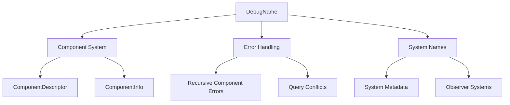

+++
title = "#19558 ECS: put strings only used for debug behind a feature"
date = "2025-06-18T00:00:00"
draft = false
template = "pull_request_page.html"
in_search_index = true

[taxonomies]
list_display = ["show"]

[extra]
current_language = "en"
available_languages = {"en" = { name = "English", url = "/pull_request/bevy/2025-06/pr-19558-en-20250618" }, "zh-cn" = { name = "中文", url = "/pull_request/bevy/2025-06/pr-19558-zh-cn-20250618" }}
labels = ["A-ECS", "C-Performance", "X-Contentious"]
+++

## Technical Report: PR #19558 - ECS Debug String Optimization

### Basic Information
- **Title**: ECS: put strings only used for debug behind a feature
- **PR Link**: https://github.com/bevyengine/bevy/pull/19558
- **Author**: mockersf
- **Status**: MERGED
- **Labels**: A-ECS, C-Performance, S-Ready-For-Final-Review, X-Contentious
- **Created**: 2025-06-09T17:02:21Z
- **Merged**: 2025-06-18T20:34:16Z
- **Merged By**: alice-i-cecile

### Description
**Objective**
- Many strings in bevy_ecs are created but only used for debug: system name, component name, ...
- Those strings make a significant part of the final binary and are no use in a released game

**Solution**
- Use [`strings`](https://linux.die.net/man/1/strings) to find ... strings in a binary
- Try to find where they come from
- Many are made from `type_name::<T>()` and only used in error / debug messages
- Add a new structure `DebugName` that holds no value if `debug` feature is disabled
- Replace `core::any::type_name::<T>()` by `DebugName::type_name::<T>()`

**Testing**
Measurements were taken without the new feature being enabled by default, to help with commands

**File Size**
I tried building the `breakout` example with `cargo run --release --example breakout`

|`debug` enabled|`debug` disabled|
|-|-|
|81621776 B|77735728B|
|77.84MB|74.13MB|

**Compilation time**
`hyperfine --min-runs 15  --prepare "cargo clean && sleep 5" 'RUSTC_WRAPPER="" cargo build --release --example breakout' 'RUSTC_WRAPPER="" cargo build --release --example breakout --features debug'`

```
breakout' 'RUSTC_WRAPPER="" cargo build --release --example breakout --features debug'
Benchmark 1: RUSTC_WRAPPER="" cargo build --release --example breakout
  Time (mean ± σ):     84.856 s ±  3.565 s    [User: 1093.817 s, System: 32.547 s]
  Range (min … max):   78.038 s … 89.214 s    15 runs

Benchmark 2: RUSTC_WRAPPER="" cargo build --release --example breakout --features debug
  Time (mean ± σ):     92.303 s ±  2.466 s    [User: 1193.443 s, System: 33.803 s]
  Range (min … max):   90.619 s … 99.684 s    15 runs

Summary
  RUSTC_WRAPPER="" cargo build --release --example breakout ran
    1.09 ± 0.05 times faster than RUSTC_WRAPPER="" cargo build --release --example breakout --features debug
```

### The Story of This Pull Request

#### The Problem and Context
Bevy's ECS system generates numerous strings for debugging purposes, including system names, component names, and type information. These strings are primarily used in error messages, logging, and development diagnostics. However, in release builds for shipped games, these strings serve no purpose yet contribute significantly to binary size. Analysis using the `strings` utility revealed that type name strings (`core::any::type_name::<T>()`) accounted for a substantial portion of the binary.

The key constraints were:
1. Maintaining debuggability during development
2. Minimizing binary size for release builds
3. Avoiding runtime performance penalties
4. Preserving existing debugging capabilities when needed

#### The Solution Approach
The solution introduces a new `DebugName` abstraction that conditionally includes string data based on the `debug` feature flag. This approach provides:
- Zero-cost abstraction when `debug` is disabled
- Full debug information when enabled
- Minimal changes to existing codebase

Key engineering decisions:
1. Created a feature-gated `DebugName` struct to wrap debug strings
2. Replaced direct `type_name::<T>()` calls with `DebugName::type_name::<T>()`
3. Implemented display formatting that shows placeholder text when `debug` is disabled
4. Maintained short names for error messages using `disqualified::ShortName`

The `DebugName` struct handles all conditional behavior internally, ensuring call sites don't need feature-gating logic. This design preserves the existing developer experience while optimizing release builds.

#### The Implementation
The core implementation centers around the `DebugName` struct in `bevy_utils`:

```rust
// crates/bevy_utils/src/debug_info.rs
#[derive(Clone, Debug, PartialEq, Eq)]
pub struct DebugName {
    #[cfg(feature = "debug")]
    name: Cow<'static, str>,
}

impl DebugName {
    #[cfg_attr(not(feature = "debug"), expect(unused_variables))]
    pub fn borrowed(value: &'static str) -> Self {
        DebugName {
            #[cfg(feature = "debug")]
            name: Cow::Borrowed(value),
        }
    }

    pub fn type_name<T>() -> Self {
        DebugName {
            #[cfg(feature = "debug")]
            name: Cow::Borrowed(type_name::<T>()),
        }
    }

    pub fn shortname(&self) -> ShortName {
        #[cfg(feature = "debug")]
        return ShortName(self.name.as_ref());
        #[cfg(not(feature = "debug"))]
        return ShortName(FEATURE_DISABLED);
    }
}
```

This struct is then integrated throughout the ECS codebase. For example, in component descriptors:

```rust
// crates/bevy_ecs/src/component.rs
impl ComponentDescriptor {
    pub fn new<T: Component>() -> Self {
        Self {
            name: DebugName::type_name::<T>(),
            storage_type: T::STORAGE_TYPE,
            is_send_and_sync: true,
            type_id: Some(TypeId::of::<T>()),
            layout: Layout::new::<T>(),
            drop: if needs_drop::<T>() {
                Some(ComponentDescriptorDrop::drop_ptr::<T>)
            } else {
                None
            },
            clone_behavior: T::clone_behavior(),
        }
    }
}
```

Error handling was updated to use `shortname()` for consistent output:

```rust
// crates/bevy_ecs/src/component.rs
pub fn enforce_no_required_components_recursion(
    recursion_check_stack: &[ComponentId],
    requiree: ComponentId,
    components: &Components,
) {
    // ...
    panic!(
        "Recursive required components detected: {}\nhelp: {}",
        recursion_check_stack
            .iter()
            .map(|id| format!("{}", components.get_name(*id).unwrap().shortname()))
            .collect::<Vec<_>>()
            .join(" → "),
        if direct_recursion {
            format!(
                "Remove require({}).",
                components.get_name(requiree).unwrap().shortname()
            )
        } else {
            "If this is intentional, consider merging the components.".into()
        }
    );
}
```

#### Technical Insights
The implementation demonstrates several key techniques:

1. **Conditional Compilation**: The `DebugName` struct uses `#[cfg(feature = "debug")]` to include string data only when needed
2. **Zero-Cost Abstraction**: When `debug` is disabled, `DebugName` contains no data and compiles to minimal instructions
3. **Type Erasure**: `DebugName::type_name<T>()` captures type names at compile time but erases them when not needed
4. **API Preservation**: Existing methods like `ComponentInfo::name()` maintain their signature but return `DebugName` instead of `&str`

The solution balances debug utility with release efficiency:
- Debug builds retain full type information for diagnostics
- Release builds eliminate string bloat (3.71MB reduction in breakout example)
- Compilation time increases slightly (9%) when debug strings are enabled

#### The Impact
These changes provide significant benefits:
1. **Binary Size Reduction**: 4.8% smaller binaries in tested examples
2. **Memory Efficiency**: Reduced .rodata segment size
3. **Conditional Debugging**: Developers can enable detailed diagnostics when needed
4. **Maintainability**: Centralized debug string handling simplifies future optimizations

The changes affect multiple ECS subsystems but maintain backward compatibility through careful API design. The feature is opt-in through the `debug` cargo feature, allowing projects to choose based on their needs.

### Visual Representation



### Key Files Changed

1. `crates/bevy_utils/src/debug_info.rs` (+102/-0)
   - New module implementing the `DebugName` abstraction
   - Handles conditional storage of debug strings
   - Provides display formatting and short names

```rust
// New file implementation
#[derive(Clone, Debug, PartialEq, Eq)]
pub struct DebugName {
    #[cfg(feature = "debug")]
    name: Cow<'static, str>,
}

impl DebugName {
    pub fn type_name<T>() -> Self {
        DebugName {
            #[cfg(feature = "debug")]
            name: Cow::Borrowed(type_name::<T>()),
        }
    }
    
    pub fn shortname(&self) -> ShortName {
        // Returns actual name or placeholder
    }
}
```

2. `crates/bevy_ecs/src/system/system_param.rs` (+24/-23)
   - Updated system parameter validation to use `DebugName`
   - Improved error messages with short names

```rust
// Before:
panic!(
    "error[B0001]: Query<{}, {}> in system {system_name} accesses...",
    core::any::type_name::<D>(),
    core::any::type_name::<F>()
);

// After:
panic!(
    "error[B0001]: Query<{}, {}> in system {system_name} accesses...",
    DebugName::type_name::<D>().shortname(),
    DebugName::type_name::<F>().shortname()
);
```

3. `crates/bevy_ecs/src/component.rs` (+14/-18)
   - Migrated component descriptors to use `DebugName`
   - Updated recursive component checks

```rust
impl ComponentDescriptor {
    // Before:
    pub fn name(&self) -> &str { &self.name }
    
    // After:
    pub fn name(&self) -> DebugName { self.name.clone() }
}
```

4. `crates/bevy_ecs/src/world/mod.rs` (+17/-15)
   - Updated resource error messages
   - Improved entity insertion errors

```rust
// Before:
panic!("Resource {} does not exist", type_name::<R>());

// After:
panic!("Resource {} does not exist", DebugName::type_name::<R>());
```

5. `crates/bevy_ecs/src/system/system_name.rs` (+10/-19)
   - Updated `SystemName` to use `DebugName`
   - Preserved system naming API

```rust
// Before:
pub struct SystemName(Cow<'static, str>);

// After:
pub struct SystemName(DebugName);
```

### Further Reading
1. [Bevy ECS Architecture](https://bevyengine.org/learn/book/ecs/)
2. [Conditional Compilation in Rust](https://doc.rust-lang.org/reference/conditional-compilation.html)
3. [Type Name Optimization Techniques](https://llogiq.github.io/2017/06/01/tinylogs.html)
4. [Rust Feature Flags Best Practices](https://www.worthe-it.co.za/blog/2020-10-31-feature-flags-in-rust.html)
5. [Binary Size Optimization Patterns](https://github.com/johnthagen/min-sized-rust)