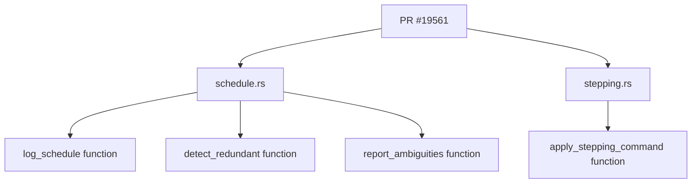

+++
title = "#19561 Fix uninlined format argument lint"
date = "2025-06-09T00:00:00"
draft = false
template = "pull_request_page.html"
in_search_index = true

[taxonomies]
list_display = ["show"]

[extra]
current_language = "en"
available_languages = {"en" = { name = "English", url = "/pull_request/bevy/2025-06/pr-19561-en-20250609" }, "zh-cn" = { name = "中文", url = "/pull_request/bevy/2025-06/pr-19561-zh-cn-20250609" }}
labels = ["D-Trivial", "C-Code-Quality"]
+++

# Fix uninlined format argument lint

## Basic Information
- **Title**: Fix uninlined format argument lint
- **PR Link**: https://github.com/bevyengine/bevy/pull/19561
- **Author**: ZioKli
- **Status**: MERGED
- **Labels**: D-Trivial, C-Code-Quality, S-Ready-For-Final-Review
- **Created**: 2025-06-09T20:34:12Z
- **Merged**: 2025-06-09T21:11:26Z
- **Merged By**: alice-i-cecile

## Description Translation
# Objective  
Fixes #19370  

## Solution  
Implemented the lint as suggested by clippy.  

## Testing  
CI tests passed and lint was resolved.  

## The Story of This Pull Request

The PR addresses lint warnings from Clippy about uninlined format arguments. These warnings occur when using the `format!` macro without directly embedding variables in the format string, which can reduce readability and potentially impact performance. The issue (#19370) specifically identified several instances in Bevy's ECS scheduling code where logs and warnings used the older `"{}"` syntax instead of the preferred `"{variable}"` inline syntax.

The solution implemented is straightforward: update all identified logging statements to use Rust's inline variable formatting syntax. This change doesn't alter functionality but improves code quality by adhering to modern Rust conventions. The changes are localized to logging statements in two files within Bevy's ECS scheduling system.

In `schedule.rs`, three logging statements were updated:
1. A schedule information log in `log_schedule`
2. An error about redundant edges in `detect_redundant`
3. A warning about schedule ambiguities in `report_ambiguities`

In `stepping.rs`, four warnings within the `apply_stepping_command` function were updated. These warnings notify developers when stepping functionality is used without proper initialization. By inlining the `label` variable, the messages become more concise while maintaining their diagnostic value.

The changes required minimal modifications - just 9 lines removed and 9 added across both files. The implementation follows Clippy's recommendations precisely, demonstrating how automated linting tools can efficiently guide code quality improvements. Since these are logging changes, they don't affect core functionality but make the codebase more consistent and maintainable.

## Visual Representation



## Key Files Changed

### `crates/bevy_ecs/src/schedule/schedule.rs`
Updated logging statements to use inline variable formatting for better readability and consistency with Rust conventions.

**Changes:**
```rust
// Before:
info!("{}", message);
error!("Schedule {schedule_label:?} has redundant edges:\n {}", message);
warn!("Schedule {schedule_label:?} has ambiguities.\n{}", message);

// After:
info!("{message}");
error!("Schedule {schedule_label:?} has redundant edges:\n {message}");
warn!("Schedule {schedule_label:?} has ambiguities.\n{message}");
```

### `crates/bevy_ecs/src/schedule/stepping.rs`
Consolidated stepping warning messages by inlining the `label` variable, eliminating redundant format arguments.

**Changes:**
```rust
// Before:
warn!(
    "stepping is not enabled for schedule {:?}; \
    use `.add_stepping({:?})` to enable stepping",
    label, label
);

// After:
warn!(
    "stepping is not enabled for schedule {label:?}; \
    use `.add_stepping({label:?})` to enable stepping"
);
```

## Full Code Diff
```diff
diff --git a/crates/bevy_ecs/src/schedule/schedule.rs b/crates/bevy_ecs/src/schedule/schedule.rs
index 2d559db1dd85c..d7d8584083ffc 100644
--- a/crates/bevy_ecs/src/schedule/schedule.rs
+++ b/crates/bevy_ecs/src/schedule/schedule.rs
@@ -166,7 +166,7 @@ impl Schedules {
             writeln!(message, "{}", components.get_name(*id).unwrap()).unwrap();
         }
 
-        info!("{}", message);
+        info!("{message}");
     }
 
     /// Adds one or more systems to the [`Schedule`] matching the provided [`ScheduleLabel`].
@@ -1705,10 +1705,7 @@ impl ScheduleGraph {
         match self.settings.hierarchy_detection {
             LogLevel::Ignore => unreachable!(),
             LogLevel::Warn => {
-                error!(
-                    "Schedule {schedule_label:?} has redundant edges:\n {}",
-                    message
-                );
+                error!("Schedule {schedule_label:?} has redundant edges:\n {message}");
                 Ok(())
             }
             LogLevel::Error => Err(ScheduleBuildError::HierarchyRedundancy(message)),
@@ -1910,7 +1907,7 @@ impl ScheduleGraph {
         match self.settings.ambiguity_detection {
             LogLevel::Ignore => Ok(()),
             LogLevel::Warn => {
-                warn!("Schedule {schedule_label:?} has ambiguities.\n{}", message);
+                warn!("Schedule {schedule_label:?} has ambiguities.\n{message}");
                 Ok(())
             }
             LogLevel::Error => Err(ScheduleBuildError::Ambiguity(message)),
diff --git a/crates/bevy_ecs/src/schedule/stepping.rs b/crates/bevy_ecs/src/schedule/stepping.rs
index 222dfdfcafe15..b6de7c8215463 100644
--- a/crates/bevy_ecs/src/schedule/stepping.rs
+++ b/crates/bevy_ecs/src/schedule/stepping.rs
@@ -475,9 +475,8 @@ impl Stepping {
                     Some(state) => state.clear_behaviors(),
                     None => {
                         warn!(
-                            "stepping is not enabled for schedule {:?}; \
-                            use `.add_stepping({:?})` to enable stepping",
-                            label, label
+                            "stepping is not enabled for schedule {label:?}; \
+                            use `.add_stepping({label:?})` to enable stepping"
                         );
                     }
                 },
@@ -486,9 +485,8 @@ impl Stepping {
                         Some(state) => state.set_behavior(system, behavior),
                         None => {
                             warn!(
-                                "stepping is not enabled for schedule {:?}; \
-                                use `.add_stepping({:?})` to enable stepping",
-                                label, label
+                                "stepping is not enabled for schedule {label:?}; \
+                                use `.add_stepping({label:?})` to enable stepping"
                             );
                         }
                     }
@@ -498,9 +496,8 @@ impl Stepping {
                         Some(state) => state.clear_behavior(system),
                         None => {
                             warn!(
-                                "stepping is not enabled for schedule {:?}; \
-                                use `.add_stepping({:?})` to enable stepping",
-                                label, label
+                                "stepping is not enabled for schedule {label:?}; \
+                                use `.add_stepping({label:?})` to enable stepping"
                             );
                         }
                     }
```