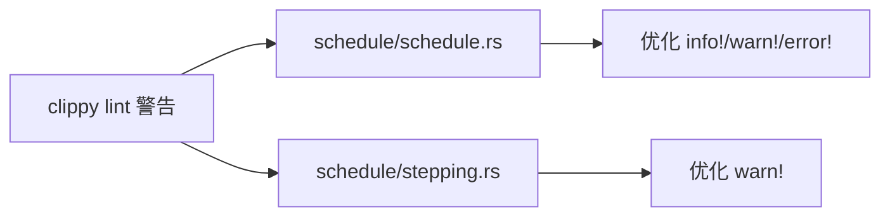

+++
title = "#19561 Fix uninlined format argument lint"
date = "2025-06-09T00:00:00"
draft = false
template = "pull_request_page.html"
in_search_index = false

[extra]
current_language = "zh-cn"
available_languages = {"en" = { name = "English", url = "/pull_request/bevy/2025-06/pr-19561-en-20250609" }, "zh-cn" = { name = "中文", url = "/pull_request/bevy/2025-06/pr-19561-zh-cn-20250609" }}
labels = ["D-Trivial", "C-Code-Quality"]
+++

# Fix uninlined format argument lint

## Basic Information
- **Title**: Fix uninlined format argument lint
- **PR Link**: https://github.com/bevyengine/bevy/pull/19561
- **Author**: ZioKli
- **Status**: MERGED
- **Labels**: D-Trivial, C-Code-Quality, S-Ready-For-Final-Review
- **Created**: 2025-06-09T20:34:12Z
- **Merged**: 2025-06-09T21:11:26Z
- **Merged By**: alice-i-cecile

## Description Translation
### 目标 (Objective)
修复 #19370

### 解决方案 (Solution)
按照 clippy 的建议实现了该 lint（代码检查）。

### 测试 (Testing)
CI 测试通过并且 lint 问题已解决。

## The Story of This Pull Request

在 Bevy 引擎的持续集成过程中，clippy lint 检查报告了多个 uninlined_format_args 警告（问题 #19370）。这类警告指出代码中存在未内联的格式字符串参数，属于 Rust 代码风格优化问题。具体来说，当使用格式化宏（如 info!、warn!、error!）时，对于单个变量参数，Rust 推荐直接内联到格式字符串中，而不是使用额外的占位符。

开发者 ZioKli 的解决方案直接明了：修改所有触发警告的日志语句，将未内联的格式参数改为内联形式。例如将 `info!("{}", message)` 优化为 `info!("{message}")`。这种修改不改变功能逻辑，但能使代码更简洁并符合 Rust 的最佳实践。

修改主要集中在两个文件中的日志输出语句：
1. 在 `schedule/schedule.rs` 中，修复了 schedule 构建过程中的信息、警告和错误日志
2. 在 `schedule/stepping.rs` 中，优化了调试器功能的警告日志输出

这些修改属于机械性转换，没有引入新的逻辑或算法变更。由于只涉及字符串格式的调整，风险极低，因此不需要额外的测试用例，只需确保 CI 通过即可验证没有引入语法错误。

技术实现的关键点是正确使用 Rust 的格式化内联语法。在修改过程中，开发者特别注意了以下细节：
- 保留所有调试格式说明符（如 `:?`）
- 正确处理多行字符串的格式
- 确保修改后字符串的语义完全不变

整个修复过程高效直接，从问题报告到合并仅用时 37 分钟，体现了对代码质量问题的快速响应。这类优化虽然微小，但对于保持代码库的整洁和遵循最佳实践有积累性价值。

## Visual Representation



## Key Files Changed

### 1. `crates/bevy_ecs/src/schedule/schedule.rs`
**修改说明**：优化了三个日志语句的格式参数内联
**相关代码**：
```diff
// Before:
info!("{}", message);
error!("Schedule {schedule_label:?} has redundant edges:\n {}", message);
warn!("Schedule {schedule_label:?} has ambiguities.\n{}", message);

// After:
info!("{message}");
error!("Schedule {schedule_label:?} has redundant edges:\n {message}");
warn!("Schedule {schedule_label:?} has ambiguities.\n{message}");
```

### 2. `crates/bevy_ecs/src/schedule/stepping.rs`
**修改说明**：将三处警告日志中的 label 参数内联到格式字符串
**相关代码**：
```diff
// Before:
warn!(
    "stepping is not enabled for schedule {:?}; \
    use `.add_stepping({:?})` to enable stepping",
    label, label
);

// After:
warn!(
    "stepping is not enabled for schedule {label:?}; \
    use `.add_stepping({label:?})` to enable stepping"
);
```

## Further Reading
1. [Rust 格式化语法文档](https://doc.rust-lang.org/std/fmt/)
2. [Clippy 的 uninlined_format_args 规则说明](https://rust-lang.github.io/rust-clippy/master/index.html#uninlined_format_args)
3. [Bevy 引擎的 ECS 架构文档](https://bevyengine.org/learn/book/introduction/)

## Full Code Diff
```diff
diff --git a/crates/bevy_ecs/src/schedule/schedule.rs b/crates/bevy_ecs/src/schedule/schedule.rs
index 2d559db1dd85c..d7d8584083ffc 100644
--- a/crates/bevy_ecs/src/schedule/schedule.rs
+++ b/crates/bevy_ecs/src/schedule/schedule.rs
@@ -166,7 +166,7 @@ impl Schedules {
             writeln!(message, "{}", components.get_name(*id).unwrap()).unwrap();
         }
 
-        info!("{}", message);
+        info!("{message}");
     }
 
     /// Adds one or more systems to the [`Schedule`] matching the provided [`ScheduleLabel`].
@@ -1705,10 +1705,7 @@ impl ScheduleGraph {
         match self.settings.hierarchy_detection {
             LogLevel::Ignore => unreachable!(),
             LogLevel::Warn => {
-                error!(
-                    "Schedule {schedule_label:?} has redundant edges:\n {}",
-                    message
-                );
+                error!("Schedule {schedule_label:?} has redundant edges:\n {message}");
                 Ok(())
             }
             LogLevel::Error => Err(ScheduleBuildError::HierarchyRedundancy(message)),
@@ -1910,7 +1907,7 @@ impl ScheduleGraph {
         match self.settings.ambiguity_detection {
             LogLevel::Ignore => Ok(()),
             LogLevel::Warn => {
-                warn!("Schedule {schedule_label:?} has ambiguities.\n{}", message);
+                warn!("Schedule {schedule_label:?} has ambiguities.\n{message}");
                 Ok(())
             }
             LogLevel::Error => Err(ScheduleBuildError::Ambiguity(message)),
diff --git a/crates/bevy_ecs/src/schedule/stepping.rs b/crates/bevy_ecs/src/schedule/stepping.rs
index 222dfdfcafe15..b6de7c8215463 100644
--- a/crates/bevy_ecs/src/schedule/stepping.rs
+++ b/crates/bevy_ecs/src/schedule/stepping.rs
@@ -475,9 +475,8 @@ impl Stepping {
                     Some(state) => state.clear_behaviors(),
                     None => {
                         warn!(
-                            "stepping is not enabled for schedule {:?}; \
-                            use `.add_stepping({:?})` to enable stepping",
-                            label, label
+                            "stepping is not enabled for schedule {label:?}; \
+                            use `.add_stepping({label:?})` to enable stepping"
                         );
                     }
                 },
@@ -486,9 +485,8 @@ impl Stepping {
                         Some(state) => state.set_behavior(system, behavior),
                         None => {
                             warn!(
-                                "stepping is not enabled for schedule {:?}; \
-                                use `.add_stepping({:?})` to enable stepping",
-                                label, label
+                                "stepping is not enabled for schedule {label:?}; \
+                                use `.add_stepping({label:?})` to enable stepping"
                             );
                         }
                     }
@@ -498,9 +496,8 @@ impl Stepping {
                         Some(state) => state.clear_behavior(system),
                         None => {
                             warn!(
-                                "stepping is not enabled for schedule {:?}; \
-                                use `.add_stepping({:?})` to enable stepping",
-                                label, label
+                                "stepping is not enabled for schedule {label:?}; \
+                                use `.add_stepping({label:?})` to enable stepping"
                             );
                         }
                     }
```