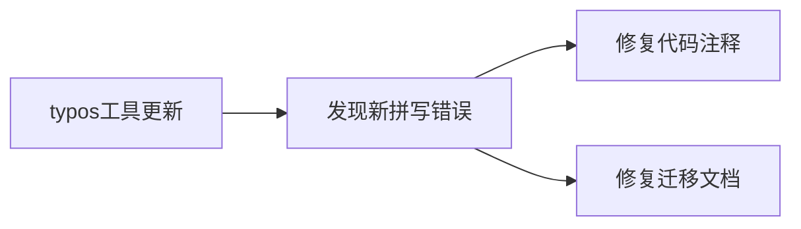

+++
title = "#19562 Fix new typos"
date = "2025-06-09T00:00:00"
draft = false
template = "pull_request_page.html"
in_search_index = false

[extra]
current_language = "zh-cn"
available_languages = {"en" = { name = "English", url = "/pull_request/bevy/2025-06/pr-19562-en-20250609" }, "zh-cn" = { name = "中文", url = "/pull_request/bevy/2025-06/pr-19562-zh-cn-20250609" }}
+++

# Fix new typos

## 基本信息
- **标题**: Fix new typos
- **PR链接**: https://github.com/bevyengine/bevy/pull/19562
- **作者**: hukasu
- **状态**: 已合并
- **标签**: 无
- **创建时间**: 2025-06-09T22:37:26Z
- **合并时间**: 2025-06-09T23:13:43Z
- **合并者**: mockersf

## 描述翻译
### 目标
修复在新版本`typos`(#19551)中发现的新拼写错误

### 解决方案
修复拼写错误

## 本PR的技术背景

本次PR源于项目引入新版本`typos`拼写检查工具后(#19551)发现的几个拼写错误。作为常规维护工作，hukasu提交了这些简单的修正。这些错误虽然不影响代码功能，但会影响文档可读性和API注释的准确性。

在`bevy_ecs`核心模块中，一个关键注释存在拼写错误"regiserted"，可能误导开发者理解组件注册逻辑。两个迁移指南文档中也存在拼写错误："prioretizes"和"despawing"，这些错误会影响用户理解版本迁移说明。所有修正都是直接替换错误拼写为正确形式，没有涉及任何功能变更或架构调整。

## 视觉表示


## 关键文件更改

### 1. `crates/bevy_ecs/src/component.rs`
**修改原因**: 修复组件元数据访问注释中的拼写错误  
**变更说明**: 将"regiserted"修正为"registered"，确保API文档准确性

```rust
// Before:
/// This will return `None` if the id is not regiserted or is queued.

// After:
/// This will return `None` if the id is not registered or is queued.
```

### 2. `release-content/migration-guides/entity_representation.md`
**修改原因**: 修正实体排序行为描述中的拼写错误  
**变更说明**: 将"prioretizes"修正为"prioritizes"

```markdown
// Before:
For entity ordering, the order still prioretizes an entity's generation

// After:
For entity ordering, the order still prioritizes an entity's generation
```

### 3. `release-content/migration-guides/remove_deprecated_batch_spawning.md`
**修改原因**: 修复批量生成迁移指南中的拼写错误  
**变更说明**: 将"despawing"修正为"despawning"

```markdown
// Before:
Option A) Instead of despawing entities, insert the `Disabled` component

// After:
Option A) Instead of despawning entities, insert the `Disabled` component
```

## 技术影响与最佳实践

本次PR展示了三个值得注意的工程实践：
1. **自动化工具集成**：通过`typos`等静态检查工具持续捕获文档和注释问题
2. **及时修正**：在问题引入后快速响应修复，避免错误传播
3. **精确修改**：最小化变更范围，仅修改必要部分而不影响功能

虽然拼写修正看似简单，但在大型开源项目中：
- 准确的文档可降低新贡献者入门门槛
- 一致的术语使用有助于知识传递
- API注释错误可能导致开发者误解系统行为

## 延伸阅读
1. [typos项目](https://github.com/crate-ci/typos) - Rust生态的拼写检查工具
2. [PR #19551](https://github.com/bevyengine/bevy/pull/19551) - 引入新版本typos工具的原始PR
3. [Bevy贡献指南](https://github.com/bevyengine/bevy/blob/main/CONTRIBUTING.md) - 项目贡献规范