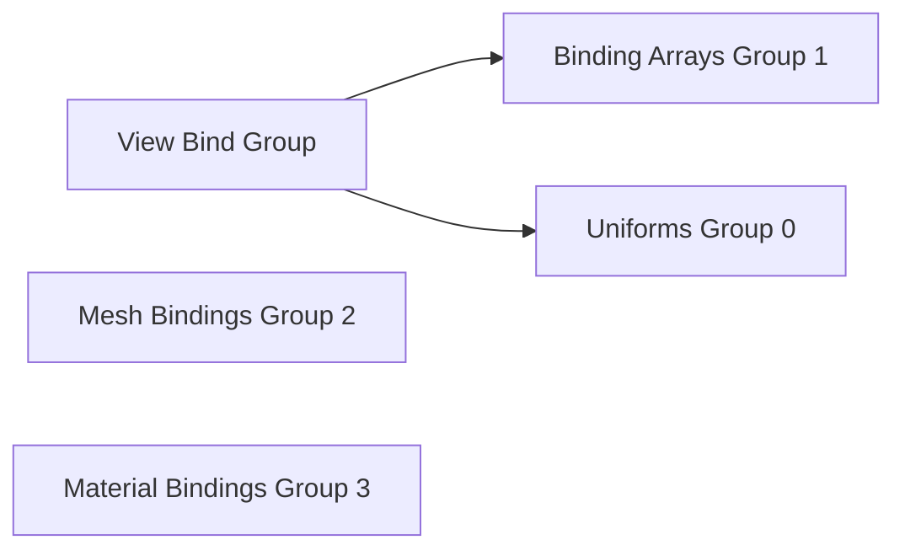

+++
title = "#19563 Ugrade to `wgpu` version `25.0`"
date = "2025-06-26T00:00:00"
draft = false
template = "pull_request_page.html"
in_search_index = true

[taxonomies]
list_display = ["show"]

[extra]
current_language = "en"
available_languages = {"en" = { name = "English", url = "/pull_request/bevy/2025-06/pr-19563-en-20250626" }, "zh-cn" = { name = "中文", url = "/pull_request/bevy/2025-06/pr-19563-zh-cn-20250626" }}
labels = ["A-Rendering"]
+++

# Upgrade to `wgpu` version `25.0` Analysis

## Basic Information
- **Title**: Ugrade to `wgpu` version `25.0`
- **PR Link**: https://github.com/bevyengine/bevy/pull/19563
- **Author**: tychedelia
- **Status**: MERGED
- **Labels**: A-Rendering, M-Needs-Migration-Guide, S-Needs-Review
- **Created**: 2025-06-09T22:41:08Z
- **Merged**: 2025-06-26T20:02:14Z
- **Merged By**: alice-i-cecile

## Description Translation
# Objective

Upgrade to `wgpu` version `25.0`.

Depends on https://github.com/bevyengine/naga_oil/pull/121

## Solution

### Problem

The biggest issue we face upgrading is the following requirement:
> To facilitate this change, there was an additional validation rule put in place: if there is a binding array in a bind group, you may not use dynamic offset buffers or uniform buffers in that bind group. This requirement comes from vulkan rules on UpdateAfterBind descriptors.

This is a major difficulty for us, as there are a number of binding arrays that are used in the view bind group. Note, this requirement does not affect merely uniform buffors that use dynamic offset but the use of *any* uniform in a bind group that also has a binding array.

### Attempted fixes

The easiest fix would be to change uniforms to be storage buffers whenever binding arrays are in use:
```wgsl
#ifdef BINDING_ARRAYS_ARE_USED
@group(0) @binding(0) var<uniform> view: View;
@group(0) @binding(1) var<uniform> lights: types::Lights;
#else
@group(0) @binding(0) var<storage> view: array<View>;
@group(0) @binding(1) var<storage> lights: array<types::Lights>;
#endif
```

This requires passing the view index to the shader so that we know where to index into the buffer:

```wgsl
struct PushConstants {
    view_index: u32,
}

var<push_constant> push_constants: PushConstants;
```

Using push constants is no problem because binding arrays are only usable on native anyway.

However, this greatly complicates the ability to access `view` in shaders. For example:
```wgsl
#ifdef BINDING_ARRAYS_ARE_USED
mesh_view_bindings::view.view_from_world[0].z
#else
mesh_view_bindings::view[mesh_view_bindings::view_index].view_from_world[0].z
#endif
```

Using this approach would work but would have the effect of polluting our shaders with ifdef spam basically *everywhere*.

Why not use a function? Unfortunately, the following is not valid wgsl as it returns a binding directly from a function in the uniform path.

```wgsl
fn get_view() -> View {
#if BINDING_ARRAYS_ARE_USED
    let view_index = push_constants.view_index;
    let view = views[view_index];
#endif
    return view;
}
```

This also poses problems for things like lights where we want to return a ptr to the light data. Returning ptrs from wgsl functions isn't allowed even if both bindings were buffers.

The next attempt was to simply use indexed buffers everywhere, in both the binding array and non binding array path. This would be viable if push constants were available everywhere to pass the view index, but unfortunately they are not available on webgpu. This means either passing the view index in a storage buffer (not ideal for such a small amount of state) or using push constants sometimes and uniform buffers only on webgpu. However, this kind of conditional layout infects absolutely everything.

Even if we were to accept just using storage buffer for the view index, there's also the additional problem that some dynamic offsets aren't actually per-view but per-use of a setting on a camera, which would require passing that uniform data on *every* camera regardless of whether that rendering feature is being used, which is also gross.

As such, although it's gross, the simplest solution just to bump binding arrays into `@group(1)` and all other bindings up one bind group. This should still bring us under the device limit of 4 for most users.

### Next steps / looking towards the future

I'd like to avoid needing split our view bind group into multiple parts. In the future, if `wgpu` were to add `@builtin(draw_index)`, we could build a list of draw state in gpu processing and avoid the need for any kind of state change at all (see https://github.com/gfx-rs/wgpu/issues/6823). This would also provide significantly more flexibility to handle things like offsets into other arrays that may not be per-view.

### Testing

Tested a number of examples, there are probably more that are still broken.

## The Story of This Pull Request

### The Problem and Context
The upgrade to `wgpu` 25.0 introduced a new validation rule: binding arrays cannot coexist with uniform buffers or dynamic offset buffers in the same bind group. This rule stems from Vulkan's UpdateAfterBind descriptor requirements. Since Bevy's view bind group extensively uses both binding arrays and uniforms, this change presented a significant compatibility challenge.

### The Solution Approach
Several approaches were considered:
1. **Conditional storage buffers**: Convert uniforms to storage buffers when binding arrays are present
   - Required passing view indices via push constants
   - Introduced pervasive `#ifdef` logic in shaders
   - Not viable due to shader complexity and platform limitations
2. **Indexed buffers everywhere**: Use storage buffers for view data in all cases
   - Limited by WebGPU's lack of push constant support
   - Would require per-camera uniform data passing

The chosen solution reorganizes bind groups:
- Binding arrays moved to `@group(1)`
- Mesh bindings shifted to `@group(2)`
- Material bindings shifted to `@group(3)`

This maintains compatibility with device limitations (most devices support at least 4 bind groups) while avoiding the shader complexity of other approaches.

### The Implementation
The implementation required coordinated changes across multiple systems:

1. **View bind group reorganization**:
   - Split into two bind groups: `main` (uniforms) and `binding_array` (binding arrays)
   - Added empty bind group for padding where needed
   ```rust
   pub struct MeshPipelineViewLayout {
       pub main_layout: BindGroupLayout,
       pub binding_array_layout: BindGroupLayout,
       pub empty_layout: BindGroupLayout,
   }
   ```

2. **Render pass adjustments**:
   - Updated bind group indices in all rendering pipelines
   - Added new `SetMeshViewBindingArrayBindGroup` and `SetMeshViewEmptyBindGroup` commands
   ```rust
   render_pass.set_bind_group(0, &mesh_view_bind_group.main, &offsets);
   render_pass.set_bind_group(1, &mesh_view_bind_group.binding_array, &[]);
   ```

3. **Shader updates**:
   - Modified group indices for all affected resources
   ```wgsl
   // Before:
   @group(0) @binding(17) var diffuse_environment_map: texture_cube<f32>;
   
   // After:
   @group(1) @binding(0) var diffuse_environment_map: texture_cube<f32>;
   ```

4. **Material system changes**:
   - Updated material bind groups from group 2 to group 3
   ```rust
   descriptor.layout.insert(3, self.material_layout.clone());
   ```

### Technical Insights
Key technical considerations:
- Maintained backward compatibility for most user-facing APIs
- Minimized shader changes through systematic group renumbering
- Ensured WebGL compatibility by preserving fallback paths
- Addressed new `wgpu` limitations around shader constants:
  ```wgsl
  // Now required
  const FOO: f32 = 1.0;
  
  // No longer allowed
  const FOO = 1.0;
  ```

### The Impact
The changes:
1. Resolve compatibility with `wgpu` 25.0
2. Maintain rendering performance by avoiding expensive shader branching
3. Require updates to custom materials:
   - Group indices increased by 1 (e.g., `@group(2)` → `@group(3)`)
4. Introduce minor complexity in render graph organization

The solution provides a foundation for future improvements like draw-indexed rendering while maintaining Bevy's rendering capabilities across all supported platforms.

## Visual Representation



## Key Files Changed

### `crates/bevy_pbr/src/render/mesh_view_bindings.rs` (+161/-119)
Reorganized view bind groups into separate layouts for main uniforms and binding arrays.

**Key changes:**
```rust
// Before:
pub struct MeshPipelineViewLayout {
    pub bind_group_layout: BindGroupLayout,
}

// After:
pub struct MeshPipelineViewLayout {
    pub main_layout: BindGroupLayout,
    pub binding_array_layout: BindGroupLayout,
    pub empty_layout: BindGroupLayout,
}
```

### `crates/bevy_pbr/src/render/mesh_view_bindings.wgsl` (+39/-39)
Updated binding locations for all resources affected by group reorganization.

**Example change:**
```wgsl
// Before:
@group(0) @binding(17) var diffuse_environment_map: texture_cube<f32>;

// After:
@group(1) @binding(0) var diffuse_environment_map: texture_cube<f32>;
```

### `crates/bevy_pbr/src/prepass/mod.rs` (+56/-13)
Adjusted prepass pipelines to use new bind group structure.

**Key addition:**
```rust
pub struct SetPrepassViewEmptyBindGroup<const I: usize>;

impl<P: PhaseItem, const I: usize> RenderCommand<P> for SetPrepassViewEmptyBindGroup<I> {
    // Implementation sets empty bind group at specified index
}
```

### `crates/bevy_pbr/src/render/pbr_bindings.wgsl` (+33/-33)
Updated material binding locations from group 2 to group 3.

**Example change:**
```wgsl
// Before:
@group(2) @binding(0) var<uniform> material: StandardMaterial;

// After:
@group(3) @binding(0) var<uniform> material: StandardMaterial;
```

### `crates/bevy_pbr/src/render/mesh.rs` (+50/-3)
Added new render commands for binding array and empty bind groups.

**New commands:**
```rust
pub struct SetMeshViewBindingArrayBindGroup<const I: usize>;
pub struct SetMeshViewEmptyBindGroup<const I: usize>;
```

## Further Reading
- [`wgpu` 25.0 Changelog](https://github.com/gfx-rs/wgpu/blob/trunk/CHANGELOG.md#v2500-2025-04-10)
- [Vulkan UpdateAfterBind Specification](https://www.khronos.org/registry/vulkan/specs/1.3-extensions/html/vkspec.html#features-descriptorIndexing)
- [WebGPU Binding Model Documentation](https://gpuweb.github.io/gpuweb/#abstract-bindings-model)