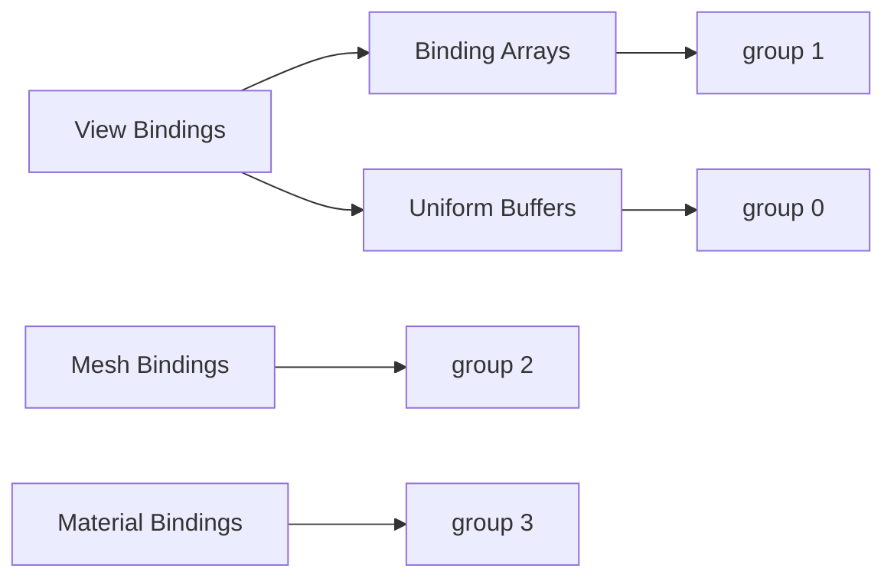

+++
title = "#19563 Ugrade to `wgpu` version `25.0"
date = "2025-06-26T00:00:00"
draft = false
template = "pull_request_page.html"
in_search_index = false

[extra]
current_language = "zh-cn"
available_languages = {"en" = { name = "English", url = "/pull_request/bevy/2025-06/pr-19563-en-20250626" }, "zh-cn" = { name = "中文", url = "/pull_request/bevy/2025-06/pr-19563-zh-cn-20250626" }}
+++

# 升级到 wgpu 25.0 的技术分析报告

## 基本信息
- **标题**: Ugrade to `wgpu` version `25.0`
- **PR 链接**: https://github.com/bevyengine/bevy/pull/19563
- **作者**: tychedelia
- **状态**: MERGED
- **标签**: A-Rendering, M-Needs-Migration-Guide, S-Needs-Review
- **创建时间**: 2025-06-09T22:41:08Z
- **合并时间**: 2025-06-26T20:02:14Z
- **合并者**: alice-i-cecile

## 描述翻译
### 目标
升级到 `wgpu` 版本 `25.0`。

依赖 https://github.com/bevyengine/naga_oil/pull/121

### 解决方案

#### 问题
升级面临的最大问题是新的验证规则：
> 为了支持此变更，增加了一条额外的验证规则：如果绑定组中存在绑定数组，则该绑定组中不能使用动态偏移缓冲区或 uniform 缓冲区。此要求来自 Vulkan 关于 UpdateAfterBind 描述符的规则。

这对我们是一个主要困难，因为视图绑定组中使用了多个绑定数组。注意，此要求不仅影响使用动态偏移的 uniform 缓冲区，而是影响**任何**在同时包含绑定数组的绑定组中使用 uniform 的情况。

#### 尝试的修复方案
最简单的修复是在使用绑定数组时将 uniform 改为存储缓冲区：
```wgsl
#ifdef BINDING_ARRAYS_ARE_USED
@group(0) @binding(0) var<uniform> view: View;
@group(0) @binding(1) var<uniform> lights: types::Lights;
#else
@group(0) @binding(0) var<storage> view: array<View>;
@group(0) @binding(1) var<storage> lights: array<types::Lights>;
#endif
```

这需要将视图索引传递给着色器：
```wgsl
struct PushConstants {
    view_index: u32,
}

var<push_constant> push_constants: PushConstants;
```

使用 push constants 没有问题，因为绑定数组只能在原生平台上使用。

然而，这大大复杂化了在着色器中访问 `view` 的方式：
```wgsl
#ifdef BINDING_ARRAYS_ARE_USED
mesh_view_bindings::view.view_from_world[0].z
#else
mesh_view_bindings::view[mesh_view_bindings::view_index].view_from_world[0].z
#endif
```

这种方法可行但会导致着色器中充满条件编译语句。

为什么不使用函数？不幸的是，以下在 uniform 路径中返回绑定的 WGSL 无效：
```wgsl
fn get_view() -> View {
#if BINDING_ARRAYS_ARE_USED
    let view_index = push_constants.view_index;
    let view = views[view_index];
#endif
    return view;
}
```

对于灯光等需要返回指向数据指针的情况也有问题，WGSL 不允许从函数返回指针。

下一个尝试是在所有路径中使用索引缓冲区。如果 push constants 可用则可行，但 WebGPU 不支持。这意味着要么在存储缓冲区中传递视图索引（不理想），要么在 WebGPU 上使用混合布局。这种条件布局会污染所有代码。

即使接受存储缓冲区方案，还存在动态偏移不是按视图而是按相机设置的问题，需要在每个相机上传递 uniform 数据，这也不理想。

因此，虽然不够优雅，最简单的解决方案是将绑定数组移到 `@group(1)` 并将其他绑定提升一个组。这应该仍能使我们保持在设备限制（4组）内。

#### 后续步骤/展望未来
希望避免拆分视图绑定组。如果未来 `wgpu` 添加 `@builtin(draw_index)`，可以在 GPU 处理中构建绘制状态列表，完全避免状态更改（见 https://github.com/gfx-rs/wgpu/issues/6823）。

#### 测试
测试了多个示例，可能仍有部分未修复。

## 这个 PR 的故事

### 问题和背景
PR #19563 的核心目标是升级 Bevy 的渲染后端到 wgpu 25.0。这个升级引入了关键限制：绑定组中如果包含绑定数组，就不能再使用动态偏移缓冲区或 uniform 缓冲区。这个限制源于 Vulkan 的 UpdateAfterBind 规则，wgpu 25.0 开始强制执行。

在 Bevy 的渲染架构中，视图绑定组（view bind group）广泛使用了绑定数组（如环境贴图、辐照体积、聚簇贴花等）。同时，视图绑定组也使用 uniform 缓冲区存储视图矩阵、光照参数等数据。这两个特性在 wgpu 25.0 中无法共存，导致升级受阻。

### 解决方案方法
开发者探索了多种技术方案：
1. **条件编译方案**：使用 `#ifdef` 在绑定数组存在时切换为存储缓冲区
   ```wgsl
   #ifdef BINDING_ARRAYS_ARE_USED
   @group(0) @binding(0) var<storage> view: array<View>;
   #else
   @group(0) @binding(0) var<uniform> view: View;
   #endif
   ```
   需要传递视图索引：
   ```wgsl
   struct PushConstants { view_index: u32; }
   var<push_constant> push_constants: PushConstants;
   ```
   **问题**：导致着色器代码充斥条件语句，可读性和维护性差，且 WebGPU 不支持 push constants

2. **统一索引方案**：始终使用索引访问视图数据
   **问题**：Web 平台兼容性差，且非视图相关的 uniform 数据（如相机设置）需要额外处理

3. **绑定组重组方案**：将绑定数组移到单独的绑定组
   - 绑定数组 → `@group(1)`
   - 视图资源 → `@group(0)`
   - 网格资源 → `@group(2)`
   - 材质资源 → `@group(3)`

最终采用方案 3，因为它：
- 满足 wgpu 25.0 的约束条件
- 保持着色器代码相对干净
- 兼容 Web 平台
- 大多数设备支持至少 4 个绑定组

### 实现细节
#### 绑定组架构重构


#### 关键变更
1. **视图绑定组拆分**：
   - `group(0)`：核心视图资源（uniform 缓冲区）
   - `group(1)`：绑定数组资源（环境贴图、辐照体积等）

2. **着色器绑定调整**：
   ```wgsl
   // 之前
   @group(0) @binding(17) var diffuse_environment_map: texture_cube<f32>;
   
   // 之后
   @group(1) @binding(0) var diffuse_environment_map: texture_cube<f32>;
   ```

3. **空绑定组支持**：
   ```rust
   pub struct MeshViewBindGroup {
       pub main: BindGroup,          // 主绑定组 (group 0)
       pub binding_array: BindGroup, // 绑定数组组 (group 1)
       pub empty: BindGroup,         // 空绑定组占位
   }
   ```

4. **渲染管线更新**：
   ```rust
   render_pass.set_bind_group(0, &mesh_view_bind_group.main, &offsets);
   render_pass.set_bind_group(1, &mesh_view_bind_group.binding_array, &[]);
   ```

### 技术洞察
1. **绑定数组限制**：wgpu 25.0 禁止在绑定数组所在的绑定组中使用动态偏移或 uniform 缓冲区，这是 Vulkan 兼容性要求
   
2. **架构影响**：
   - 绑定组索引全局调整（材质从 group 2 → group 3）
   - 视图绑定组拆分为逻辑部分
   - 新增空绑定组处理无绑定数组的情况

3. **性能考量**：绑定组重组避免了复杂的状态切换，保持渲染性能稳定

4. **Web 兼容性**：方案避免了 push constants 等 WebGPU 不支持的特性

### 影响
1. **着色器迁移**：所有自定义着色器需要更新绑定组索引：
   ```wgsl
   // 之前
   @group(2) @binding(0) var material: CustomMaterial;
   
   // 之后
   @group(3) @binding(0) var material: CustomMaterial;
   ```

2. **API 变化**：
   - `MeshPipelineViewLayout` 拆分为多个布局
   - 渲染命令需要设置额外的绑定组

3. **迁移指南**：添加了详细迁移文档指导用户更新着色器

## 关键文件变更

### `crates/bevy_pbr/src/render/mesh_view_bindings.rs` (+161/-119)
**变更原因**：重构视图绑定组以支持绑定数组分离  
**关键修改**：
```rust
// 之前
pub struct MeshPipelineViewLayout {
    pub bind_group_layout: BindGroupLayout,
}

// 之后
pub struct MeshPipelineViewLayout {
    pub main_layout: BindGroupLayout,
    pub binding_array_layout: BindGroupLayout,
    pub empty_layout: BindGroupLayout,
}
```
**关联 PR**：实现绑定组拆分架构

### `crates/bevy_pbr/src/render/mesh_view_bindings.wgsl` (+39/-39)
**变更原因**：调整资源绑定组索引  
**关键修改**：
```wgsl
// 之前
@group(0) @binding(17) var diffuse_environment_map: texture_cube<f32>;

// 之后
@group(1) @binding(0) var diffuse_environment_map: texture_cube<f32>;
```
**关联 PR**：绑定数组资源迁移到 group 1

### `crates/bevy_pbr/src/prepass/mod.rs` (+56/-13)
**变更原因**：支持前处理管线的绑定组重组  
**关键修改**：
```rust
pub type DrawPrepass<M> = (
    SetItemPipeline,
    SetPrepassViewBindGroup<0>,
    SetPrepassViewEmptyBindGroup<1>, // 新增空绑定组
    SetMeshBindGroup<2>,
    SetMaterialBindGroup<M, 3>,
    DrawMesh,
);
```
**关联 PR**：确保前处理与主渲染管线一致性

### `crates/bevy_pbr/src/render/pbr_bindings.wgsl` (+33/-33)
**变更原因**：材质绑定组索引更新  
**关键修改**：
```wgsl
// 之前
@group(2) @binding(0) var<uniform> material: StandardMaterial;

// 之后
@group(3) @binding(0) var<uniform> material: StandardMaterial;
```
**关联 PR**：材质系统迁移到 group 3

### `crates/bevy_pbr/src/render/mesh.rs` (+50/-3)
**变更原因**：支持网格绑定组更新  
**关键修改**：
```rust
pub type DrawMesh3d = (
    SetItemPipeline,
    SetMeshViewBindGroup<0>,
    SetMeshViewBindingArrayBindGroup<1>, // 新增绑定数组组
    SetMeshBindGroup<2>,
    DrawMesh,
);
```
**关联 PR**：更新网格渲染命令以支持新绑定组结构

## 进一步阅读
1. [wgpu 25.0 更新日志](https://github.com/gfx-rs/wgpu/blob/trunk/CHANGELOG.md#v2500-2025-04-10)
2. [Vulkan UpdateAfterBind 规则](https://www.khronos.org/registry/vulkan/specs/1.3-extensions/man/html/VK_EXT_descriptor_indexing.html)
3. [Bevy 迁移指南：wgpu 25.0](release-content/migration-guides/wgpu_25.md)

## 完整代码差异
```diff
diff --git a/assets/shaders/array_texture.wgsl b/assets/shaders/array_texture.wgsl
index d49d492a06396..293f3316654e4 100644
--- a/assets/shaders/array_texture.wgsl
+++ b/assets/shaders/array_texture.wgsl
@@ -7,8 +7,8 @@
 }
 #import bevy_core_pipeline::tonemapping::tone_mapping
 
-@group(2) @binding(0) var my_array_texture: texture_2d_array<f32>;
-@group(2) @binding(1) var my_array_texture_sampler: sampler;
+@group(3) @binding(0) var my_array_texture: texture_2d_array<f32>;
+@group(3) @binding(1) var my_array_texture_sampler: sampler;
 
 @fragment
 fn fragment(
diff --git a/crates/bevy_pbr/src/render/mesh_view_bindings.rs b/crates/bevy_pbr/src/render/mesh_view_bindings.rs
index 8e231886bae1e..50bbcd20fa9b6 100644
--- a/crates/bevy_pbr/src/render/mesh_view_bindings.rs
+++ b/crates/bevy_pbr/src/render/mesh_view_bindings.rs
@@ -59,7 +59,9 @@ use {crate::MESH_PIPELINE_VIEW_LAYOUT_SAFE_MAX_TEXTURES, bevy_utils::once, traci
 
 #[derive(Clone)]
 pub struct MeshPipelineViewLayout {
-    pub bind_group_layout: BindGroupLayout,
+    pub main_layout: BindGroupLayout,
+    pub binding_array_layout: BindGroupLayout,
+    pub empty_layout: BindGroupLayout,
 
     #[cfg(debug_assertions)]
     pub texture_count: usize,
@@ -498,7 +500,9 @@ pub fn prepare_mesh_view_bind_groups(
 
             commands.entity(entity).insert(MeshViewBindGroup {
-                value: render_device.create_bind_group("mesh_view_bind_group", layout, &entries),
+                main: render_device.create_bind_group("mesh_view_bind_group", &layout.main_layout, &entries),
+                binding_array: render_device.create_bind_group("mesh_view_bind_group_binding_array", &layout.binding_array_layout, &entries_binding_array),
+                empty: render_device.create_bind_group("mesh_view_bind_group_empty", &layout.empty_layout, &[]),
             });
         }
     }
diff --git a/crates/bevy_pbr/src/render/mesh_view_bindings.wgsl b/crates/bevy_pbr/src/render/mesh_view_bindings.wgsl
index 2fb34d84669c9..0f650e6e54dbb 100644
--- a/crates/bevy_pbr/src/render/mesh_view_bindings.wgsl
+++ b/crates/bevy_pbr/src/render/mesh_view_bindings.wgsl
@@ -50,70 +50,70 @@ const VISIBILITY_RANGE_UNIFORM_BUFFER_SIZE: u32 = 64u;
 
 @group(0) @binding(15) var<uniform> ssr_settings: types::ScreenSpaceReflectionsSettings;
 @group(0) @binding(16) var screen_space_ambient_occlusion_texture: texture_2d<f32>;
-
-#ifdef MULTIPLE_LIGHT_PROBES_IN_ARRAY
-@group(0) @binding(17) var diffuse_environment_maps: binding_array<texture_cube<f32>, 8u>;
-@group(0) @binding(18) var specular_environment_maps: binding_array<texture_cube<f32>, 8u>;
-#else
-@group(0) @binding(17) var diffuse_environment_map: texture_cube<f32>;
-@group(0) @binding(18) var specular_environment_map: texture_cube<f32>;
-#endif
-@group(0) @binding(19) var environment_map_sampler: sampler;
-@group(0) @binding(20) var<uniform> environment_map_uniform: types::EnvironmentMapUniform;
-
-#ifdef IRRADIANCE_VOLUMES_ARE_USABLE
-#ifdef MULTIPLE_LIGHT_PROBES_IN_ARRAY
-@group(0) @binding(21) var irradiance_volumes: binding_array<texture_3d<f32>, 8u>;
-#else
-@group(0) @binding(21) var irradiance_volume: texture_3d<f32>;
-#endif
-@group(0) @binding(22) var irradiance_volume_sampler: sampler;
-#endif
-
-#ifdef CLUSTERED_DECALS_ARE_USABLE
-@group(0) @binding(23) var<storage> clustered_decals: types::ClusteredDecals;
-@group(0) @binding(24) var clustered_decal_textures: binding_array<texture_2d<f32>, 8u>;
-@group(0) @binding(25) var clustered_decal_sampler: sampler;
-#endif  // CLUSTERED_DECALS_ARE_USABLE
+@group(0) @binding(17) var<uniform> environment_map_uniform: types::EnvironmentMapUniform;
 
 // NB: If you change these, make sure to update `tonemapping_shared.wgsl` too.
-@group(0) @binding(26) var dt_lut_texture: texture_3d<f32>;
-@group(0) @binding(27) var dt_lut_sampler: sampler;
+@group(0) @binding(18) var dt_lut_texture: texture_3d<f32>;
+@group(0) @binding(19) var dt_lut_sampler: sampler;
 
 #ifdef MULTISAMPLED
 #ifdef DEPTH_PREPASS
-@group(0) @binding(28) var depth_prepass_texture: texture_depth_multisampled_2d;
+@group(0) @binding(20) var depth_prepass_texture: texture_depth_multisampled_2d;
 #endif // DEPTH_PREPASS
 #ifdef NORMAL_PREPASS
-@group(0) @binding(29) var normal_prepass_texture: texture_multisampled_2d<f32>;
+@group(0) @binding(21) var normal_prepass_texture: texture_multisampled_2d<f32>;
 #endif // NORMAL_PREPASS
 #ifdef MOTION_VECTOR_PREPASS
-@group(0) @binding(30) var motion_vector_prepass_texture: texture_multisampled_2d<f32>;
+@group(0) @binding(22) var motion_vector_prepass_texture: texture_multisampled_2d<f32>;
 #endif // MOTION_VECTOR_PREPASS
 
 #else // MULTISAMPLED
 
 #ifdef DEPTH_PREPASS
-@group(0) @binding(28) var depth_prepass_texture: texture_depth_2d;
+@group(0) @binding(20) var depth_prepass_texture: texture_depth_2d;
 #endif // DEPTH_PREPASS
 #ifdef NORMAL_PREPASS
-@group(0) @binding(29) var normal_prepass_texture: texture_2d<f32>;
+@group(0) @binding(21) var normal_prepass_texture: texture_2d<f32>;
 #endif // NORMAL_PREPASS
 #ifdef MOTION_VECTOR_PREPASS
-@group(0) @binding(30) var motion_vector_prepass_texture: texture_2d<f32>;
+@group(0) @binding(22) var motion_vector_prepass_texture: texture_2d<f32>;
 #endif // MOTION_VECTOR_PREPASS
 
 #endif // MULTISAMPLED
 
 #ifdef DEFERRED_PREPASS
-@group(0) @binding(31) var deferred_prepass_texture: texture_2d<u32>;
+@group(0) @binding(23) var deferred_prepass_texture: texture_2d<u32>;
 #endif // DEFERRED_PREPASS
 
-@group(0) @binding(32) var view_transmission_texture: texture_2d<f32>;
-@group(0) @binding(33) var view_transmission_sampler: sampler;
+@group(0) @binding(24) var view_transmission_texture: texture_2d<f32>;
+@group(0) @binding(25) var view_transmission_sampler: sampler;
 
 #ifdef OIT_ENABLED
-@group(0) @binding(34) var<storage, read_write> oit_layers: array<vec2<u32>>;
-@group(0) @binding(35) var<storage, read_write> oit_layer_ids: array<atomic<i32>>;
-@group(0) @binding(36) var<uniform> oit_settings: types::OrderIndependentTransparencySettings;
+@group(0) @binding(26) var<storage, read_write> oit_layers: array<vec2<u32>>;
+@group(0) @binding(27) var<storage, read_write> oit_layer_ids: array<atomic<i32>>;
+@group(0) @binding(28) var<uniform> oit_settings: types::OrderIndependentTransparencySettings;
 #endif // OIT_ENABLED
+
+#ifdef MULTIPLE_LIGHT_PROBES_IN_ARRAY
+@group(1) @binding(0) var diffuse_environment_maps: binding_array<texture_cube<f32>, 8u>;
+@group(1) @binding(1) var specular_environment_maps: binding_array<texture_cube<f32>, 8u>;
+#else
+@group(1) @binding(0) var diffuse_environment_map: texture_cube<f32>;
+@group(1) @binding(1) var specular_environment_map: texture_cube<f32>;
+#endif
+@group(1) @binding(2) var environment_map_sampler: sampler;
+
+#ifdef IRRADIANCE_VOLUMES_ARE_USABLE
+#ifdef MULTIPLE_LIGHT_PROBES_IN_ARRAY
+@group(1) @binding(3) var irradiance_volumes: binding_array<texture_3d<f32>, 8u>;
+#else
+@group(1) @binding(3) var irradiance_volume: texture_3d<f32>;
+#endif
+@group(1) @binding(4) var irradiance_volume_sampler: sampler;
+#endif
+
+#ifdef CLUSTERED_DECALS_ARE_USABLE
+@group(1) @binding(5) var<storage> clustered_decals: types::ClusteredDecals;
+@group(1) @binding(6) var clustered_decal_textures: binding_array<texture_2d<f32>, 8u>;
+@group(1) @binding(7) var clustered_decal_sampler: sampler;
+#endif  // CLUSTERED_DECALS_ARE_USABLE
```