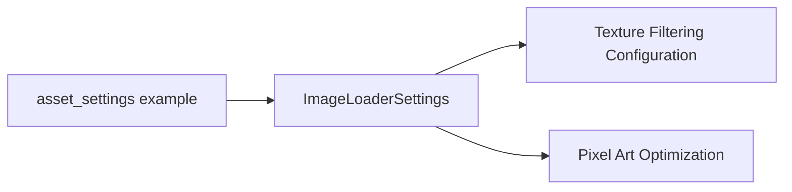

+++
title = "#19565 Update example doc link for `ImageLoaderSettings`."
date = "2025-06-11T00:00:00"
draft = false
template = "pull_request_page.html"
in_search_index = true

[taxonomies]
list_display = ["show"]

[extra]
current_language = "en"
available_languages = {"en" = { name = "English", url = "/pull_request/bevy/2025-06/pr-19565-en-20250611" }, "zh-cn" = { name = "中文", url = "/pull_request/bevy/2025-06/pr-19565-zh-cn-20250611" }}
labels = ["C-Docs", "D-Trivial", "A-Rendering"]
+++

## Technical Analysis of PR #19565: Update example doc link for `ImageLoaderSettings`

### Basic Information
- **Title**: Update example doc link for `ImageLoaderSettings`.
- **PR Link**: https://github.com/bevyengine/bevy/pull/19565
- **Author**: yrns
- **Status**: MERGED
- **Labels**: C-Docs, D-Trivial, A-Rendering, S-Ready-For-Final-Review
- **Created**: 2025-06-10T01:33:23Z
- **Merged**: 2025-06-11T23:06:25Z
- **Merged By**: alice-i-cecile

### Description Translation
Link in the "asset settings" example. The struct was moved.

### The Story of This Pull Request

#### The Problem and Context
The `asset_settings.rs` example contained an outdated documentation link for the `ImageLoaderSettings` struct. This occurred because the struct had been moved from `bevy::render::texture` to `bevy::image` in a previous refactor. The outdated link would direct users to incorrect documentation, potentially causing confusion and reducing the effectiveness of the example as a learning resource.

#### The Solution Approach
The solution required updating the documentation URL to reflect the struct's new location. Since this was a straightforward documentation fix with no functional changes, the implementation consisted of a single-line modification in the example file. No alternatives were considered as the change directly addressed the root cause.

#### The Implementation
The implementation modifies the comment containing the documentation link. The old path pointed to `bevy/render/texture/struct.ImageLoaderSettings.html`, while the updated path correctly references `bevy/image/struct.ImageLoaderSettings.html`:

```rust
// Before:
// https://docs.rs/bevy/latest/bevy/render/texture/struct.ImageLoaderSettings.html#

// After:
// https://docs.rs/bevy/latest/bevy/image/struct.ImageLoaderSettings.html
```

This change ensures developers referencing the example will be directed to the correct documentation for the current API structure.

#### Technical Insights
This change highlights the importance of maintaining accurate documentation links, especially after structural refactors. The `ImageLoaderSettings` struct plays a critical role in texture filtering configuration, particularly for pixel art assets where nearest-neighbor filtering is often preferred. Keeping documentation links current helps developers:
1. Correctly configure texture sampling
2. Understand available filtering options
3. Maintain visual consistency in pixel-art projects

#### The Impact
This PR provides immediate value by:
- Correcting a documentation link that could misdirect users
- Maintaining the example's usefulness as a reference
- Preventing potential confusion about struct location
- Improving the onboarding experience for new contributors

The change has no runtime impact but significantly enhances documentation accuracy. It serves as a reminder to update documentation references when moving types during refactoring.

### Visual Representation



### Key Files Changed

#### `examples/asset/asset_settings.rs`
**Change Description**: Updated documentation link for `ImageLoaderSettings` to reflect its new module location.

**Code Change**:
```rust
// Before:
// https://docs.rs/bevy/latest/bevy/render/texture/struct.ImageLoaderSettings.html#

// After:
// https://docs.rs/bevy/latest/bevy/image/struct.ImageLoaderSettings.html
```

**Relation to PR**: This is the sole change in the PR, directly addressing the documentation link issue.

### Further Reading
1. [Bevy Asset System Documentation](https://docs.rs/bevy/latest/bevy/asset/index.html)
2. [ImageLoaderSettings API Reference](https://docs.rs/bevy/latest/bevy/image/struct.ImageLoaderSettings.html)
3. [Texture Filtering Techniques](https://learnopengl.com/Getting-started/Textures)
4. [Bevy Examples Repository](https://github.com/bevyengine/bevy/tree/main/examples)