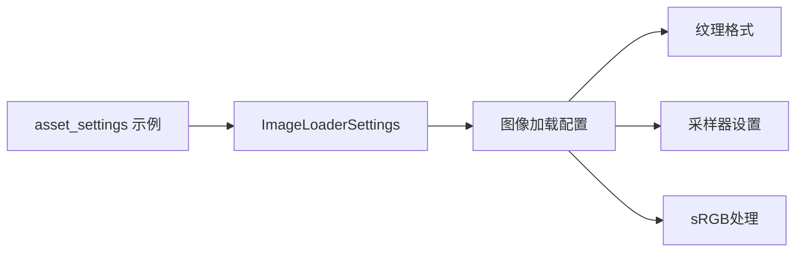

+++
title = "#19565 Update example doc link for `ImageLoaderSettings"
date = "2025-06-11T00:00:00"
draft = false
template = "pull_request_page.html"
in_search_index = false

[extra]
current_language = "zh-cn"
available_languages = {"en" = { name = "English", url = "/pull_request/bevy/2025-06/pr-19565-en-20250611" }, "zh-cn" = { name = "中文", url = "/pull_request/bevy/2025-06/pr-19565-zh-cn-20250611" }}
+++

# PR 分析报告：更新 `ImageLoaderSettings` 示例文档链接

## 基本信息
- **标题**: Update example doc link for `ImageLoaderSettings`
- **PR 链接**: https://github.com/bevyengine/bevy/pull/19565
- **作者**: yrns
- **状态**: 已合并
- **标签**: C-Docs, D-Trivial, A-Rendering, S-Ready-For-Final-Review
- **创建时间**: 2025-06-10T01:33:23Z
- **合并时间**: 2025-06-11T23:06:25Z
- **合并人**: alice-i-cecile

## 描述翻译
更新 "asset settings" 示例中的链接。该结构体已被移动。

## PR 技术分析

### 问题背景
在 Bevy 引擎的示例代码中，`asset_settings.rs` 文件包含一个指向 `ImageLoaderSettings` 结构体文档的链接。该结构体原先位于 `bevy::render::texture` 模块，但在代码重构后被迁移至 `bevy::image` 模块。这种模块位置的变更导致原有的文档链接失效，形成死链。对于依赖示例代码学习引擎用法的开发者，这种文档链接的断裂会造成认知障碍，增加理解成本。

### 解决方案
PR 采用直接修复策略，将失效的文档链接更新为结构体当前所在模块的正确路径。方案选择基于以下考虑：
1. 文档链接修复属于低风险变更，不涉及功能逻辑
2. 直接路径更新是最精确的解决方案，避免引入额外抽象
3. 保持与 Bevy 官方文档策略一致，直接指向 docs.rs 的稳定版本

### 实现细节
核心变更集中在单行注释的链接更新：
```diff
// 旧链接指向 render/texture 模块（已失效）
- // https://docs.rs/bevy/latest/bevy/render/texture/struct.ImageLoaderSettings.html#
// 新链接指向 image 模块（正确位置）
+ // https://docs.rs/bevy/latest/bevy/image/struct.ImageLoaderSettings.html
```
此修改确保开发者参考示例时能直接访问最新文档。`ImageLoaderSettings` 控制纹理加载行为的关键参数如：
- `format`：像素格式 (pixel format)
- `sampler`：纹理采样器 (texture sampler)
- `is_srgb`：sRGB 色彩空间处理

### 技术影响
该修复产生以下具体改进：
1. **消除文档死链**：恢复示例代码与文档的关联性
2. **提升开发者体验**：减少理解资产加载配置时的认知摩擦
3. **维护代码健康度**：预防因文档误导产生的错误配置
4. **强化示例价值**：确保示例保持完整教学功能

结构体迁移案例凸显模块化演进中的常见挑战：当核心组件位置变更时，需同步更新所有引用点。此 PR 展示了高效维护策略——通过简单明了的链接更新，解决因架构调整产生的下游影响。

## 可视化关系



## 关键文件变更

### examples/asset/asset_settings.rs
**变更原因**：修复因结构体迁移导致的文档链接失效问题  
**核心修改**：更新 `ImageLoaderSettings` 的文档链接路径

```diff
@@ -40,7 +40,7 @@ fn setup(mut commands: Commands, asset_server: Res<AssetServer>) {
     // filtering. This tends to work much better for pixel art assets.
     // A good reference when filling this out is to check out [ImageLoaderSettings::default()]
     // and follow to the default implementation of each fields type.
-    // https://docs.rs/bevy/latest/bevy/render/texture/struct.ImageLoaderSettings.html#
+    // https://docs.rs/bevy/latest/bevy/image/struct.ImageLoaderSettings.html
     commands.spawn((
         Sprite {
             image: asset_server.load("bevy_pixel_dark_with_meta.png"),
```

## 延伸阅读
1. [Bevy 资产系统官方文档](https://bevyengine.org/learn/book/assets/)
2. [`ImageLoaderSettings` API 文档](https://docs.rs/bevy/latest/bevy/image/struct.ImageLoaderSettings.html)
3. [纹理采样技术解析](https://learnopengl.com/Getting-started/Textures)
4. [sRGB 色彩空间原理](https://en.wikipedia.org/wiki/SRGB)

## 完整代码变更
```diff
diff --git a/examples/asset/asset_settings.rs b/examples/asset/asset_settings.rs
index cfc76d774a960..9f4c1fe507dfe 100644
--- a/examples/asset/asset_settings.rs
+++ b/examples/asset/asset_settings.rs
@@ -40,7 +40,7 @@ fn setup(mut commands: Commands, asset_server: Res<AssetServer>) {
     // filtering. This tends to work much better for pixel art assets.
     // A good reference when filling this out is to check out [ImageLoaderSettings::default()]
     // and follow to the default implementation of each fields type.
-    // https://docs.rs/bevy/latest/bevy/render/texture/struct.ImageLoaderSettings.html#
+    // https://docs.rs/bevy/latest/bevy/image/struct.ImageLoaderSettings.html
     commands.spawn((
         Sprite {
             image: asset_server.load("bevy_pixel_dark_with_meta.png"),
```