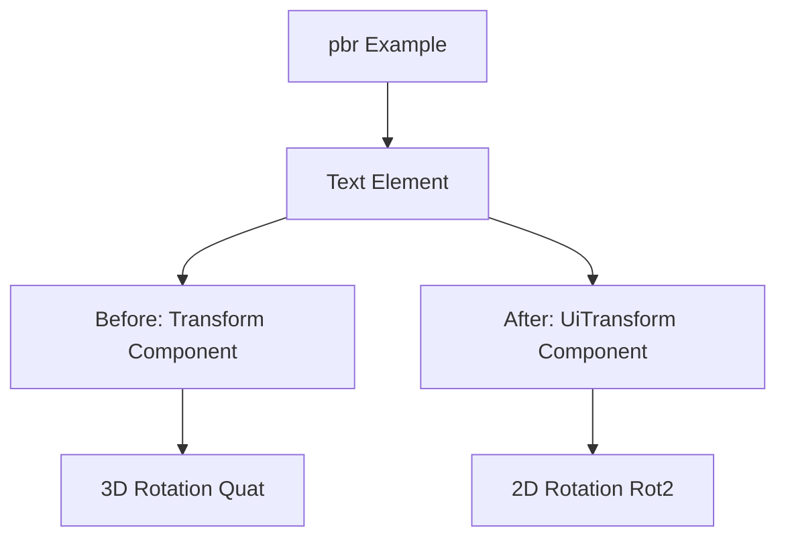

+++
title = "#19571 Fix `pbr` example text rotation"
date = "2025-06-10T00:00:00"
draft = false
template = "pull_request_page.html"
in_search_index = true

[taxonomies]
list_display = ["show"]

[extra]
current_language = "en"
available_languages = {"en" = { name = "English", url = "/pull_request/bevy/2025-06/pr-19571-en-20250610" }, "zh-cn" = { name = "中文", url = "/pull_request/bevy/2025-06/pr-19571-zh-cn-20250610" }}
labels = ["D-Trivial", "A-Rendering", "C-Examples"]
+++

## Fix `pbr` Example Text Rotation

### Basic Information
- **Title**: Fix `pbr` example text rotation
- **PR Link**: https://github.com/bevyengine/bevy/pull/19571
- **Author**: rparrett
- **Status**: MERGED
- **Labels**: D-Trivial, A-Rendering, C-Examples, S-Ready-For-Final-Review
- **Created**: 2025-06-10T15:04:22Z
- **Merged**: 2025-06-10T17:17:48Z
- **Merged By**: mockersf

### Description Translation
**Objective**  
This example migration was missed in #16615  

https://pixel-eagle.com/project/b25a040a-a980-4602-b90c-d480ab84076d/run/10633/compare/10627?screenshot=3D+Rendering/pbr.png  

**Solution**  
Use new `UiTransform`  

**Testing**  
`cargo run --example pbr`

### The Story of This Pull Request
The `pbr` example had an incorrect text rotation due to an incomplete migration to Bevy's new UI transform system introduced in PR #16615. While #16615 migrated most UI elements to use the specialized `UiTransform` component, this particular example was overlooked and continued using the general-purpose `Transform` component for UI rotation. 

The core issue stemmed from using a 3D rotation (`Quat`) for a purely 2D UI element. The original implementation rotated the text using a Z-axis rotation specified in radians:
```rust
Transform {
    rotation: Quat::from_rotation_z(std::f32::consts::PI / 2.0),
    ..default()
}
```
This approach was problematic for two reasons:
1. UI elements should use the dedicated 2D-oriented `UiTransform` component
2. The rotation value used radians instead of the more UI-appropriate degrees

The solution was straightforward: migrate to the `UiTransform` component and use its dedicated 2D rotation type (`Rot2`) which works in degrees. The new implementation:
```rust
UiTransform {
    rotation: Rot2::degrees(90.),
    ..default()
}
```
This change aligns with Bevy's UI system best practices where:
1. `UiTransform` handles 2D layout and rotation
2. `Rot2` provides a more intuitive rotation interface for UI elements
3. Degree-based rotation improves readability for UI adjustments

The fix was verified by running `cargo run --example pbr` and confirming the text rendered with the correct 90-degree rotation. This change maintains consistency with Bevy's UI system architecture and prevents confusion when modifying UI elements in examples.

### Visual Representation


### Key Files Changed
**File**: `examples/3d/pbr.rs`  
**Changes**: Migrated text rotation from `Transform` to `UiTransform`  
**Reason**: Correct missed migration from #16615 to use proper UI rotation  

Before:
```rust
Transform {
    rotation: Quat::from_rotation_z(std::f32::consts::PI / 2.0),
    ..default()
},
```

After:
```rust
UiTransform {
    rotation: Rot2::degrees(90.),
    ..default()
},
```

### Further Reading
1. [Bevy UI Transform Migration (#16615)](https://github.com/bevyengine/bevy/pull/16615)
2. [Bevy UI Transform Documentation](https://docs.rs/bevy_ui/latest/bevy_ui/struct.UiTransform.html)
3. [Rot2 Type Documentation](https://docs.rs/glam/latest/glam/struct.Rot2.html)