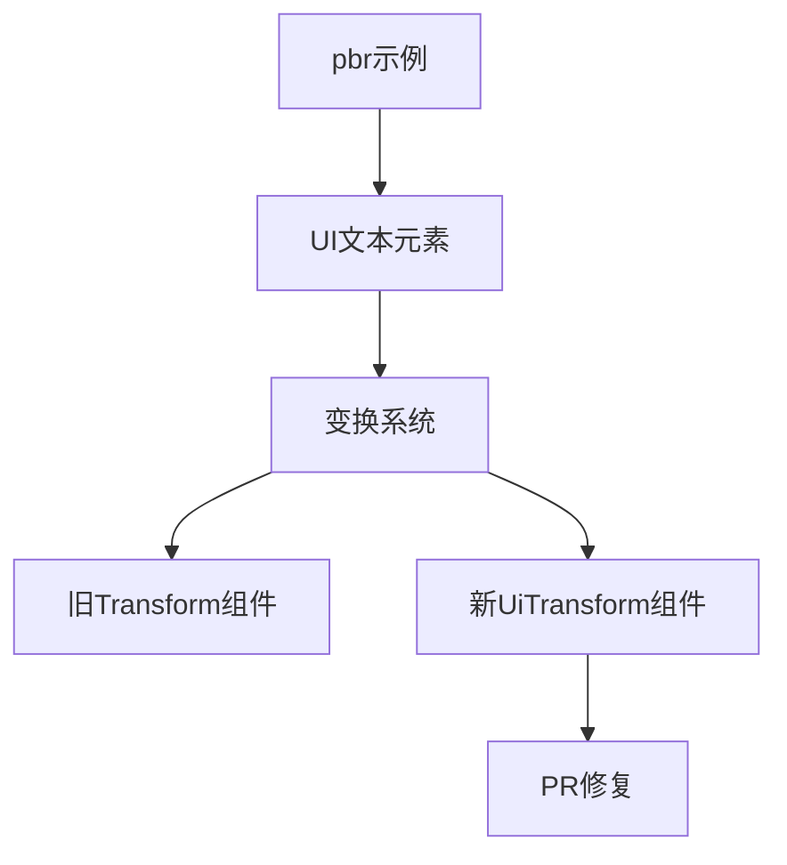

+++
title = "#19571 Fix `pbr` example text rotation"
date = "2025-06-10T00:00:00"
draft = false
template = "pull_request_page.html"
in_search_index = false

[extra]
current_language = "zh-cn"
available_languages = {"en" = { name = "English", url = "/pull_request/bevy/2025-06/pr-19571-en-20250610" }, "zh-cn" = { name = "中文", url = "/pull_request/bevy/2025-06/pr-19571-zh-cn-20250610" }}
labels = ["D-Trivial", "A-Rendering", "C-Examples"]
+++

# Fix `pbr` example text rotation

## Basic Information
- **Title**: Fix `pbr` example text rotation
- **PR Link**: https://github.com/bevyengine/bevy/pull/19571
- **Author**: rparrett
- **Status**: MERGED
- **Labels**: D-Trivial, A-Rendering, C-Examples, S-Ready-For-Final-Review
- **Created**: 2025-06-10T15:04:22Z
- **Merged**: 2025-06-10T17:17:48Z
- **Merged By**: mockersf

## Description Translation
### 目标 (Objective)

此示例在 #16615 的迁移中被遗漏

https://pixel-eagle.com/project/b25a040a-a980-4602-b90c-d480ab84076d/run/10633/compare/10627?screenshot=3D+Rendering/pbr.png

### 解决方案 (Solution)

使用新的 `UiTransform`

### 测试 (Testing)

`cargo run --example pbr`

## The Story of This Pull Request

在 Bevy 引擎的持续开发过程中，#16615 PR 引入了一项重要的 UI 系统重构。该重构将 UI 的变换系统从传统的 `Transform` 组件迁移到了专门的 `UiTransform` 组件。这种架构变更提高了 UI 系统的清晰度和性能，但同时也要求所有使用 UI 的示例进行相应更新。

`pbr` 示例负责展示 Bevy 的基于物理的渲染能力，其中包含一个旋转 90 度的文本元素用于显示调试信息。在原始实现中，该文本使用了通用的 `Transform` 组件进行旋转：

```rust
Transform {
    rotation: Quat::from_rotation_z(std::f32::consts::PI / 2.0),
    ..default()
}
```

当 #16615 的 UI 重构完成后，UI 元素应改用 `UiTransform` 组件进行变换操作。然而，`pbr` 示例中的文本旋转逻辑被遗漏，未能随重构更新。这导致示例运行时文本显示方向错误，影响了示例的正确性和演示效果。

PR #19571 解决了这个问题。开发者识别到问题根源在于使用了陈旧的 `Transform` 组件而非新的 `UiTransform` 系统。解决方案是将旋转逻辑迁移到正确的组件，并使用更简洁的旋转表示方式：

```rust
UiTransform {
    rotation: Rot2::degrees(90.),
    ..default()
}
```

关键变更包括：
1. 将 `Transform` 替换为 `UiTransform`，符合 UI 系统的最新规范
2. 使用 `Rot2::degrees(90.)` 替代 `Quat::from_rotation_z`，简化旋转配置
3. 保持相同的 90 度旋转效果，确保文本正确显示

这个修复虽然只涉及两行代码变更，但体现了重要原则：当核心系统重构时，必须全面更新所有依赖示例。未更新的示例会产生误导，影响开发者对框架功能的理解。通过使用 `UiTransform`，该示例现在与其他 UI 系统保持一致，避免了混合使用不同变换系统可能导致的渲染问题。

## Visual Representation



## Key Files Changed

### examples/3d/pbr.rs
**变更描述**：更新文本旋转逻辑以使用正确的 UI 变换组件  
**关系**：这是 PR 的核心变更，解决了示例中文本旋转错误的问题

```rust
// Before:
Transform {
    rotation: Quat::from_rotation_z(std::f32::consts::PI / 2.0),
    ..default()
}

// After:
UiTransform {
    rotation: Rot2::degrees(90.),
    ..default()
}
```

## Further Reading

1. [Bevy UI 系统迁移指南](https://bevyengine.org/news/bevy-0.13/#ui-system-overhaul)
2. [UiTransform 组件文档](https://docs.rs/bevy/latest/bevy/ui/struct.UiTransform.html)
3. [Rot2 类型 API 参考](https://docs.rs/bevy/latest/bevy/math/struct.Rot2.html)
4. 原始重构 PR: [#16615](https://github.com/bevyengine/bevy/pull/16615)