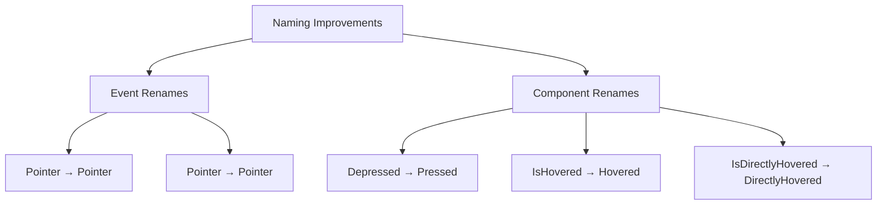

+++
title = "#19574 Rename some pointer events and components"
date = "2025-06-10T00:00:00"
draft = false
template = "pull_request_page.html"
in_search_index = true

[taxonomies]
list_display = ["show"]

[extra]
current_language = "en"
available_languages = {"en" = { name = "English", url = "/pull_request/bevy/2025-06/pr-19574-en-20250610" }, "zh-cn" = { name = "中文", url = "/pull_request/bevy/2025-06/pr-19574-zh-cn-20250610" }}
labels = ["D-Trivial", "A-UI", "C-Code-Quality", "A-Picking"]
+++

# Rename some pointer events and components

## Basic Information
- **Title**: Rename some pointer events and components
- **PR Link**: https://github.com/bevyengine/bevy/pull/19574
- **Author**: Jondolf
- **Status**: MERGED
- **Labels**: D-Trivial, A-UI, C-Code-Quality, S-Ready-For-Final-Review, M-Needs-Migration-Guide, A-Picking
- **Created**: 2025-06-10T20:48:11Z
- **Merged**: 2025-06-10T22:18:09Z
- **Merged By**: cart

## Description Translation
# Objective

#19366 implemented core button widgets, which included the `Depressed` state component.

`Depressed` was chosen instead of `Pressed` to avoid conflict with the `Pointer<Pressed>` event, but it is problematic and awkward in many ways:

- Using the word "depressed" for such a high-traffic type is not great due to the obvious connection to "depressed" as in depression.
- "Depressed" is not what I would search for if I was looking for a component like this, and I'm not aware of any other engine or UI framework using the term.
- `Depressed` is not a very natural pair to the `Pointer<Pressed>` event.
- It might be because I'm not a native English speaker, but I have very rarely heard someone say "a button is depressed". Seeing it, my mind initially goes from "depression??" to "oh, de-pressed, meaning released" and definitely not "is pressed", even though that *is* also a valid meaning for it.

A related problem is that the current `Pointer<Pressed>` and `Pointer<Released>` event names use a different verb tense than all of our other observer events such as `Pointer<Click>` or `Pointer<DragStart>`. By fixing this and renaming `Pressed` (and `Released`), we can then use `Pressed` instead of `Depressed` for the state component.

Additionally, the `IsHovered` and `IsDirectlyHovered` components added in #19366 use an inconsistent naming; the other similar components don't use an `Is` prefix. It also makes query filters like `Has<IsHovered>` and `With<IsHovered>` a bit more awkward.

This is partially related to Cart's [picking concept proposal](https://gist.github.com/cart/756e48a149db2838028be600defbd24a?permalink_comment_id=5598154).

## Solution

- Rename `Pointer<Pressed>` to `Pointer<Press>`
- Rename `Pointer<Released>` to `Pointer<Release>`
- Rename `Depressed` to `Pressed`
- Rename `IsHovered` to `Hovered`
- Rename `IsDirectlyHovered` to `DirectlyHovered`

## The Story of This Pull Request

This PR addresses naming inconsistencies in Bevy's UI and picking systems. The changes originated from PR #19366 which introduced core button widgets. That implementation used `Depressed` as a component name for the pressed state to avoid conflicts with the existing `Pointer<Pressed>` event. However, this naming choice proved problematic for several reasons:

1. The term "depressed" has strong mental health connotations
2. It's not a standard term in UI frameworks
3. It creates an unnatural pairing with `Pointer<Pressed>`
4. Non-native English speakers might misinterpret it as "de-pressed" (released)

Additionally, the existing `Pointer<Pressed>` and `Pointer<Released>` events used past participle verb forms, while other events like `Pointer<Click>` used base forms. The `IsHovered` and `IsDirectlyHovered` components also had an inconsistent naming pattern compared to other components.

The solution involved coordinated renames across multiple systems:
1. Rename `Pointer<Pressed>` to `Pointer<Press>` and `Pointer<Released>` to `Pointer<Release>` for consistent verb tense
2. Rename the `Depressed` component to `Pressed` since the naming conflict was resolved
3. Remove the "Is" prefix from hover components: `IsHovered` → `Hovered` and `IsDirectlyHovered` → `DirectlyHovered`

These changes improve API consistency and reduce cognitive load. The new names align better with established UI terminology and make query filters more natural (e.g., `Has<Hovered>` instead of `Has<IsHovered>`).

The implementation required updates across several areas:
- Event definitions in `bevy_picking`
- Button logic in `bevy_core_widgets`
- Hover state systems
- All examples using these components
- Internal tests
- Documentation and migration guides

The changes are mechanical but widespread, affecting 15 files. Each rename follows the same pattern:
1. Update type definitions
2. Modify system queries
3. Adjust event handlers
4. Update component insertions/removals

For example, in button logic:
```rust
// Before:
commands.entity(button).insert(Depressed);

// After:
commands.entity(button).insert(Pressed);
```

In hover systems:
```rust
// Before:
commands.entity(entity).insert(IsHovered(is_hovering));

// After:
commands.entity(entity).insert(Hovered(is_hovering));
```

The renaming also required updating event handlers to use the new `Pointer<Press>` and `Pointer<Release>` events instead of `Pointer<Pressed>` and `Pointer<Released>`. All examples were updated to reflect these changes.

A migration guide was added to help users transition their code. The changes are backward-incompatible but straightforward to apply through search-and-replace operations.

## Visual Representation



## Key Files Changed

### 1. `crates/bevy_picking/src/hover.rs` (+29/-31)
Updated hover state components and systems:
```rust
// Before:
pub struct IsHovered(pub bool);
pub struct IsDirectlyHovered(pub bool);

// After:
pub struct Hovered(pub bool);
pub struct DirectlyHovered(pub bool);
```
Systems like `update_is_hovered` were renamed and adjusted to work with the new component names. All queries and commands were updated to reference `Hovered` and `DirectlyHovered`.

### 2. `examples/ui/core_widgets_observers.rs` (+22/-22)
Updated example to use new component names:
```rust
// Before:
use bevy::picking::hover::IsHovered;
use bevy::ui::Depressed;

// After:
use bevy::picking::hover::Hovered;
use bevy::ui::Pressed;
```
All system parameters and queries were updated to reference `Pressed` and `Hovered`.

### 3. `crates/bevy_core_widgets/src/core_button.rs` (+21/-21)
Updated button logic to use `Pressed`:
```rust
// Before:
use bevy_ui::Depressed;
commands.entity(button).insert(Depressed);

// After:
use bevy_ui::Pressed;
commands.entity(button).insert(Pressed);
```
All event handlers were updated to use `Pointer<Press>` and `Pointer<Release>`.

### 4. `examples/ui/core_widgets.rs` (+18/-18)
Updated core widgets example:
```rust
// Before:
use bevy::picking::hover::IsHovered;
use bevy::ui::Depressed;

// After:
use bevy::picking::hover::Hovered;
use bevy::ui::Pressed;
```
Button styling logic was updated to reference `Pressed` and `Hovered`.

### 5. `crates/bevy_picking/src/events.rs` (+11/-11)
Updated event definitions:
```rust
// Before:
pub struct Pressed { ... }
pub struct Released { ... }

// After:
pub struct Press { ... }
pub struct Release { ... }
```
All event writers and system parameters were updated to use the new names.

## Further Reading
- [Bevy's Picking Concept Proposal](https://gist.github.com/cart/756e48a149db2838028be600defbd24a?permalink_comment_id=5598154)
- [PR #19366: Core Button Widgets](https://github.com/bevyengine/bevy/pull/19366)
- [Migration Guide: Rename Pointer Events](release-content/migration-guides/rename_pointer_events.md)