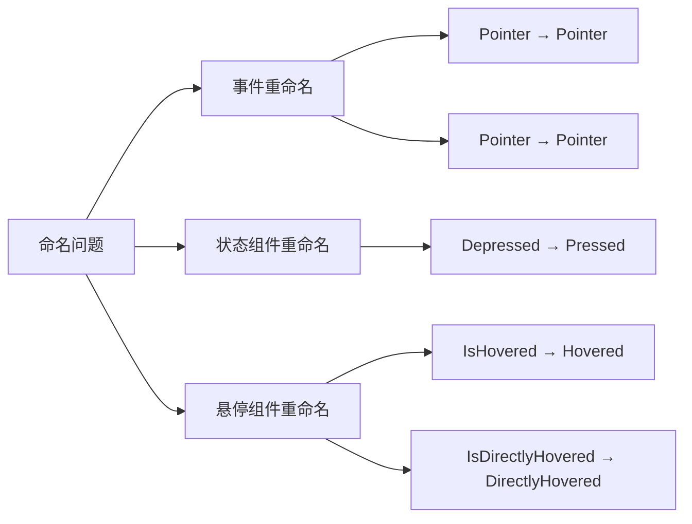
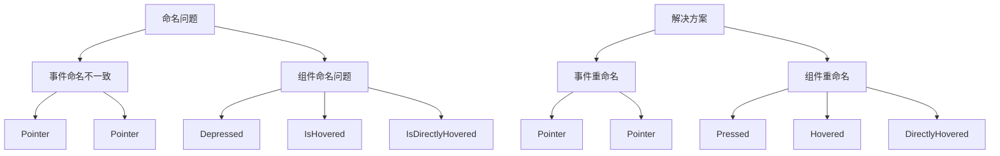

+++
title = "#19574 Rename some pointer events and components"
date = "2025-06-10T00:00:00"
draft = false
template = "pull_request_page.html"
in_search_index = false

[extra]
current_language = "zh-cn"
available_languages = {"en" = { name = "English", url = "/pull_request/bevy/2025-06/pr-19574-en-20250610" }, "zh-cn" = { name = "中文", url = "/pull_request/bevy/2025-06/pr-19574-zh-cn-20250610" }}
labels = ["D-Trivial", "A-UI", "C-Code-Quality", "A-Picking"]
+++

# 重命名指针事件和组件

## Basic Information
- **Title**: Rename some pointer events and components
- **PR Link**: https://github.com/bevyengine/bevy/pull/19574
- **Author**: Jondolf
- **Status**: MERGED
- **Labels**: D-Trivial, A-UI, C-Code-Quality, S-Ready-For-Final-Review, M-Needs-Migration-Guide, A-Picking
- **Created**: 2025-06-10T20:48:11Z
- **Merged**: 2025-06-10T22:18:09Z
- **Merged By**: cart

## Description Translation
# Objective

#19366 实现了核心按钮组件，其中包含了 `Depressed` 状态组件。

选择 `Depressed` 而不是 `Pressed` 是为了避免与 `Pointer<Pressed>` 事件冲突，但它在多个方面存在问题且不自然：

- 对于高频使用的类型，"depressed" 一词容易与抑郁症产生关联
- "Depressed" 不是开发者在搜索此类组件时的常用术语，也没有其他引擎或 UI 框架使用该术语
- `Depressed` 与 `Pointer<Pressed>` 事件的配对不自然
- 非英语母语者很少听到 "a button is depressed" 的说法，容易引起混淆

另一个问题是 `Pointer<Pressed>` 和 `Pointer<Released>` 的事件名称与 `Pointer<Click>` 或 `Pointer<DragStart>` 等其他观察者事件的动词时态不一致。通过修复这个问题并重命名 `Pressed` (和 `Released`)，我们可以将状态组件改为使用 `Pressed` 代替 `Depressed`。

此外，#19366 中添加的 `IsHovered` 和 `IsDirectlyHovered` 组件使用了不一致的命名；其他类似组件没有 `Is` 前缀。这也使得 `Has<IsHovered>` 和 `With<IsHovered>` 等查询过滤器略显别扭。

这与 Cart 的 [picking concept proposal](https://gist.github.com/cart/756e48a149db2838028be600defbd24a?permalink_comment_id=5598154) 部分相关。

## Solution

- 将 `Pointer<Pressed>` 重命名为 `Pointer<Press>`
- 将 `Pointer<Released>` 重命名为 `Pointer<Release>`
- 将 `Depressed` 重命名为 `Pressed`
- 将 `IsHovered` 重命名为 `Hovered`
- 将 `IsDirectlyHovered` 重命名为 `DirectlyHovered`

## The Story of This Pull Request

### 问题背景
在实现核心按钮组件 (#19366) 时，引入了 `Depressed` 状态组件来表示按钮被按下的状态。选择这个名称是为了避免与已有的 `Pointer<Pressed>` 事件冲突。然而，这个命名方案存在几个问题：

1. **术语不直观**：`Depressed` 在英语中主要与抑郁症相关，而不是按钮状态。开发者更习惯使用 `Pressed` 来描述按钮被按下的状态。
2. **命名不一致**：
   - 指针事件使用过去分词 (`Pressed`, `Released`)，而其他事件如 `Click` 和 `DragStart` 使用动词原形
   - 悬停状态组件使用 `IsHovered` 和 `IsDirectlyHovered`，而其他类似组件没有 `Is` 前缀
3. **开发体验问题**：`Has<IsHovered>` 这样的查询语法不如 `Has<Hovered>` 自然

这些不一致增加了认知负担，可能导致代码可读性下降和开发效率降低。

### 解决方案
PR 通过系统性地重命名相关组件和事件来解决这些问题：



### 实现细节
1. **事件重命名**：
   - `Pointer<Pressed>` → `Pointer<Press>`
   - `Pointer<Released>` → `Pointer<Release>`
   
   在事件定义文件中更新了类型和文档：
   ```rust
   // Before:
   pub struct Pressed { ... }
   pub struct Released { ... }
   
   // After:
   pub struct Press { ... }
   pub struct Release { ... }
   ```

2. **按钮状态组件重命名**：
   - `Depressed` → `Pressed`
   
   在按钮逻辑中更新了所有引用：
   ```rust
   // Before:
   fn button_on_pointer_down(
       mut trigger: Trigger<Pointer<Pressed>>,
       mut q_state: Query<(Entity, Has<InteractionDisabled>, Has<Depressed>), With<CoreButton>>,
   ) {
       if !disabled && !depressed {
           commands.entity(button).insert(Depressed);
       }
   }
   
   // After:
   fn button_on_pointer_down(
       mut trigger: Trigger<Pointer<Press>>,  // 事件类型更新
       mut q_state: Query<(Entity, Has<InteractionDisabled>, Has<Pressed>), With<CoreButton>>, // 组件类型更新
   ) {
       if !disabled && !pressed {
           commands.entity(button).insert(Pressed);  // 组件名称更新
       }
   }
   ```

3. **悬停组件重命名**：
   - `IsHovered` → `Hovered`
   - `IsDirectlyHovered` → `DirectlyHovered`
   
   更新了组件定义和相关系统：
   ```rust
   // Before:
   #[derive(Component)]
   pub struct IsHovered(pub bool);
   
   // After:
   #[derive(Component)]
   pub struct Hovered(pub bool);
   ```

   在悬停状态更新系统中：
   ```rust
   // Before:
   pub fn update_is_hovered(
       mut hovers: Query<(Entity, &IsHovered)>,
   ) {
       commands.entity(entity).insert(IsHovered(is_hovering));
   }
   
   // After:
   pub fn update_is_hovered(
       mut hovers: Query<(Entity, &Hovered)>,  // 查询类型更新
   ) {
       commands.entity(entity).insert(Hovered(is_hovering));  // 组件名称更新
   }
   ```

### 技术考量
1. **向后兼容性**：这是一个破坏性变更，需要更新所有使用旧名称的代码
2. **迁移策略**：
   - 添加了迁移指南 (`rename_pointer_events.md`)
   - 更新了所有示例和测试用例
3. **性能影响**：纯重命名操作，不影响运行时性能
4. **API 一致性**：
   - 事件名称统一使用动词原形 (`Press`, `Release`, `Click`)
   - 状态组件名称更加简洁 (`Hovered` 替代 `IsHovered`)

### 影响与收益
1. **更直观的命名**：
   - `Pressed` 明确表示按钮被按下的状态
   - `Hovered` 更符合常见 UI 框架的命名惯例
2. **一致的 API**：
   - 所有指针事件使用相同动词形式
   - 状态组件命名模式统一
3. **改进的开发体验**：
   - 查询语法更自然：`With<Hovered>` 替代 `With<IsHovered>`
   - 减少术语混淆，特别是非英语母语开发者

## Visual Representation



## Key Files Changed

### 1. `crates/bevy_picking/src/hover.rs` (+29/-31)
- **修改内容**：重命名悬停状态组件和相关系统
- **关键变更**：
  ```rust
  // Before:
  pub struct IsHovered(pub bool);
  pub fn update_is_hovered(query: Query<(Entity, &IsHovered)>) { ... }
  
  // After:
  pub struct Hovered(pub bool);
  pub fn update_is_hovered(query: Query<(Entity, &Hovered)>) { ... }
  ```
- **关联性**：统一悬停状态组件命名规范

### 2. `examples/ui/core_widgets_observers.rs` (+22/-22)
- **修改内容**：更新UI示例使用新命名
- **关键变更**：
  ```rust
  // Before:
  fn on_change_hover(trigger: Trigger<OnInsert, IsHovered>) { ... }
  fn set_button_style(..., depressed: bool) { ... }
  
  // After:
  fn on_change_hover(trigger: Trigger<OnInsert, Hovered>) { ... }
  fn set_button_style(..., pressed: bool) { ... }
  ```
- **关联性**：确保示例代码与核心变更保持一致

### 3. `crates/bevy_core_widgets/src/core_button.rs` (+21/-21)
- **修改内容**：更新按钮逻辑使用新事件和组件名称
- **关键变更**：
  ```rust
  // Before:
  use bevy_ui::Depressed;
  fn button_on_pointer_down(trigger: Trigger<Pointer<Pressed>>) { ... }
  
  // After:
  use bevy_ui::Pressed;
  fn button_on_pointer_down(trigger: Trigger<Pointer<Press>>) { ... }
  ```
- **关联性**：核心按钮组件适配新命名方案

### 4. `examples/ui/core_widgets.rs` (+18/-18)
- **修改内容**：更新核心组件示例
- **关键变更**：
  ```rust
  // Before:
  fn update_button_style(query: Query<(Has<Depressed>, &IsHovered)>) { ... }
  
  // After:
  fn update_button_style(query: Query<(Has<Pressed>, &Hovered)>) { ... }
  ```
- **关联性**：保持示例与API变更同步

### 5. `crates/bevy_picking/src/events.rs` (+11/-11)
- **修改内容**：重命名指针事件类型
- **关键变更**：
  ```rust
  // Before:
  pub struct Pressed { ... }
  pub struct Released { ... }
  add_event::<Pointer<Pressed>>()
  
  // After:
  pub struct Press { ... }
  pub struct Release { ... }
  add_event::<Pointer<Press>>()
  ```
- **关联性**：统一事件命名规范

## Further Reading
- [Bevy 输入系统文档](https://docs.rs/bevy_input/latest/bevy_input/)
- [UI 交互状态管理指南](https://github.com/bevyengine/bevy/blob/main/examples/ui/button.rs)
- [事件系统工作原理](https://bevy-cheatbook.github.io/programming/events.html)

这些变更通过统一命名规范提高了代码一致性和可读性，同时消除了可能引起混淆的术语。