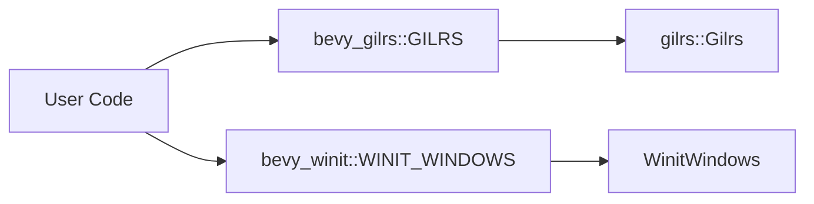

+++
title = "#19575 Make `GILRS` and `WINIT_WINDOWS` public"
date = "2025-06-12T00:00:00"
draft = false
template = "pull_request_page.html"
in_search_index = true

[taxonomies]
list_display = ["show"]

[extra]
current_language = "en"
available_languages = {"en" = { name = "English", url = "/pull_request/bevy/2025-06/pr-19575-en-20250612" }, "zh-cn" = { name = "中文", url = "/pull_request/bevy/2025-06/pr-19575-zh-cn-20250612" }}
labels = ["A-ECS", "A-Windowing", "C-Usability", "P-Regression"]
+++

## Make `GILRS` and `WINIT_WINDOWS` public

### Basic Information
- **Title**: Make `GILRS` and `WINIT_WINDOWS` public
- **PR Link**: https://github.com/bevyengine/bevy/pull/19575
- **Author**: joshua-holmes
- **Status**: MERGED
- **Labels**: A-ECS, A-Windowing, C-Usability, S-Ready-For-Final-Review, P-Regression
- **Created**: 2025-06-11T01:09:10Z
- **Merged**: 2025-06-12T20:23:01Z
- **Merged By**: alice-i-cecile

### Description Translation
After removing `!Send` resources, `GILRS` and `WINIT_WINDOWS` were not made public, which is a breaking change. This was brought up in a [comment on that PR](https://github.com/bevyengine/bevy/pull/18386#issuecomment-2954209010). This PR makes them public.

Fixes #19540.

### The Story of This Pull Request

**The Problem and Context**  
When Bevy removed `!Send` resources in PR #18386, several thread-local storage implementations replaced previous resources. However, the thread-locals `GILRS` (gamepad input) and `WINIT_WINDOWS` (window management) weren't exposed as public API elements. This created a regression where users couldn't access functionality that was previously available through public resources. Issue #19540 documented this breaking change, noting that users could no longer access gamepad or window data in their systems.

**The Solution Approach**  
The fix required making these thread-locals publicly accessible while preserving their existing functionality. Since both were already implemented as thread-locals, the minimal solution involved simply changing their visibility from private to public. For `WINIT_WINDOWS`, we added a clarifying doc comment to explain its temporary nature until proper `!Send` resource handling is implemented.

**The Implementation**  
For `GILRS`, we modified the thread-local declaration to make it public:
```rust
// crates/bevy_gilrs/src/lib.rs
- static GILRS: RefCell<Option<gilrs::Gilrs>> = const { RefCell::new(None) };
+ pub static GILRS: RefCell<Option<gilrs::Gilrs>> = const { RefCell::new(None) };
```

For `WINIT_WINDOWS`, we made it public and added documentation:
```rust
// crates/bevy_winit/src/lib.rs
- static WINIT_WINDOWS: RefCell<WinitWindows> = const { RefCell::new(WinitWindows::new()) };
+ pub static WINIT_WINDOWS: RefCell<WinitWindows> = const { RefCell::new(WinitWindows::new()) };
+ /// Temporary storage of WinitWindows data to replace usage of `!Send` resources...
```

Additionally, we created a migration guide explaining how to access these thread-locals and mark systems as non-Send:
```markdown
// release-content/migration-guides/replace_non_send_resources.md
+ WINIT_WINDOWS.with_borrow(|winit_windows| {
+     // do things with `winit_windows`
+ });
```

**Technical Insights**  
Thread-locals (`thread_local!`) provide thread-specific storage but aren't inherently `Send`. Access patterns use `with_borrow` (immutable) and `with_borrow_mut` (mutable), which will panic if borrowing conflicts occur. Systems using these must include `NonSendMarker` to enforce main-thread execution:
```rust
fn my_system(_non_send_marker: NonSendMarker) {
    ACCESS_KIT_ADAPTERS.with_borrow_mut(|adapters| { ... });
}
```

**The Impact**  
This fix restores access to window management and gamepad input functionality broken by the `!Send` removal. The migration guide helps users transition to the new access patterns while we await a permanent solution for `!Send` resources (issue #17667). All changes maintain existing behavior without introducing new dependencies or architectural changes.

### Visual Representation



### Key Files Changed

1. **`crates/bevy_gilrs/src/lib.rs`**  
   Made gamepad input thread-local publicly accessible:
   ```rust
   // Before:
   static GILRS: RefCell<Option<gilrs::Gilrs>> = const { RefCell::new(None) };
   
   // After:
   pub static GILRS: RefCell<Option<gilrs::Gilrs>> = const { RefCell::new(None) };
   ```

2. **`crates/bevy_winit/src/lib.rs`**  
   Publicly exposed window management thread-local with documentation:
   ```rust
   // Before:
   static WINIT_WINDOWS: RefCell<WinitWindows> = const { RefCell::new(WinitWindows::new()) };
   
   // After:
   pub static WINIT_WINDOWS: RefCell<WinitWindows> = const { RefCell::new(WinitWindows::new()) };
   ```

3. **`release-content/migration-guides/replace_non_send_resources.md`**  
   Added migration guide explaining access patterns:
   ```markdown
   + WINIT_WINDOWS.with_borrow(|winit_windows| {
   +     // do things with `winit_windows`
   + });
   + 
   + fn my_system(_non_send_marker: NonSendMarker) {
   +     ACCESS_KIT_ADAPTERS.with_borrow_mut(|adapters| { ... });
   + }
   ```

### Further Reading
1. [Original !Send resources removal PR](https://github.com/bevyengine/bevy/pull/18386)  
2. [Thread-local storage in Rust](https://doc.rust-lang.org/std/thread/struct.LocalKey.html)  
3. [Tracking issue for !Send resources](https://github.com/bevyengine/bevy/issues/17667)